# Spring

### 工作空间工程构建

1.新建工作空间的文件夹

2.File -> Open 打开工作空间

3.右键工作空间 -> new -> Module -> Maven

4.File -> Project Structure -> Project -> 设置 SDK、language level、output 到本项目（存疑）

5.上一步 Facets 点 + 选 Web 再选本项目 -> 右栏 Edit 路径 \web 改成 src\main\webapp

6.上一步相同页面 Web Resource 下同样修改为 \src\main\webapp


### 小记

引入配置文件：<imput resource="applicationContext-xxx.xml"/>

ResourceBundle 读取配置文件：ResourceBundle rb = ResourceBundle.getBundle("jdbc");

​	注：ResourceBundle 路径是相对类加载路径的地址，既 resources
​			且 getBundle() 参数不需要拓展名（因只读取 properties 类型文件）


### 概念

##### 是什么

​	1.Spring是分层的Java SE/EE应用full-stack轻量级开源框架，以 loC ( Inverse Of Control:反转控制)和AOP ( Aspect Oriented Programming :面向切面编程）为内核。

​	2.提供了展现层 SpringMVC 和持久层 Spring JDBCTemplate 以及业务层事务管理等众多的企业级应用技术，还能整合开源世界众多著名的第三方框架和类库，逐渐成为使用最多的 JavaEE 企业应用开源框架。


##### 优势

​	1.方便解耦,简化开发
​		通过Spring提供的loC容器，可以将对象间的依赖关系交由Spring进行控制，避免硬编码所造成的过度耦合。用户也不必再为单例模式类、属性文件解析等这些很底层的需求编写代码，可以更专注于上层的应用。

​	2.AOP编程的支持
​		通过Spring的AOP功能，方便进行面向切面编程，许多不容易用传统OOP实现的功能可以通过AOP轻松实现.

​	3.声明式事务的支持
​		可以将我们从单调烦闷的事务管理代码中解脱出来，通过声明式方式灵活的进行事务管理，提高开发效率和质量。

​	4.方便程序的测试
​		可以用非容器依赖的编程方式进行几乎所有的测试工作，测试不再是昂贵的操作，而是随手可做的事情.

​	5.方便集成各种优秀框架
​		Spring对各种优秀框架(Struts、Hibernate、Hessian、Quartz等)的支持。

​	6.降低JavaEE API的使用难度
​		Spring对JavaEE API(如JDBC、JavaMail、远程调用等）进行了薄薄的封装层，使这些API的使用难度大为降低.

​	7.Java源码是经典学习范例
​		Spring的源代码设计精妙、结构清晰、匠心独用，处处体现着大师对Java设计模式灵活运用以及对Java技术的高深造诣。它的源代码无意是Java技术的最佳实践的范例。


### 快速入门

##### Spring 程序开发步骤

​	1.导入 Spring 开发的基本包坐标

​	2.编写 Dao 接口和实现类

​	3.创建 Spring 核心配置文件

​	4.在 Spring 配置文件中配置 UserDaoImpl

​	5.使用 Spring 的 API 获取 Bean 实例


##### 具体操作

1.导入依赖

```xml
<dependencies>
    <dependency>
        <groupId>org.springframework</groupId>
        <artifactId>spring-context</artifactId>
        <version>5.2.16.RELEASE</version>
    </dependency>
</dependencies>
```


2.创建 Dao 接口和实现类

```java
package com.itcast.dao;

public interface UserDao {
    public void save();
}
```

```java
package com.itcast.dao.impl;

import com.itcast.dao.UserDao;

public class UserDaoImpl implements UserDao {

    @Override
    public void save() {
        System.out.println("save running ...");
    }

}
```


3.创建 Spring 核心配置文件 applicationContext.xml、在 Spring 配置文件中配置 UserDaoImpl

```xml
<?xml version="1.0" encoding="UTF-8"?>
<beans xmlns="http://www.springframework.org/schema/beans"
       xmlns:xsi="http://www.w3.org/2001/XMLSchema-instance"
       xsi:schemaLocation="http://www.springframework.org/schema/beans http://www.springframework.org/schema/beans/spring-beans.xsd">

    <bean id="userDao" class="com.itcast.dao.impl.UserDaoImpl"></bean>

</beans>
```


4.使用 Spring 的 API 获取 Bean 实例

```java
package com.itcast.demo;

import com.itcast.dao.UserDao;
import org.springframework.context.ApplicationContext;
import org.springframework.context.support.ClassPathXmlApplicationContext;

public class UserDaoDemo {

    public static void main(String[] args) {
        ApplicationContext app = new ClassPathXmlApplicationContext("applicationContext.xml");
        UserDao userDao = (UserDao) app.getBean("userDao");
        userDao.save();
    }

}
```


### 配置文件 Bean 详解

用于配置对象交由 Spring 创建，默认情况下调用类中无参构造函数

##### 属性

​	id：容器中唯一标识

​	class：Bean 的全限定名

​	score：对象作用范围

​		1）singleton：默认，单例

​		2）prototype：多例

​		3）request：WEB 项目中，Spring 创建一个 Bean 的对象，将对象存入 request 域中

​		4）session：WEB 项目中，Spring 创建一个 Bean 的对象，将对象存入 session 域中

​		5）global session：WEB 项目中，应用在 Portlet 环境，如果没有 Portlet，则相当于 session

​	init-method：指定初始化方法

​	destory-method：指定销毁方法

​	factory-bean：指定工厂类（需要由谁创建本类）

​	factory-method：指定工厂方法实例化（需要由哪个方法创建本类）


##### 作用范围补充

​	1.当scope的取值为singleton时
​		Bean的实例化个数:1个
​		Bean的实例化时机:当Spring核心文件被加载时，实例化配置的Bean实例Bean的生命周期:
​		对象创建:当应用加载，创建容器时，对象就被创建了对象运行:只要容器在，对象一直活着
​		对象销毁:当应用卸载，销毁容器时，对象就被销毁了

​	2.当scope的取值为prototype时
​		Bean的实例化个数:多个
​		Bean的实例化时机:当调用getBean(方法时实例化Bean
​		对象创建:当使用对象时，创建新的对象实例对象运行:只要对象在使用中，就一直活着
​		对象销毁:当对象长时间不用时，被Java的垃圾回收器回收了


##### Bean 三种实例化方法

​	1.无参构造方法实例化

```xml
<bean id="userDao" class="com.itcast.dao.impl.UserDaoImpl"></bean>
```

​	2.工厂静态方法实例化

```xml
<bean id="userDao" class="com.itcast.factoty.StaticFactory" factory-method="getUserDao">
```

​	3.工厂实例方法实例化

```xml
<bean id="factory" class="com.itcast.factoty.DynamicFactory"></bean>
<bean id="userDao" factory-bean="factory" factory-method="getUserDao"></bean>
```


##### 配置总结

```markdown
<bean> 标签
	id 属性：在容器中 Bean 实例的唯一标识，不允许重复
	class 属性：要实例化的 Bean 的全限定名
	scope 属性：Bean 的作用范围，常用是 singleton（默认）和 prototype
	<property> 标签：属性注入
		name 属性：属性名称
		value 属性：注入的普通属性值
		ref 属性：注入的对象引用值
		<list> 标签
		<map> 标签
		<properties> 标签
	<constructor-arg> 标签
<import> 标签：导入其他的 spring 的分文件
```


### 依赖注入

##### 概念

​	依赖注入(Dependency lnjection):它是Spring框架核心IOC的具体实现。

​	在编写程序时，通过控制反转，把对象的创建交给了Spring，但是代码中不可能出现没有依赖的情况。IOC解耦只是降低他们的依赖关系，但不会消除。例如:业务层仍会调用持久层的方法。

​	那这种业务层和持久层的依赖关系，在使用Spring之后，就让Spring来维护了。简单的说，就是坐等框架把持久层对象传入业务层，而不用我们自己去获取。


##### 注入方式

​	1.构造方法

```xml
<bean id="userService" class="com.itcast.service.impl.UserServiceImpl">
    <constructor-arg name="userDao" ref="userDao"/>
</bean>
```


​	2.set 方法

​		既：通过把容器当中的 userDao 通过 userService 内部的 setUserDao 方法注入

```xml
<bean id="userDao" class="com.itcast.dao.impl.UserDaoImpl"></bean>
<bean id="userService" class="com.itcast.service.impl.UserServiceImpl">
    <property name="userDao" ref="userDao"></property>
</bean>
```

```java
public class UserServiceImpl implements UserService {

    private UserDao userDao;
    public void setUserDao(UserDao userDao) {
        this.userDao = userDao;
    }

    @Override
    public void save() {
        userDao.save();
    }

}
```


​	3.set 的 p 命名空间注入

```xml
xmlns:p="http://www.springframework.org/schema/p"	//beans 上添加
```

```xml
<bean id="userDao" class="com.itcast.dao.impl.UserDaoImpl"></bean>
<bean id="userService" class="com.itcast.service.impl.UserServiceImpl" p:userDao-ref="userDao"/>
```


##### 注入的数据类型

​	1.普通数据类型

```xml
<bean id="userDao" class="com.itcast.dao.impl.UserDaoImpl">
    <property name="username" value="zhangsan"/>
    <property name="age" value="18"/>
</bean>
```

​	

​	2.引用数据类型

```xml
<bean id="userService" class="com.itcast.service.impl.UserServiceImpl">
    <property name="userDao" ref="userDao"></property>
</bean>
```

​	

​	3.集合数据类型

```xml
<bean id="user1" class="com.itcast.domain.User">
    <property name="name" value="tom"/>
    <property name="addr" value="beijing"/>
</bean>

<bean id="user2" class="com.itcast.domain.User">
    <property name="name" value="lucy"/>
    <property name="addr" value="tianjin"/>
</bean>

<bean id="userDao" class="com.itcast.dao.impl.UserDaoImpl">
    <property name="strList">
        <list>
            <value>aaa</value>
            <value>bbb</value>
            <value>ccc</value>
        </list>
    </property>
    <property name="userMap">
        <map>
            <entry key="u1" value-ref="user1"/>
            <entry key="u2" value-ref="user2"/>
        </map>
    </property>
    <property name="properties">
        <props>
            <prop key="p1">ppp1</prop>
            <prop key="p2">ppp2</prop>
        </props>
    </property>
</bean>
```


### 相关 API

##### ApplicationContext 实现类

​	1.ClassPathXmlApplicationContext

​		从类的根路径下加载配置文件（推荐使用）

​	2.FileSystemXmlApplicationContext

​		从磁盘路径上加载配置文件，配置文件可以在磁盘任意位置

​	3.AnnotationConfigApplicationContext

​		使用注解配置容器对象时，需要使用此类创建 spring 容器，用来读取注解


##### getBean() 方法使用

​	1.根据 id 方式：UserService userService = (UserService) app.getBean("userService");

​		注：容许多个对象（配置文件中相同类可以有不同 id）

​	2.根据字节码文件：UserService userService = app.getBean(UserService.class);


### 配置数据源

##### 数据源(连接池)的作用

​	1.数据源(连接池)是提高程序性能如出现的

​	2.事先实例化数据源，初始化部分连接资源

​	3.使用连接资源时从数据源中获取

​	4.使用完毕后将连接资源归还给数据源

​	5.常见的数据源(连接池):DBCP、C3PO、BoneCP、Druid等


##### 抽取 jdbc 配置文件

​	1.引入 context 命名空间和约束路径：

```tex
命名空间：xmlns:context="http://www.springframework.org/schema/context"
约束路径：http://www.springframework.org/schema/context
		http://www.springframework.org/schema/context/spring-context.xsd
```

​	2.配置 applicationContext.xml

```xml
<!-- 加载外部 properties 文件 -->
<context:property-placeholder location="classpath:jdbc.properties"/>

<bean id="dataSource" class="com.mchange.v2.c3p0.ComboPooledDataSource">
    <property name="driverClass" value="${jdbc.driver}"/>
    <property name="jdbcUrl" value="${jdbc.url}"/>
    <property name="user" value="${jdbc.username}"/>
    <property name="password" value="${jdbc.password}"/>
</bean>
```


##### 数据源配置

​	1.手动创建 druid 数据源

```java
DruidDataSource dataSource = new DruidDataSource();
dataSource.setDriverClassName("com.mysql.cj.jdbc.Driver");
dataSource.setUrl("jdbc:mysql:///hm_db3");
dataSource.setUsername("root");
dataSource.setPassword("123456");
DruidPooledConnection connection = dataSource.getConnection();
System.out.println(connection);
connection.close();
```


​	2.手动创建 c3p0 数据源（加载 properties 配置文件）

```java
/**
 * 注：ResourceBundle 路径是相对类加载路径的地址，既 resources
 *    且 getBundle() 参数不需要拓展名（因只读取 properties 类型文件）
 */
ResourceBundle rb = ResourceBundle.getBundle("jdbc");

ComboPooledDataSource dataSource = new ComboPooledDataSource();
dataSource.setDriverClass(rb.getString("jdbc.driver"));
dataSource.setJdbcUrl(rb.getString("jdbc.url"));
dataSource.setUser(rb.getString("jdbc.username"));
dataSource.setPassword(rb.getString("jdbc.password"));

Connection connection = dataSource.getConnection();
System.out.println(connection);
connection.close();
```


​	3.通过 Spring 容器产生数据源对象

```xml
<!-- 加载外部 properties 文件 -->
<context:property-placeholder location="classpath:jdbc.properties"/>

<bean id="dataSource" class="com.mchange.v2.c3p0.ComboPooledDataSource">
    <property name="driverClass" value="${jdbc.driver}"/>
    <property name="jdbcUrl" value="${jdbc.url}"/>
    <property name="user" value="${jdbc.username}"/>
    <property name="password" value="${jdbc.password}"/>
</bean>
```

```java
ApplicationContext app = new ClassPathXmlApplicationContext("applicationContext.xml");
DataSource dataSource = app.getBean(DataSource.class);
Connection connection = dataSource.getConnection();
System.out.println(connection);
connection.close();
```


### 注解开发

​	优势：Spring是轻代码而重配置的框架，配置比较繁重，影响开发效率，所以注解开发是一种趋势，注解代替xml配置文件可以简化配置，提高开发效率。


##### Spring 原始注解

​	Spring 发展中出现较早的注解，主要替代 <bean> 的配置

| 注解           | 说明                                                   |
| -------------- | :----------------------------------------------------- |
| @Component     | 使用在类上用于实例化 Bean                              |
| @Controller    | 使用在 web 层类上用于实例化 Bean                       |
| @Service       | 使用在 service 层类上用于实例化 Bean                   |
| @Repository    | 使用在 dao 层类上用于实例化 Bean                       |
| @Autowired     | 使用在字段上用于根据类型依赖注入                       |
| @Qualifier     | 结合 @Autowired 一起使用用于根据名称进行依赖注入       |
| @Resource      | 相当于 @Autowired + @Qualifier，按照名称进行注入       |
| @Value         | 注入普通属性                                           |
| @Scope         | 标注 Bean 的作用范围（单例 singleton，多例 prototype） |
| @PostConstruct | 使用在方法上标注该方法是 Bean 的初始化方法             |
| @PreDestroy    | 使用在方法上标注该方法是 Bean 的销毁方法               |


​	注意：

​		1.使用注解进行开发时，需要在applicationContext.xml中配置组件扫描，作用是指定哪个包及其子包下的Bean需要进行扫描以便识别使用注解配置的类、字段和方法。

```xml
<!-- 配置组件扫描 -->
<context:component-scan base-package="com.itcast"/>
```

​		2.使用注解开发时，可以省略属性的 set 方法（会自动反射注入）

​		3.在 applicatonContext.xml 中加载了外部配置文件，可在类中使用 @value("${xxx}") 读取

```xml
<!-- 加载外部 properties 文件 -->
<context:property-placeholder location="classpath:jdbc.properties"/>
```

```java
@Value("${jdbc.driver}")
private String driver;
```


##### Spring 新注解

​	使用上面的注解还不能全部替代 xml 配置文件，还需要使用注解替代的配置如下：

​	· 非自定义的 bean 的配置：<bean>

​	· 加载 properties 文件的配置：contex:tproperty-placeholder

​	· 组件扫描的配置置：context:component-scan

​	· 引入其他文件：<import>

| 注解            | 说明                                                         |
| --------------- | ------------------------------------------------------------ |
| @Configuration  | 用于指定当前类是一个Spring配置类，当创建容器时会从该类上加载注解 |
| @ComponentScan  | 用于指定Spring在初始化容器时要扫描的包<br />作用和在Spring 的xml配置文件中的<br /><context:component-scan base-package="com.itcast"/>一样 |
| @Bean           | 使用在方法上，标注将该方法的返回值存储到Spring容器中         |
| @PropertySource | 用于加载.properties文件中的配置                              |
| @Import         | 用于导入其他配置类                                           |


​	示例：

```java
//标志该类是 Spring 的核心配置类
@Configurable

//<context:component-scan base-package="com.itcast"/>
@ComponentScan("com.itcast")

//<import resource="" />
@Import({DataSourceConfiguration.class})

public class SpringConfiguration { }
```

```java
//<context:property-placeholder location="classpath:jdbc.properties"/>
@PropertySource("classpath:jdbc.properties")
public class DataSourceConfiguration {

    @Value("${jdbc.driver}")
    private String driver;
    @Value("${jdbc.url}")
    private String url;
    @Value("${jdbc.username}")
    private String username;
    @Value("${jdbc.password}")
    private String password;

    @Bean("dataSource") //Spring 会将当前方法的返回值以指定名称存储到 Spring 容器中
    public DataSource getDatasource() throws PropertyVetoException {
        ComboPooledDataSource dataSource = new ComboPooledDataSource();
        dataSource.setDriverClass(driver);
        dataSource.setJdbcUrl(url);
        dataSource.setUser(username);
        dataSource.setPassword(password);
        return dataSource;
    }

}
```


### Spring 集成 Junit 测试

##### 原始测试问题

​	在测试类中，每个测试方法都有以下两行代码：

```java
ApplicationContext app = new ClassPathXmlApplicationContext("applicationContext.xml");
UserService userService = app.getBean(UserService.class);
```

​	这两行代码作用是获取容器，如果不写则会提示空指针异常，故解决思路为：

​		1.让 SpringJunit 负责创建 Spring 容器，但需要将配置文件名告诉它

​		2.将需要进行测试的 Bean 直接在测试类中进行注入


##### 集成步骤

​	1.导入 Spring 集成 Junit 坐标

​	2.使用 @Runwith 注解替换原来运行期

​	3.使用 @ContextConfiguration 指定配置文件或配置类

​	4.使用 @Autowired 注入需要测试的对象

​	5.创建测试方法进行测试


​	示例：

```xml
<dependency>
    <groupId>org.springframework</groupId>
    <artifactId>spring-test</artifactId>
    <version>5.2.16.RELEASE</version>
    <scope>test</scope>
</dependency>
```

```java
@RunWith(SpringJUnit4ClassRunner.class)
//@ContextConfiguration("classpath:applicationContext.xml")
@ContextConfiguration(classes = {SpringConfiguration.class})
public class SpringJunitTest {

    @Autowired
    private UserService userService;

    @Autowired
    private DataSource dataSource;

    @Test
    public void test1() throws SQLException {
        userService.save();
        System.out.println(dataSource.getConnection());
    }

}
```


### Spring 的 AOP

##### 概念

​	AOP 为 Aspect Oriented Programming 的缩写，意思为面向切面编程，是通过预编译方式和运行期动态代理实现程序功能的统一维护的一种技术。

​	AOP 是 OOP（面向对象编程）的延续，是软件开发中的一个热点，也是 Spring 框架中的一个重要内容，是函数式编程的一种衍生范型。利用 AOP 可以对业务逻辑的各个部分进行隔离，从而使得业务逻辑各部分之间的耦合度降低，提高程序的可重用性，同时提高了开发的效率。

​	作用：在程序运行期间，在不修改源码的情况下对方法进行功能增强

​	优势：减少重复代码，提高开发效率，并且便于维护

​	底层实现：实际上，AOP 的底层是通过 Spring 提供的的动态代理技术实现的。在运行期间，Spring通过动态代理技术动态的生成代理对象，代理对象方法执行时进行增强功能的介入，在去调用目标对象的方法，从而完成功能的增强。


##### JDK 代理

​	基于接口的动态代理技术

```java
Target target = new Target();   //目标对象
Advice advice = new Advice();   //增强对象

TargetInterface proxy = (TargetInterface) Proxy.newProxyInstance(
        target.getClass().getClassLoader(), //目标对象类加载器
        target.getClass().getInterfaces(),  //目标对象相同接口字节码对象数组
        new InvocationHandler() {   //调用代理对象任何方法，实质执行都是 invoke 方法
            @Override
            public Object invoke(Object proxy, Method method, Object[] args) throws Throwable {
                advice.before();    //前置增强
                Object invoke = method.invoke(target, args);    //执行目标方法
                advice.after();     //后置增强
                return invoke;
            }
        }
);

proxy.save();
```


##### cglib 代理

​	基于父类的动态代理技术，spring-core 已经集成

```java
Target target = new Target();   //目标对象
Advice advice = new Advice();   //增强对象

//1.创建增强器
Enhancer enhancer = new Enhancer();

//2.设置父类（目标）
enhancer.setSuperclass(Target.class);

//3.设置回调
enhancer.setCallback(new MethodInterceptor() {
    @Override
    public Object intercept(Object proxy, Method method, Object[] args, MethodProxy methodProxy) throws Throwable {
        advice.before();
        Object invoke = method.invoke(target, args);
        advice.after();
        return invoke;
    }
});

//4.创建代理对象，返回值就是动态生成的代理对象，基于 cglib
Target proxy = (Target) enhancer.create();
proxy.save();
```


##### 相关术语

​	Spring的AOP实现底层就是对上面的动态代理的代码进行了封装，封装后我们只需要对需要关注的部分进行代码编写，并通过配置的方式完成指定目标的方法增强。

​	AOP 常用术语如下：

| 名称                  | 含义                                                         |
| --------------------- | ------------------------------------------------------------ |
| Target（目标对象）    | 代理的目标对象                                               |
| Proxy（代理）         | 一个类被 AOP 织入增强后，就产生一个结果代理类                |
| Joinpoint（连接点）   | 所谓连接点是指那些被拦截到的点。<br />在 spring 中，这些点指的是方法，因为 spring 只支持方法类型的连接点 |
| Pointcut（切入点）    | 所谓切入点是指我们要对哪些 Joinpoint 进行拦截的定义          |
| Advice（通知 / 增强） | 所谓通知是指拦截到 Joinpoint 之后所要做的事情就是通知        |
| Aspect（切面）        | 是切入点和通知（引介）的结合                                 |
| Weaving （织入）      | 是指把增强应用到目标对象来创建新的代理对象的过程。<br />spring 采用动态代理织入，而 AspectJ 采用编译期织入和类装载期织入 |


##### 开发明确事项

1.需要编写的内容

​	1）编写核心业务代码（目标类的目标方法）

​	2）编写切面类，切面类中有通知（增强功能方法）

​	3）在配置文件中，配置织入关系，即将哪些通知与哪些连接点进行结合

2.AOP技术实现的内容

​	Spring框架监控切入点方法的执行。一旦监控到切入点方法被运行，使用代理机制，动态创建目标对象的代理对象，根据通知类别，在代理对象的对应位置，将通知对应的功能织入，完成完整的代码逻辑运行。

3.AOP底层使用哪种代理方式

​	在spring中，框架会根据目标类是否实现了接口来决定采用哪种动态代理的方式。

4.要点：

​	1）谁是切点（切点表达式配置）

​	2）谁是通知（切面中的增强方法）

​	3）将切点和通知进行织入配置


##### 快速入门

​	1.导入AOP相关坐标

​	2.创建目标接口和目标类(内部有切点)

​	3.创建切面类(内部有增强方法)

​	4.将目标类和切面类的对象创建权交给spring

​	5.在pplicationContext.xml 中配置织入关系

​	6.测试代码


```xml
<dependency>
    <groupId>org.aspectj</groupId>
    <artifactId>aspectjweaver</artifactId>
    <version>1.9.7</version>
</dependency>
<dependency>
    <groupId>org.springframework</groupId>
    <artifactId>spring-test</artifactId>
    <version>5.2.16.RELEASE</version>
</dependency>
```

```xml
<!-- 目标对象 -->
<bean id="target" class="com.itcast.aop.Target"></bean>

<!-- 切面对象 -->
<bean id="myAspect" class="com.itcast.aop.MyAspect"></bean>

<!-- 配置织入，告诉 spring 框架 哪些方法需要哪些增强 -->
<aop:config>
    <!-- 声明切面 -->
    <aop:aspect ref="myAspect">
        <!-- 切面 = 切点 + 通知 -->
        <aop:before method="before" pointcut="execution(public void com.itcast.aop.Target.save())"/>
    </aop:aspect>
</aop:config>
```

```java
@RunWith(SpringJUnit4ClassRunner.class)
@ContextConfiguration("classpath:applicationContext.xml")
public class AopTest {

    @Autowired
    private TargetInterface target;

    @Test
    public void test1() {
        target.save();
    }

}
```


### Spring AOP 详解

##### 切点表达式写法

​	表达式语法：execution([修饰符] 返回值类型 包名.类名.方法名(参数))

​	1.访问修饰符可以省略

​	2.返回值类型、包名、类名、方法名可以使用 * 代表任意

​	3.包名与类名之间一个点 . 代表当前包下的类，两个点 .. 代表当前包及其子包下的类

​	4.参数列表可以使用两个点 .. 表示任意个数，任意类型的参数列表


​	例如：

```java
execution(public void com.itheima.aop.Target.method())
execution(void com.itheima.aop.Target.*(..))
execution(* com.itheima.aop.*.*(..))
execution(* com.itheima.aop..*.*(..))
execution(* *..*.*(..))
```


##### 切点表达式抽取

```xml
<aop:aspect ref="myAspect">
    <aop:pointcut id="myPointcut" expression="execution(public void com.itcast.aop.*.*(..))"/>
    <aop:before method="before" pointcut-ref="myPointcut"/>
</aop:aspect>
```


##### 通知类型

​	配置语法：<aop:通知类型 method="切面类中的方法名" pointcut="切点表达式"></aop:通知类型 >

| 名称         | 标签                | 说明                                       |
| ------------ | ------------------- | ------------------------------------------ |
| 前置通知     | aop:before          | 指定增强的方法在切入点方法之前执行         |
| 后置通知     | aop:after-returning | 指定增强的方法在切入点方法之后执行         |
| 环绕通知     | aop:around          | 指定增强的方法在切入点方法之前和之后都执行 |
| 异常抛出通知 | aop:after-throwing  | 指定增强的方法在出现异常时执行             |
| 最终通知     | aop:after           | 无论增强方式执行是否有异常都会执行         |


​	示例：

```java
public class MyAspect {

    public void before() {
        System.out.println("前置增强 ...");
    }

    public void afterReturning() {
        System.out.println("后置增强 ...");
    }

    //Proceeding JoinPoint：正在执行的连接点 = 切点
    public Object around(ProceedingJoinPoint pjp) throws Throwable {
        System.out.println("环绕前通知 ...");
        Object proceed = pjp.proceed(); //切点方法
        System.out.println("环绕后通知 ...");
        return proceed;
    }

    public void afterThrowing() {
        System.out.println("异常抛出增强 ...");
    }

    public void after() {
        System.out.println("最终增强 ...");
    }

}
```

```xml
<aop:config>
    <!-- 声明切面 -->
    <aop:aspect ref="myAspect">
        <aop:pointcut id="myPointcut" expression="execution(public void com.itcast.aop.*.*(..))"/>
        <!-- 切面 = 切点 + 通知 -->
        <aop:before method="before" pointcut-ref="myPointcut"/>
        <aop:after-returning method="afterReturning" pointcut-ref="myPointcut"/>
        <aop:around method="around" pointcut-ref="myPointcut"/>
        <aop:after-throwing method="afterThrowing" pointcut-ref="myPointcut"/>
        <aop:after method="after" pointcut-ref="myPointcut"/>
    </aop:aspect>
</aop:config>
```


##### 注解 AOP 开发

​	与 xml 步骤区别：在切面类中使用注解配置织入关系，在配置文件中开启组件扫描和 AOP 自动代理

| 名称         | 注解            |
| ------------ | --------------- |
| 前置通知     | @Before         |
| 后置通知     | @AfterReturning |
| 环绕通知     | @Around         |
| 异常抛出通知 | @AfterThrowing  |
| 最终通知     | @After          |


​	1.交由 Spring 容器创建

```java
@Component("target")
public class Target implements TargetInterface { ... }
```

​	2.标注切面类与通知

```java
@Component("myAspect")
@Aspect     //标注当前 MyAspect 是一个切面类
public class MyAspect {

    @Before("execution(public void com.itcast.anno.*.*(..))")
    public void before() {
        System.out.println("前置增强 ...");
    }

}
```

​	3.开启组件扫描和 AOP 自动代理

```xml
<!-- 组件扫描 -->
<context:component-scan base-package="com.itcast.anno"/>

<!-- AOP 自动代理 -->
<aop:aspectj-autoproxy/>
```

​	4.测试

```java
@RunWith(SpringJUnit4ClassRunner.class)
@ContextConfiguration("classpath:applicationContext-anno.xml")
public class AnnoTest {

    @Autowired
    private TargetInterface target;

    @Test
    public void test1() {
        target.save();
    }

}
```


##### 注解切点表达式抽取

​	同 xml 配置 aop 一样，我们可以将切点表达式抽取。抽取方式是在切面内定义方法，在该方法上使用 @Pointcut 注解定义切点表达式，然后在在增强注解中进行引用。具体如下：

```java
@Pointcut("execution(public void com.itcast.anno.*.*(..))")
public void pointcut() {}

@Before("pointcut()")
public void before() {
    System.out.println("前置增强 ...");
}

@AfterReturning("MyAspect.pointcut()")
public void afterReturning() {
    System.out.println("后置增强 ...");
}
```


### Spring JdbcTemplate

##### 需导入坐标

```xml
<dependency>
    <groupId>org.springframework</groupId>
    <artifactId>spring-jdbc</artifactId>
    <version>5.2.16.RELEASE</version>
</dependency>
<dependency>
    <groupId>org.springframework</groupId>
    <artifactId>spring-tx</artifactId>
    <version>5.2.16.RELEASE</version>
</dependency>
```


##### Spring 配置

```xml
<!-- 加载配置文件 -->
<context:property-placeholder location="classpath:jdbc.properties"/>

<!-- 数据源对象 -->
<bean id="dataSource" class="com.mchange.v2.c3p0.ComboPooledDataSource">
    <property name="driverClass" value="${jdbc.driver}"/>
    <property name="jdbcUrl" value="${jdbc.url}"/>
    <property name="user" value="${jdbc.username}"/>
    <property name="password" value="${jdbc.password}"/>
</bean>

<!-- jdbc 模板对象 -->
<bean id="jdbcTemplate" class="org.springframework.jdbc.core.JdbcTemplate">
    <property name="dataSource" ref="dataSource"/>
</bean>
```


##### 常用操作

```java
@RunWith(SpringJUnit4ClassRunner.class)
@ContextConfiguration("classpath:applicationContext.xml")
public class JdbcTemplateCRUDTest {

    @Autowired
    private JdbcTemplate template;

    @Test
    public void testQueryCount() {
        Integer i = template.queryForObject("select count(*) from account", Integer.class);
        System.out.println(i);
    }

    @Test
    public void testQueryOne() {
        Account account = template.queryForObject("select * from account where name = ?", new BeanPropertyRowMapper<Account>(Account.class), "tom");
        System.out.println(account);
    }

    @Test
    public void testQueryAll() {
        List<Account> list = template.query("select * from account", new BeanPropertyRowMapper<Account>(Account.class));
        System.out.println(list);
    }

    @Test
    public void testDelete() {
        template.update("delete from account where name = ?", "tom");
    }

    @Test
    public void testUpdate() {
        template.update("update account set balance = ? where name = ?", 10000, "tom");
    }

}
```


### 事务控制

​	编程式与声明式事务控制：自己编写 java 和 xml 配置


##### 相关对象

​	1.PlatformTransactionManager

​		此接口是 spring 的事务管理器，提供了我们常用的操作事务的方法

| 方法                                                         | 说明               |
| ------------------------------------------------------------ | ------------------ |
| Transactionstatus getTransaction(TransactionDefination defination) | 获取事务的状态信息 |
| void commit(Transactionstatus status)                        | 提交事务           |
| void rollback(Transactionstatus status)                      | 回滚事务           |

​		不同的 Dao 层技术则有不同的实现类，例如：

​			Dao层技术是 jdbc 或 mybatis 时：
​				org.springframework.jdbc.datasource.DatasourceTransactionManager

​			Dao层技术是 hibernate 时：
​				org.springframework.orm.hibernate5.HibernateTransactionManager


​	2.TransactionDefinition 事务定义信息对象

| 方法                         | 说明               |
| ---------------------------- | ------------------ |
| int getIsolationLevel()      | 获得事务的隔离级别 |
| int getPropogationBehavior() | 获得事务的传播行为 |
| int getTimeout()             | 获得超时时间       |
| boolean isReadonly()         | 是否只读           |

​	事务隔离级别：

​		设置隔离级别，可以解决事务并发产生的问题，如脏读、不可重复读和虚读。

​			ISOLATION__DEFAULT

​			ISOLATION_READ_UNCOMMITTED

​			ISOLATION_READ_COMMITTED

​			ISOIATION_REPEATABLE_READ

​			ISOLATION_SERIALIZABLE

​	事务传播行为：

​		REQUIRED：如果当前没有事务，就新建一个事务，如果已经存在一个事务中，加入到这个事务中。一般的选择(默认值)

​		SUPPORTS：支持当前事务，如果当前没有事务，就以非事务方式执行(没有事务)

​		MANDATORY：使用当前的事务，如果当前没有事务，就抛出异常

​		REQUERS_NEW：新建事务，如果当前在事务中，把当前事务挂起。

​		NOT_SUPPORTED：以非事务方式执行操作，如果当前存在事务，就把当前事务挂起NEVER:以非事务方式运行，如果当前存在事务，抛出异常

​		NESTED：如果当前存在事务，则在嵌套事务内执行。如果当前没有事务，则执行REQUIRED类似的操作

​		超时时间：默认值是-1，没有超时限制。如果有，以秒为单位进行设置

​		是否只读：建议查询时设置为只读


​	3.TransactionStatus

​		TransactionStatus接口提供的是事务具体的运行状态，方法介绍如下。

| 方法                       | 说明           |
| -------------------------- | -------------- |
| boolean hassavepoint()     | 是否存储回滚点 |
| boolean iscompleted()      | 事务是否完成   |
| boolean isNewTransaction() | 是否是新事务   |
| boolean isRollbackonly()   | 事务是否回滚   |


##### 声明式事务控制

​	Spring的声明式事务顾名思义就是采用声明的方式来处理事务。这里所说的声明，就是指在配置文件中声明，用在Spring配置文件中声明式的处理事务来代替代码式的处理事务

​	作用：事务管理不侵入开发的组件。具体来说，业务逻辑对象就不会意识到正在事务管理之中，事实上也应该如此，因为事务管理是属于系统层面的服务，而不是业务逻辑的一部分，如果想要改变事务管理策划的话，也只需要在定义文件中重新配置即可。在不需要事务管理的时候，只要在设定文件上修改一下，即可移去事务管理服务，无需改变代码重新编译，这样维护起来极其方便。

​	注意：Spring声明式事务控制底层就是AOP


##### 配置要点

​	1.平台事务管理器配置：告诉 Spring 使用哪套 API 进行事务控制

​	2.事务通知配置：引用配置好的事务管理器，设置事务的属性

​	3.事务 AOP 织入配置


##### 快速入门

​	明确事项：切点、通知、切面

```xml
<!-- 目标对象，内部的方法就是切点 -->
<bean id="accountService" class="com.itheima.service.impl.AccountServiceImpl">
    <property name="accountDao" ref="accountDao"/>
</bean>

<!-- 配置平台事务管理器 -->
<bean id="transactionManager" class="org.springframework.jdbc.datasource.DataSourceTransactionManager">
    <property name="dataSource" ref="dataSource"/>
</bean>

<!-- 配置通知：事务的增强 -->
<tx:advice id="txAdvice" transaction-manager="transactionManager">
    <tx:attributes>
        <tx:method name="*"/>	<!-- 哪些方法被增强 -->
    </tx:attributes>
</tx:advice>

<!-- 配置事务的 AOP 织入 -->
<aop:config>
    <aop:advisor advice-ref="txAdvice" pointcut="execution(* com.itheima.service.impl.*.*(..))"/>
</aop:config>
```


##### 事务增强配置

```xml
<tx:advice id="txAdvice" transaction-manager="transactionManager">
    <tx:attributes>
        <tx:method name="transfer" isolation="REPEATABLE_READ" propagation="REQUIRED" read-only="false"/>
        <tx:method name="save" isolation="REPEATABLE_READ" propagation="REQUIRED" read-only="false"/>
        <tx:method name="findAll" isolation="REPEATABLE_READ" propagation="REQUIRED" read-only="true"/>
        <tx:method name="update*" isolation="REPEATABLE_READ" propagation="REQUIRED" read-only="false"/>
        <tx:method name="*"/>
    </tx:attributes>
</tx:advice>
```

​	其中，tx:method 代表切点方法的事务参数的配置，例如：

<tx:method name="transfer" isolation="REPEATABLE_READ" propagation="REQUIRED" timeout="-1"read-only="false" />

​	name：切点方法名称

​	isolation：事务的隔离级别

​	propogation：事务的传播行为

​	timeout：超时时间

​	read-only：是否只读


##### 注解配置

​	注意：一般非自定 bean 用 xml，自定义 bean 用注解

​	1.配置 Dao 和 Service 的注解，xml 添加组件扫描 

```java
<!-- 组件扫描 -->
<context:component-scan base-package="com.itheima"/>
```

​	2.在需要事务增强的方法或类上添加注解

```java
@Transactional(isolation = Isolation.READ_COMMITTED, propagation = Propagation.REQUIRED)
```

​	3.xml 添加事务注解驱动

```xml
<tx:annotation-driven transaction-manager="transactionManager"/>
```


​	配置要点：

​		1）平台事务管理器配置（xml 方式）

​		2）事务通知的配置（@Transactional 注解配置）

​		3）事务注解驱动的配置


​	解析：

​		1）使用@Transactional在需要进行事务控制的类或是方法上修饰，注解可用的属性同xml配置方式，例如隔离级别、传播行为等

​		2）注解使用在类上，那么该类下的所有方法都使用同一套注解参数配置

​		3）使用在方法上，不同的方法可以采用不同的事务参数配置

​		4）xml 配置文件中要开启事务的注解驱动 <tx:annotation-driven />


# Spring MVC

### Spring 集成 web 环境

##### ApplicationContext 应用上下文获取方式

​		应用上下文对象是通过 new ClasspathXmIApplicationContext(spring 配置文件) 方式获取的，但是每次从容器中获得 Bean 时都要编写 new ClasspathXmIApplicationContext(spring 配置文件)，这样的弊端是配置文件加载多次，应用上下文对象创建多次。

​		在 Web 项目中，可以使用 ServletContextListener 监听 Web 应用的启动，我们可以在 Web 应用启动时，就加载 Spring 的配置文件，创建应用上下文对象 ApplicationContext，在将其存储到最大的域 servletContext 域中，这样就可以在任意位置从域中获得应用上下文 ApplicationContext 对象了。


​	注意：以下代码只需要理解即可，不需要会编写

```xml
<!-- 此为 web.xml 配置 -->
<!-- 全局初始化参数 -->
<context-param>
    <param-name>contextConfigLocation</param-name>
    <param-value>applicationContext.xml</param-value>
</context-param>

<!-- 配置监听器 -->
<listener>
    <listener-class>com.itcast.listener.ContextLoaderListener</listener-class>
</listener>
```

```java
public class ContextLoaderListener implements ServletContextListener {

    @Override
    public void contextInitialized(ServletContextEvent sce) {

        //读取 web.xml 中的全局参数
        ServletContext servletContext = sce.getServletContext();
        String contextConfigLocation = servletContext.getInitParameter("contextConfigLocation");

        //将 Spring 的应用上下文对象存储到 ServletContext 域中
        ApplicationContext app = new ClassPathXmlApplicationContext(contextConfigLocation);
        sce.getServletContext().setAttribute("app", app);
        System.out.println("spring 容器创建完毕：" + app);
    }

}
```

```java
public class WebApplicationContextUtils {

    public static ApplicationContext getWebApplicationContext(ServletContext servletContext) {
        return (ApplicationContext) servletContext.getAttribute("app");
    }

}
```

```java
public class UserServlet extends HttpServlet {

    @Override
    protected void doGet(HttpServletRequest req, HttpServletResponse resp) throws ServletException, IOException {
        ServletContext servletContext = this.getServletContext();
        ApplicationContext app = WebApplicationContextUtils.getWebApplicationContext(servletContext);
        UserService userService = app.getBean(UserService.class);
        userService.save();
    }
}
```


##### Spring 提供获取应用上下文的工具

​	上面的分析不用手动实现，Spring 提供了一个监听器 ContextLoaderListener 就是对上述功能的封装，该监听器内部加载 Spring 配置文件，创建应用上下文对象，并存储到 ServletContext 域中，提供了一个客户端工具 WebApplicationContextUtils 供使用者获得应用上下文对象。

​	所以我们需要做的只有两件事:

​		1.在 web.xml 中配置 ContextLoaderListener 监听器（导入spring-web坐标）使用

​		2.WebApplicationContextUtils 获得应用上下文对象 ApplicationContext


```xml
<!-- 此为 web.xml 配置 -->
<!-- 全局初始化参数 -->
<context-param>
    <param-name>contextConfigLocation</param-name>
    <param-value>classpath:applicationContext.xml</param-value>
</context-param>

<!-- 配置监听器 -->
<listener>
    <listener-class>org.springframework.web.context.ContextLoaderListener</listener-class>
</listener>
```

```java
ServletContext servletContext = this.getServletContext();
ApplicationContext app = WebApplicationContextUtils.getWebApplicationContext(servletContext);
UserService userService = app.getBean(UserService.class);
```


### 概述

​	SpringMVC是一种基于 Java 的实现 MVC 设计模型的请求驱动类型的轻量级 Web 框架，属于SpringFrameWork 的后续产品，已经融合在 Spring Web Flow 中。

​	SpringMVC 已经成为目前最主流的 MVC 框架之一，并且随着 Spring3.0 的发布，全面超越 Struts2，成为最优秀的 MVC 框架。它通过一套注解，让一个简单的 Java 类成为处理请求的控制器，而无须实现任何接口。同时它还支持 RESTful 编程风格的请求。


##### 实现原理

​	Servlet 分为共有行为和特有行为，共有行为包含接收数据、封装实体、指派视图等操作，一般称为前端控制器，特有行为包含表单校验等操作。

​	客户端访问 Tomcat 引擎，Tomcat 接收客户端请求、封装 request 和 response，随后调用前端控制器（Spring MVC），前端控制器再调用特有行为（一般为 POJO 类，称为 Controller）


### 快速入门

需求:客户端发起请求，服务器端接收请求，执行逻辑并进行视图跳转。


##### 开发步骤

​	1.导入 SpringMVC 相关坐标

​	2.配置 SpringMVC 核心控制器 DispathcerServlet

​	3.创建 Controller 类和视图页面

​	4.使用注解配置 Controller 类中业务方法的映射地址

​	5.配置 SpringMVC 核心文件 spring-mvc.xml


```xml
<!-- pom.xml -->
<dependency>
    <groupId>org.springframework</groupId>
    <artifactId>spring-webmvc</artifactId>
    <version>5.2.16.RELEASE</version>
</dependency>
```

```xml
<!-- web.xml -->
<!-- 配置 SpringMVC 前端控制器 -->
<servlet>
    <servlet-name>DispatcherServlet</servlet-name>
    <servlet-class>org.springframework.web.servlet.DispatcherServlet</servlet-class>
    <init-param>
        <param-name>contextConfigLocation</param-name>
        <param-value>classpath:spring-mvc.xml</param-value>
    </init-param>
    <load-on-startup>1</load-on-startup>
</servlet>
<servlet-mapping>
    <servlet-name>DispatcherServlet</servlet-name>
    <url-pattern>/</url-pattern>
</servlet-mapping>
```

```java
@Controller
public class UserController {

    //请求映射
    @RequestMapping("/quick")
    public String save() {
        System.out.println("Controller save running ...");
        return "success.jsp";
    }

}
```

```xml
<!-- spring-mvc.xml -->
<!-- Controller 的组件扫描 -->
<context:component-scan base-package="com.itcast.controller"/>
```


### 执行流程

​	1.用户发送请求至前端控制器 DispatcherServlet。

​	2.DispatcherServlet 收到请求调用 HandlerMapping 处理器映射器。

​	3.处理器映射器找到具体的处理器（可以根据 xml 配置、注解进行查找），生成处理器对象及处理器拦截（如果有则生成）一并返回给 DispatcherServlet。

​	4.DispatcherServlet 调用 HandlerAdapter 处理器适配器。

​	5.HandlerAdapter 经过适配调用具体的处理器（Controller，也叫后端控制器）。

​	6.Controller 执行完成返回 ModelAndView。

​	7.HandlerAdapter 将 Controller 执行结果 ModelAndView 返回给 DispatcherServlet。

​	8.DispatcherServlet 将 ModelAndView 传给 ViewReslover 视图解析器。

​	9.ViewReslover 解析后返回具体 View。

​	10.DispatcherServlet 根据 View 进行渲染视图（即将模型数据填充至视图中），DispatcherServlet响应用户。


### 注解解析

@RequestMapping

​	作用：用于建立请求 URL 和处理请求方法之间的对应关系

​	位置：

​		类上，请求 URL 的第一级访问目录。此处不写的话，就相当于应用的根目录

​		方法上，请求 URL 的第二级访问目录，与类上的使用 @ReqquestMapping 标注的一级目录一起组成访问虚拟路径

​	属性：

​		value：用于指定请求的 URL。它和 path 属性的作用是一样的

​		method：用于指定请求的方式，一般为 RequestMethod.XXX

​		params：用于指定限制请求参数的条件。它支持简单的表达式。要求请求参数的 key 和 value 必须和配置的一模一样

​	例如：

​		params = {"accountName"}，表示请求参数必须有 accountName

​		params = {"moeny!100"}，表示请求参数中 money 不能是 100

​	示例：

```java
@Controller
@RequestMapping("/user")
public class UserController {

    //请求映射 http://localhost:8080/springmvc/user/quick?username=xxx
    @RequestMapping(value = "/quick", method = RequestMethod.GET, params = {"username"})
    public String save() {
        System.out.println("Controller save running ...");
        return "/success.jsp";
    }

}
```


### 配置解析

##### 指定注解组件扫描

​	组件扫描可设置为扫描特定包下的特定注解类型的类

```xml
<!-- spring-mvc.xml -->
<!-- Controller 的组件扫描 -->
<context:component-scan base-package="com.itcast">
    <context:include-filter type="annotation" expression="org.springframework.stereotype.Controller"/>
</context:component-scan>
```


##### 配置视图解析器

​	SpringMVC 有默认组件配置，默认组件都是 DispatcherServlet.properties 配置文件中配置的

​	该配置文件地址 org/springframework/web/servlet/DispatcherServlet.properties，该文件中配置了默认的视图解析器，如下:

```properties
org.springframework.web.servlet.ViewResolver=org.springframework.web.servlet.view.InternalResourceviewResolver
```

​	翻看该解析器源码，可以看到该解析器的默认设置，如下:

​		REDIRECT_UR工_PREFIX= "redirect : "	--重定向前缀

​		FORWARD_URL_PREFIX= "forward: "	  --转发前缀（默认值）

​		prefix =""";	--视图名称前缀

​		suffix ="";	  --视图名称后缀


​	则可在 Controller 类的方法 return 时可以指定跳转方式，如：

```java
@RequestMapping("/quick")
public String save() {
    System.out.println("Controller save running ...");
    //return "forward:/success.jsp";
    return "redirect:/success.jsp";
}
```


​	也可以在 spring-mvc.xml 进内部资源视图解析器的前后缀配置：

```xml
<!-- 配置内部资源视图解析器 -->
<bean id="viewResolver" class="org.springframework.web.servlet.view.InternalResourceViewResolver">
    <!-- 则访问地址为 /jsp/success.jsp -->
    <property name="prefix" value="/jsp/"/>
    <property name="suffix" value=".jsp"/>
</bean>
```

​	上面 return 方法改为 return "success";


### 数据响应

##### 数据响应方式

​	1.页面跳转

​		1）直接返回字符串

​		2）通过 ModelAndView 对象返回

​	2.回写数据

​		1）直接返回字符串

​		2）返回对象或集合


##### 页面跳转

> 1.返回字符串形式

​		直接返回字符串：此方式会将返回的字符串与视图解析器的前后缀拼接后跳转

```java
@RequestMapping("/quick")
public String save() {
    return "success";
}
```

```xml
<!-- 配置内部资源视图解析器 -->
<bean id="viewResolver" class="org.springframework.web.servlet.view.InternalResourceViewResolver">
    <!-- 则访问地址为 /jsp/success.jsp -->
    <property name="prefix" value="/jsp/"/>
    <property name="suffix" value=".jsp"/>
</bean>
```

​		返回带有前后缀的字符串：

​			转发：forward:/WEB-INF/views/index.jsp

​			重定向：redirect:/index.jsp


> 2.返回 ModelAndVIew 对象

​		方式1：

```java
@RequestMapping("/quick2")
public ModelAndView save2() {
    /*
        Model：模型，用于封装数据
        View：视图，用于展示数据
     */
    ModelAndView modelAndView = new ModelAndView();
    //设置模型数据
    modelAndView.addObject("username", "itcast");
    //设置视图名称
    modelAndView.setViewName("success");
    return modelAndView;
}
```

​		方式2：SpringMVC 对方法的参数可以进行自动注入

```java
@RequestMapping("/quick3")
public ModelAndView save3(ModelAndView modelAndView) {
    modelAndView.addObject("username", "itcast");
    modelAndView.setViewName("success");
    return modelAndView;
}
```

​		方式3：将 Model 和 View 拆分，方法参数中 Model 代表数据，返回类型 String 代表视图

```java
@RequestMapping("/quick4")
public String save4(Model model) {
    model.addAttribute("username", "测试");
    return "success";
}
```

​		方式4：可自动注入 requst 等对象（不常用）

```java
@RequestMapping("/quick5")
public String save4(HttpServletRequest request) {
    request.setAttribute("username", "测试2");
    return "success";
}
```


##### 回写数据

> 1.直接返回字符串

​	Web基础阶段，客户端访问服务器端，如果想直接回写字符串作为响应体返回的话，只需要使用
response.getWriter().print("hello world”) 即可，那么在 Controller 中想直接回写字符串该怎样呢?

​	通过 SpringMVC 框架注入的 response 对象，使用 response.getWriter().print(“hello world”) 回写数据，此时不需要视图跳转，业务方法返回值为void。

​	注意：此方法不常用，一般采用第二种注解的方式

```java
@RequestMapping("/quick6")
public void save6(HttpServletResponse response) throws IOException {
    response.getWriter().print("hello world !");
}
```

​	注解方式：

```java
@RequestMapping("/quick7")
@ResponseBody   //告知 SpringMVC 框架不进行视图跳转，直接进行数据响应
public String save7() {
    return "hello world !";
}
```


​	通过 jackson 返回 json 数据：

```xml
<dependency>
    <groupId>com.fasterxml.jackson.core</groupId>
    <artifactId>jackson-core</artifactId>
    <version>2.12.4</version>
</dependency>
<dependency>
    <groupId>com.fasterxml.jackson.core</groupId>
    <artifactId>jackson-databind</artifactId>
    <version>2.12.4</version>
</dependency>
<dependency>
    <groupId>com.fasterxml.jackson.core</groupId>
    <artifactId>jackson-annotations</artifactId>
    <version>2.12.4</version>
</dependency>
```

```java
@RequestMapping("/quick9")
@ResponseBody
public String save9() throws JsonProcessingException {
    User user = new User();
    user.setUsername("KTSK");
    user.setAge(22);
    ObjectMapper mapper = new ObjectMapper();
    String json = mapper.writeValueAsString(user);
    return json;
}
```


> 2.返回对象或集合

​	通过 SpringMVC 帮助我们对对象或集合进行 json 字符串的转换并回写，为处理器适配器配置消息转换参数，指定使用 jackson 进行对象或集合的转换，因此需要在 spring-mvc.xml 中进行如下配置：

```xml
<!-- 配置处理器映射器 -->
<bean class="org.springframework.web.servlet.mvc.method.annotation.RequestMappingHandlerAdapter">
    <property name="messageConverters">
        <list>
            <bean class="org.springframework.http.converter.json.MappingJackson2HttpMessageConverter"/>
        </list>
    </property>
</bean>
```

```java
@RequestMapping("/quick10")
@ResponseBody
public User save10() {
    User user = new User();
    user.setUsername("KTSK");
    user.setAge(22);
    return user;
}
```

​	注意：以上 xml 配置方法不常用！通常使用以下 mvc 注解驱动配置


​	在方法上添加 @ResponseBody 就可以返回 json 格式的字符串，但是这样配置比较麻烦，配置的代码比较多，因此，我们可以使用 mvc 的注解驱动代替上述配置。

```xml
<!-- mvc 的注解驱动 -->
<mvc:annotation-driven/>
```

​	在 SpringMVC 的各个组件中，处理器映射器、处理器适配器、视图解析器称为 SpringMVC 的三大组件。使用 <mvc:annotation-driven > 能自动加载 RequestMappingHandlerMapping（处理映射器）和 RequestMappingHandlerAdapter（处理适配器）

​	可在 spring-xml.xml 配置文件中使用 <mvc:annotation-driven > 替代注解处理器和适配器的配置。
同时使用 <mvc:annotation-driven > 默认底层就会集成 jackson 进行对象或集合的 json 格式字符串的转换。


### 获得请求数据

客户端请求参数的格式是: name=value&name=value... ...
服务器端要获得请求的参数，有时还需要进行数据的封装，SpringMVC可以接收如下类型的参数:

​	1.基本类型参数

​	2.POJO类型参数

​	3.数组类型参数

​	4.集合类型参数


##### 获得基本类型

​	Controller 中的业务方法的参数名称要与请求参数的 name 一致，参数值会自动映射匹配。

```http
http://localhost:8080/springmvc/user/quick11?username=zhangsan&age=21
```

```java
@RequestMapping("/quick11")
@ResponseBody
public void save11(String username, int age) {
    System.out.println(username + ": " + age);
}
```


##### 获得 POJO 类型

​	Controller 中的业务方法的 POJO 参数的属性名与请求参数的 name 一致，参数值会自动映射匹配。

```http
http://localhost:8080/springmvc/user/quick12?username=zhangsan&age=21
```

```java
@RequestMapping("/quick12")
@ResponseBody
public void save12(User user) {
    System.out.println(user);
}
```


##### 获得数组类型

​	Controller 中的业务方法数组名称与请求参数的 name 一致，参数值会自动映射匹配。

```http
http://localhost:8080/springmvc/user/quick13?strs=aaa&strs=bbb&strs=ccc
```

```java
@RequestMapping("/quick13")
@ResponseBody
public void save13(String[] strs) {
    System.out.println(Arrays.asList(strs));
}
```


##### 获得集合类型

​	方式1（直接获取）：获得集合参数时，要将集合参数包装到一个 POJO 中才可以。

```java
public class ViewObject {
    private List<User> userList;
    getter / setter ...
}
```

```java
@RequestMapping("/quick14")
@ResponseBody
public void save14(ViewObject viewObject) {
    System.out.println(viewObject);
}
```

```html
<form action="${pageContext.request.contextPath}/user/quick14" method="post">
    <!-- 表明是第几个 User 对象的 username 和 age -->
    <input type="text" name="userList[0].username"/><br/>
    <input type="text" name="userList[0].age"/><br/>
    <input type="text" name="userList[1].username"/><br/>
    <input type="text" name="userList[1].age"/><br/>
    <input type="submit" value="提交">
</form>
```


​	方式2（json 获取）：当使用 ajax 提交时，可以指定 contentType为 json 形式，那么在方法参数位置使用 @RequestBody 可以直接接收集合数据而无需使用 POJO 进行包装。

```java
@RequestMapping("/quick15")
@ResponseBody
public void save15(@RequestBody List<User> userList) {
    System.out.println(userList);
}
```

```html
<script src="${pageContext.request.contextPath}/js/jquery-3.3.1.js"></script>
<script>
    var userList = new Array();
    userList.push({username:"张三", age:18});
    userList.push({username:"李四", age:20});

    $.ajax({
        type:"POST",
        url:"${pageContext.request.contextPath}/user/quick15",
        data:JSON.stringify(userList),
        contentType:"application/json;charset=utf-8"
    });
</script>
```

```xml
<mvc:resources mapping="/js/**" location="/js/"/>
```


##### 静态资源的访问

​	如果上面的案例不加 mvc:resource 则会造成无法访问到 jquery-3.3.1.js 的问题，这是因为在 web.xml 中配置 DispatcherServlet 时配置了 <url-pattern>/</url-pattern> 缺省值，导致所有请求都归 DispatcherServlet  处理，而访问 /js/jquery-3.3.1.js 时会被当成虚拟路径匹配 RequestMapping。所以需要在 spring-mvc.xml 中配置开放资源的访问

​	方法1：（mapping：访问地址，location：实际路径）

```xml
<!-- 开放资源的访问 -->
<mvc:resources mapping="/js/**" location="/js/"/>
<mvc:resources mapping="/img/**" location="/img/"/>
```

​	方法2：（无法找到资源时交由原始容器处理，既交给 Tomcat）

```xml
<mvc:default-servlet-handler/>
```


##### 请求数据乱码问题

​	当 post 请求时，数据会出现乱码，可以设置一个过滤器进行编码过滤

```xml
<!-- 配置全局编码过滤器 -->
<filter>
    <filter-name>CharacterEncodingFilter</filter-name>
    <filter-class>org.springframework.web.filter.CharacterEncodingFilter</filter-class>
    <init-param>
        <param-name>encoding</param-name>
        <param-value>UTF-8</param-value>
    </init-param>
</filter>
<filter-mapping>
    <filter-name>CharacterEncodingFilter</filter-name>
    <url-pattern>/*</url-pattern>
</filter-mapping>
```


##### 参数绑定注解

​	当请求的参数名称与 Controller 的业务方法参数名称不一致时，就需要通过 @RequestParam 注解显示的绑定。

​	注解 @RequestParam 还有如下参数可以使用：

​		value：与请求参数名称

​		required：此在指定的请求参数是否必须包括，默认是 true，提交时如果没有此参数则报错

​		defaultValue：当没有指定请求参数时，则使用指定的默认值赋值

```http
http://localhost:8080/springmvc/user/quick16?name=测试
```

```java
@RequestMapping("/quick16")
@ResponseBody
public void save16(@RequestParam(value = "name", required = false, defaultValue = "itcast") String username) {
    System.out.println(username);
}
```


##### 获得 Restful 风格的参数

​	Restful 是一种软件架构风格、设计风格，而不是标准，只是提供了一组设计原则和约束条件。主要用于客户端和服务器交互类的软件，基于这个风格设计的软件可以更简洁，更有层次，更易于实现缓存机制等。

​	Restful 风格的请求是使用 “ url + 请求方式 ” 表示一次请求目的地，HTTP 协议里面四个表示操作方式的动词如下：

​		GET：用于获取资源

​		POST：用于新建资源

​		PUT：用于更新资源

​		DELETE：用于删除资源

​	例如：

​		/user/1	GET：		得到 id =1 的 user

​		/user/1	DELETE：  删除 id =1 的 user

​		/user/1	PUT：		更新 id =1 的 user

​		/user		POST：	  新增 user

​	上述 url 地址 /user/1 中的 1 就是要获得的请求参数，在 SpringMVC 中可以使用占位符进行参数绑定。地址 /user/1 可以写成 /user/(id}，占位符 {id} 对应的就是 1 的值。在业务方法中我们可以使用 @PathVariable 注解进行占位符的匹配获取工作。

```http
http://localhost:8080/springmvc/user/quick17/aaa
```

```java
@RequestMapping("/quick17/{name}")
@ResponseBody
public void save17(@PathVariable(value = "name", required = true) String username) {
    System.out.println(username);
}
```


##### 自定义类型转换器

​	SpringMVC 默认已经提供了一些常用的类型转换器，例客户端提交的字符串转换成 int 型进行参数设置。但是不是所有的数据类型都提供了转换器，没有提供的就需要自定义转换器，例如：日期类型的数据就需要自定义转换器。

​	自定义类型转换器的开发步骤：

​		1.定义转换器类实现 Converter 接口

​		2.在配置文件 spring-mvc.xml 中声明转换器

​		3.在 <annotation-driven> 中引用转换器

```java
package com.itcast.converter;

import org.springframework.core.convert.converter.Converter;

import java.text.ParseException;
import java.text.SimpleDateFormat;
import java.util.Date;

public class DateConverter implements Converter<String, Date> {

    @Override
    public Date convert(String dateStr) {
        //将日期字符串转换为日期对象
        SimpleDateFormat format = new SimpleDateFormat("yyyy-MM-dd");
        Date date = null;
        try {
            date = format.parse(dateStr);
        } catch (ParseException e) {
            e.printStackTrace();
        }
        return date;
    }

}
```

```xml
<!-- 声明转换器 -->
<bean id="conversionService" class="org.springframework.context.support.ConversionServiceFactoryBean">
    <property name="converters">
        <list>
            <bean class="com.itcast.converter.DateConverter"/>
        </list>
    </property>
</bean>
```

```xml
<!-- 引用转换器 -->
<mvc:annotation-driven conversion-service="conversionService"/>
```

```java
@RequestMapping("/quick18")
@ResponseBody
public void save18(Date date) {
    System.out.println(date);
}
```


##### 获得 Servlet 相关 API

​	SpringMVC支持使用原始ServletAPI对象作为控制器方法的参数进行注入，常用的对象如下：

​		1）HttpServletRequest

​		2）HttpServletResponse

​		3）HttpSession

```java
@RequestMapping("/quick19")
@ResponseBody
public void save19(HttpServletRequest request, HttpServletResponse response, HttpSession session) {
    System.out.println(request);
    System.out.println(response);
    System.out.println(session);
}
```


##### 获得请求头

1.@RequestHeader

​	使用 @RequestHeader 可以获得请求头信息相当于 web 阶段学习的 request.getHeader(name)

​	@RequestHeader 注解的属性如下：

​		value：请求头的名称

​		required：是否必须携带此请求头

```java
@RequestMapping("/quick20")
@ResponseBody
public void save20(@RequestHeader(value = "User-Agent", required = false) String user_agent) {
    System.out.println(user_agent);
}
```


2.@CookieValue

​	使用 @CookieValue 可以获得指定 Cookie 的值

​	@CookieValue 注解的属性如下：

​		value：指定 cookie 的名称

​		required：是否必须携带此 cookie

```java
@RequestMapping("/quick21")
@ResponseBody
public void save21(@CookieValue(value = "JSESSIONID") String jsessionId) {
    System.out.println(jsessionId);
}
```


### 文件上传

##### 客户端三要素

​	文件上传客户端表单需要满足：

​		表单项 type=“file”

​		表单的提交方式是 post

​		表单的 enctype 属性是多部分表单形式，既 enctype=“multipart/form-data”

```html
<form action="${pageContext.request.contextPath}/user/quick22" method="post" enctype="multipart/form-data">
    名称 <input type="text" name="username"/><br/>
    文件 <input type="file" name="uploadFile"/><br/>
    <input type="submit" value="提交">
</form>
```


##### 上传原理

​	当 form 表单修改为多部分表单时，request.getParameter() 将失效。

​	enctype=“application/x-www-form-urlencoded” 时，form 表单的正文内容格式是：

​		key=value&key=value&key=value

​	当 form 表单的 enctype 取值为 Mutilpart/form-data 时，请求正文内容就变成多部分形式


##### 单文件上传

​	1.导入 fileupload 和 io 坐标

​	2.配置文件上传解析器

​	3.编写文件上传代码

```xml
<dependency>
    <groupId>commons-fileupload</groupId>
    <artifactId>commons-fileupload</artifactId>
    <version>1.4</version>
</dependency>
<dependency>
    <groupId>commons-io</groupId>
    <artifactId>commons-io</artifactId>
    <version>2.6</version>
</dependency>
```

```xml
<!-- 配置文件上传解析器 -->
<bean id="multipartResolver" class="org.springframework.web.multipart.commons.CommonsMultipartResolver">
    <!-- 上传总文件大小 -->
    <property name="maxUploadSize" value="5242800"/>
    <!-- 上传单个文件的大小 -->
    <property name="maxUploadSizePerFile" value="5242800"/>
    <!-- 上传文件的编码类型 -->
    <property name="defaultEncoding" value="UTF-8"/>
</bean>
```

```Java
@RequestMapping("/quick22")
@ResponseBody
public void save22(String username, MultipartFile uploadFile) throws IOException {
    System.out.println(username);
    String originalFilename = uploadFile.getOriginalFilename();
    uploadFile.transferTo(new File("G:\\JetBrains\\IDEA_Projects\\Spring\\temp_upload\\" + originalFilename));
}
```


##### 多文件上传

```html
<form action="${pageContext.request.contextPath}/user/quick23" method="post" enctype="multipart/form-data">
    名称 <input type="text" name="username"/><br/>
    文件1 <input type="file" name="uploadFile"/><br/>
    文件2 <input type="file" name="uploadFile"/><br/>
    <input type="submit" value="提交">
</form>
```

```java
@RequestMapping("/quick23")
@ResponseBody
public void save23(String username, MultipartFile[] uploadFile) throws IOException {
    System.out.println(username);
    for (MultipartFile multipartFile : uploadFile) {
        String originalFilename = multipartFile.getOriginalFilename();
        multipartFile.transferTo(new File("G:\\JetBrains\\IDEA_Projects\\Spring\\temp_upload\\" + originalFilename));
    }
}
```


# Spring+SpringMVC 综合练习

### 环境搭建

1.创建工程（Project & Module）

2.导入静态页面（见资料 jsp 页面）

3.导入需要坐标（见资料中的 pom.xml）

4.创建包结构（controller、service、dao、domain、utils）

5.导入数据库脚本（见资料 test.sql）

6.创建POJO类（见资料 User.java 和 Role.java）

7.创建配置文件（applicationContext.xml、spring-mvc.xml、jdbc.properties、log4j.properties）


##### jdbc.properties

```properties
jdbc.driver=com.mysql.cj.jdbc.Driver
jdbc.url=jdbc:mysql:///hm_db3
jdbc.username=root
jdbc.password=123456
```


##### web.xml

```xml
<!-- 全局初始化参数 -->
<context-param>
    <param-name>contextConfigLocation</param-name>
    <param-value>classpath:applicationContext.xml</param-value>
</context-param>

<!-- Spring 监听器 -->
<listener>
    <listener-class>org.springframework.web.context.ContextLoaderListener</listener-class>
</listener>

<!-- SpringMVC 前端控制器 -->
<servlet>
    <servlet-name>DispatcherServlet</servlet-name>
    <servlet-class>org.springframework.web.servlet.DispatcherServlet</servlet-class>
    <init-param>
        <param-name>contextConfigLocation</param-name>
        <param-value>classpath:spring-mvc.xml</param-value>
    </init-param>
    <load-on-startup>1</load-on-startup>
</servlet>
<servlet-mapping>
    <servlet-name>DispatcherServlet</servlet-name>
    <url-pattern>/</url-pattern>
</servlet-mapping>
```


##### spring-mvc.xml

```xml
<!-- mvc 注解驱动 -->
<mvc:annotation-driven/>

<!-- 配置视图解析器 -->
<bean class="org.springframework.web.servlet.view.InternalResourceViewResolver">
    <property name="prefix" value="/pages"/>
    <property name="suffix" value=".jsp"/>
</bean>

<!-- 静态资源权限开放 -->
<mvc:default-servlet-handler/>
```


##### applicationContext.xml

```xml
<!-- 加载 jdbc.properties -->
<context:property-placeholder location="classpath:jdbc.properties"/>

<!-- 配置数据源 -->
<bean id="dataSource" class="com.mchange.v2.c3p0.ComboPooledDataSource">
    <property name="driverClass" value="${jdbc.driver}"/>
    <property name="jdbcUrl" value="${jdbc.url}"/>
    <property name="user" value="${jdbc.username}"/>
    <property name="password" value="${jdbc.password}"/>
</bean>

<!-- 配置 JdbcTemplate 对象 -->
<bean id="jdbcTemplate" class="org.springframework.jdbc.core.JdbcTemplate">
    <property name="dataSource" ref="dataSource"/>
</bean>
```


### 角色列表展示和添加

##### 展示步骤分析

1.点击角色管理菜单发送请求到服务器端（修改角色管理菜单的url地址）

2.创建RoleController和showList()方法

3.创建RoleService和showList()方法

4.创建RoleDao和findAll()方法

5.使用JdbcTemplate完成查询操作

6.将查询数据存储到Model中

7.转发到role-list.jsp页面进行展示


##### 展示实现

​	1.修改 aside.jsp

```jsp
<li><a
   href="${pageContext.request.contextPath}/role/list"> <i
      class="fa fa-circle-o"></i> 角色管理
</a></li>
```

​	2.创建 RoleController

```java
@Controller
@RequestMapping("/role")
public class RoleController {

    @Autowired
    private RoleService roleService;

    @RequestMapping("/list")
    public ModelAndView list() {
        ModelAndView modelAndView = new ModelAndView();
        List<Role> roleList = roleService.list();
        //设置模型
        modelAndView.addObject("roleList", roleList);
        //设置视图
        modelAndView.setViewName("role-list");
        return modelAndView;
    }

}
```

​	3.创建 RoleService

```java
public class RoleServiceImpl implements RoleService {

    private RoleDao roleDao;

    public void setRoleDao(RoleDao roleDao) {
        this.roleDao = roleDao;
    }

    @Override
    public List<Role> list() {
        List<Role> roleList = roleDao.finAll();
        return roleList;
    }

}
```

​	4.创建 RoleDao

```java
public class RoleDaoImpl implements RoleDao {

    private JdbcTemplate jdbcTemplate;

    public void setJdbcTemplate(JdbcTemplate jdbcTemplate) {
        this.jdbcTemplate = jdbcTemplate;
    }

    @Override
    public List<Role> finAll() {
        List<Role> roleList = jdbcTemplate.query("select * from sys_role", new BeanPropertyRowMapper<Role>(Role.class));
        return roleList;
    }

}
```

​	5.spring-mvc.xml 添加组件扫描

```xml
<!-- 组件扫描，扫描 Controller -->
<context:component-scan base-package="com.itcast.controller"/>
```

​	6.applicationContext.xml 添加 bean

```xml
<!-- 配置 RoleService -->
<bean id="roleService" class="com.itcast.service.impl.RoleServiceImpl">
    <property name="roleDao" ref="roleDao"/>
</bean>

<!-- 配置RoleDao -->
<bean id="roleDao" class="com.itcast.dao.impl.RoleDaoImpl">
    <property name="jdbcTemplate" ref="jdbcTemplate"/>
</bean>
```

​	7.修改 role-list.jsp

```jsp
<%@ taglib prefix="c" uri="http://java.sun.com/jsp/jstl/core" %>
... ...
<c:forEach items="${roleList}" var="role">
   <tr>
      <td><input name="ids" type="checkbox"></td>
      <td>${role.id}</td>
      <td>${role.roleName}</td>
      <td>${role.roleDesc}</td>
      <td class="text-center">
         <a href="#" class="btn bg-olive btn-xs">删除</a>
      </td>
   </tr>
</c:forEach>
```


##### 添加实现

​	1.RoleController

```java
@RequestMapping("/save")
public String save(Role role) {
    roleService.save(role);
    return "redirect:/role/list";
}
```

​	2.RoleService

```java
@Override
public void save(Role role) {
    roleDao.save(role);
}
```

​	3.RoleDao

```java
@Override
public void save(Role role) {
    jdbcTemplate.update("insert into sys_role value (?,?,?)", null, role.getRoleName(), role.getRoleDesc());
}
```

​	4.web.xml 配置过滤器解决乱码

```xml
<!-- 决绝乱码过滤器 -->
<filter>
    <filter-name>CharacterEncodingFilter</filter-name>
    <filter-class>org.springframework.web.filter.CharacterEncodingFilter</filter-class>
    <init-param>
        <param-name>encoding</param-name>
        <param-value>UTF-8</param-value>
    </init-param>
</filter>
<filter-mapping>
    <filter-name>CharacterEncodingFilter</filter-name>
    <url-pattern>/*</url-pattern>
</filter-mapping>
```


### 用户列表

##### 用户列表展示

​	1.UserController

```java
@Controller
@RequestMapping("/user")
public class UserController {

    @Autowired
    private UserService userService;

    @RequestMapping("/list")
    public ModelAndView list() {
        List<User> userList =  userService.list();
        ModelAndView modelAndView = new ModelAndView();
        modelAndView.addObject("userList", userList);
        modelAndView.setViewName("user-list");
        return modelAndView;
    }

}
```

​	2.UserService

```java
public class UserServiceImpl implements UserService {

    private UserDao userDao;

    public void setUserDao(UserDao userDao) {
        this.userDao = userDao;
    }

    @Override
    public List<User> list() {
        return userDao.findAll();
    }

}
```

​	3.UserDao

```java
public class UserDaoImpl implements UserDao {

    private JdbcTemplate jdbcTemplate;

    public void setJdbcTemplate(JdbcTemplate jdbcTemplate) {
        this.jdbcTemplate = jdbcTemplate;
    }

    @Override
    public List<User> findAll() {
        List<User> userList = jdbcTemplate.query("select * from sys_user", new BeanPropertyRowMapper<User>(User.class));
        return userList;
    }

}
```

​	4.applicationContext.xml

```xml
<!-- 配置 UserService -->
<bean id="userService" class="com.itcast.service.impl.UserServiceImpl">
    <property name="userDao" ref="userDao"/>
</bean>

<!-- 配置 UserDao -->
<bean id="userDao" class="com.itcast.dao.impl.UserDaoImpl">
    <property name="jdbcTemplate" ref="jdbcTemplate"/>
</bean>
```

​	5.user-list.jsp 修改

```jsp
<%@taglib prefix="c" uri="http://java.sun.com/jsp/jstl/core" %>
... ...
<c:forEach items="${userList}" var="user">
   <tr>
      <td><input name="ids" type="checkbox"></td>
      <td>${user.id}</td>
      <td>${user.username}</td>
      <td>${user.email}</td>
      <td>${user.phoneNum}</td>
      <td class="text-center">
         课程研究员&nbsp;讲师&nbsp;
      </td>
      <td class="text-center">
         <a href="javascript:void(0);" class="btn bg-olive btn-xs">删除</a>
      </td>
   </tr>
</c:forEach>
```


##### 用户列表展示完善

​	1.修改 UserService

```java
public class UserServiceImpl implements UserService {

    private UserDao userDao;
    private RoleDao roleDao;

    public void setUserDao(UserDao userDao) {
        this.userDao = userDao;
    }

    public void setRoleDao(RoleDao roleDao) {
        this.roleDao = roleDao;
    }

    @Override
    public List<User> list() {
        List<User> userList = userDao.findAll();
        //封装 userList 中的每一个 User 的 roles 数据
        for (User user : userList) {
            Long id = user.getId();
            List<Role> roles = roleDao.findRoleByUserId(id);
            user.setRoles(roles);
        }
        return userList;
    }

}
```

​	2.RoleDao 添加方法

```java
@Override
public List<Role> findRoleByUserId(Long id) {
    List<Role> roles = jdbcTemplate.query("select * from sys_user_role ur, sys_role r where ur.roleId = r.id and ur.userId = ?",
            new BeanPropertyRowMapper<Role>(Role.class),
            id);
    return roles;
}
```

​	3.applicationContext.xml 添加注入

```xml
<!-- 配置 UserService -->
<bean id="userService" class="com.itcast.service.impl.UserServiceImpl">
    <property name="userDao" ref="userDao"/>
    <property name="roleDao" ref="roleDao"/>
</bean>
```

​	4.user-list.jsp 相应位置添加循环

```jsp
<td class="text-center">
   <c:forEach items="${user.roles}" var="role">
      ${role.roleName}&nbsp;&nbsp;
   </c:forEach>
</td>
```


##### 用户添加中展示角色

​	1.修改入口链接

```jsp
<button type="button" class="btn btn-default" title="新建" onclick="location.href='${pageContext.request.contextPath}/user/saveUI'">
   <i class="fa fa-file-o"></i> 新建
</button>
```

​	2.UserController 添加方法

```java
@RequestMapping("/saveUI")
public ModelAndView listUI() {
    ModelAndView modelAndView = new ModelAndView();
    List<Role> roleList = roleService.list();
    modelAndView.addObject("roleList", roleList);
    modelAndView.setViewName("user-add");
    return modelAndView;
}
```


##### 用户添加

​	1.UserController

```java
@RequestMapping("/save")
public String save(User user, Long[] roleIds) {
    userService.save(user, roleIds);
    return "redirect:/user/list";
}
```

​	2.UserService

```java
@Override
public void save(User user, Long[] roleIds) {
    //1.向 sys_user 存入数据
    Long userId = userDao.save(user);
    //2.向 sys_user_role 存入数据
    userDao.saveUserRoleRel(userId, roleIds);
}
```

​	3.UserDao

```java
@Override
public Long save(User user) {
    //jdbcTemplate.update("insert into sys_user values(?,?,?,?,?)", null, user.getUsername(), user.getEmail(), user.getPassword(), user.getPhoneNum());
    //1.创建 PreparedStatementCreator
    PreparedStatementCreator creator = new PreparedStatementCreator() {
        @Override
        public PreparedStatement createPreparedStatement(Connection connection) throws SQLException {
            //使用原始 JDBC 完成 PreparedStatement 的组件，指定返回生成主键
            PreparedStatement preparedStatement = connection.prepareStatement("insert into sys_user values(?,?,?,?,?)", PreparedStatement.RETURN_GENERATED_KEYS);
            preparedStatement.setObject(1, null);
            preparedStatement.setString(2, user.getUsername());
            preparedStatement.setString(3, user.getEmail());
            preparedStatement.setString(4, user.getPassword());
            preparedStatement.setString(5, user.getPhoneNum());
            return preparedStatement;
        }
    };
    //2.创建 keyHolder
    GeneratedKeyHolder keyHolder = new GeneratedKeyHolder();
    //3.执行插入
    jdbcTemplate.update(creator, keyHolder);
    //4.获得生成主键
    long userId = keyHolder.getKey().longValue();
    return userId;  //返回当前保存用户的 id，改 id 为数据库自动生成
}

@Override
public void saveUserRoleRel(Long userId, Long[] roleIds) {
    for (Long roleId : roleIds) {
        jdbcTemplate.update("insert into sys_user_role value(?,?)", userId, roleId);
    }
}
```


##### 用户删除

​	1.修改 user-list.jsp

```html
<script>
   function delUser(userId) {
      if (confirm("确认删除？")) {
         location.href = "${pageContext.request.contextPath}/user/del/" + userId;
      }
   }
</script>
... ...
<a href="javascript:void(0);" onclick="delUser('${user.id}')" class="btn bg-olive btn-xs">删除</a>
```

​	2.UserController

```java
@RequestMapping("/del/{userId}")
public String del(@PathVariable("userId") Long userId) {
    userService.del(userId);
    return "redirect:/user/list";
}
```

​	3.UserService

```java
@Override
public void del(Long userId) {
    //1.删除 sys_user_role 关系
    userDao.delUserRoleRel(userId);
    //2.删除 sys_user 用户
    userDao.del(userId);
}
```

​	4.UserDao

```java
@Override
public void delUserRoleRel(Long userId) {
    jdbcTemplate.update("delete from sys_user_role where userId = ?", userId);
}

@Override
public void del(Long userId) {
    jdbcTemplate.update("delete from sys_user where id = ?", userId);
}
```


# MyBatis

### 简介

##### 原始jdbc操作的分析

​	原始 jdbc 开发存在的问题如下：

​		1）数据库连接创建、释放频繁造成系统资源浪费从而影响系统性能

​		2）sql 语句在代码中硬编码，造成代码不易维护，实际应用 sql 变化的可能较大，sql 变动需要改变 java 代码。

​		3）查询操作时，需要手动将结果集中的数据手动封装到实体中。插入操作时，需要手动将实体的数据设置到 sql 语句的占位符位置


​	应对上述问题给出的解决方案：

​		1）使用数据库连接池初始化连接资源

​		2）将 sql 语句抽取到 xml 配置文件中

​		3）使用反射、内省等底层技术，自动将实体与表进行属性与字段的自动映射


##### 什么是 MyBatis

​	mybatis 是一个优秀的基于 java 的持久层框架，它内部封装了 jdbc，使开发者只需要关注 sql 语句本身，而不需要花费精力去处理加载驱动、创建连接、创建 statement 等繁杂的过程。

​	mybatis 通过 xml 或注解的方式将要执行的各种 statement 配置起来，并通过 java 对象和statement 中 sql 的动态参数进行映射生成最终执行的 sql 语句。

​	最后 mybatis 框架执行 sql 并将结果映射为 java 对象并返回。采用 ORM 思想解决了实体和数据库映射的问题，对 jdbc 进行了封装，屏蔽了 jdbc api 底层访问细节，使我们不用与 jdbc api 打交道，就可以完成对数据库的持久化操作。


### 快速入门

##### MyBatis 开发步骤

​	1. 添加 MyBatis 的坐标

​	2. 创建 user 数据表

​	3. 编写 User 实体类 

​	4. 编写映射文件 UserMapper.xml

​	5. 编写核心文件 SqlMapConfig.xml

​	6. 编写测试类


##### 简单实现

​	MyBatis 坐标：

```xml
<dependencies>
    <dependency>
        <groupId>mysql</groupId>
        <artifactId>mysql-connector-java</artifactId>
        <version>8.0.26</version>
    </dependency>
    <dependency>
        <groupId>org.mybatis</groupId>
        <artifactId>mybatis</artifactId>
        <version>3.5.7</version>
    </dependency>
    <dependency>
        <groupId>junit</groupId>
        <artifactId>junit</artifactId>
        <version>4.13</version>
        <scope>test</scope>
    </dependency>
    <dependency>
        <groupId>log4j</groupId>
        <artifactId>log4j</artifactId>
        <version>1.2.17</version>
    </dependency>
</dependencies>
```


​	UserMapper.xml 映射文件（resource 目录下 com/itcast/mapper/UserMapper.xml）

```xml
<?xml version="1.0" encoding="UTF-8" ?>
<!DOCTYPE mapper PUBLIC "-//mybatis.org//DTD Mapper 3.0//EN" "http://mybatis.org/dtd/mybatis-3-mapper.dtd">

<mapper namespace="userMapper">

    <select id="findAll" resultType="com.itcast.domain.User">
        select * from user
    </select>

</mapper>
```


​	sqlMapConfig.xml（核心配置文件）

```xml
<?xml version="1.0" encoding="UTF-8" ?>
<!DOCTYPE configuration PUBLIC "-//mybatis.org//DTD Config 3.0//EN" "http://mybatis.org/dtd/mybatis-3-config.dtd">

<configuration>
    
    <!-- 数据源环境 -->
    <environments default="development">
        <environment id="development">
            <transactionManager type="JDBC"></transactionManager>
            <dataSource type="POOLED">
                <property name="driver" value="com.mysql.cj.jdbc.Driver"/>
                <property name="url" value="jdbc:mysql:///hm_db3"/>
                <property name="username" value="root"/>
                <property name="password" value="123456"/>
            </dataSource>
        </environment>
    </environments>

    <!-- 加载映射文件 -->
    <mappers>
        <mapper resource="com/itcast/mapper/UserMapper.xml"/>
    </mappers>
    
</configuration>
```


​	测试类：

```java
@Test
public void test1() throws IOException {
    //1.获得核心配置文件
    InputStream resource = Resources.getResourceAsStream("sqlMapConfig.xml");
    //2.获得 session 工厂对象
    SqlSessionFactory sqlSessionFactory = new SqlSessionFactoryBuilder().build(resource);
    //3.获得 session 会话对象
    SqlSession sqlSession = sqlSessionFactory.openSession();
    //4.执行操作，参数：namespace + id
    List<User> userList = sqlSession.selectList("userMapper.findAll");
    //5.打印数据
    System.out.println(userList);
    //6.释放资源
    sqlSession.close();
}
```


### 增删改查

##### 插入

​	1）插入语句使用 insert 标签

​	2）在映射文件中使用 parameterType 属性指定要插入的数据类型

​	3）Sql语句中使用 #{实体属性名} 方式引用实体中的属性值

​	4）插入操作使用的 API 是 sqlSession.insert(“命名空间.id”, 实体对象);

​	5）插入操作涉及数据库数据变化，所以要使用 sqlSession 对象显示的提交事务，即 sqlSession.commit() 


​	UserMapper.xml

```xml
<!-- 插入操作 -->
<insert id="save" parameterType="com.itcast.domain.User">
    insert into user value(#{id},#{username},#{password})
</insert>
```

```java
//模拟 user 对象
User user = new User();
user.setUsername("tom");
user.setPassword("abc");

//1.获得核心配置文件
InputStream resource = Resources.getResourceAsStream("sqlMapConfig.xml");
//2.获得 session 工厂对象
SqlSessionFactory sqlSessionFactory = new SqlSessionFactoryBuilder().build(resource);
//3.获得 session 会话对象
SqlSession sqlSession = sqlSessionFactory.openSession();
//4.执行操作
sqlSession.insert("userMapper.save", user);
//5.提交事务（MyBatis 默认不提交）
sqlSession.commit();
//6.释放资源
sqlSession.close();
```


##### 修改

```xml
<!-- 修改操作 -->
<update id="update" parameterType="com.itcast.domain.User">
    update user set username=#{username},password=#{password} where id=#{id}
</update>
```

```java
User user = new User();
user.setId(5);
user.setUsername("tom");
user.setPassword("123");

InputStream resource = Resources.getResourceAsStream("sqlMapConfig.xml");
SqlSessionFactory sqlSessionFactory = new SqlSessionFactoryBuilder().build(resource);
SqlSession sqlSession = sqlSessionFactory.openSession();
sqlSession.update("userMapper.update",user);

sqlSession.commit();
sqlSession.close();
```


##### 删除

​	1）删除语句使用 delete 标签

​	2）sql 语句中使用 #{任意字符串} 方式引用传递的单个参数

​	3）删除操作使用的 API 是 sqlSession.delete(“命名空间.id”, Object);


```xml
<!-- 删除操作 -->
<delete id="delete" parameterType="java.lang.Integer">
    delete from user where id=#{id}
</delete>
```

```java
InputStream resource = Resources.getResourceAsStream("sqlMapConfig.xml");
SqlSessionFactory sqlSessionFactory = new SqlSessionFactoryBuilder().build(resource);
SqlSession sqlSession = sqlSessionFactory.openSession();
sqlSession.delete("userMapper.delete",5);

sqlSession.commit();
sqlSession.close();
```


### 核心配置文件概述

##### 层级关系

configuration 配置

> properties 属性
>
> settings 设置
>
> typeAliases 类型别名
>
> typeHandlers 类型处理器
>
> objectFactory 对象工厂
>
> plugins 插件
>
> environments 环境
>
> > environment 环境变量
> >
> > > transactionManager 事务管理器
> > >
> > > dataSource 数据源
>
> databaseIdProvider 数据库厂商标识
>
> mappers 映射器


##### environments 标签

```xml
<environments default="development">			<!-- 指定默认环境名 -->
    <environment id="development">				<!-- 环境名称 -->
        <transactionManager type="JDBC"/>		<!-- 事务管理类型 -->
        <dataSource type="POOLED">				<!-- 数据源类型 -->
            <property name="driver" value="com.mysql.cj.jdbc.Driver"/>
            <property name="url" value="jdbc:mysql:///hm_db3"/>
            <property name="username" value="root"/>
            <property name="password" value="123456"/>
        </dataSource>
    </environment>
</environments>
```


​	事务管理器（transactionManager）类型有两种：

​		JDBC：这个配置就是直接使用了 JDBC 的提交和回滚设置，它依赖于从数据源得到的连接来管理事务作用域。

​		MANAGED：这个配置几乎没做什么。它从来不提交或回滚一个连接，而是让容器来管理事务的整个生命周期（比如 JEE 应用服务器的上下文）。 默认情况下它会关闭连接，然而一些容器并不希望这样，因此需要将 closeConnection 属性设置为 false 来阻止它默认的关闭行为。


​	数据源（dataSource）类型有三种：

​		UNPOOLED：这个数据源的实现只是每次被请求时打开和关闭连接。

​		POOLED：这种数据源的实现利用“池”的概念将 JDBC 连接对象组织起来。

​		JNDI：这个数据源的实现是为了能在如 EJB 或应用服务器这类容器中使用，容器可以集中或在外部配置数据源，然后放置一个 JNDI 上下文的引用。


##### mappers 标签

​	该标签的作用是加载映射的，加载方式有如下几种：

​		1）使用相对于类路径的资源引用，例如：<mapper resource="org/mybatis/builder/AuthorMapper.xml"/>

​		2）使用完全限定资源定位符（URL），例如：<mapper url="file:///var/mappers/AuthorMapper.xml"/>

​		3）使用映射器接口实现类的完全限定类名，例如：<mapper class="org.mybatis.builder.AuthorMapper"/>

​		4）将包内的映射器接口实现全部注册为映射器，例如：<package name="org.mybatis.builder"/>


##### Propertis 标签

​	实际开发中，习惯将数据源的配置信息单独抽取成一个 properties 文件，该标签可以加载额外配置的 properties 文件

```xml
<properties resource="jdbc.properties"></properties>

<!-- 数据源环境 -->
<environments default="development">
    <environment id="development">
        <transactionManager type="JDBC"></transactionManager>
        <dataSource type="POOLED">
            <property name="driver" value="${jdbc.driver}"/>
            <property name="url" value="${jdbc.url}"/>
            <property name="username" value="${jdbc.username}"/>
            <property name="password" value="${jdbc.password}"/>
        </dataSource>
    </environment>
</environments>
```


##### typeAliases 标签

​	类型别名是为 Java 类型设置一个短的名字。可以配置 typeAliases，为 com.itcast.domain.User 定义别名为 user，注意：配置文件中的标签有位置要求

​	sqlMapConfig.xml

```xml
<!-- 自定义别名 -->
<typeAliases>
    <typeAlias type="com.itcast.domain.User" alias="user"/>
</typeAliases>
```

​	UserMapper.xml

```xml
<!-- 查询操作 -->
<select id="findAll" resultType="user">
    select * from user
</select>
```


​	上面我们是自定义的别名，MyBatis 框架已经为我们设置好的一些常用的类型的别名

| **别名** | **数据类型** |
| -------- | ------------ |
| string   | String       |
| long     | Long         |
| int      | Integer      |
| double   | Double       |
| boolean  | Boolean      |
| … …      | … …          |


### 相应 API

##### SqlSessionFactoryBuilder

​	SqlSession 的工厂构造器

​	常用API： SqlSessionFactory  build(InputStream inputStream)

​	通过加载 MyBatis 的核心文件的输入流的形式构建一个 SqlSessionFactory 对象

```java
String resource = "org/mybatis/builder/mybatis-config.xml"; 
InputStream inputStream = Resources.getResourceAsStream(resource); 
SqlSessionFactoryBuilder builder = new SqlSessionFactoryBuilder(); 
SqlSessionFactory factory = builder.build(inputStream);
```

​	其中， Resources 工具类，这个类在 org.apache.ibatis.io 包中。Resources 类帮助你从类路径下、文件系统或一个 web URL 中加载资源文件。


​	SqlSessionFactory 有多个个方法创建 SqlSession 实例。常用的有如下两个：

| **方法**                        | **解释**                                                     |
| ------------------------------- | ------------------------------------------------------------ |
| openSession()                   | 会默认开启一个事务，但事务不会自动提交，也就意味着需要手动提交该事务，更新操作数据才会持久化到数据库中 |
| openSession(boolean autoCommit) | 参数为是否自动提交，如果设置为true，那么不需要手动提交事务   |


##### SqlSession 会话对象

​	SqlSession 实例在 MyBatis 中是非常强大的一个类。在这里你会看到所有执行语句、提交或回滚事务和获取映射器实例的方法。

​	执行语句的方法主要有：

```java
<T> T selectOne(String statement, Object parameter) 
<E> List<E> selectList(String statement, Object parameter) 
int insert(String statement, Object parameter) 
int update(String statement, Object parameter) 
int delete(String statement, Object parameter)
```

​	操作事务的方法主要有： 

```java
void commit()  
void rollback() 
```


### Dao 层实现

##### 传统 Dao 层

```java
public class UserMapperImpl implements UserMapper {

    @Override
    public List<User> findAll() throws IOException {
        InputStream resource = Resources.getResourceAsStream("sqlMapConfig.xml");
        SqlSessionFactory sqlSessionFactory = new SqlSessionFactoryBuilder().build(resource);
        SqlSession sqlSession = sqlSessionFactory.openSession();
        List<User> userList = sqlSession.selectList("userMapper.findAll");
        return userList;
    }

}
```


##### 注解代理开发方式

​	采用 Mybatis 的代理开发方式实现 DAO 层的开发，这种方式是我们后面进入企业的主流。

​	Mapper 接口开发方法只需要程序员编写 Mapper 接口（相当于Dao 接口），由 Mybatis 框架根据接口定义创建接口的动态代理对象，代理对象的方法体同上边 Dao 接口实现类方法。

​	Mapper 接口开发需要遵循以下规范：

​	1、 Mapper.xml 文件中的 namespace 与 mapper 接口的全限定名相同

​	2、 Mapper 接口方法名和 Mapper.xml 中定义的每个 statement 的 id 相同

​	3、 Mapper 接口方法的输入参数类型和 mapper.xml 中定义的每个 sql 的 parameterType 的类型相同

​	4、 Mapper 接口方法的输出参数类型和 mapper.xml 中定义的每个 sql 的 resultType 的类型相同


​	UserMapper.xml

```xml
<?xml version="1.0" encoding="UTF-8" ?>
<!DOCTYPE mapper PUBLIC "-//mybatis.org//DTD Mapper 3.0//EN" "http://mybatis.org/dtd/mybatis-3-mapper.dtd">

<mapper namespace="com.itcast.dao.UserMapper">

    <!-- 查询操作 -->
    <select id="findAll" resultType="user">
        select * from user
    </select>

    <!-- 根据 id 进行查询 -->
    <select id="findById" parameterType="int" resultType="user">
        select * from user where id = #{id}
    </select>

</mapper>
```

​	UserMapper.java

```java
public interface UserMapper {

    public List<User> findAll();

    public User findById(int id);

}
```

​	ServiceDemo.java

```java
InputStream resource = Resources.getResourceAsStream("sqlMapConfig.xml");
SqlSessionFactory sqlSessionFactory = new SqlSessionFactoryBuilder().build(resource);
SqlSession sqlSession = sqlSessionFactory.openSession();

//交由 mybatis 自动生成实现类
UserMapper mapper = sqlSession.getMapper(UserMapper.class);
List<User> all = mapper.findAll();
System.out.println(all);

User user = mapper.findById(3);
System.out.println(user);
```


### 动态 SQL 语句

##### where 和 if 标签

​	根据实体类的不同取值，使用不同的 SQL 语句来进行查询。比如在 id 如果不为空时可以根据 id 查询，如果 username 不同空时还要加入用户名作为条件。这种情况在多条件组合查询中经常会碰到。

```java
public interface UserMapper {
    public List<User> findByCondition(User user);
}
```

```xml
<mapper namespace="com.itcast.mapper.UserMapper">

    <select id="findByCondition" parameterType="user" resultType="user">
        select * from user
        <where>
            <if test="id != 0">
                and id=#{id}
            </if>
            <if test="username != null">
                and username=#{username}
            </if>
            <if test="password != null">
                and password=#{password}
            </if>
        </where>
    </select>

</mapper>
```


##### foreach（用于 in）

​	循环执行 sql 的拼接操作，例如：SELECT * FROM USER WHERE id IN (1,2,5)

```java
public List<User> findByIds(List<Integer> ids);
```

```xml
<select id="findByIds" parameterType="list" resultType="user">
    select * from user
    <where>
        <!-- 如果是数组则 collection="array" -->
        <foreach collection="list" open="id in(" close=")" item="id" separator=",">
            #{id}
        </foreach>
    </where>
</select>
```

​	其中：collection 为循环的集合，open 为语句前缀，close 为后缀，item 为单个元素别名，separator 为分隔符，循环体中为 #{元素别名}


##### sql 语句抽取

```xml
<sql id="selectUser">select * from user</sql>

<select id="findByCondition" parameterType="user" resultType="user">
    <include refid="selectUser"/>
... ...
```


### 核心配置文件深入

##### typeHandlers 标签

​	无论是 MyBatis 在预处理语句（PreparedStatement）中设置一个参数时，还是从结果集中取出一个值时， 都会用类型处理器将获取的值以合适的方式转换成 Java 类型。下表描述了一些默认的类型处理器（截取部分）。

| 类型处理器         | Java类型                   | JDBC类型                              |
| ------------------ | -------------------------- | ------------------------------------- |
| BooleanTypeHandler | java.lang.Boolean, boolean | 数据库兼容的 EOOLEAN                  |
| ByteTypeHandler    | java.lang.Byte, byte       | 数据库兼容的 NUHERIC 或 BYTE          |
| shortTypeHandler   | java.lang.short, short     | 数据库兼容的 NUHERIC 或 SHORT INTEGER |
| IntegerTypeHandler | java.lang.Integer, int     | 数据库兼容的 NUAERIC 或 INTEGER       |
| LongTypeHandler    | java.lang.Long, long       | 数据库兼容的 NUHERIC 或 LONG INTEGER  |

​	可以重写类型处理器或创建你自己的类型处理器来处理不支持的或非标准的类型。

​	具体做法为：实现 org.apache.ibatis.type.TypeHandler 接口， 或继承一个很便利的类 org.apache.ibatis.type.BaseTypeHandler， 然后可以选择性地将它映射到一个 JDBC 类型。

​	例如需求：一个 Java 中的 Date 数据类型，我想将之存到数据库的时候存成一个 1970 年至今的毫秒数，取出来时转换成 java 的 Date，即 java 的 Date 与数据库的 varchar 毫秒值之间转换。

​	开发步骤：

​		1）定义转换类继承类 BaseTypeHandler<T>

​		2）覆盖4个未实现的方法，其中 setNonNullParameter 为 java 程序设置数据到数据库的回调方法，getNullableResult 为查询时 mysql 的字符串类型转换成 java 的 Type 类型的方法

​		3）在 MyBatis 核心配置文件中进行注册

​		4）测试转换是否正确


​	1）DateTypeHandler.java

```java
public class DateTypeHandler extends BaseTypeHandler<Date> {

    //将 java 类型转换为数据需要的类型
    @Override
    public void setNonNullParameter(PreparedStatement preparedStatement, int i, Date date, JdbcType jdbcType) throws SQLException {
        long time = date.getTime();
        preparedStatement.setLong(i, time); //i 为参数位置
    }

    /**
     * 以下均为将数据库中类型转换为 java 类型，MyBatis 根据情况调用不同方法
     * ResultSet 参数：查询出的结果集
     * String 参数：要转换的字段名称
     */
    @Override
    public Date getNullableResult(ResultSet resultSet, String s) throws SQLException {
        //获得结果集中需要的数据（Long）转换成 Date 类型并返回
        long aLong = resultSet.getLong(s);
        Date date = new Date(aLong);
        return date;
    }

    @Override
    public Date getNullableResult(ResultSet resultSet, int i) throws SQLException {
        //此处 i 为字段位置
        long aLong = resultSet.getLong(i);
        Date date = new Date(aLong);
        return date;
    }

    @Override
    public Date getNullableResult(CallableStatement callableStatement, int i) throws SQLException {
        //此处原理一样，只不过是 ResultSet 和 callableStatement 类型上的区别
        long aLong = callableStatement.getLong(i);
        Date date = new Date(aLong);
        return date;
    }

}
```

​	

​	2）sqlMapConfig.xml 中注册类型处理器

```xml
<!-- 注册类型处理器 -->
<typeHandlers>
    <typeHandler handler="com.itcast.handler.DateTypeHandler"/>
</typeHandlers>
```


​	3）测试方法

```java
@Test
public void test2() throws IOException {
    InputStream resources = Resources.getResourceAsStream("sqlMapConfig.xml");
    SqlSessionFactory factory = new SqlSessionFactoryBuilder().build(resources);
    SqlSession sqlSession = factory.openSession();

    UserMapper mapper = sqlSession.getMapper(UserMapper.class);
    User user = mapper.findById(1);
    System.out.println(user.getBirthday());
}

@Test
public void test1() throws IOException {
    InputStream resources = Resources.getResourceAsStream("sqlMapConfig.xml");
    SqlSessionFactory factory = new SqlSessionFactoryBuilder().build(resources);
    SqlSession sqlSession = factory.openSession();

    UserMapper mapper = sqlSession.getMapper(UserMapper.class);

    User user = new User();
    user.setUsername("zhangsan");
    user.setPassword("123");
    user.setBirthday(new Date());

    mapper.save(user);

    sqlSession.commit();
    sqlSession.close();
}
```


##### plugins 标签

​	MyBatis 可以使用第三方的插件来对功能进行扩展，其中分页助手 PageHelper 是将分页的复杂操作进行封装，使用简单的方式即可获得分页的相关数据

​	开发步骤：

​	1）导入通用 PageHelper 的坐标

​	2）在 MyBatis 核心配置文件中配置PageHelper插件

​	3）测试分页数据获取

​	

​	1）pom.xml

```
<dependency>
    <groupId>com.github.pagehelper</groupId>
    <artifactId>pagehelper</artifactId>
    <version>5.2.1</version>
</dependency>
<dependency>
    <groupId>com.github.jsqlparser</groupId>
    <artifactId>jsqlparser</artifactId>
    <version>4.1</version>
</dependency>
```

​	

​	2）sqlMapConfig.xml 中配置插件

```xml
<!-- 配置分页助手 -->
<plugins>
    <!-- 老版本的类为 PageHelper -->
    <plugin interceptor="com.github.pagehelper.PageInterceptor">
        <!-- 设置数据库方言，4.0版本后不设置该参数 -->
        <!-- <property name="dialect" value="mysql"/> -->
    </plugin>
</plugins>
```


​	3）测试

```java
InputStream resources = Resources.getResourceAsStream("sqlMapConfig.xml");
SqlSessionFactory factory = new SqlSessionFactoryBuilder().build(resources);
SqlSession sqlSession = factory.openSession();
UserMapper mapper = sqlSession.getMapper(UserMapper.class);

//设置分页相关参数：当前页 + 每页显示条数
PageHelper.startPage(2, 3);

//获取数据
List<User> userList = mapper.findAll();
for (User user : userList) {
    System.out.println(user);
}

//获得与分页相关的参数
PageInfo<User> pageInfo = new PageInfo<User>(userList);
System.out.println("当前页：" + pageInfo.getPageNum());
System.out.println("每页显示条数：" + pageInfo.getPageSize());
System.out.println("总条数：" + pageInfo.getTotal());
System.out.println("总页数：" + pageInfo.getPages());
System.out.println("上一页：" + pageInfo.getPrePage());
System.out.println("下一页：" + pageInfo.getNextPage());
System.out.println("是否第一页：" + pageInfo.isIsFirstPage());
System.out.println("是否最后一页：" + pageInfo.isIsLastPage());
```


### 多表操作

##### 一对一配置

​	注意：实体类中关系一般封装实体，不是只封装字段，如：

```java
public class Order {

    private int id;
    private Date ordertime;
    private double total;

    //当前订单属于哪个用户
    private User user;
    
    ... ...
}
```


方式1：实体.属性名

```xml
<!-- 手动指定字段与实体属性的映射关系 -->
<resultMap id="orderMap" type="order">
    <!--
        column：数据表的字段名
        property：实体的属性名
    -->
    <id column="oid" property="id"/>
    <result column="ordertime" property="ordertime"/>
    <result column="total" property="total"/>
    <result column="uid" property="user.id"/>
    <result column="username" property="user.username"/>
    <result column="password" property="user.password"/>
    <result column="birthday" property="user.birthday"/>
</resultMap>

<select id="findAll" resultMap="orderMap">
    select *, o.id oid from orders o, user u where o.uid = u.id;
</select>
```


​	方式2：

```xml
<resultMap id="orderMap" type="order">
    <id column="oid" property="id"/>
    <result column="ordertime" property="ordertime"/>
    <result column="total" property="total"/>
    
    <!--
        association：匹配
        property：当前实体（order）中属性名称（private User user）
        javaType：当前实体（order）中的属性类型（User）
     -->
    <association property="user" javaType="user">
        <id column="uid" property="id"/>
        <result column="username" property="username"/>
        <result column="password" property="password"/>
        <result column="birthday" property="birthday"/>
    </association>
</resultMap>

<select id="findAll" resultMap="orderMap">
    select *, o.id oid from orders o, user u where o.uid = u.id;
</select>
```


##### 一对多配置

```java
public class User {

    private int id;
    private String username;
    private String password;
    private Date birthday;

    //描述当前用户存在哪些订单
    private List<Order> orderList;
    
    ... ...
}
```

```xml
<resultMap id="userMap" type="user">
    <id column="uid" property="id"/>
    <result column="username" property="username"/>
    <result column="password" property="password"/>
    <result column="birthday" property="birthday"/>
    <!--
        collection：配置集合信息
        property：集合名称
        ofType：当前集合中的数据类型
    -->
    <collection property="orderList" ofType="order">
        <id column="oid" property="id"/>
        <result column="ordertime" property="ordertime"/>
        <result column="total" property="total"/>
    </collection>
</resultMap>

<select id="findAll" resultMap="userMap">
    select *, o.id oid from user u, orders o where u.id = o.uid
</select>
```


##### 多对多配置

Role 实体类中不需要 userList，只需在 User 中定义 roleList（与一对多仅为查询语句区别）

```java
public class User {

    private int id;
    private String username;
    private String password;
    private Date birthday;

    //描述当前用户存在哪些订单
    private List<Order> orderList;

    //描述当前用户具备哪些角色
    private List<Role> roleList;
        
    ... ...
}
```

```xml
<resultMap id="userRoleMap" type="user">
    <id column="userId" property="id"/>
    <result column="username" property="username"/>
    <result column="password" property="password"/>
    <result column="birthday" property="birthday"/>
    <!-- user 内部的 roleList 信息 -->
    <collection property="roleList" ofType="role">
        <id column="roleId" property="id"/>
        <result column="roleName" property="roleName"/>
        <result column="roleDesc" property="roleDesc"/>
    </collection>
</resultMap>

<select id="findUserAndRoleAll" resultMap="userRoleMap">
    select * from user u, sys_user_role ur, sys_role r where u.id = ur.userId and ur.roleId = r.id
</select>
```


### 注解开发

​	这几年来注解开发越来越流行，Mybatis也可以使用注解开发方式，这样我们就可以减少编写Mapper 映射文件了。我们先围绕一些基本的 CRUD 来学习，再学习复杂映射多表操作。

​	@Insert：实现新增
​	@Update：实现更新
​	@Delete：实现删除
​	@Select：实现查询
​	@Result：实现结果集封装
​	@Results：可以与 @Result 一起使用，封装多个结果集
​	@One：实现一对一结果集封装
​	@Many：实现一对多结果集封装


​	实现复杂关系映射之前我们可以在映射文件中通过配置 <resultMap> 来实现，使用注解开发后，我们可以使用 @Results 注解，@Result 注解，@One 注解，@Many 注解组合完成复杂关系的配置

| **注解**         | **说明**                                                     |
| ---------------- | ------------------------------------------------------------ |
| @Results         | 代替的是标签 <resultMap> 该注解中可以使用单个@Result注解，也可以使用@Result集合。<br />使用格式：@Results（{@Result（），@Result（）}）或@Results（@Result（）） |
| @Result          | 代替了<id> 标签和 <result> 标签<br />@Result中属性介绍：<br />column：数据库的列名<br />property：需要装配的属性名<br />one：需要使用的@One 注解（@Result（one=@One）（）））<br />many：需要使用的@Many 注解（@Result（many=@many）（））） |
| @One（一对一）   | 代替了 <assocation> 标签，是多表查询的关键，在注解中用来指定子查询返回单一对象。
@One注解属性介绍：
select: 指定用来多表查询的 sqlmapper
使用格式：@Result(column=" ",property="",one=@One(select="")) |
| @Many （多对一） | 代替了<collection>标签, 是是多表查询的关键，在注解中用来指定子查询返回对象集合。
使用格式：@Result(property="",column="",many=@Many(select="")) |


##### 简单查询

​	sqlMapConfig.xml 添加映射关系，删除 UserMapper.xml

```xml
<!-- 加载映射关系 -->
<mappers>
    <!-- 指定接口所在的包 -->
    <package name="com.itcast.mapper"/>
</mappers>
```

```java
public interface UserMapper {

    @Insert("insert into user value(#{id},#{username},#{password},#{birthday})")
    public void save(User user);

    @Update("update user set username=#{username},password=#{password} where id=#{id}")
    public void update(User user);

    @Delete("delete from user where id=#{id}")
    public void delete(int id);

    @Select("select * from user where id=#{id}")
    public User findById(int id);

    @Select("select * from user")
    public List<User> findAll();

}
```


##### 一对一配置

​	方式1：

```java
@Select("select *, o.id oid from orders o, user u where o.uid = u.id")
@Results({
        @Result(column = "oid", property = "id"),
        @Result(column = "ordertime", property = "ordertime"),
        @Result(column = "total", property = "total"),
        @Result(column = "uid", property = "user.id"),
        @Result(column = "username", property = "user.username"),
        @Result(column = "password", property = "user.password"),
        @Result(column = "birthday", property = "user.birthday")
})
public List<Order> findAll();
```

​	方式2：

```java
@Select("select * from orders")
@Results({
        @Result(column = "oid", property = "id"),
        @Result(column = "ordertime", property = "ordertime"),
        @Result(column = "total", property = "total"),
        @Result(
                property = "user",      //要封装的属性名称
                column = "uid",         //根据哪个字段查询 user 表的数据
                javaType = User.class,  //要封装的实体类型
                //select 属性，代表查询哪个接口的方法获得数据
                one = @One(select = "com.itcast.mapper.UserMapper.findById")
        )
})
public List<Order> findAll();
```


##### 一对多配置

```java
@Select("select * from user")
@Results({
        @Result(id = true, column = "id", property = "id"),
        @Result(column = "username", property = "username"),
        @Result(column = "password", property = "password"),
        @Result(column = "birthday", property = "birthday"),
        @Result(
                property = "orderList",
                column = "id",
                javaType = List.class,
                many = @Many(select = "com.itcast.mapper.OrderMapper.findByUid")
        )
})
public List<User> findUserAndOrderAll();
```


##### 多对多配置

```java
public interface RoleMapper {

    @Select("select * from sys_user_role ur, sys_role r where ur.roleId=r.id and ur.userId=#{uid}")
    public List<Role> findByUid(int id);

}
```

```java
@Select("select * from user")
@Results({
        @Result(id = true, column = "id", property = "id"),
        @Result(column = "username", property = "username"),
        @Result(column = "password", property = "password"),
        @Result(column = "birthday", property = "birthday"),
        @Result(
                property = "roleList",
                column = "id",
                javaType = List.class,
                many = @Many(select = "com.itcast.mapper.RoleMapper.findByUid")
        )
})
public List<User> findUserAndRoleAll();
```


# SSM 框架整合

### 原始方式环境搭建

##### 导入坐标

```xml
<?xml version="1.0" encoding="UTF-8"?>

<project xmlns="http://maven.apache.org/POM/4.0.0" xmlns:xsi="http://www.w3.org/2001/XMLSchema-instance"
         xsi:schemaLocation="http://maven.apache.org/POM/4.0.0 http://maven.apache.org/xsd/maven-4.0.0.xsd">
    <modelVersion>4.0.0</modelVersion>

    <groupId>com.itcast</groupId>
    <artifactId>itcast_ssm</artifactId>
    <version>1.0-SNAPSHOT</version>
    <packaging>war</packaging>

    <name>itcast_ssm Maven Webapp</name>
    <!-- FIXME change it to the project's website -->
    <url>http://www.example.com</url>

    <properties>
        <project.build.sourceEncoding>UTF-8</project.build.sourceEncoding>
        <maven.compiler.source>1.8</maven.compiler.source>
        <maven.compiler.target>1.8</maven.compiler.target>
    </properties>

    <dependencies>
        <!--spring相关-->
        <dependency>
            <groupId>org.springframework</groupId>
            <artifactId>spring-context</artifactId>
            <version>5.2.16.RELEASE</version>
        </dependency>
        <dependency>
            <groupId>org.aspectj</groupId>
            <artifactId>aspectjweaver</artifactId>
            <version>1.9.7</version>
        </dependency>
        <dependency>
            <groupId>org.springframework</groupId>
            <artifactId>spring-jdbc</artifactId>
            <version>5.2.16.RELEASE</version>
        </dependency>
        <dependency>
            <groupId>org.springframework</groupId>
            <artifactId>spring-tx</artifactId>
            <version>5.2.16.RELEASE</version>
        </dependency>
        <dependency>
            <groupId>org.springframework</groupId>
            <artifactId>spring-test</artifactId>
            <version>5.2.16.RELEASE</version>
        </dependency>
        <dependency>
            <groupId>org.springframework</groupId>
            <artifactId>spring-webmvc</artifactId>
            <version>5.2.16.RELEASE</version>
        </dependency>

        <!--servlet和jsp-->
        <dependency>
            <groupId>javax.servlet</groupId>
            <artifactId>servlet-api</artifactId>
            <version>2.5</version>
        </dependency>
        <dependency>
            <groupId>javax.servlet.jsp</groupId>
            <artifactId>jsp-api</artifactId>
            <version>2.2</version>
        </dependency>

        <!--mybatis相关-->
        <dependency>
            <groupId>org.mybatis</groupId>
            <artifactId>mybatis</artifactId>
            <version>3.5.7</version>
        </dependency>
        <dependency>
            <groupId>org.mybatis</groupId>
            <artifactId>mybatis-spring</artifactId>
            <version>2.0.6</version>
        </dependency>
        <dependency>
            <groupId>mysql</groupId>
            <artifactId>mysql-connector-java</artifactId>
            <version>8.0.26</version>
        </dependency>
        <dependency>
            <groupId>com.mchange</groupId>
            <artifactId>c3p0</artifactId>
            <version>0.9.5.5</version>
        </dependency>


        <dependency>
            <groupId>junit</groupId>
            <artifactId>junit</artifactId>
            <version>4.13</version>
        </dependency>
        <dependency>
            <groupId>jstl</groupId>
            <artifactId>jstl</artifactId>
            <version>1.2</version>
        </dependency>

    </dependencies>

    <build>
        <finalName>itcast_ssm</finalName>
        <pluginManagement><!-- lock down plugins versions to avoid using Maven defaults (may be moved to parent pom) -->
            <plugins>
                <plugin>
                    <artifactId>maven-clean-plugin</artifactId>
                    <version>3.1.0</version>
                </plugin>
                <!-- see http://maven.apache.org/ref/current/maven-core/default-bindings.html#Plugin_bindings_for_war_packaging -->
                <plugin>
                    <artifactId>maven-resources-plugin</artifactId>
                    <version>3.0.2</version>
                </plugin>
                <plugin>
                    <artifactId>maven-compiler-plugin</artifactId>
                    <version>3.8.0</version>
                </plugin>
                <plugin>
                    <artifactId>maven-surefire-plugin</artifactId>
                    <version>2.22.1</version>
                </plugin>
                <plugin>
                    <artifactId>maven-war-plugin</artifactId>
                    <version>3.3.1</version>
                </plugin>
                <plugin>
                    <artifactId>maven-install-plugin</artifactId>
                    <version>2.5.2</version>
                </plugin>
                <plugin>
                    <artifactId>maven-deploy-plugin</artifactId>
                    <version>2.8.2</version>
                </plugin>
            </plugins>
        </pluginManagement>
    </build>
</project>
```


##### 创建实体类

```java
package com.itcast.domain;

public class Account {

    private Integer id;
    private String name;
    private Integer balance;

    @Override
    public String toString() {
        return "Account{" +
                "id=" + id +
                ", name='" + name + '\'' +
                ", balance=" + balance +
                '}';
    }

    public Integer getId() {
        return id;
    }

    public void setId(Integer id) {
        this.id = id;
    }

    public String getName() {
        return name;
    }

    public void setName(String name) {
        this.name = name;
    }

    public Integer getBalance() {
        return balance;
    }

    public void setBalance(Integer balance) {
        this.balance = balance;
    }
}
```


##### 创建三层架构

​	1）创建 Mapper

```java
public interface AccountMapper {

    public void save(Account account);

    public List<Account> findAll();

}
```


​	2）创建 Service

```java
public interface AccountService {

    public void save(Account account);

    public List<Account> findAll();

}
```

```java
@Service("accountService")
public class AccountServiceImpl implements AccountService {

    @Override
    public void save(Account account) {
        try {
            InputStream resource = Resources.getResourceAsStream("sqlMapConfig.xml");
            SqlSessionFactory sqlSessionFactory = new SqlSessionFactoryBuilder().build(resource);
            SqlSession sqlSession = sqlSessionFactory.openSession();
            AccountMapper mapper = sqlSession.getMapper(AccountMapper.class);
            mapper.save(account);
            sqlSession.commit();
            sqlSession.close();
        } catch (IOException e) {
            e.printStackTrace();
        }
    }

    @Override
    public List<Account> findAll() {
        try {
            InputStream resource = Resources.getResourceAsStream("sqlMapConfig.xml");
            SqlSessionFactory sqlSessionFactory = new SqlSessionFactoryBuilder().build(resource);
            SqlSession sqlSession = sqlSessionFactory.openSession();
            AccountMapper mapper = sqlSession.getMapper(AccountMapper.class);
            List<Account> accountList = mapper.findAll();
            sqlSession.close();
            return accountList;
        } catch (IOException e) {
            e.printStackTrace();
        }
        return null;
    }

}
```


​	3）创建 Controller

```java
@Controller
@RequestMapping("/account")
public class AccountController {

    @Autowired
    private AccountService accountService;

    //保存
    @RequestMapping(value = "/save", produces = "text/html;charset=utf-8")
    @ResponseBody
    public String save(Account account) {
        accountService.save(account);
        return "保存成功";
    }

    //查询
    @RequestMapping("/findAll")
    public ModelAndView findAll() {
        List<Account> accountList = accountService.findAll();
        ModelAndView modelAndView = new ModelAndView();
        modelAndView.addObject("accountList", accountList);
        modelAndView.setViewName("accountList");
        return modelAndView;
    }

}
```


##### 创建页面

​	1）创建 save.jsp

```jsp
<h1>添加账户信息表单</h1>
<form name="accountForm" action="${pageContext.request.contextPath}/account/save" method="post">
    账户名称：<input type="text" name="name"/><br/>
    账户金额：<input type="text" name="balance"/><br/>
    <input type="submit" value="保存"/>
</form>
```


​	2）创建 accountList.jsp

​		注意：放在 WEB-INF/pages 文件夹下

```jsp
<h1>展示账户数据列表</h1>
<table>
    <tr>
        <th>账户 ID</th>
        <th>账户名称</th>
        <th>账户金额</th>
    </tr>

    <c:forEach items="${accountList}" var="account">
        <tr>
            <td>${account.id}</td>
            <td>${account.name}</td>
            <td>${account.balance}</td>
        </tr>
    </c:forEach>


</table>
```


##### 编写相应配置文件

​	1）创建 jdbc.properties

```properties
jdbc.driver=com.mysql.cj.jdbc.Driver
jdbc.url=jdbc:mysql:///hm_db3
jdbc.username=root
jdbc.password=123456
```


​	2）创建 log4j.properties

```properties
### direct log messages to stdout ###
log4j.appender.stdout=org.apache.log4j.ConsoleAppender
log4j.appender.stdout.Target=System.out
log4j.appender.stdout.layout=org.apache.log4j.PatternLayout
log4j.appender.stdout.layout.ConversionPattern=%d{ABSOLUTE} %5p %c{1}:%L - %m%n

### direct messages to file mylog.log ###
log4j.appender.file=org.apache.log4j.FileAppender
log4j.appender.file.File=c:/mylog.log
log4j.appender.file.layout=org.apache.log4j.PatternLayout
log4j.appender.file.layout.ConversionPattern=%d{ABSOLUTE} %5p %c{1}:%L - %m%n

### set log levels - for more verbose logging change 'info' to 'debug' ###

log4j.rootLogger=debug, stdout
```


​	3）创建 applicationContext.xml

```xml
<?xml version="1.0" encoding="UTF-8"?>
<beans xmlns="http://www.springframework.org/schema/beans"
       xmlns:xsi="http://www.w3.org/2001/XMLSchema-instance"
       xmlns:aop="http://www.springframework.org/schema/aop"
       xmlns:tx="http://www.springframework.org/schema/tx"
       xmlns:context="http://www.springframework.org/schema/context"
       xsi:schemaLocation="
            http://www.springframework.org/schema/beans http://www.springframework.org/schema/beans/spring-beans.xsd
            http://www.springframework.aop/schema/beans http://www.springframework.org/schema/aop/spring-aop.xsd
            http://www.springframework.org/schema/tx http://www.springframework.org/schema/tx/spring-tx.xsd
            http://www.springframework.org/schema/context http://www.springframework.org/schema/context/spring-context.xsd">

    <!-- 组件扫描：扫码 service 和 mapper -->
    <context:component-scan base-package="com.itcast">
        <!-- 排除 Controller 的扫描 -->
        <context:exclude-filter type="annotation" expression="org.springframework.stereotype.Controller"/>
    </context:component-scan>

</beans>
```


​	4）创建 spring-mvc.xml

```xml
<?xml version="1.0" encoding="UTF-8"?>
<beans xmlns="http://www.springframework.org/schema/beans"
       xmlns:xsi="http://www.w3.org/2001/XMLSchema-instance"
       xmlns:mvc="http://www.springframework.org/schema/mvc"
       xmlns:aop="http://www.springframework.org/schema/aop"
       xmlns:tx="http://www.springframework.org/schema/tx"
       xmlns:context="http://www.springframework.org/schema/context"
       xsi:schemaLocation="
            http://www.springframework.org/schema/beans http://www.springframework.org/schema/beans/spring-beans.xsd
            http://www.springframework.aop/schema/beans http://www.springframework.org/schema/aop/spring-aop.xsd
            http://www.springframework.org/schema/tx http://www.springframework.org/schema/tx/spring-tx.xsd
            http://www.springframework.org/schema/mvc http://www.springframework.org/schema/mvc/spring-mvc.xsd
            http://www.springframework.org/schema/context http://www.springframework.org/schema/context/spring-context.xsd">

    <!-- 组件扫描 主要扫描 controller -->
    <context:component-scan base-package="com.itcast.controller"/>

    <!-- 注解驱动 -->
    <mvc:annotation-driven/>

    <!-- 内部资源解析器 -->
    <bean id="resourceViewResolver" class="org.springframework.web.servlet.view.InternalResourceViewResolver">
        <property name="prefix" value="/WEB-INF/pages/"/>
        <property name="suffix" value=".jsp"/>
    </bean>

    <!-- 开放静态资源访问权限 -->
    <mvc:default-servlet-handler/>

</beans>
```


​	5）创建 com/itcast/mapper/AccountMapper.xml

```xml
<?xml version="1.0" encoding="UTF-8" ?>
<!DOCTYPE mapper PUBLIC "-//mybatis.org//DTD Mapper 3.0//EN" "http://mybatis.org/dtd/mybatis-3-mapper.dtd">
<mapper namespace="com.itcast.mapper.AccountMapper">

    <insert id="save" parameterType="account">
        insert into account values(#{id},#{name},#{balance})
    </insert>

    <select id="findAll" resultType="account">
        select * from account
    </select>

</mapper>
```


​	6）创建 sqlMapConfig.xml

```xml
<?xml version="1.0" encoding="UTF-8" ?>
<!DOCTYPE configuration PUBLIC "-//mybatis.org//DTD Config 3.0//EN" "http://mybatis.org/dtd/mybatis-3-config.dtd">
<configuration>

    <!-- 加载配置文件 -->
    <properties resource="jdbc.properties"/>

    <!-- 定义别名 -->
    <typeAliases>
        <!--<typeAlias type="com.itcast.domain.Account" alias="account"/>-->
        <package name="com.itcast.domain"/>
    </typeAliases>

    <!-- 环境 -->
    <environments default="development">
        <environment id="development">
            <transactionManager type="JDBC"></transactionManager>
            <dataSource type="POOLED">
                <property name="driver" value="${jdbc.driver}"/>
                <property name="url" value="${jdbc.url}"/>
                <property name="username" value="${jdbc.username}"/>
                <property name="password" value="${jdbc.password}"/>
            </dataSource>
        </environment>
    </environments>

    <!-- 加载映射 -->
    <mappers>
        <!--<mapper resource="com/itcast/mapper/AccountMapper.xml"/>-->
        <package name="com.itcast.mapper"/>
    </mappers>

</configuration>
```


​	7）修改 web.xml

```xml
<?xml version="1.0" encoding="UTF-8"?>
<web-app xmlns="http://xmlns.jcp.org/xml/ns/javaee"
         xmlns:xsi="http://www.w3.org/2001/XMLSchema-instance"
         xsi:schemaLocation="http://xmlns.jcp.org/xml/ns/javaee http://xmlns.jcp.org/xml/ns/javaee/web-app_4_0.xsd"
         version="4.0">

    <!-- Spring 监听器 -->
    <context-param>
        <param-name>contextConfigLocation</param-name>
        <param-value>classpath:applicationContext.xml</param-value>
    </context-param>
    <listener>
        <listener-class>org.springframework.web.context.ContextLoaderListener</listener-class>
    </listener>

    <!-- SpringMVC 前端控制器 -->
    <servlet>
        <servlet-name>DispatcherServlet</servlet-name>
        <servlet-class>org.springframework.web.servlet.DispatcherServlet</servlet-class>
        <init-param>
            <param-name>contextConfigLocation</param-name>
            <param-value>classpath:spring-mvc.xml</param-value>
        </init-param>
        <load-on-startup>1</load-on-startup>
    </servlet>
    <servlet-mapping>
        <servlet-name>DispatcherServlet</servlet-name>
        <url-pattern>/</url-pattern>
    </servlet-mapping>

    <!-- 乱码过滤器 -->
    <filter>
        <filter-name>characterEncodingFilter</filter-name>
        <filter-class>org.springframework.web.filter.CharacterEncodingFilter</filter-class>
        <init-param>
            <param-name>encoding</param-name>
            <param-value>UTF-8</param-value>
        </init-param>
    </filter>
    <filter-mapping>
        <filter-name>characterEncodingFilter</filter-name>
        <url-pattern>/*</url-pattern>
    </filter-mapping>

</web-app>
```


### SSM 整合方式

##### 整合思路

​	1.每次 service 执行业务方法时都会加载 mybatis 的配置文件和创建工厂，故将 Session 工厂交给 Spring 容器管理，从容器中获得执行操作的 Mapper 实例即可

​	2.需要进行事务控制，将事务控制交给 Spring 容器进行声明式事务控制


##### 修改 MyBatis 配置

```xml
<?xml version="1.0" encoding="UTF-8" ?>
<!DOCTYPE configuration PUBLIC "-//mybatis.org//DTD Config 3.0//EN" "http://mybatis.org/dtd/mybatis-3-config.dtd">
<configuration>

    <!-- 定义别名 -->
    <typeAliases>
        <!--<typeAlias type="com.itcast.domain.Account" alias="account"/>-->
        <package name="com.itcast.domain"/>
    </typeAliases>

</configuration>
```


##### 修改 Spring 配置

```xml
<?xml version="1.0" encoding="UTF-8"?>
<beans xmlns="http://www.springframework.org/schema/beans"
       xmlns:xsi="http://www.w3.org/2001/XMLSchema-instance"
       xmlns:aop="http://www.springframework.org/schema/aop"
       xmlns:tx="http://www.springframework.org/schema/tx"
       xmlns:context="http://www.springframework.org/schema/context"
       xsi:schemaLocation="
            http://www.springframework.org/schema/beans http://www.springframework.org/schema/beans/spring-beans.xsd
            http://www.springframework.org/schema/aop http://www.springframework.org/schema/aop/spring-aop.xsd
            http://www.springframework.org/schema/tx http://www.springframework.org/schema/tx/spring-tx.xsd
            http://www.springframework.org/schema/context http://www.springframework.org/schema/context/spring-context.xsd">

    <!-- 组件扫描：扫码 service 和 mapper -->
    <context:component-scan base-package="com.itcast">
        <!-- 排除 Controller 的扫描 -->
        <context:exclude-filter type="annotation" expression="org.springframework.stereotype.Controller"/>
    </context:component-scan>

    <!-- 加载配置文件 -->
    <context:property-placeholder location="classpath:jdbc.properties"/>

    <!-- 配置数据源信息 -->
    <bean id="dataSource" class="com.mchange.v2.c3p0.ComboPooledDataSource">
        <property name="driverClass" value="${jdbc.driver}"/>
        <property name="jdbcUrl" value="${jdbc.url}"/>
        <property name="user" value="${jdbc.username}"/>
        <property name="password" value="${jdbc.password}"/>
    </bean>

    <!-- 配置 sessionFactory（整合时 Spring 提供了新的接口实现类） -->
    <bean id="sqlSessionFactory" class="org.mybatis.spring.SqlSessionFactoryBean">
        <property name="dataSource" ref="dataSource"/>
        <!-- 加载 mybatis 核心文件 -->
        <property name="configLocation" value="classpath:sqlMapConfig-spring.xml"/>
    </bean>

    <!-- 扫描 mapper 所在的包，为 mapper 创建实现类 -->
    <bean class="org.mybatis.spring.mapper.MapperScannerConfigurer">
        <property name="basePackage" value="com.itcast.mapper"/>
    </bean>

    <!-- 平台事务管理器 -->
    <bean id="transactionManager" class="org.springframework.jdbc.datasource.DataSourceTransactionManager">
        <property name="dataSource" ref="dataSource"/>
    </bean>

    <!-- 配置事务增强 -->
    <tx:advice id="txAdvice">
        <tx:attributes>
            <tx:method name="*"/>
        </tx:attributes>
    </tx:advice>

    <!-- 事务的 AOP 织入 -->
    <aop:config>
        <aop:advisor advice-ref="txAdvice" pointcut="execution(* com.itcast.service.impl.*.*(..))"/>
    </aop:config>

</beans>
```


##### 修改 Service

```java
@Service("accountService")
public class AccountServiceImpl implements AccountService {

    @Autowired
    private AccountMapper accountMapper;

    @Override
    public void save(Account account) {
        accountMapper.save(account);
    }

    @Override
    public List<Account> findAll() {
        return accountMapper.findAll();
    }

}
```


# Maven 高级

### 介绍

maven 是一个项目管理工具，主要作用是在项目开发阶段对Java项目进行依赖管理和项目构建。

依赖管理：就是对jar包的管理。通过导入maven坐标，就相当于将仓库中的jar包导入了当前项目中。

项目构建：通过maven的一个命令就可以完成项目从清理、编译、测试、报告、打包，部署整个过程。


##### 仓库类型

​	1.本地仓库 
​	2.远程仓库
​		1）maven中央仓库（地址：http://repo2.maven.org/maven2/）
​		2）maven私服（公司局域网内的仓库，需要自己搭建）
​		3）其他公共远程仓库（例如apache提供的远程仓库，地址：http://repo.maven.apache.org/maven2/）


##### 常用命令

​	clean：清理

​	compile：编译

​	test：测试

​	package：打包

​	install：安装


##### 依赖范围

| **依赖范围** | 对于编译classpath有效 | 对于测试classpath有效 | 对于运行时classpath有效 | **例子**                    |
| ------------ | --------------------- | --------------------- | ----------------------- | --------------------------- |
| compile      | Y                     | Y                     | Y                       | spring-core                 |
| test         | -                     | Y                     | -                       | Junit                       |
| provided     | Y                     | Y                     | -                       | servlet-api                 |
| runtime      | -                     | Y                     | Y                       | JDBC驱动                    |
| system       | Y                     | Y                     | -                       | 本地的，maven仓库之外的类库 |


### 依赖传递

##### 依赖冲突

​	在maven中，依赖是可以传递的，假设存在三个项目，分别是项目A，项目B以及项目C。假设C依赖B，B依赖A，那么我们可以根据maven项目依赖的特征不难推出项目C也依赖A。

​	例如：我们的web项目直接依赖了spring-webmvc，而spring-webmvc依赖了spring-aop、spring-beans等。最终的结果就是在我们的web项目中间接依赖了spring-aop、spring-beans等。

​	由于依赖传递现象的存在， spring-webmvc 依赖 spring-beans-4.2.4，spring-aop 依赖 spring-beans-5.0.2，但是发现 spring-beans-4.2.4 加入到了工程中，而我们希望 spring-beans-5.0.2 加入工程。这就造成了依赖冲突。


##### 如何解决依赖冲突

​	1.使用maven提供的依赖调解原则 

​		1）第一声明者优先原则

​		2）路径近者优先原则

​	2.排除依赖

​	3.锁定版本 


##### 第一声明者优先原则

​	在 pom 文件中定义依赖，以先声明的依赖为准。其实就是根据坐标导入的顺序来确定最终使用哪个传递过来的依赖。

​	例如：spring-aop和spring-webmvc都传递过来了spring-beans，但是因为spring-aop在前面，所以最终使用的spring-beans是由spring-aop传递过来的，而spring-webmvc传递过来的spring-beans则被忽略了。


##### 路径进着优先原则

​	在 pom 文件定义依赖，以路径近者为准。

​	还是上述情况，spring-aop 和 spring-webmvc 都会传递过来 spring-beans，那如果直接把 spring-beans 的依赖直接写到 pom 文件中，那么项目就不会再使用其他依赖传递来的 spring-beans，因为自己直接在 pom 中定义 spring-beans要比其他依赖传递过来的路径要近。


##### 排除依赖

​	可以使用exclusions标签将传递过来的依赖排除出去。

```xml
<dependency>
    <groupId>org.springframework</groupId>
    <artifactId>spring-webmvc</artifactId>
    <version>4.1.3.RELEASE</version>
    
    <!-- 指定不需要传递的依赖 -->
    <exclusions>
        <exclusion>
            <groupId>org.springframework</groupId>
            <artifactId>spring-beans</artifactId>
        </exclusion>
    </exclusions>
    
</dependency>

<dependency>
    <groupId>org.springframework</groupId>
    <artifactId>spring-aop</artifactId>
    <version>5.0.5.RELEASE</version>
</dependency>
```


##### 版本锁定（重点）

​	采用直接锁定版本的方法确定依赖jar包的版本，版本锁定后则不考虑依赖的声明顺序或依赖的路径，以锁定的版本为准添加到工程中，此方法在企业开发中经常使用。

​	版本锁定的使用方式：

​		第一步：在 dependencyManagement 标签中锁定依赖的版本

​		第二步：在 dependencies 标签中声明需要导入的 maven 坐标

```xml
<!-- 锁定 jar 包版本 -->
<dependencyManagement>
    <dependencies>
        <dependency>
            <groupId>org.springframework</groupId>
            <artifactId>spring-beans</artifactId>
            <version>5.0.5.RELEASE</version>
        </dependency>
        <dependency>
            <groupId>org.springframework</groupId>
            <artifactId>spring-context</artifactId>
            <version>5.0.5.RELEASE</version>
        </dependency>
    </dependencies>
</dependencyManagement>

<dependencies>
    <dependency>
        <groupId>org.springframework</groupId>
        <artifactId>spring-webmvc</artifactId>
        <version>4.1.3.RELEASE</version>
    </dependency>

    <dependency>
        <groupId>org.springframework</groupId>
        <artifactId>spring-aop</artifactId>
        <version>5.0.5.RELEASE</version>
    </dependency>

    <dependency>
        <groupId>org.springframework</groupId>
        <artifactId>spring-beans</artifactId>
    </dependency>
    <dependency>
        <groupId>org.springframework</groupId>
        <artifactId>spring-context</artifactId>
    </dependency>
</dependencies>
```


### Maven 构建 SSM 工程

​	本案例基于maven构建 SSM（Spring+SpringMVC+Mybatis）工程，通过maven坐标进行依赖管理。最终实现根据 id 查询商品信息的功能。


##### 项目构建

​	1.创建 maven web 项目

​	2.配置pom.xml文件

​	3.实现spring+mybatis整合

​		1）创建POJO类

​		2）持久层DAO接口编写

​		3）Mapper映射文件编写

​		4）业务层Service编写

​		5）spring配置文件 applicationContext-dao.xml 编写

​		6）spring配置文件 applicationContext-service.xml 编写

​	加入springmvc 相关配置

​		1）表现层Controller编写

​		2）springmvc.xml文件编写

​		3）jsp页面编写

​		4）配置web.xml文件

​	创建maven webapp模板，maven 参数添加：archetypeCatelog -internal


##### 部分代码

​	实体类：

```java
public class Item {

    private int id;
    private String name;
    private float price;
    private Date createtime;
    private String detail;
    
    getter / setter
}
```

​	ItemMapper.xml：

```xml
<?xml version="1.0" encoding="UTF-8" ?>
<!DOCTYPE mapper PUBLIC "-//mybatis.org//DTD Mapper 3.0//EN" "http://mybatis.org/dtd/mybatis-3-mapper.dtd">
<mapper namespace="com.itcast.ssm.dao.ItemMapper">
    
    <select id="findById" parameterType="int" resultType="Item">
        select * from items where id = #{id}
    </select>
    
</mapper>
```

​	ItemServiceImpl.java：

```java
@Service
@Transactional
public class ItemServiceImpl implements ItemService {

    @Autowired
    private ItemMapper itemMapper;

    public Item findById(int id) {
        return itemMapper.findById(id);
    }

}
```

​	applicationContext-dao.xml

```xml
<?xml version="1.0" encoding="UTF-8"?>
<beans xmlns="http://www.springframework.org/schema/beans"
       xmlns:xsi="http://www.w3.org/2001/XMLSchema-instance"
       xmlns:context="http://www.springframework.org/schema/context"
       xmlns:aop="http://www.springframework.org/schema/aop"
       xmlns:tx="http://www.springframework.org/schema/tx"
       xmlns:mvc="http://www.springframework.org/schema/mvc"
       xsi:schemaLocation="
            http://www.springframework.org/schema/beans http://www.springframework.org/schema/beans/spring-beans.xsd
         http://www.springframework.org/schema/context http://www.springframework.org/schema/context/spring-context.xsd
         http://www.springframework.org/schema/aop http://www.springframework.org/schema/aop/spring-aop.xsd
         http://www.springframework.org/schema/tx http://www.springframework.org/schema/tx/spring-tx.xsd
         http://www.springframework.org/schema/mvc http://www.springframework.org/schema/mvc/spring-mvc.xsd">

    <!-- 引入配置文件 -->
    <context:property-placeholder location="classpath:jdbc.properties"/>

    <!-- 配置数据源信息，使用 druid 连接池 -->
    <bean id="dataSource" class="com.alibaba.druid.pool.DruidDataSource">
        <property name="driverClassName" value="${jdbc.driver}"/>
        <property name="url" value="${jdbc.url}"/>
        <property name="username" value="${jdbc.username}"/>
        <property name="password" value="${jdbc.password}"/>
    </bean>

    <!-- 配置 spring 整合 mybatis 框架的 SqlSessionFactoryBean -->
    <bean id="sqlSessionFactory" class="org.mybatis.spring.SqlSessionFactoryBean">
        <property name="dataSource" ref="dataSource"/>
        <!-- 扫描 pojo 为实体类创建别名 -->
        <property name="typeAliasesPackage" value="com.itcast.ssm.pojo"/>
    </bean>

    <!-- mapper 扫描器 -->
    <bean class="org.mybatis.spring.mapper.MapperScannerConfigurer">
        <property name="basePackage" value="com.itcast.ssm.dao"/>
    </bean>

</beans>
```

​	applicationContext-service.xml

```xml
<?xml version="1.0" encoding="UTF-8"?>
<beans xmlns="http://www.springframework.org/schema/beans"
       xmlns:xsi="http://www.w3.org/2001/XMLSchema-instance"
       xmlns:context="http://www.springframework.org/schema/context"
       xmlns:aop="http://www.springframework.org/schema/aop"
       xmlns:tx="http://www.springframework.org/schema/tx"
       xmlns:mvc="http://www.springframework.org/schema/mvc"
       xsi:schemaLocation="
            http://www.springframework.org/schema/beans http://www.springframework.org/schema/beans/spring-beans.xsd
         http://www.springframework.org/schema/context http://www.springframework.org/schema/context/spring-context.xsd
         http://www.springframework.org/schema/aop http://www.springframework.org/schema/aop/spring-aop.xsd
         http://www.springframework.org/schema/tx http://www.springframework.org/schema/tx/spring-tx.xsd
         http://www.springframework.org/schema/mvc http://www.springframework.org/schema/mvc/spring-mvc.xsd">

    <!-- 配置扫描器，扫描 Service -->
    <context:component-scan base-package="com.itcast.ssm.service"/>

    <!-- 事务管理器 -->
    <bean id="transactionManager" class="org.springframework.jdbc.datasource.DataSourceTransactionManager">
        <property name="dataSource" ref="dataSource"/>
    </bean>

    <!-- 事务注解驱动 -->
    <tx:annotation-driven transaction-manager="transactionManager"/>

</beans>
```

​	ItemController.java

```java
@Controller
@RequestMapping("/item")
public class ItemController {

    @Autowired
    private ItemService itemService;

    @RequestMapping("/showItem/{id}")
    public String findById(@PathVariable("id") int id, Model model) {
        Item item = itemService.findById(id);
        model.addAttribute("item", item);
        return "item";
    }

}
```

​	spring-mvc.xml

```xml
<?xml version="1.0" encoding="UTF-8"?>
<beans xmlns="http://www.springframework.org/schema/beans"
       xmlns:xsi="http://www.w3.org/2001/XMLSchema-instance"
       xmlns:context="http://www.springframework.org/schema/context"
       xmlns:aop="http://www.springframework.org/schema/aop"
       xmlns:tx="http://www.springframework.org/schema/tx"
       xmlns:mvc="http://www.springframework.org/schema/mvc"
       xsi:schemaLocation="
            http://www.springframework.org/schema/beans http://www.springframework.org/schema/beans/spring-beans.xsd
         http://www.springframework.org/schema/context http://www.springframework.org/schema/context/spring-context.xsd
         http://www.springframework.org/schema/aop http://www.springframework.org/schema/aop/spring-aop.xsd
         http://www.springframework.org/schema/tx http://www.springframework.org/schema/tx/spring-tx.xsd
         http://www.springframework.org/schema/mvc http://www.springframework.org/schema/mvc/spring-mvc.xsd">

    <!-- 配置扫描器，扫描 Controller -->
    <context:component-scan base-package="com.itcast.ssm.controller"/>

    <bean id="resourceViewResolver" class="org.springframework.web.servlet.view.InternalResourceViewResolver">
        <property name="prefix" value="/WEB-INF/jsp/"/>
        <property name="suffix" value=".jsp"/>
    </bean>

</beans>
```

​	web.xml

```xml
<web-app version="2.4"
         xmlns="http://java.sun.com/xml/ns/j2ee"
         xmlns:xsi="http://www.w3.org/2001/XMLSchema-instance"
         xsi:schemaLocation="http://java.sun.com/xml/ns/j2ee http://java.sun.com/xml/ns/j2ee/web-app_2_4.xsd">

  <!-- 指定 Spring 配置文件位置 -->
  <context-param>
    <param-name>contextConfigLocation</param-name>
    <param-value>classpath:applicationContext-*.xml</param-value>
  </context-param>

  <!-- 配置 Spring 框架启动时使用的监听器 -->
  <listener>
    <listener-class>org.springframework.web.context.ContextLoaderListener</listener-class>
  </listener>

  <!-- 配置 SpringMVC 前端控制器（本质为 Servlet） -->
  <servlet>
    <servlet-name>DispatcherServlet</servlet-name>
    <servlet-class>org.springframework.web.servlet.DispatcherServlet</servlet-class>
    <init-param>
      <param-name>contextConfigLocation</param-name>
      <param-value>classpath:spring-mvc.xml</param-value>
    </init-param>
  </servlet>
  <servlet-mapping>
    <servlet-name>DispatcherServlet</servlet-name>
    <url-pattern>*.do</url-pattern>
  </servlet-mapping>

</web-app>
        
```


### 分模块构建 Maven 项目

​	在企业项目开发过程中，由于项目规模庞大，业务复杂，参与的人员比较多，一般会通过合理的模块拆分将一个大型的项目拆分为N多个小模块，分别进行开发。而且拆分出的模块可以非常容易的被其他模块复用。

​	常见的拆分方式有两种：

​		第一种：按照业务模块进行拆分，每个模块拆分成一个maven工程，例如将一个项目分为用户模块、订单模块、购物车模块等，每个模块对应就是一个maven工程

​		第二种：按照层进行拆分，例如持久层、业务层、表现层等，每个层对应就是一个maven工程
不管是上面哪种拆分方式，通常都会提供一个父工程，将一些公共的代码和配置提取到父工程中进行统一管理和配置。


##### Maven 工程的继承

​	在Java语言中，类之间是可以继承的，通过继承，子类就可以引用父类中非private的属性和方法。同样，在maven工程之间也可以继承，子工程继承父工程后，就可以使用在父工程中引入的依赖。继承的目的是为了消除重复代码。

​	被继承的 Maven 项目中 pom 部分定义为：

```xml
<groupId>com.itcast</groupId>
<artifactId>parent</artifactId>
<version>1.0-SNAPSHOT</version>

<!-- 父工程打包方式必须为 pom -->
<packaging>pom</packaging>
```

​	被继承的 maven 工程通常称为父工程，父工程的打包方式必须为 pom，所以我们区分某个 maven 工程是否为父工程就看这个工程的打包方式是否为 pom


​	继承的 Maven 项目这种 pom 的关键部分为：

```xml
<!-- 通过 parent 标签进行 maven 工程继承 -->
<parent>
    <artifactId>parent</artifactId>
    <groupId>com.itcast</groupId>
    <version>1.0-SNAPSHOT</version>
</parent>
<modelVersion>4.0.0</modelVersion>

<artifactId>son</artifactId>
```

​	继承其他 maven 父工程的工程通常称为子工程，在 pom.xml 文件中通过 parent 标签进行父工程的继承


##### Maven 工程的聚合

​	在 maven 工程的 pom.xml 文件中可以使用 <modules> 标签将其他 maven 工程聚合到一起，聚合的目的是为了进行统一操作。

​	例如拆分后的 maven 工程有多个，如果要进行打包，就需要针对每个工程分别执行打包命令，操作起来非常繁琐。这时就可以使用 <modules> 标签将这些工程统一聚合到 maven 工程中，需要打包的时候，只需要在此工程中执行一次打包命令，其下被聚合的工程就都会被打包了。

​	注意：继承和聚合没有必然的联系或关系。

```xml
<modules>
    <module>son</module>
</modules>
```


##### 分模块具体实现

​	注意：父工程一般用于指定 jar 包，子工程里引用

​	maven_parent 项目 pom.xml：

```xml
<?xml version="1.0" encoding="UTF-8"?>
<project xmlns="http://maven.apache.org/POM/4.0.0"
         xmlns:xsi="http://www.w3.org/2001/XMLSchema-instance"
         xsi:schemaLocation="http://maven.apache.org/POM/4.0.0 http://maven.apache.org/xsd/maven-4.0.0.xsd">
    <modelVersion>4.0.0</modelVersion>

    <groupId>com.itcast</groupId>
    <artifactId>maven_parent</artifactId>
    <version>1.0-SNAPSHOT</version>
    <!-- 聚合工程 -->
    <modules>
        <module>maven_pojo</module>
        <module>maven_service</module>
        <module>maven_dao</module>
        <module>maven_web</module>
    </modules>
    <packaging>pom</packaging>

    <!-- 版本定义 -->
    <properties>
        <spring.version>5.2.16.RELEASE</spring.version>
        <springmvc.version>5.2.16.RELEASE</springmvc.version>
        <mybatis.version>3.5.7</mybatis.version>
    </properties>
    <!--锁定jar版本-->
    <dependencyManagement>
        <dependencies>
            <!-- Mybatis -->
            <dependency>
                <groupId>org.mybatis</groupId>
                <artifactId>mybatis</artifactId>
                <version>${mybatis.version}</version>
            </dependency>
            <!-- springMVC -->
            <dependency>
                <groupId>org.springframework</groupId>
                <artifactId>spring-webmvc</artifactId>
                <version>${springmvc.version}</version>
            </dependency>
            <!-- spring -->
            <dependency>
                <groupId>org.springframework</groupId>
                <artifactId>spring-context</artifactId>
                <version>${spring.version}</version>
            </dependency>
            <dependency>
                <groupId>org.springframework</groupId>
                <artifactId>spring-core</artifactId>
                <version>${spring.version}</version>
            </dependency>
            <dependency>
                <groupId>org.springframework</groupId>
                <artifactId>spring-aop</artifactId>
                <version>${spring.version}</version>
            </dependency>
            <dependency>
                <groupId>org.springframework</groupId>
                <artifactId>spring-web</artifactId>
                <version>${spring.version}</version>
            </dependency>
            <dependency>
                <groupId>org.springframework</groupId>
                <artifactId>spring-expression</artifactId>
                <version>${spring.version}</version>
            </dependency>
            <dependency>
                <groupId>org.springframework</groupId>
                <artifactId>spring-beans</artifactId>
                <version>${spring.version}</version>
            </dependency>
            <dependency>
                <groupId>org.springframework</groupId>
                <artifactId>spring-aspects</artifactId>
                <version>${spring.version}</version>
            </dependency>
            <dependency>
                <groupId>org.springframework</groupId>
                <artifactId>spring-context-support</artifactId>
                <version>${spring.version}</version>
            </dependency>
            <dependency>
                <groupId>org.springframework</groupId>
                <artifactId>spring-test</artifactId>
                <version>${spring.version}</version>
            </dependency>
            <dependency>
                <groupId>org.springframework</groupId>
                <artifactId>spring-jdbc</artifactId>
                <version>${spring.version}</version>
            </dependency>
            <dependency>
                <groupId>org.springframework</groupId>
                <artifactId>spring-tx</artifactId>
                <version>${spring.version}</version>
            </dependency>
        </dependencies>
    </dependencyManagement>

</project>
```


​	maven_pojo 不需要引用 jar 包，

​	maven_dao 中 pom.xml 引用不需要指定版本号：

```xml
<?xml version="1.0" encoding="UTF-8"?>
<project xmlns="http://maven.apache.org/POM/4.0.0"
         xmlns:xsi="http://www.w3.org/2001/XMLSchema-instance"
         xsi:schemaLocation="http://maven.apache.org/POM/4.0.0 http://maven.apache.org/xsd/maven-4.0.0.xsd">
    <parent>
        <artifactId>maven_parent</artifactId>
        <groupId>com.itcast</groupId>
        <version>1.0-SNAPSHOT</version>
    </parent>
    <modelVersion>4.0.0</modelVersion>

    <artifactId>maven_dao</artifactId>

    <dependencies>
        <dependency>
            <groupId>com.itcast</groupId>
            <artifactId>maven_pojo</artifactId>
            <version>1.0-SNAPSHOT</version>
        </dependency>
        <!-- Mybatis和mybatis与spring的整合 -->
        <dependency>
            <groupId>org.mybatis</groupId>
            <artifactId>mybatis</artifactId>
        </dependency>
        <dependency>
            <groupId>org.mybatis</groupId>
            <artifactId>mybatis-spring</artifactId>
            <version>2.0.6</version>
        </dependency>
        <!-- MySql驱动 -->
        <dependency>
            <groupId>mysql</groupId>
            <artifactId>mysql-connector-java</artifactId>
            <version>8.0.26</version>
        </dependency>
        <!-- druid数据库连接池 -->
        <dependency>
            <groupId>com.alibaba</groupId>
            <artifactId>druid</artifactId>
            <version>1.2.6</version>
        </dependency>
        <!-- spring相关 -->
        <dependency>
            <groupId>org.springframework</groupId>
            <artifactId>spring-context</artifactId>
        </dependency>
        <dependency>
            <groupId>org.springframework</groupId>
            <artifactId>spring-core</artifactId>
        </dependency>
        <dependency>
            <groupId>org.springframework</groupId>
            <artifactId>spring-aop</artifactId>
        </dependency>
        <dependency>
            <groupId>org.springframework</groupId>
            <artifactId>spring-expression</artifactId>
        </dependency>
        <dependency>
            <groupId>org.springframework</groupId>
            <artifactId>spring-beans</artifactId>
        </dependency>
        <dependency>
            <groupId>org.springframework</groupId>
            <artifactId>spring-aspects</artifactId>
        </dependency>
        <dependency>
            <groupId>org.springframework</groupId>
            <artifactId>spring-context-support</artifactId>
        </dependency>
        <dependency>
            <groupId>org.springframework</groupId>
            <artifactId>spring-test</artifactId>
        </dependency>
        <dependency>
            <groupId>org.springframework</groupId>
            <artifactId>spring-jdbc</artifactId>
        </dependency>
        <dependency>
            <groupId>org.springframework</groupId>
            <artifactId>spring-tx</artifactId>
        </dependency>
        <!-- junit测试 -->
        <dependency>
            <groupId>junit</groupId>
            <artifactId>junit</artifactId>
            <version>4.12</version>
        </dependency>
    </dependencies>

</project>
```


​	传递依赖原理，maven_service 只需引用 maven_dao 即可：

```xml
<?xml version="1.0" encoding="UTF-8"?>
<project xmlns="http://maven.apache.org/POM/4.0.0"
         xmlns:xsi="http://www.w3.org/2001/XMLSchema-instance"
         xsi:schemaLocation="http://maven.apache.org/POM/4.0.0 http://maven.apache.org/xsd/maven-4.0.0.xsd">
    <parent>
        <artifactId>maven_parent</artifactId>
        <groupId>com.itcast</groupId>
        <version>1.0-SNAPSHOT</version>
    </parent>
    <modelVersion>4.0.0</modelVersion>

    <artifactId>maven_service</artifactId>

    <dependencies>
        <dependency>
            <groupId>com.itcast</groupId>
            <artifactId>maven_dao</artifactId>
            <version>1.0-SNAPSHOT</version>
        </dependency>
    </dependencies>

</project>
```


​	maven_web 项目需要导入 spring-webmvc：

```xml
<?xml version="1.0" encoding="UTF-8"?>
<project xmlns="http://maven.apache.org/POM/4.0.0"
         xmlns:xsi="http://www.w3.org/2001/XMLSchema-instance"
         xsi:schemaLocation="http://maven.apache.org/POM/4.0.0 http://maven.apache.org/xsd/maven-4.0.0.xsd">
    <parent>
        <artifactId>maven_parent</artifactId>
        <groupId>com.itcast</groupId>
        <version>1.0-SNAPSHOT</version>
    </parent>
    <modelVersion>4.0.0</modelVersion>

    <artifactId>maven_web</artifactId>

    <dependencies>
        <dependency>
            <groupId>com.itcast</groupId>
            <artifactId>maven_service</artifactId>
            <version>1.0-SNAPSHOT</version>
        </dependency>

        <dependency>
            <groupId>org.springframework</groupId>
            <artifactId>spring-webmvc</artifactId>
        </dependency>
        <dependency>
            <groupId>javax.servlet</groupId>
            <artifactId>servlet-api</artifactId>
            <version>2.5</version>
        </dependency>
    </dependencies>

</project>
```

​	

​	最后将 maven_ssm 项目中的文件分别复制到不同项目中，tomcat 启动 web 层即可

​	注意：本地 maven 项目聚合会出现 bean 加载顺序问题，出现无法先读取到 dao 和 service 导致初始化失败的问题，暂时发现的解决办法为使用 @ComponentScan 和将配置文件移动到 web 层

```java
@ComponentScan(basePackages = {"com.itcast.ssm.service"})
public class ItemController {
    ...
```


### nexus 私服

​	maven仓库分为本地仓库和远程仓库，而远程仓库又分为maven中央仓库、其他远程仓库和私服（私有服务器）。其中，中央仓库是由maven官方提供的，而私服就需要我们自己搭建了。

​	maven私服就是公司局域网内的maven远程仓库，每个员工的电脑上安装maven软件并且连接maven私服，程序员可以将自己开发的项目打成jar并发布到私服，其它项目组成员就可以从私服下载所依赖的jar。私服还充当一个代理服务器的角色，当私服上没有jar包时会从maven中央仓库自动下载。
​	nexus 是一个maven仓库管理器（其实就是一个软件），nexus可以充当maven私服，同时nexus还提供强大的仓库管理、构件搜索等功能。


##### 安装与运行

​	nexus 2：bin 下 nexus.bat install 或 uninstall

​	nexus 3：bin 下 nexus.exe /run 或 /stop

​	注意：nexus 2 默认账号密码为 admin/admin123，nexus 3 登陆时会提示密码文本存储位置


##### 修改端口

​	nexus 2：conf 下 nexus.properties

​	nexus 3：etc 下 nexus-default.properties


##### 仓库类型

​	nexus默认内置了很多仓库，这些仓库可以划分为4种类型，每种类型的仓库用于存放特定的jar包，具体说明如下：

​	hosted：宿主仓库，部署自己的jar到这个类型的仓库，包括Releases和Snapshots两部分，Releases为公司内部发布版本仓库、 Snapshots为公司内部测试版本仓库 

​	proxy：代理仓库，用于代理远程的公共仓库，如maven中央仓库，用户连接私服，私服自动去中央仓库下载jar包或者插件

​	group：仓库组，用来合并多个hosted/proxy仓库，通常我们配置自己的maven连接仓库组

​	virtual(虚拟)：兼容Maven1版本的jar或者插件（淘汰）


##### 将项目发布到私服

​	maven私服是搭建在公司局域网内的maven仓库，公司内的所有开发团队都可以使用。例如技术研发团队开发了一个基础组件，就可以将这个基础组件打成jar包发布到私服，其他团队成员就可以从私服下载这个jar包到本地仓库并在项目中使用。

​	将项目发布到maven私服操作步骤如下：

​		1）配置 maven 的 settings.xml 文件

```xml
<servers>
	<!-- 配置用户名和密码 -->
	<server>
		<id>releases</id>
		<username>admin</username>
		<password>admin123</password>
	</server>
    <server>
		<id>snapshots</id>
		<username>admin</username>
		<password>admin123</password>
	</server>
</servers>
```

​		2）配置项目的 pom.xml 文件

```xml
<!-- 添加到要上传的项目 pom 中确定上传路径 -->
<distributionManagement>
    <repository>
        <id>releases</id>
        <url>http://localhost:8081/repository/maven-releases/</url>
    </repository>
    <snapshotRepository>
        <id>snapshots</id>
        <url>http://localhost:8081/repository/maven-snapshots/</url>
    </snapshotRepository>
</distributionManagement>
```

​		3）执行 mvn deploy 命令

注意：上传到的仓库是根据 <version> 标签是否含有 SNAPSHOT 或 RELEASES 决定的


##### 私服下载到本地仓库

​	1）在 maven 的 settings.xml 文件中配置下载模板（profiles 标签下）

```xml
<!-- 下载jar包配置 -->
<profile> 
  <!--profile的id -->
  <id>dev</id>
  <repositories>
    <repository> <!--仓库id，repositories可以配置多个仓库，保证id不重复 -->
      <id>nexus</id> <!--仓库地址，即nexus仓库组的地址 -->
      <url>http://localhost:8081/repository/maven-public/</url> <!--是否下载releases构件 -->
      <releases>
        <enabled>true</enabled>
      </releases> <!--是否下载snapshots构件 -->
      <snapshots>
        <enabled>true</enabled>
      </snapshots>
    </repository>
  </repositories>
  <pluginRepositories> <!-- 插件仓库，maven的运行依赖插件，也需要从私服下载插件 -->
    <pluginRepository> <!-- 插件仓库的id不允许重复，如果重复后边配置会覆盖前边 -->
      <id>public</id>
      <name>Public Repositories</name>
      <url>http://localhost:8081/repository/maven-public/</url>
    </pluginRepository>
  </pluginRepositories>
</profile>
```

​	2）在 maven 的 settings.xml 文件中配置激活下载模板（settings 标签下）

```xml
<activeProfiles>
	<activeProfile>dev</activeProfile>
</activeProfiles>
```


##### 第三方包安装到本地

​	在maven工程的pom.xml文件中配置某个jar包的坐标后，如果本地的maven仓库不存在这个jar包，maven工具会自动到配置的maven私服下载，如果私服中也不存在，maven私服就会从maven中央仓库进行下载。

​	但是并不是所有的jar包都可以从中央仓库下载到，比如常用的Oracle数据库驱动的jar包在中央仓库就不存在。此时需要到Oracle的官网下载驱动jar包，然后将此jar包通过maven命令安装到我们本地的maven仓库或者maven私服中，这样在maven项目中就可以使用maven坐标引用到此jar包了。

​	方式1：进入jar包所在目录运行

```cmd
mvn install:install-file -DgroupId=com.alibaba -DartifactId=fastjson -Dversion=1.1.37 -Dfile=fastjson-1.1.37.jar -Dpackaging=jar
```

​	方式2：打开cmd直接运行

```
mvn install:install-file -DgroupId=com.alibaba -DartifactId=fastjson -Dversion=1.1.37 -Dpackaging=jar -Dfile=C:\my_java\授课资料\资料：maven【高级】\安装第三方jar包\fastjson-1.1.37.jar
```


##### 第三方包安装到私服

​	在 settings 配置文件中添加登录私服第三方登录信息：

```xml
<server>
	<id>thirdparty</id>
	<username>admin</username>
	<password>admin123</password>
</server>
```

​	方式1：进入jar包所在目录运行

```
mvn deploy:deploy-file -DgroupId=com.alibaba -DartifactId=fastjson -Dversion=1.1.37 -Dpackaging=jar -Dfile=fastjson-1.1.37.jar -Durl=http://localhost:8081/repository/maven_thirdparty/ -DrepositoryId=thirdparty
```

​	方式2：打开cmd直接运行

```
mvn deploy:deploy-file -DgroupId=com.alibaba -DartifactId=fastjson -Dversion=1.1.37 -Dpackaging=jar -Dfile=C:\my_java\授课资料\资料：maven【高级】\安装第三方jar包\fastjson-1.1.37.jar -Durl=http://localhost:8081/repository/maven_thirdparty/ -DrepositoryId=thirdparty
```


# Git

### Git 概述

##### 历史

​	Git 诞生于一个极富纷争大举创新的年代。Linux 内核开源项目有着为数众多的参与者。 绝大多数的 Linux 内核维护工作都花在了提交补丁和保存归档的繁琐事务上（1991－2002年间）。 到 2002 年，整个项目组开始启用一个专有的分布式版本控制系统 BitKeeper 来管理和维护代码。

​	到了 2005 年，开发 BitKeeper 的商业公司同 Linux 内核开源社区的合作关系结束，他们收回了 Linux 内核社区免费使用 BitKeeper 的权力。 这就迫使 Linux 开源社区（特别是 Linux 的缔造者 Linus Torvalds）基于使用 BitKeeper 时的经验教训，开发出自己的版本系统。 

​	他们对新的系统制订了若干目标：

​		1）速度

​		2）简单的设计

​		3）对非线性开发模式的强力支持（允许成千上万个并行开发的分支）

​		4）完全分布式

​		5）有能力高效管理类似 Linux 内核一样的超大规模项目（速度和数据量）


##### Git 与 SVN 对比

​	SVN是集中式版本控制系统，版本库是集中放在中央服务器的，而开发人员工作的时候，用的都是自己的电脑，所以首先要从中央服务器下载最新的版本，然后开发，开发完后，需要把自己开发的代码提交到中央服务器。

​	集中式版本控制工具缺点：

​		1）服务器单点故障

​		2）容错性差


​	Git是分布式版本控制系统（Distributed Version Control System，简称 DVCS） ，分为两种类型的仓库：本地仓库和远程仓库。

​	本地仓库：是在开发人员自己电脑上的Git仓库
​	远程仓库：是在远程服务器上的Git仓库

​	Clone：克隆，就是将远程仓库复制到本地
​	Push：推送，就是将本地仓库代码上传到远程仓库
​	Pull：拉取，就是将远程仓库代码下载到本地仓库


##### Git 工作流程

​	工作流程如下：

​		1．从远程仓库中克隆代码到本地仓库

​		2．从本地仓库中checkout代码然后进行代码修改

​		3．在提交前先将代码提交到暂存区

​		4．提交到本地仓库。本地仓库中保存修改的各个历史版本

​		5．修改完成后，需要和团队成员共享代码时，将代码push到远程仓库


### 常用命令

##### 环境配置

​	当安装Git后首先要做的事情是设置用户名称和email地址。这是非常重要的，因为每次Git提交都会使用该用户信息

 	设置用户信息：
 		git config --global user.name “Ku_Tatsuko”
 		git config --global user.email “1299029411@qq.com”

​	查看配置信息
​		git config --list
​		git config user.name

通过上面的命令设置的信息会保存在 ~/.gitconfig 文件中


##### 获取 Git 仓库

​	1.本地初始化 Git 仓库：

​		1）在电脑的任意位置创建一个空目录（例如repo1）作为我们的本地 Git 仓库

​		2）进入这个目录中，点击右键打开 Git bash 窗口

​		3）执行命令 git init

​	如果在当前目录中看到 .git 文件夹（此文件夹为隐藏文件夹）则说明 Git 仓库创建成功


​	2.从远程仓库克隆：

​		可以通过Git提供的命令从远程仓库进行克隆，将远程仓库克隆到本地

​		命令形式为：git clone 远程Git仓库地址 

​		如：git clone https://gitee.com/Ku_Tatsuko/my-repo1.git


##### 相关概念

​	版本库：前面看到的 .git 隐藏文件夹就是版本库，版本库中存储了很多配置信息、日志信息和文件版本信息等。

​	工作目录（工作区）：包含 .git 文件夹的目录就是工作目录，主要用于存放开发的代码。

​	暂存区：.git 文件夹中有很多文件，其中有一个 index 文件就是暂存区，也可以叫做 stage。暂存区是一个临时保存修改文件的地方。


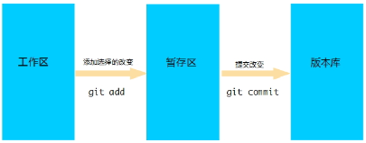


​	Git 工作目录下文件的两种状态：

​		1）untracked 未跟踪（未被纳入版本控制）

​		2）tracked 已跟踪（被纳入版本控制）

​			Unmodified 未修改状态

​			Modified 已修改状态

​			Staged 已暂存状态

​	这些文件的状态会随着我们执行 Git 的命令发生变化


##### 本地仓库操作

| 命令                     | 功能                                               |
| ------------------------ | -------------------------------------------------- |
| git status               | 查看文件状态                                       |
| git status –s            | 输出信息更加简洁（M 已修改、？？未跟踪、A 已暂存） |
| git add                  | 将未跟踪的文件加入暂存区                           |
| git reset                | 将暂存区的文件取消暂存                             |
| git commit               | 将暂存区的文件修改提交到本地仓库（提交前需暂存）   |
| git commit -m "日志信息" | 添加时附加日志信息                                 |
| git commit -a            | 加入暂存区同时提交到本地仓库                       |
| git rm                   | 删除文件                                           |
| git log                  | 查看日志记录（enter 下翻，q 退出）                 |


​	将文件添加至忽略列表：

​		一般我们总会有些文件无需纳入Git 的管理，也不希望它们总出现在未跟踪文件列表。 通常都是些自动生成的文件，比如日志文件，或者编译过程中创建的临时文件等。 在这种情况下，我们可以在工作目录中创建一个名为 .gitignore 的文件（文件名称固定），列出要忽略的文件模式。示例：

```
# no .a files
*.a
# but do track lib.a, even though you're ignoring .a files above
!lib.a
# only ignore the TODO file in the current directory, not subdir/TODO
/TODO
# ignore all files in the build/ directory
build/
# ignore doc/notes.txt, but not doc/server/arch.txt
doc/*.txt
# ignore all .pdf files in the doc/ directory
doc/**/*.pdf
```


##### 远程仓库操作

​	1.查看远程仓库

​		如果想查看已经配置的远程仓库服务器，可以运行 git remote 命令。 它会列出指定的每一个远程服务器的简写。 如果已经克隆了远程仓库，那么至少应该能看到 origin ，这是 Git 克隆的仓库服务器的默认名字

​		git remote

​		git remote -v

​		git remote show origin

​		

​	2.添加远程仓库

​		运行 git remote add <shortname> <url> 添加一个新的远程 Git 仓库，同时指定一个可以引用的简写，例如：git remote add origin https://gitee.com/Ku_Tatsuko/repo1.git


​	3.从远程仓库克隆

​		如果你想获得一份已经存在了的 Git 仓库的拷贝，这时就要用到 git clone 命令。 Git 克隆的是该 Git 仓库服务器上的几乎所有数据（包括日志信息、历史记录等），而不仅仅是复制工作所需要的文件。 当你执行 git clone 命令的时候，默认配置下远程 Git 仓库中的每一个文件的每一个版本都将被拉取下来。

​		克隆仓库的命令格式是 git clone [url]


​	4.移除无效的远程仓库

​		如果因为一些原因想要移除一个远程仓库 ，可以使用 git remote rm
​		注意：此命令只是从本地移除远程仓库的记录，并不会真正影响到远程仓库

​		示例：git remote rm my1


​	5.从远程仓库中抓取与拉取

​		1）git fetch：从远程仓库获取最新版本到本地仓库，不会自动 merge（合并到工作区）

​			还可指定分支：git fetch origin master，不指定则默认 origin/master 分支

​		2）git pull：是从远程仓库获取最新版本并 merge 到本地仓库

​		3）git merge origin/master：合并到工作区

​		注意：如果当前本地仓库不是从远程仓库克隆，而是本地创建的仓库，并且仓库中存在文件，此时再从远程仓库拉取文件的时候会报错（fatal: refusing to merge unrelated histories ），解决此问题可以在 git pull 命令后加入参数 --allow-unrelated-histories


​	6.推送到远程仓库

​		当你想分享你的代码时，可以将其推送到远程仓库。

​		命令形式：git push [remote-name] [branch-name]

​		例如：git push origin master


##### Git 分支

​	1.查看分支

​		1）列出所有本地分支：git branch

​		2）列出所有远程分支：git branch -r

​		3）列出所有本地分支和远程分支：git branch -a


​	2.创建分支

​		git branch 分支名

​		注意：* 号表示当前所在分支


​	3.切换分支

​		git checkout 分支名


​	4.推送至远程仓库分支

​		git push origin 分支名


​	5.合并分区

​		指令：git merge b1（在 master 分支下运行）

​		有时候合并操作不会如此顺利。 如果你在两个不同的分支中，对同一个文件的同一个部分进行了不同的修改，Git 就没办法合并它们，同时会提示文件冲突。此时需要我们打开冲突的文件并修复冲突内容，最后执行 git add 命令来标识冲突已解决


​	6.删除分支

​		git branch -d 分支名

​		如果要删除的分支中进行了一些开发动作，此时执行上面的删除命令并不会删除分支，如果坚持要删除此分支，可以将命令中的-d参数改为-D

​		如果要删除远程仓库中的分支，可以使用命令git push origin –d branchName


​	7.综合应用

​		工作场景如下：

​		1）开发某个网站，为实现某个新的需求，创建一个分支。

​			git branch dev

​			git checkout dev

​		2）在这个分支上开展工作。

​			git add UserDao-dev.java

​			git commit -m "add UserDao-dev.java in dev branch"

​		正在此时，你突然接到一个电话说有个很严重的问题需要紧急修补。 你将按照如下方式来处理：

​		3）切换到你的线上分支（production branch）。

​			git checkout master

​		4）为这个紧急任务新建一个分支，并在其中修复它。

​			git branch fix

​			git checkout fix

​			git commit -a -m "fix problem"

​		5）在测试通过之后，切换回线上分支，然后合并这个修补分支，最后将改动推送到线上分支。

​			git checkout master

​			git merge fix

​			git push origin master

​		6）切换回你最初工作的分支上，继续工作。

​			git checkout dev


##### Git 标签

| 指令                             | 功能                                                        |
| -------------------------------- | ----------------------------------------------------------- |
| git tag                          | 列出所有 tag                                                |
| git show [tag]                   | 查看 tag 信息                                               |
| git tag [tagName]                | 新建一个 tag                                                |
| git push [remote] [tag]          | 提交指定 tag<br />例：git push origin v0.2                  |
| git checkout -b [branch] [tag]   | 新建一个分支，指向某个 tag<br />例：git checkout -b b2 v0.2 |
| git tag -d [tag]                 | 删除本地 tag                                                |
| git push origin :refs/tags/[tag] | 删除远程 tag                                                |


### TortoiseGit

##### 常用操作

​	创建仓库：新建一个文件夹 --> 右键 Git Create repository here（复选框不勾）

​	克隆仓库：右键 --> Git Clone

​	添加到暂存区：右键 --> TortoiseGit --> Add

​	提交文件：右键该文件 --> git Commit

​	推送至远程仓库：右键 --> TortoiseGit --> Push

​	拉取代码：右键 --> TortoiseGit --> Pull

​	创建分支：右键 --> TortoiseGit --> Create Branch

​	切换分支：右键 --> TortoiseGit --> Switch/Checkout

​	合并分支：右键 --> TortoiseGit --> Merge


### IDEA 中使用 Git

​	安装好 IntelliJ IDEA 后，如果 Git 安装在默认路径下，那么 idea 会自动找到 git 的位置，如果更改了 Git 的安装位置则需要手动配置下 Git 的路径。

​	选择 File→Settings 打开设置窗口，找到 Version Control 下的 git 选项，选择 git 的安装目录后可以点击 “Test” 按钮测试是否正确配置

​	创建项目后 VCS --> Create Git Repository


##### 常用操作

​	忽略文件：项目下新建 .gitignore 文件，一般添加 .idea/ taget/ 和 iml 文件

​	添加到暂存区：右键项目 --> Git --> Add

​	提交文件：绿色小勾勾

​	推送至远程仓库：右键项目 --> Git --> Push

​	创建项目时克隆：File --> Project from Version Control

​	远程拉取代码：Git --> Pull（或蓝色小箭头）

​	版本对比：右键 --> Git --> Show History

​	创建分支：Git --> Btanches --> New Branch

​	合并分支：Git --> Merge


### 使用SSH协议传输数据

##### Git 支持的传输协议

​	由于 Git 的远程仓库并不在我们本地，当我们在使用远程仓库的时候（例如克隆、拉取、推送）就会涉及到数据的网络传输，Git 支持多种数据传输协议

​	1）本地协议（Local）
​	2）HTTPS 协议
​	3）SSH（Secure Shell）协议
​	4）Git 协议

##### SSH 协议概念

​	SSH 为 Secure Shell（安全外壳协议）的缩写，由 IETF 的网络小组（Network Working Group）所制定。SSH 是目前较可靠，专为远程登录会话和其他网络服务提供安全性的协议。利用 SSH 协议可以有效防止远程管理过程中的信息泄露问题。

​	由于本地 Git 仓库和远程仓库之间的传输是通过 SSH 加密的，所以必须要让远程仓库服务器认证你的 SSH key，在此之前，必须要生成 SSH key。

​	使用 ssh 协议通信时，推荐使用基于密钥的验证方式。你必须为自己创建一对密匙（公钥和私钥），并把公匙放在需要访问的服务器上。


##### 配置 SSH 协议

​	可以使用Git提供的命令行工具Git Bash生成公钥和私钥，具体操作过程如下：

​	1）使用命令 ssh-keygen –t rsa 生成公钥和私钥，执行完成后在 window 本地用户 .ssh 目录 C:\Users\用户名\\.ssh 下面生成如下名称的公钥和私钥

​	2）复制公钥文件内容至码云服务器


# Dubbo

### 软件架构的演进过程

​	软件架构的发展经历了由单体架构、垂直架构、SOA架构到微服务架构的演进过程，下面我们分别了解一下这几个架构。


##### 单体架构


​	架构说明：

​		全部功能集中在一个项目内（All in one）。

​	架构优点：

​		架构简单，前期开发成本低、开发周期短，适合小型项目。

​	架构缺点：

​		全部功能集成在一个工程中，对于大型项目不易开发、扩展和维护。

​		技术栈受限，只能使用一种语言开发。

​		系统性能扩展只能通过扩展集群节点，成本高。


##### 垂直架构


​	架构说明：       

​		按照业务进行切割，形成小的单体项目。

​	架构优点：

​		技术栈可扩展（不同的系统可以用不同的编程语言编写）。

​	架构缺点：

​		功能集中在一个项目中，不利于开发、扩展、维护。

​		系统扩张只能通过集群的方式。

​		项目之间功能冗余、数据冗余、耦合性强。


##### SOA 架构

​	SOA 全称为 Service-Oriented Architecture，即面向服务的架构。它可以根据需求通过网络对松散耦合的粗粒度应用组件(服务)进行分布式部署、组合和使用。一个服务通常以独立的形式存在于操作系统进程中。

​	站在功能的角度，把业务逻辑抽象成可复用的服务，通过服务的编排实现业务的快速再生，目的：把原先固有的业务功能转变为通用的业务服务，实现业务逻辑的快速复用。


​	架构说明：

​		将重复功能或模块抽取成组件的形式，对外提供服务，在项目与服务之间使用ESB（企业服务总线）的形式作为通信的桥梁。

​	架构优点：

​		重复功能或模块抽取为服务，提高开发效率。

​		可重用性高。

​		可维护性高。

​	架构缺点：

​		各系统之间业务不同，很难确认功能或模块是重复的。

​		抽取服务的粒度大。

​		系统和服务之间耦合度高。


##### 微服务架构


​	架构说明：

​		将系统服务层完全独立出来，抽取为一个一个的微服务。

​		抽取的粒度更细，遵循单一原则。

​		采用轻量级框架协议传输。

​	架构优点：

​		服务拆分粒度更细，有利于提高开发效率。 

​		可以针对不同服务制定对应的优化方案。

​		适用于互联网时代，产品迭代周期更短。

​	架构缺点：

​		粒度太细导致服务太多，维护成本高。

​		分布式系统开发的技术成本高，对团队的挑战大。


### Apache Dubbo 概述

##### Dubbo简介

​	Apache Dubbo 是一款高性能的 Java RPC 框架。其前身是阿里巴巴公司开源的一个高性能、轻量级的开源 Java RPC 框架，可以和 Spring 框架无缝集成。


##### 什么是RPC？

​	RPC全称为 remote procedure call，即**远程过程调用**。比如两台服务器 A 和 B，A 服务器上部署一个应用，B 服务器上部署一个应用，A 服务器上的应用想调用 B 服务器上的应用提供的方法，由于两个应用不在一个内存空间，不能直接调用，所以需要通过网络来表达调用的语义和传达调用的数据。

​	需要注意的是 RPC 并不是一个具体的技术，而是指整个网络远程调用过程。

​	RPC 是一个泛化的概念，严格来说一切远程过程调用手段都属于 RPC 范畴。各种开发语言都有自己的RPC 框架。Java 中的 RPC 框架比较多，广泛使用的有 RMI、Hessian、Dubbo 等。

Dubbo 官网地址：http://dubbo.apache.org

Dubbo 提供了三大核心能力：面向接口的远程方法调用，智能容错和负载均衡，以及服务自动注册和发现。

##### Dubbo架构

​	Dubbo 架构图（Dubbo 官方提供）如下：

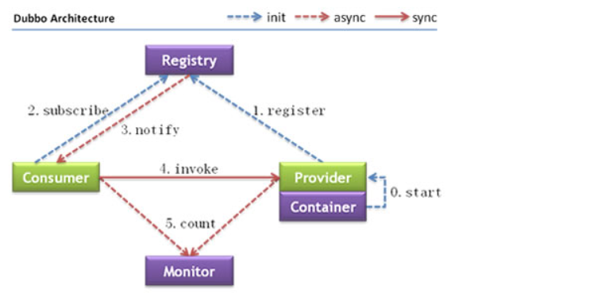

节点角色说明：

| 节点      | 角色名称                               |
| --------- | -------------------------------------- |
| Provider  | 暴露服务的服务提供方                   |
| Consumer  | 调用远程服务的服务消费方               |
| Registry  | 服务注册与发现的注册中心               |
| Monitor   | 统计服务的调用次数和调用时间的监控中心 |
| Container | 服务运行容器                           |

虚线都是异步访问，实线都是同步访问
蓝色虚线:在启动时完成的功能
红色虚线(实线)都是程序运行过程中执行的功能

调用关系说明:

0. 服务容器负责启动，加载，运行服务提供者。
1. 服务提供者在启动时，向注册中心注册自己提供的服务。
2. 服务消费者在启动时，向注册中心订阅自己所需的服务。
3. 注册中心返回服务提供者地址列表给消费者，如果有变更，注册中心将基于长连接推送变更数据给消费者。
4. 服务消费者，从提供者地址列表中，基于软负载均衡算法，选一台提供者进行调用，如果调用失败，再选另一台调用。
5. 服务消费者和提供者，在内存中累计调用次数和调用时间，定时每分钟发送一次统计数据到监控中心。

### 服务注册中心 Zookeeper

​	通过前面的 Dubbo 架构图可以看到，Registry（服务注册中心）在其中起着至关重要的作用。Dubbo 官方推荐使用 Zookeeper 作为服务注册中心。


##### Zookeeper 介绍

​	Zookeeper 是 Apache Hadoop 的子项目，是一个树型的目录服务，支持变更推送，适合作为 Dubbo 服务的注册中心，工业强度较高，可用于生产环境，并推荐使用 。

​	为了便于理解 Zookeeper 的树型目录服务，我们先来看一下我们电脑的文件系统（也是一个树型目录结构）：


我的电脑可以分为多个盘符（例如 C、D、E 等），每个盘符下可以创建多个目录，每个目录下面可以创建文件，也可以创建子目录，最终构成了一个树型结构。通过这种树型结构的目录，我们可以将文件分门别类的进行存放，方便我们后期查找。而且磁盘上的每个文件都有一个唯一的访问路径，例如：C:\Windows\itcast\hello.txt。

Zookeeper 树型目录服务：

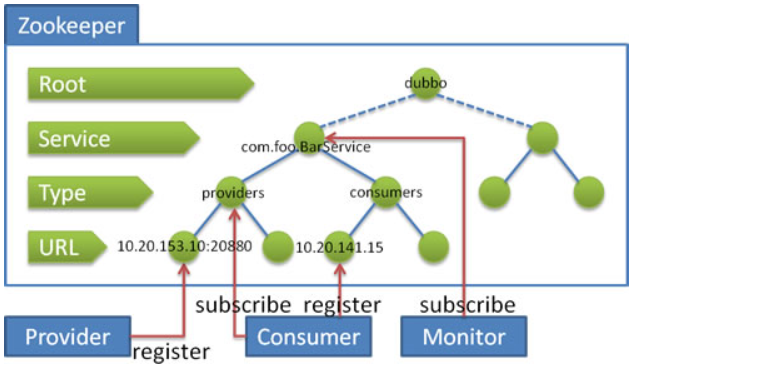

流程说明：

- 服务提供者(Provider)启动时: 向 `/dubbo/com.foo.BarService/providers` 目录下写入自己的 URL 地址
- 服务消费者(Consumer)启动时: 订阅 `/dubbo/com.foo.BarService/providers` 目录下的提供者 URL 地址。并向 `/dubbo/com.foo.BarService/consumers` 目录下写入自己的 URL 地址
- 监控中心(Monitor)启动时: 订阅 `/dubbo/com.foo.BarService` 目录下的所有提供者和消费者 URL 地址


##### Zookeeper 安装

​	下载地址：http://archive.apache.org/dist/zookeeper/

​	本课程使用的 Zookeeper 版本为 3.6.3，下载完成后可以获得名称为 apache-zookeeper-3.6.3-bin.tar.gz 的压缩文件。（注意：不带 bin 的是源码，不能直接运行）

​	安装步骤：

​	第一步：安装 jdk（略）
​	第二步：把 zookeeper 的压缩包上传到 linux 系统
​	第三步：解压缩压缩包
​		tar -zxvf apache-zookeeper-3.6.3-bin.tar.gz -C /usr/local/software/
​	第四步：进入 zookeepe 目录，创建 data 目录
​		mkdir data
​	第五步：进入 conf 目录 ， 把zoo_sample.cfg 改名为 zoo.cfg
​		cd conf
​		mv zoo_sample.cfg zoo.cfg
​	第六步：打开 zoo.cf g文件,  修改data属性：
​		dataDir=/usr/local/software/apache-zookeeper-3.6.3-bin/


##### 启动、停止

​	进入 Zookeeper 的 bin 目录，启动服务命令
​		./zkServer.sh start

​	停止服务命令
​		./zkServer.sh stop

​	查看服务状态：
​		./zkServer.sh status


### Dubbo 快速入门

Dubbo作为一个RPC框架，其最核心的功能就是要实现跨网络的远程调用。本小节就是要创建两个应用，一个作为服务的提供方，一个作为服务的消费方。通过Dubbo来实现服务消费方远程调用服务提供方的方法。


##### 服务提供方开发

（1）创建maven工程（打包方式为war）dubbo_provider，在 pom.xml 文件中导入如下坐标

```xml
<properties>
  <project.build.sourceEncoding>UTF-8</project.build.sourceEncoding>
  <maven.compiler.source>1.8</maven.compiler.source>
  <maven.compiler.target>1.8</maven.compiler.target>
  <spring.version>5.0.5.RELEASE</spring.version>
</properties>
<dependencies>
  <dependency>
    <groupId>org.springframework</groupId>
    <artifactId>spring-context</artifactId>
    <version>${spring.version}</version>
  </dependency>
  <dependency>
    <groupId>org.springframework</groupId>
    <artifactId>spring-beans</artifactId>
    <version>${spring.version}</version>
  </dependency>
  <dependency>
    <groupId>org.springframework</groupId>
    <artifactId>spring-webmvc</artifactId>
    <version>${spring.version}</version>
  </dependency>
  <dependency>
    <groupId>org.springframework</groupId>
    <artifactId>spring-jdbc</artifactId>
    <version>${spring.version}</version>
  </dependency>
  <dependency>
    <groupId>org.springframework</groupId>
    <artifactId>spring-aspects</artifactId>
    <version>${spring.version}</version>
  </dependency>
  <dependency>
    <groupId>org.springframework</groupId>
    <artifactId>spring-jms</artifactId>
    <version>${spring.version}</version>
  </dependency>
  <dependency>
    <groupId>org.springframework</groupId>
    <artifactId>spring-context-support</artifactId>
    <version>${spring.version}</version>
  </dependency>
  <!-- dubbo相关 -->
  <dependency>
    <groupId>com.alibaba</groupId>
    <artifactId>dubbo</artifactId>
    <version>2.6.0</version>
  </dependency>
  <dependency>
    <groupId>org.apache.zookeeper</groupId>
    <artifactId>zookeeper</artifactId>
    <version>3.4.7</version>
  </dependency>
  <dependency>
    <groupId>com.github.sgroschupf</groupId>
    <artifactId>zkclient</artifactId>
    <version>0.1</version>
  </dependency>
  <dependency>
    <groupId>javassist</groupId>
    <artifactId>javassist</artifactId>
    <version>3.12.1.GA</version>
  </dependency>
  <dependency>
    <groupId>com.alibaba</groupId>
    <artifactId>fastjson</artifactId>
    <version>1.2.47</version>
  </dependency>
</dependencies>
<build>
  <plugins>
    <plugin>
      <groupId>org.apache.maven.plugins</groupId>
      <artifactId>maven-compiler-plugin</artifactId>
      <version>2.3.2</version>
      <configuration>
        <source>1.8</source>
        <target>1.8</target>
      </configuration>
    </plugin>
    <plugin>
      <groupId>org.apache.tomcat.maven</groupId>
      <artifactId>tomcat7-maven-plugin</artifactId>
      <configuration>
        <!-- 指定端口 -->
        <port>8082</port>
        <!-- 请求路径 -->
        <path>/</path>
      </configuration>
    </plugin>
  </plugins>
</build>
```


（2）配置 web.xml 文件

```xml
<!DOCTYPE web-app PUBLIC
        "-//Sun Microsystems, Inc.//DTD Web Application 2.3//EN"
        "http://java.sun.com/dtd/web-app_2_3.dtd" >
<web-app>
  <display-name>Archetype Created Web Application</display-name>
  <context-param>
    <param-name>contextConfigLocation</param-name>
    <param-value>classpath:applicationContext*.xml</param-value>
  </context-param>
  <listener>
    <listener-class>org.springframework.web.context.ContextLoaderListener</listener-class>
  </listener>
</web-app>
```


（3）创建服务接口

~~~java
package com.itcast.service;
public interface HelloService {
    public String sayHello(String name);
}
~~~


（4）创建服务实现类

~~~java
package com.itcast.service.impl;

import com.alibaba.dubbo.config.annotation.Service;
import com.itcast.service.HelloService;

//改为 dubbo 的注解，将此 Service 发布为服务，提供网络远程调用
@Service
public class HelloServiceImpl implements HelloService {
    @Override
    public String sayHello(String name) {
        return "hello " + name;
    }
}
~~~

​	注意：服务实现类上使用的 Service 注解是 Dubbo 提供的，用于对外发布服务


（5）在 src/main/resources 下创建 applicationContext-service.xml 

```xml
<?xml version="1.0" encoding="UTF-8"?>
<beans xmlns="http://www.springframework.org/schema/beans"
       xmlns:xsi="http://www.w3.org/2001/XMLSchema-instance"
       xmlns:p="http://www.springframework.org/schema/p"
       xmlns:context="http://www.springframework.org/schema/context"
       xmlns:dubbo="http://code.alibabatech.com/schema/dubbo"
       xmlns:mvc="http://www.springframework.org/schema/mvc"
       xsi:schemaLocation="http://www.springframework.org/schema/beans
      http://www.springframework.org/schema/beans/spring-beans.xsd
         http://www.springframework.org/schema/mvc
         http://www.springframework.org/schema/mvc/spring-mvc.xsd
         http://code.alibabatech.com/schema/dubbo
         http://code.alibabatech.com/schema/dubbo/dubbo.xsd
         http://www.springframework.org/schema/context
         http://www.springframework.org/schema/context/spring-context.xsd">

    <!-- 当前应用名称，用于注册中心计算应用间依赖关系，注意：消费者和提供者应用名不要一样 -->
    <dubbo:application name="dubbo_provider" />

    <!-- 连接服务注册中心zookeeper ip为zookeeper所在服务器的ip地址-->
    <dubbo:registry address="zookeeper://192.168.24.128:2181"/>

    <!-- 注册  协议和port   端口默认是20880 -->
    <dubbo:protocol name="dubbo" port="20881"></dubbo:protocol>

    <!-- 扫描指定包，加入@Service注解的类会被发布为服务  -->
    <dubbo:annotation package="com.itcast.service.impl" />

</beans>
```


（6）启动服务

​		tomcat7:run


##### 服务消费方开发

（1）创建 maven 工程（打包方式为war）dubbo_consumer，pom.xml 配置和上面服务提供者相同，只需要将 Tomcat 插件的端口号改为 8082 即可

（2）配置 web.xml 文件

```xml
<!DOCTYPE web-app PUBLIC
        "-//Sun Microsystems, Inc.//DTD Web Application 2.3//EN"
        "http://java.sun.com/dtd/web-app_2_3.dtd" >
<web-app>
  <display-name>Archetype Created Web Application</display-name>
  <servlet>
    <servlet-name>springmvc</servlet-name>
    <servlet-class>org.springframework.web.servlet.DispatcherServlet</servlet-class>
    <!-- 指定加载的配置文件 ，通过参数contextConfigLocation加载 -->
    <init-param>
      <param-name>contextConfigLocation</param-name>
      <param-value>classpath:applicationContext-web.xml</param-value>
    </init-param>
    <load-on-startup>1</load-on-startup>
  </servlet>
  <servlet-mapping>
    <servlet-name>springmvc</servlet-name>
    <url-pattern>*.do</url-pattern>
  </servlet-mapping>
</web-app>
```


（3）将服务提供者工程中的 HelloService 接口复制到当前工程

（4）编写 Controller

```java
package com.itcast.controller;

import com.alibaba.dubbo.config.annotation.Reference;
import com.itcast.service.HelloService;
import org.springframework.stereotype.Controller;
import org.springframework.web.bind.annotation.RequestMapping;
import org.springframework.web.bind.annotation.ResponseBody;

@Controller
@RequestMapping("/demo")
public class HelloController {

    @Reference
    private HelloService helloService;

    @RequestMapping("/hello")
    @ResponseBody
    public String getName(String name) {
        return helloService.sayHello(name);
    }

}
```

​	注意：Controller 中注入 HelloService 使用的是 Dubbo 提供的 @Reference 注解


（5）在 src/main/resources 下创建 applicationContext-web.xml

```xml
<?xml version="1.0" encoding="UTF-8"?>
<beans xmlns="http://www.springframework.org/schema/beans"
       xmlns:xsi="http://www.w3.org/2001/XMLSchema-instance"
       xmlns:p="http://www.springframework.org/schema/p"
       xmlns:context="http://www.springframework.org/schema/context"
       xmlns:dubbo="http://code.alibabatech.com/schema/dubbo"
       xmlns:mvc="http://www.springframework.org/schema/mvc"
       xsi:schemaLocation="http://www.springframework.org/schema/beans
         http://www.springframework.org/schema/beans/spring-beans.xsd
         http://www.springframework.org/schema/mvc
         http://www.springframework.org/schema/mvc/spring-mvc.xsd
         http://code.alibabatech.com/schema/dubbo
         http://code.alibabatech.com/schema/dubbo/dubbo.xsd
         http://www.springframework.org/schema/context
         http://www.springframework.org/schema/context/spring-context.xsd">

    <!-- 当前应用名称，用于注册中心计算应用间依赖关系，注意：消费者和提供者应用名不要一样 -->
    <dubbo:application name="dubbodemo-consumer" />

    <!-- 连接服务注册中心zookeeper ip为zookeeper所在服务器的ip地址-->
    <dubbo:registry address="zookeeper://192.168.24.128:2181"/>

    <!-- 扫描的方式暴露接口  -->
    <dubbo:annotation package="com.itcast.controller" />

</beans>
```


（6）运行测试

​	tomcat7:run启动

​	在浏览器输入http://localhost:8082/demo/hello.do?name=Jack，查看浏览器输出结果


##### 相关问题

​	**思考一：**上面的 Dubbo 入门案例中我们是将 HelloService 接口从服务提供者工程(dubbo_provider)复制到服务消费者工程(dubboo_consumer)中，这种做法是否合适？还有没有更好的方式？

​	**答：**这种做法显然是不好的，同一个接口被复制了两份，不利于后期维护。更好的方式是单独创建一个 maven 工程，将此接口创建在这个 maven 工程中。需要依赖此接口的工程只需要在自己工程的 pom.xml 文件中引入 maven 坐标即可。


​	**思考二：**在服务消费者工程(dubbo_consumer)中只是引用了 HelloService 接口，并没有提供实现类，Dubbo 是如何做到远程调用的？

​	**答：**Dubbo 底层是基于代理技术 为HelloService 接口创建代理对象，远程调用是通过此代理对象完成的。可以通过开发工具的 debug 功能查看此代理对象的内部结构。另外，Dubbo 实现网络传输底层是基于 Netty 框架完成的。


​	**思考三：**上面的 Dubbo 入门案例中我们使用 Zookeeper 作为服务注册中心，服务提供者需要将自己的服务信息注册到 Zookeeper，服务消费者需要从 Zookeeper 订阅自己所需要的服务，此时 Zookeeper 服务就变得非常重要了，那如何防止 Zookeeper 单点故障呢？

​	**答：**Zookeeper 其实是支持集群模式的，可以配置 Zookeeper 集群来达到 Zookeeper 服务的高可用，防止出现单点故障。


###  Dubbo 管理控制台

​	我们在开发时，需要知道 Zookeeper 注册中心都注册了哪些服务，有哪些消费者来消费这些服务。我们可以通过部署一个管理中心来实现。其实管理中心就是一个 web 应用，部署到 tomcat 即可。


##### 安装

（1）将资料中的 dubbo-admin-2.6.0.war 文件复制到 tomcat 的 webapps 目录下

（2）启动 tomcat，此 war 文件会自动解压

（3）修改 WEB-INF 下的 dubbo.properties 文件，注意 dubbo.registry.address 对应的值需要对应当前使用的 Zookeeper 的 ip 地址和端口号

​	dubbo.registry.address=zookeeper://192.168.24.128:2181
​	dubbo.admin.root.password=root
​	dubbo.admin.guest.password=guest

（4）重启 tomcat


##### 使用

（1）访问 http://localhost:8080/dubbo-admin-2.6.0/，输入用户名(root)和密码(root)

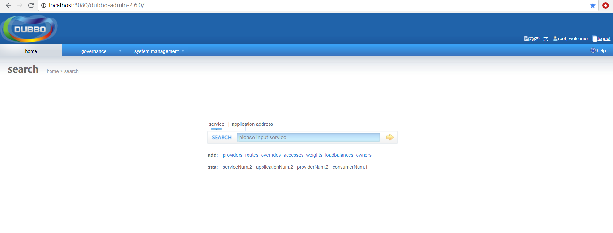

（2）启动服务提供者工程和服务消费者工程，可以在查看到对应的信息


### Dubbo 相关配置说明

##### 包扫描

```xml
<dubbo:annotation package="com.itheima.service" />
```

服务提供者和服务消费者都需要配置，表示包扫描，作用是扫描指定包(包括子包)下的类。

如果不使用包扫描，也可以通过如下配置的方式来发布服务：

```xml
<bean id="helloService" class="com.itheima.service.impl.HelloServiceImpl" />
<dubbo:service interface="com.itheima.api.HelloService" ref="helloService" />
```

作为服务消费者，可以通过如下配置来引用服务：

```xml
<!-- 生成远程服务代理，可以和本地bean一样使用helloService -->
<dubbo:reference id="helloService" interface="com.itheima.api.HelloService" />
```

上面这种方式发布和引用服务，一个配置项(<dubbo:service>、<dubbo:reference>)只能发布或者引用一个服务，如果有多个服务，这种方式就比较繁琐了。推荐使用包扫描方式。


##### 协议

```xml
<dubbo:protocol name="dubbo" port="20880"/>
```

​	一般在服务提供者一方配置，可以指定使用的协议名称和端口号。（name 为协议）

​	其中 Dubbo 支持的协议有：dubbo、rmi、hessian、http、webservice、rest、redis 等。

​	推荐使用的是 dubbo 协议。

​	dubbo 协议采用单一长连接和 NIO 异步通讯，适合于小数据量大并发的服务调用，以及服务消费者机器数远大于服务提供者机器数的情况。不适合传送大数据量的服务，比如传文件，传视频等，除非请求量很低。

​	也可以在同一个工程中配置多个协议，不同服务可以使用不同的协议，例如：

```xml
<!-- 多协议配置 -->
<dubbo:protocol name="dubbo" port="20880" />
<dubbo:protocol name="rmi" port="1099" />
<!-- 使用dubbo协议暴露服务 -->
<dubbo:service interface="com.itheima.api.HelloService" ref="helloService" protocol="dubbo" />
<!-- 使用rmi协议暴露服务 -->
<dubbo:service interface="com.itheima.api.DemoService" ref="demoService" protocol="rmi" /> 
```

​	或使用注解方式配置：

```java
@Service(protocol = "dubbo")
```


##### 启动时检查

```xml
<dubbo:consumer check="false"/>
```

​	上面这个配置需要配置在服务消费者一方，如果不配置默认 check 值为 true。Dubbo 缺省会在启动时检查依赖的服务是否可用，不可用时会抛出异常，阻止 Spring 初始化完成，以便上线时，能及早发现问题。可以通过将 check 值改为 false 来关闭检查。

​	建议在开发阶段将 check 值设置为 false，在生产环境下改为 true。


##### 负载均衡

​	负载均衡（Load Balance）：其实就是将请求分摊到多个操作单元上进行执行，从而共同完成工作任务。

​	在集群负载均衡时，Dubbo 提供了多种均衡策略（包括随机、轮询、最少活跃调用数、一致性 Hash），缺省为 random 随机调用。

​	配置负载均衡策略，既可以在服务提供者一方配置，也可以在服务消费者一方配置，如下：

```java
    @Controller
    @RequestMapping("/demo")
    public class HelloController {
        //在服务消费者一方配置负载均衡策略
        @Reference(check = false,loadbalance = "random")
        private HelloService helloService;

        @RequestMapping("/hello")
        @ResponseBody
        public String getName(String name){
            //远程调用
            String result = helloService.sayHello(name);
            System.out.println(result);
            return result;
        }
    }
```

```java
//在服务提供者一方配置负载均衡
@Service(loadbalance = "random")
public class HelloServiceImpl implements HelloService {
    public String sayHello(String name) {
        return "hello " + name;
    }
}
```

​	可以通过启动多个服务提供者来观察 Dubbo 负载均衡效果。

​	注意：因为我们是在一台机器上启动多个服务提供者，所以需要修改 tomcat 的端口号和 Dubbo 服务的端口号来防止端口冲突。

​	在实际生产环境中，多个服务提供者是分别部署在不同的机器上，所以不存在端口冲突问题。


### 解决 Dubbo 无法发布被事务代理的 Service 问题

​	前面我们已经完成了 Dubbo 的入门案例，通过入门案例我们可以看到通过 Dubbo 提供的标签配置就可以进行包扫描，扫描到 @Service 注解的类就可以被发布为服务。

​	但是我们如果在服务提供者类上加入 @Transactional 事务控制注解后，服务就发布不成功了。原因是事务控制的底层原理是为服务提供者类创建代理对象，而默认情况下 Spring 是基于 JDK 动态代理方式创建代理对象，而此代理对象的完整类名为 com.sun.proxy.$Proxy42（最后两位数字不是固定的），导致 Dubbo 在发布服务前进行包匹配时无法完成匹配，进而没有进行服务的发布。


##### 问题展示

​	在入门案例的服务提供者 dubbo_provider 工程基础上进行展示

（1）在 pom.xml 文件中增加 maven 坐标

~~~xml
<dependency>
  <groupId>mysql</groupId>
  <artifactId>mysql-connector-java</artifactId>
  <version>8.0.26</version>
</dependency>
<dependency>
  <groupId>com.alibaba</groupId>
  <artifactId>druid</artifactId>
  <version>1.2.6</version>
</dependency>
<dependency>
  <groupId>org.mybatis</groupId>
  <artifactId>mybatis-spring</artifactId>
  <version>1.3.2</version>
</dependency>
~~~

（2）在 applicationContext-service.xml 配置文件中加入数据源、事务管理器、开启事务注解的相关配置

```xml
<!--数据源-->
<bean id="dataSource" class="com.alibaba.druid.pool.DruidDataSource" destroy-method="close">
    <property name="username" value="root" />
    <property name="password" value="123456" />
    <property name="driverClassName" value="com.mysql.cj.jdbc.Driver" />
    <property name="url" value="jdbc:mysql:///hm_db3" />
</bean>

<!-- 事务管理器  -->
<bean id="transactionManager"
      class="org.springframework.jdbc.datasource.DataSourceTransactionManager">
    <property name="dataSource" ref="dataSource"/>
</bean>

<!--开启事务控制的注解支持-->
<!-- proxy-target-class="true" 强制开启 cglib 代理， cglib 代理创建的包会和原目录结构保持一致 -->
<tx:annotation-driven transaction-manager="transactionManager" proxy-target-class="true"/>
```


（3）在HelloServiceImpl类上加入@Transactional注解

（4）启动服务提供者和服务消费者，并访问

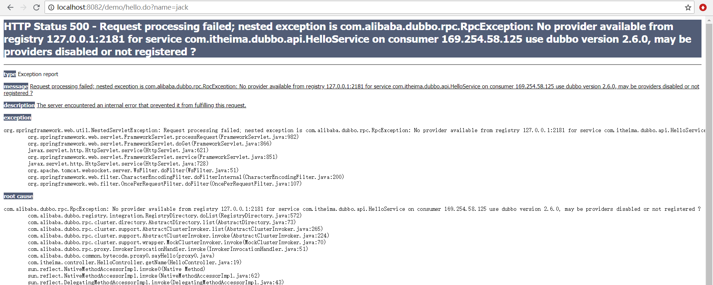

​	上面的错误为没有可用的服务提供者

​	查看 dubbo 管理控制台发现服务并没有发布，如下：


可以通过断点调试的方式查看 Dubbo 执行过程，Dubbo 通过 AnnotationBean 的 postProcessAfterInitialization 方法进行处理


##### 解决方案

​	通过上面的断点调试可以看到，在 HelloServiceImpl 类上加入事务注解后，Spring 会为此类基于JDK动态代理技术创建代理对象，创建的代理对象完整类名为 com.sun.proxy.$Proxy35，导致 Dubbo 在进行包匹配时没有成功（因为我们在发布服务时扫描的包为 com.itheima.service），所以后面真正发布服务的代码没有执行。

​	解决方式操作步骤：

（1）修改 applicationContext-service.xml 配置文件，开启事务控制注解支持时指定 proxy-target-class 属性，值为 true。其作用是使用 cglib 代理方式为 Service 类创建代理对象

~~~xml
<!--开启事务控制的注解支持-->
<tx:annotation-driven transaction-manager="transactionManager" proxy-target-class="true"/>
~~~

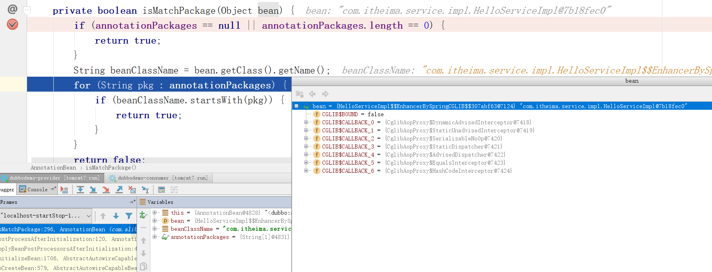

（2）修改 HelloServiceImpl 类，在 Service 注解中加入 interfaceClass 属性，值为 HelloService.class，作用是指定服务的接口类型

~~~java
//同时需要明确指定当前实现类实现的服务接口，否则实现接口会被代理为 SpringProxy
@Service(interfaceClass = HelloService.class)
@Transactional
public class HelloServiceImpl implements HelloService {
    public String sayHello(String name) {
        return "hello " + name;
    }
}
~~~

​	此处也是必须要修改的，否则会导致发布的服务接口为 SpringProxy，而不是 HelloService 接口：


# Node.js

### 概述

​	Node.js 就是运行在服务端的 JavaScript。

​	Node.js 是一个基于 Chrome JavaScript 运行时建立的一个平台。

​	Node.js 是一个事件驱动 I/O 服务端 JavaScript 环境，基于 Google 的 V8 引擎，V8 引擎执行 JavaScript 的速度非常快，性能非常好。


### Nodejs 模块化编程

##### 快速入门

（1）创建普通 Web 工程

（2）编写 demo.js

```javascript
var c = add(100, 200);
console.log(c);
function add(a, b) {
    return a + b;
}
```

（3）点击 IDEA 下方 Terminal 执行 node demo.js（需要管理员身份运行 IDEA）


##### 模块化编程

​	每个文件就是一个模块，有自己的作用域。在一个文件里定义的变量、函数、类，都是私有的，对其他文件不可见，但可以使用 exports. 导出方法方便其他文件调用

> 创建 demo2_1.js

```javascript
exports.add = function (a, b) {
    return a + b;
}
```

​	每个模块内部，module 变量代表当前模块。这个变量是一个对象，它的 exports 属性（既 module.exports）是对外的接口。加载某个模块，其实是加载该模块的 module.exports 属性。

> 创建 demo2_2.js

```javascript
//引入模块 demo2_1
var demo = require("./demo3_1");
console.log(demo.add(400, 600));
```

​	最后，在命令行输入 node demo2_2.js 即可

​	**小结**：可以使用 exports 将 js 方法导出，并使用 require 引入对应的 js 模块，即可使用对应方法


### 创建 Nodejs Web 服务器

```javascript
//引入 node.js 内置 http 模块
var http = require("http");

//创建并监听 web 服务器
http.createServer(function (request, response) {

    //发送 http 头部
    //参数1：响应状态码，200 表示成功
    //参数2：响应头部信息，Content-Type 内容类型：纯文本
    response.writeHead(200, {"Content-Type": "text/plain"});

    //发送响应数据
    for (var i=0; i<10; i++) {
        response.write("Hello World \n");
    }

    //添加结束标识
    response.end("");

}).listen(8888);
console.log("服务器运行在 http://127.0.0.1:8888");
```


### 处理请求参数

需求：http://127.0.0.1:8888?id=123&name=ktsk 中获取到请求路径中参数及值并输出

实现步骤：

​	1.引入 url 模块

​	2.创建 web 服务器

​	3.利用 url 解析请求中参数和值并输出

​	4.启动测试

```javascript
//引入 node.js 内置 http 与 url 模块
var http = require("http");
var url = require("url");

http.createServer(function (request, response) {

    response.writeHead(200, {"Content-Type": "text/plain"});

    //解析请求数据
    //参数1：请求地址
    //参数2：如为 true 则使用 query 解析参数到一个对象，默认为 false
    var params = url.parse(request.url, true).query;
    for (var key in params) {
        response.write(key + " = " + params[key]);
        response.write("\n");
    }

    response.end("");

}).listen(8888);
console.log("访问 url： http://127.0.0.1:8888?id=123&name=ktsk");
```


### NPM 包资源管理

##### 概述

​	npm 全称 Node Package Manager, 是 node 包管理和分发工具。其实我们可以把 NPM 理解为前端的 Maven。通过 npm 可以很方便地下载 js 库，管理前端工程。

​	现在的 node.js 以及集成了 npm 工具，在命令提示符输入 npm -v 可查看当前 npm 版本。


##### 初始化工程

​	使用 `npm init` 在空文件夹或工程中初始化，按照提示输入相关信息，如果需默认值则直接回车。

​		name：项目名

​		version：项目版本

​		description：项目描述

​		entry point：入口 js 文件，项目为空时生成 index.js，项目不为空时默认为第一个 js 文件

​			入口 js：在一般前端工程中会将其他 js 在入口 js 中引入，其他地方使用时只需引入入口 js 即可

​		test command：测试指令

​		git repository：仓库路径

​		keywords：{Array} 关键词，便于用户搜索到我们的项目

​		author：作者信息

​	最后会生成 package.json 文件，这个是包的配置文件，相当于 Maven 的 pom.xml


##### 本地安装

​	install 命令用于安装某个模块，可以通过 require 引入到项目中使用。如果我们想安装 express 模块（node 的 web 框架），则输入：

> npm install express

​	如果下载速度慢，可使用淘宝镜像源下载：

> cnpm install express

​	下载完成后会在该目录下出现 node_modules 文件夹和 package-lock.json 文件（cnpm 无此文件）,node_modules 文件夹用于存放下载的 js 库（相当于 maven 的本地仓库）

​	package-lock.json 是 当 node_modules 或 package.json 发送变化时自动生成的文件。这个文件主要功能是确定当前安装的包的依赖，以便后续重新安装时生成相同的依赖，而忽略项目开发过程中有些依赖发生的更新（既可能存在切换了不同镜像源后，同一个大版本号下可能出现兼容问题，package-lock 可以保证即使换了源，下载的文件也和原来的保持一致）

​	同时，package.json 文件会自动把 express 添加到依赖列表中：

```json
"dependencies": {
  "express": "^4.17.1"
}
```

​	注意：cnpm 不会自动添加，需要手动输入


​	关于版本号的定义：

>指定版本：比如 1.2.2 遵循 "大版本.次要版本,小版本" 的格式规定，安装时只安装指定版本。
>
>波浪号（~）+ 指定版本：比如 ~1.2.2，表示安装 1.2.x 的最新版本 (不低于1.2.2)，但是不安装 1.3.x，也就是说安装时不改变大版本号和次要版本号。
>
>插入号（^）+ 指定版本：比如 ^1.2.2，表示安装 1.x.x 的最新版本 (不低于1.2.2)，但是不安装 2.x.x，也就是说安装时不改变大版本号。需要注意的是，如果大版本号为 0，则插入号的行为与波浪号相同，这是因为此时处于开发阶段，即使是次要版本号变动，也可能带来程序的不兼容。
>
>latest：安装最新版本。


##### 全局安装

​	本地安装会将 js 库安装到当前目录，全局安装则会将库安装到全局目录下。全局安装之后可以在命令行使用安装的模块所对应的内容或命令。

> 查看全局目录：npm root -g
>
> 例如全局安装 jquery：npm install jquery -g

​	注意：全局安装后在全局目录下会存在对应的 jquery 目录，里面的 dist 则包含对应的 jquery.js 文件


##### 批量下载

​	从网上下载某些代码，发现只有 package.json，没有 node_modules 文件夹时，则需通过命令重新下载 js 库，进入目录（package.json 所在目录）输入：

> npm install

​	此时，npm 会自动下载 package.json 中依赖的 js 库。


### 切换 NPM 镜像

​	有时我们使用 npm 下载资源会很慢，则可以切换下载的镜像源（如：淘宝镜像)，或者安装一个cnmp（指定淘宝镜像）来加快下载速度。


##### 切换源方式

​	如果使用切换镜像源的方式，可以使用一个工具：nrm

​		首先安装 nrm，这里 -g 代表全局安装

> npm install nrm -g

​		然后通过 `nrm ls` 命令查看 npm 的仓库列表，带 * 的就是当前选中的镜像仓库。

​		通过 `nrm use taobao` 来指定使用 taobao 镜像源。


##### cnpm 方式

​	如果使用 cnpm 方式，则先安装 cnpm，输入：

> npm install -g cnpm --registry=https://registry.npm.taobao.org

​	安装后，可以使用以下命令查看 cnpm 版本：

> cnpm -v

​	使用 cnpm：

> cnpm install 需要下载的js库

​	注意：一般只有在下载时才使用 cnpm，其他情况还是使用 npm


### 运行工程测试

##### 运行工程说明

​	如果我们想运行某个工程，则使用 run 命令

​	如果 package.json 中定义的脚本有：

​		dev：开发阶段测试运行

​		build：构建编译工程

​		lint：运行 js 代码检测

​	则运行时命令格式：

> npm run dev 或 build 或 lint


##### 编译工程说明

​	编译后的代码会放在dist文件夹中，进入命令提示符输入命令

> npm run build

​	生成后会发现只有个静态页面，和一个 static 文件夹

​	这种工程我们称之为单页 Web 应用 (single page web application，SPA)，就是只有一张 Web 页面的应用，是加载单个 HTML 页面并在用户与应用程序交互时动态更新该页面的 Web 应用程序。

​	这里其实是调用了 webpack 来实现打包的，关于 webpack 下面的章节将进行介绍。


### webpack

##### 概述

​	Webpack 是一个前端资源加载/打包工具。它将根据模块的依赖关系进行静态分析，然后将这些模块按照指定的规则生成对应的静态资源。

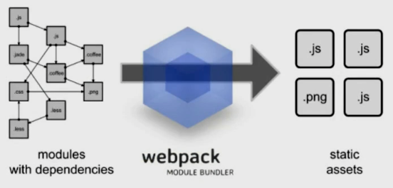

​	从图中我们可以看出，Webpack 可以将多种静态资源 js、css 等转换成一个静态文件，减少了页面的请求。


##### Webpack 安装

​	全局安装：

> 安装 webpack：npm install webpack -g
>
> 安装 webpack 脚手架：npm install webpack-cli -g

​	webpack 脚手架：用于构建 webpack 相关目录结构

​	注意：如果安装失败，则将全局目录下的 webpack 的相关文件夹删除再执行上述命令

​	安装后查看版本号：

> webpack -v


##### Webpack 打包 js

​	实现步骤：

​		1.创建 2 个 js 文件

```javascript
//bar.js
exports.info = function (str) {
    document.write(str);
}
```

```javascript
//logic.js
exports.add = function (a, b) {
    return a + b;
}
```

​		2.创建入口文件 main.js 

```javascript
//引入 js 文件并应用
var bar = require("./bar");
var logic = require("./logic");
bar.info("100 + 200 = " + logic.add(100, 200));
```

​		3.创建 webpack 的配置文件

```javascript
//webpack.config.js 文件，必须以此命名
//引入路径模块
var path = require("path");
//给模块赋值
module.exports = {
    //入口文件
    entry: "./src/main.js",
    output: {
        /**
         * 输出路径：
         *  path.resolve()：查找路径
         *  __dirname：nodejs 的全局变量，代表当前所在目录
         *  "./dist"：需要创建的文件夹
         *  filename：需要创建的文件名
        **/
        path: path.resolve(__dirname, "./dist"),
        filename: "bundle.js"
    }
}
```

​		以上代码的意思是：读取当前目录下 src 文件夹中的 main.js （入口文件）内容，把对应的 js 文件打包，打包后的文件放入当前目录的 dist 文件夹下，打包后的 js 文件名为 bundle.js

​		4.运行 webpack 命令

​		5.创建 index.html 页面进行测试（index 中 `<script src="dist/bundle.js"></script>`）


##### Webpack 打包 css

（1）安装 style-loader 和 css-loader

​		Webpack 本身只能处理 JavaScript 模块，如果要处理其他类型的文件，就需要使用 loader 进行转换。Loader 可以理解为是模块和资源的转换器，它本身是一个函数，接受源文件作为参数，返回转换的结果。这样，我们就可以通过 require 来加载任何类型的模块或文件，比如 CoffeeScript、JSX、LESS 或图片。首先我们需要安装相关 Loader 插件，css-loader 是将 css 装载到 javascript; style-loader 是让 javascript 认识 css。

> npm install style-loader css-loader --save-dev
>
> npm install less less-loader --save-dev

> ​	-save 的意思是将模块安装到项目目录下，并在 package 文件的 dependencies 节点写入依赖。运行 npm install--production 或者注明 NODE_ENV 变量值为 production 时，会自动下载模块到 node_modules 目录中。
>
> ​	-save-dev 的意思是将模块安装到项目目录下，并在 package 文件的 devDependencies 节点写入依赖。运行 npm install -production 或者注明 NODE_ENV 变量值为 production 时，不会自动下载模块到 node_modules 目录中。


（2）修改 webpack.config.js

```javascript
var path = require("path");

module.exports = {
    entry: "./src/main.js",
    output: {
        path: path.resolve(__dirname, "./dist"),
        filename: "bundle.js"
    },
    //添加以下代码
    module: {
        rules: [
            {
                //对哪些资源进行转换（正则为以 .css 结尾的文件）
                test: /\.css$/,
                //用哪些组件转换，打包到上面生成的 js 文件中
                use: ["style-loader", "css-loader"]
            }
        ]
    }
}
```


（3）创建 ./src/css/css1.css

```css
body {
    background-color: cadetblue;
}
```


（4）在入口 js 中引入 css 文件

```javascript
var bar = require("./bar");
var logic = require("./logic");

//引入样式文件
require("./css/css1.css");

bar.info("100 + 200 = " + logic.add(100, 200));
```


（5）执行 webpack，访问 index.html 查看结果

​	**小结**：webpack 打包 css 文件需要安装转换组件，并修改配置文件


# Vue

### 概述

#### 前言

先了解一下前端开发模式的发展。

> 静态页面

* 最初的网页以 HTML 为主，是纯静态的网页。网页是只读的，信息流只能从服务端到客户端单向流通。**开发人员** **也只关心页面的样式和内容**。

> 异步刷新，操作 DOM

* 1995年，网景工程师 Brendan Eich 花了 10 天时间设计了 JavaScript 语言。

  随着 JavaScript 的诞生，我们可以操作页面的 DOM 元素及样式，页面有了一些动态的效果，但是依然是以静态为主。

* ajax 盛行：

  * 2005 年开始，ajax 逐渐被前端开发人员所重视，因为不用刷新页面就可以更新页面的数据和渲染效果。

  * 此时的**开发人员不仅仅要编写** **HTML** **样式，还要懂** **ajax** **与后端交互，然后通过** **JS** **操作** **Dom** **元素来实现页面** **动态效果**。比较流行的框架如 jQuery 就是典型代表。

> MVVM，关注模型和视图

* 2008 年，google 的 Chrome 发布，随后就以极快的速度占领市场，超过 IE 成为浏览器市场的主导者。

* 2009 年，Ryan Dahl 在谷歌的 Chrome V8 引擎基础上，打造了基于事件循环的异步 IO 框架：Node.js。

  * 基于时间循环的异步IO

  * 单线程运行，避免多线程的变量同步问题

  * JS 可以编写后台 diamante，前后台统一编程语言

* node.js 的伟大之处不在于让 JS 迈向了后端开发，而是构建了一个庞大的生态系统。

* 2010 年，NPM 作为 node.js 的包管理系统首次发布，开发人员可以遵循 Common.js 规范来编写 Node.js 模块，然后发布到 NPM 上供其他开发人员使用。目前已经是世界最大的包模块管理系统。

* 随后，在 node 的基础上，涌现出了一大批的前端框架：

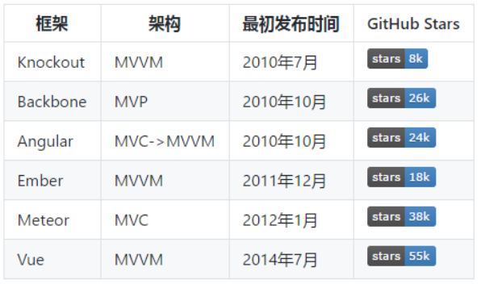

> MVVM模式

* M：即 Model，模型，包括数据和一些基本操作

* V：即 View，视图，页面渲染结果

* VM：即 View-Model，模型与视图间的双向操作（无需开发人员干涉）

在 MVVM 之前，开发人员从后端获取需要的数据模型，然后要通过 DOM 操作 Model 渲染到 View 中。而后当用户操作视图，我们还需要通过 DOM 获取 View 中的数据，然后同步到 Model 中。

而 MVVM 中的 VM 要做的事情就是把 DOM 操作完全封装起来，开发人员不用再关心 Model 和 View 之间是如何互相影响的：

* 只要 Model 发生了改变，View 上自然就会表现出来。

* 当用户修改了 View，Model 中的数据也会跟着改变。

* 把开发人员从繁琐的 DOM 操作中解放出来，把关注点放在如何操作 Model 上。

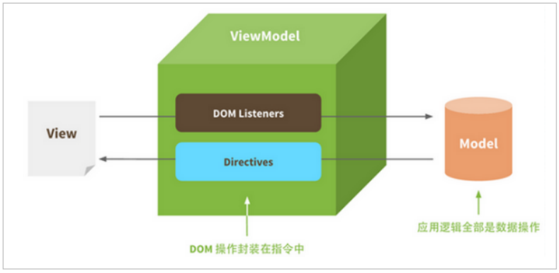


#### 认识 Vue

​	Vue (读音 /vjuː/，类似于 **view**) 是一套用于构建用户界面的**渐进式框架**。与其它大型框架不同的是，Vue 被设计为可以自底向上逐层应用。Vue 的核心库只关注视图层，不仅易于上手，还便于与第三方库或既有项目整合。另一方面，当与现代化的工具链以及各种支持类库结合使用时，Vue 也完全能够为复杂的单页应用提供驱动。

> 前端框架三巨头：Vue.js、React.js、AngularJS，vue.js以其轻量易用著称，vue.js 和 React.js 发展速度最快。
>
> 渐进式：可以选择性的使用该框架的一个或一些组件，这些组件的使用也不需要将框架全部组件都应用；而且用了这些组件也不要求你的系统全部都使用该框架。

官网：https://cn.vuejs.org/

参考：https://cn.vuejs.org/v2/guide/

Git 地址：https://github.com/vuejs

**尤雨溪**，Vue.js 创作者，Vue Technology 创始人，致力于 Vue 的研究开发。

**小结**：MVVM 通过视图与模型的双向绑定，简化前端操作。Vue 是一款前端渐进式框架，可以提高前端开发效率。


### 安装

##### 下载安装

​	下载地址：https://github.com/vuejs/vue


##### 使用 CDN

```html
<!-- 开发环境版本，包含了用帮助的命令行警告 -->
<script src="https://cdn.jsdelivr.net/npm/vue/dist/vue.js"></script>
```

或

```html
<!-- 生产环境版本，优化了尺寸和速度 -->
<script src="https://cdn.jsdelivr.net/npm/vue"></script>
```


##### npm 安装（推荐）

​	IDEA 中打开控制台：（-y 为默认初始化）

```sh
npm init -y
```

​	安装 Vue：

```sh
#save 的意思是将模块安装到项目目录下，并在package文件的dependencies节点写入依赖
npm install vue --save
```


### 入门案例

##### vue 渲染

​	01-demo.html内容如下：

```html
<div id="app">
    <h2>{{name}}, idea</h2>
</div>

<script type="text/javascript">
    var app = new Vue({
        el:"#app",
        data:{
            name:"test"
        }
    });
</script>
```

* 首先通过 new Vue()来创建Vue实例
* 然后构造函数接收一个对象，对象中有一些属性：
  * el：是element的缩写，通过id选中要渲染的页面元素，本例中是一个div
  * data：数据，数据是一个对象，里面有很多属性，都可以渲染到视图中
    * name：这里指定了一个name属性

* 页面中的 h2 元素中，通过{{name}}的方式，来渲染刚刚定义的name属性。


​	浏览器控制台也可动态修改：

​		this.app._data.name="aaa" 或 app.name="bbb"


##### 双向绑定

```html
<div id="app">
    <input type="text"  v-model="num">
    <h2>{{name}}, idea, num = {{num}}</h2>
</div>

<script type="text/javascript">
    var app = new Vue({
        el:"#app",
        data:{
            name: "test",
            num: 1
        }
    });
</script>
```

* 在data添加了新的属性： num

* 在页面中有一个 input 元素，通过 v-model 与 num 进行绑定。

* 同时通过 {{num}} 在页面输出

​	可以观察到，输入框的变化引起了 data 中的 num 的变化，同时页面输出也跟着变化。 input 与 num 绑定，input 的 value 值变化，影响到了 data 中的 num 值页面 {{num}} 与数据 num 绑定，因此 num 值变化，引起了页面效果变化。


##### 事件处理

```html
<div id="app">
    <input type="text"  v-model="num">
    <button v-on:click="num++">num++ btn</button>
    <h2>{{name}}, idea, num = {{num}}</h2>
</div>

<script type="text/javascript">
    var app = new Vue({
        el:"#app",
        data:{
            name: "test",
            num: 1
        }
    });
</script>
```

​	这里用 v-on 指令绑定点击事件，而不是普通的 onclick ，然后直接操作 num，普通 onclick 是无法直接操作 num 的。


### Vue 实例

##### 创建 Vue 实例

​	每个 Vue 应用都是通过用 Vue 函数创建一个新的 Vue 实例开始的：

```javascript
var vm = new Vue({
	//选项
});
```

​	在构造函数中传入一个对象，并且在对象中声明各种 Vue 需要的数据和方法，包括：

* el

* data
* methods
* ...


##### 模板或元素

​	每个 Vue 实例都需要关联一段 html 模板，Vue 会基于此模板进行视图渲染，可通过 el 属性来指定。

​	例如一段 html 模板：

```html
<div id="app">
	...
</div>
```

​	然后创建 Vue 实例，关联这个 div

```javascript
var vm = new Vue({
	el:"#app"
});
```

​	这样，Vue 就可以基于 id 为 app 的 div 元素作为模板进行渲染了。在这个 div 范围以外的部分是无法使用 vue 特性的（如 {{name}} ）。


##### 数据

​	当 Vue 实例被创建时，它会尝试获取在 data 中定义的所有属性，用于视图的渲染，并且监视 data 中的属性变化，当 data 发生改变，所有相关的视图都将重新渲染，这就是 “响应式“ 系统。

​	html：

```html
<div id="app">
	<input type="text" v-model="name" />
</div>
```

​	js：

```javascript
var vm = new Vue({
	el: "#app",
	data: {
		name: "test"
	}
});
```

* name 的变化会影响到 input 的值
* input 中输入的值，也会导致 vm 中的 name 发生改变


##### 方法

​	Vue 实例中除了可以定义 data 属性，也可以定义方法，并且在 Vue 的作用范围内使用。

​	html：

```html
<div id="app">
	<button v-on:click="add">点我</button>
</div>
```

​	js：

```javascript
var vm = new Vue({
	el: "#app",
	data: {},
	methods: {
		add:function() {
			console.log("点我了...233")
		}
	}
});
```


### Vue 生命周期钩子

##### 生命周期

​	每个 Vue 实例在被创建时都要经过一系列的初始化过程 ：创建实例，装载模板，渲染模板等。Vue 为生命周期中的每个状态都设置了钩子函数（监听函数）。每当 Vue 实例处于不同的生命周期时，对应的函数就会被触发调用。

> 所有的生命周期钩子自动绑定 this 上下文到实例中，因此你可以访问数据，对属性和方法进行运算。这意味着你不能使用箭头函数来定义一个生命周期方法 (例如 created: () => this.fetchTodos() )。这是因为箭头函数绑定了父上下文，因此 this 与你期待的 Vue 实例不同， this.fetchTodos 的行为未定义。


> vm.$el ：Vue 实例使用的根 DOM 元素
>
> vm.$root ：当前组件树的根 Vue 实例。如果当前实例没有父实例，此实例将会是其自己。


##### 钩子函数

​	例如：created 代表在 Vue 实例创建后，可以在 Vue 中定义一个 created 函数，代表这个时期的构造函数：

```html
<div id="app">
  {{msg}}
</div>

<script type="text/javascript">
  var app = new Vue({
    el: "#app",
    data: {
      msg: ""
    },
    //钩子函数
    created() {
      //this 表示 Vue 实例
      this.msg = "hello vue. created.";
      console.log(this);
    }
  });
</script>
```

​	总结：

* this 就是当前的 Vue 实例，在 Vue 对象内部，必须使用 this 才能访问到 Vue 中定义的 data 内属性、方法等。
* 钩子函数会在 Vue 实例的各个生命周期阶段自动调用，具体有：beforeCreate、created、beforeMount、mounted、updated、beforeUpdate、destroyed、beforeDestroy
* created 钩子函数常用场景：用于初始化数据


### 指令

​	指令 (Directives) 是带有 v- 前缀的特殊属性。例如在入门案例中的 v-model，代表双向绑定。


##### 花括号

​	格式：{{ 表达式 }}

​	说明：

​		1）该表达式支持 JS 语法，可以调用 js 内置函数（必须有返回值）

​		2）表达式必须有返回结果。例如 1 + 1，没有结果的表达式不允许使用，如：var a = 1 + 1;

​		3）可以直接获取 Vue 实例中定义的数据或函数


##### 插值闪烁

​	使用 {{}} 方式在网速较慢时会出现问题。在数据未加载完成时，页面会显示出原始的 {{}} ，加载完毕后才显示正确数据称为插值闪烁。类似如下的效果（最新 vue 是几乎没有此问题）


##### v-text 和 v-html

​	使用 v-text 和 v-html 指令来替代 {{}}

​	说明：

​		v-text：将数据输出到元素内部，如果输出的数据有 HTML 代码，会作为普通文本输出

​		v-html：将数据输出到元素内部，如果输出的数据有 HTML 代码，会被渲染

```html
<div id="app">
    <span v-text="msg"></span><br/>
    <span v-html="msg"></span>
</div>

<script type="text/javascript">
  var app = new Vue({
    el: "#app",
    data: {
      msg: "<h1>test</h1>"
    }
  });
</script>
```


##### v-model

​	刚才的 v-text 和 v-html 可以看做是单向绑定，数据影响了视图渲染，但是反过来就不行。而 v-model 是双向绑定，视图（View）和模型（Model）之间会互相影响。

​	既然是双向绑定，一定是在视图中可以修改数据，这样就限定了视图的元素类型。目前 v-model 的可使用元素有：（基本上除了最后一项，其它都是表单的输入项）

* input
* select
* textarea
* checkbox
* radio
* components（Vue 中的自定义组件）

```html
<div id="app">
    <input type="checkbox" value="Java" v-model="language"> Java <br/>
    <input type="checkbox" value="Python" v-model="language"> Python <br/>
    <input type="checkbox" value="Swift" v-model="language"> Swift <br/>
    <h2>
        你选择了：{{language.join(",")}}
    </h2>
</div>

<script type="text/javascript">
  var app = new Vue({
    el: "#app",
    data: {
      language: []
    }
  });
</script>
```

​	多个 checkbox 对应一个 model 时，model 的类型是一个数组，单个 checkbox 值是 boolean 类型 

* radio 对应的值是 input 的 value 值

* input 和 textarea 默认对应的 model 是字符串

* select 单选对应字符串，多选对应也是数组


##### v-on

​	语法：`v-on:事件名="js片段或函数名"`

​	简写语法：` @事件名="js片段或函数名"`

```html
<div id="app">
    <button v-on:click="num++">增加</button>
    <button @click="decrement">减少</button>
    <h2>
        num = {{num}}
    </h2>
</div>

<script type="text/javascript">
  var app = new Vue({
    el: "#app",
    data: {
      num: 1
    },
    methods: {
        decrement() {
            this.num--;
        }
    }
  });
</script>
```


##### 事件修饰符	

​	在事件处理程序中调用 event.preventDefault() 或 event.stopPropagation() 是非常常见的需求。尽管我们 可以在方法中轻松实现这点，但更好的方式是：方法只有纯粹的数据逻辑，而不是去处理 DOM 事件细节。为了解决这个问题，Vue.js 为 v-on 提供了事件修饰符。之前提过，修饰符是由点开头的指令后缀来表示的。

* .stop ：阻止事件冒泡（阻止后续事件发生）
* .prevent ：阻止默认事件发生
* .capture ：使用事件捕获模式
* .self ：只有元素自身触发事件才执行。（冒泡或捕获的都不执行）
* .once ：只执行一次

```html
<div id="app">
    <button v-on:click="num++">增加</button>
    <button @click="decrement">减少</button>
    <h2>
        num = {{num}}
    </h2>
    <hr />
    事件冒泡测试：<br />
    <div style="background-color: lightblue; width: 100px; height: 100px" @click="print('点击了 div')">
        <button @click.stop="print('点击了 button')">点我</button>
    </div>
    <hr />
    阻止默认事件：<br />
    <a href="http://www.baidu.com" @click.prevent="print('点击了超链接')">百度</a>
</div>

<script type="text/javascript">
  var app = new Vue({
    el: "#app",
    data: {
      num: 1
    },
    methods: {
        //递减
        decrement() {
            this.num--;
        },
        //打印
        print(str) {
            console.log(str);
        }
    }
  });
</script>
```


##### v-for

​	可以在 vue 实例化的时候指定要遍历的数据，然后通过 v-for 指令在模板中遍历显示数据。一般情况下，要遍历的数据可以通过钩子函数 created 发送异步请求获取数据。

​	语法：`v-for="item in items"`

* items：要遍历的数组，需要在 vue 的 data 中定义好
* item：循环变量

```html
<div id="app">
   <ul>
       <li v-for="user in users">
           {{user.name}} --- {{user.age}} --- {{user.gender}}
       </li>
   </ul>
</div>

<script type="text/javascript">
  var app = new Vue({
    el: "#app",
    data: {
      users: [
          {"name":"张三", "age":13, "gender":"男"},
          {"name":"李四", "age":16, "gender":"女"},
          {"name":"王五", "age":18, "gender":"男"}
      ]
    }
  });
</script>
```

​	在遍历的过程中，如果需要知道数组角标，可以指定第二个参数：v-for="(item,index) in items"

​	index：迭代到的当前元素索引，从0开始。

```html
<div id="app">
   <ul>
       <li v-for="(user, index) in users">
           {{index}} --- {{user.name}} --- {{user.age}} --- {{user.gender}}
       </li>
   </ul>
</div>
```


##### 遍历对象

​	v-for除了可以迭代数组，也可以迭代对象。语法基本类似

​	语法：

```javascript
v-for="value in object"
v-for="(value,key) in object"
v-for="(value,key,index) in object"
```

* 1个参数时，得到的是对象的值
* 2个参数时，第一个是值，第二个是键
* 3个参数时，第三个是索引，从 0 开始

```html
<div id="app">
   <ul>
       <li v-for="(value, key, index) in person">
           {{index}} --- {{key}} --- {{value}}
       </li>
   </ul>
</div>

<script type="text/javascript">
  var app = new Vue({
    el: "#app",
    data: {
        person: {"name":"张三", "age":23, "gender":"男", "address":"中国"}
    }
  });
</script>
```


##### v-if

​	顾名思义，条件判断。当得到结果为true时，所在的元素才会被渲染。

​	语法：`v-if="布尔表达式"`

```html
<div id="app">
    <button @click="show=!show">点我</button>
    <h2 v-if="show">
        Hello Vue !
    </h2>
</div>

<script type="text/javascript">
  var app = new Vue({
    el: "#app",
    data: {
        show: true
    }
  });
</script>
```

​	当 v-if 和 v-for 出现在一起时，v-for 优先级更高。也就是说，会先遍历，再判断条件。

```html
<div id="app">
   <ul>
       <li v-for="(user, index) in users" v-if="user.gender=='女'" key="index" style="background-color: blue">
           {{index}} --- {{user.name}} --- {{user.age}} --- {{user.gender}}
       </li>
       <li v-else style="background-color: red">
           {{index}} --- {{user.name}} --- {{user.age}} --- {{user.gender}}
       </li>
   </ul>
</div>

<script type="text/javascript">
  var app = new Vue({
    el: "#app",
    data: {
      users: [
          {"name":"张三", "age":13, "gender":"男"},
          {"name":"李四", "age":16, "gender":"女"},
          {"name":"王五", "age":18, "gender":"男"},
          {"name":"Lisa", "age":19, "gender":"女"}
      ]
    }
  });
</script>
```

​	v-else 元素必须紧跟在带 v-if 或者 v-else-if 的元素的后面，否则它将不会被识别。

​	注意：一般会在 for 里嵌套第二层容器编写 if，方便维护：

```html
<div id="app">
   <ul>
       <li v-for="(user, index) in users" key="index">
           <span v-if="user.gender=='女'" style="background-color: blue">{{index}} --- {{user.name}} --- {{user.age}} --- {{user.gender}}</span>
           <span v-else style="background-color: red">{{index}} --- {{user.name}} --- {{user.age}} --- {{user.gender}}</span>
       </li>
   </ul>
</div>
```


##### v-show

​	另一个用于根据条件展示元素的选项是 v-show 指令。用法大致一样，不同的是带有 v-show 的元素始终会被渲染并保留在 DOM 中。 v-show 只是简单地切换元素的 CSS 属性 display

```html
<div id="app">
   <button @click="show=!show">点我</button>
   <h2 v-show="show">
       Hello Vue !
   </h2>
</div>

<script type="text/javascript">
  var app = new Vue({
    el: "#app",
    data: {
        show: true
    }
  });
</script>
```


##### v-bind

​	可以对所有元素的属性设置 vue 实例的数据。

​	语法：`v-bind:属性名="Vue中的变量"`

​	简写：`:属性名="Vue中的变量"`

```html
<!DOCTYPE html>
<html lang="en">
<head>
    <meta charset="UTF-8">
    <title>Title</title>
    <script src="node_modules/vue/dist/vue.js"></script>
    <style>
        div {
            width: 100px;
            height: 100px;
            color: white;
        }
        .red {
            background-color: red;
        }
        .blue {
            background-color: blue;
        }
    </style>
</head>
<body>

    <div id="app">
        <button @click="color='red'">红色</button>
        <button @click="color='blue'">蓝色</button>
        <!-- <div v-bind:class="color"> -->
        <div :class="color">
            点击按钮改变背景颜色
        </div>
    </div>
    <div></div>
    <script type="text/javascript">
        var app = new Vue({
            el: "#app",
            data: {
                color: "red"
            }
        });
    </script>

</body>
</html>
```


##### class 属性特殊用法

​	上面虽然实现了颜色切换，但是语法却比较啰嗦。 Vue 对 class 属性进行了特殊处理，可以接收数组或对象格式。

​	可以传给 :class 一个对象，以动态地切换 class：

```html
<div :class="{ red: true,blue:false }"></div>
```

> key 是已经定义的 class 样式的名称，如本例中的： red 和 blue
>
> value 是一个布尔值，如果为 true，则这个样式会生效，如果为 false，则不生效。

​	上面案例可修改为：

```html
<!DOCTYPE html>
<html lang="en">
<head>
    <meta charset="UTF-8">
    <title>Title</title>
    <script src="node_modules/vue/dist/vue.js"></script>
    <style>
        div {
            width: 100px;
            height: 100px;
            color: white;
        }
        .red {
            background-color: red;
        }
        .blue {
            background-color: blue;
        }
    </style>
</head>
<body>

    <div id="app">
        <button @click="bool=!bool">点我改变 div 颜色</button>
        <div :class="{red: bool, blue: !bool}">
            点击按钮改变背景颜色
        </div>
    </div>
    <div></div>
    <script type="text/javascript">
        var app = new Vue({
            el: "#app",
            data: {
                color: "red",
                bool: true
            }
        });
    </script>

</body>
</html>
```

* 首先class绑定的是一个对象： {red:bool, blue: !bool} 
  * red 和 blue 两个样式的值分别是 bool 和 !bool，也就是说这两个样式的生效标记恰好相反，一个生效，另一 个失效。 
  * bool 默认为 true，也就是说默认 red 生效，blue 不生效

* 现在只需要一个按钮即可，点击时对 bool 取反，自然实现了样式的切换


### 计算属性

​	应用场景：在插值或指令表示式复杂的时候，可以将一些属性数据经过方法处理后返回

​	案例：一个日期毫秒值要显示为格式化日期字符串，可以使用 computed 计算属性里的方法处理

```html
<div id="app">
    <h2>
        你的生日是：
        {{new Date(birthday).getFullYear()}}-{{new Date(birthday).getMonth() + 1}}-{{new Date(birthday).getDay()}}
    </h2>
    <h2>
        你的生日是：
        {{birth}}
    </h2>
</div>

<script type="text/javascript">
    var app = new Vue({
        el:"#app",
        data:{
            birthday:1429032123201
        },
        computed: {
            birth() {
                const date = new Date(this.birthday);
                return date.getFullYear() + "-" + date.getMonth() + "-" + date.getDay();
            }
        }
    });
</script>
```


### Watch 监控

​	作用：vue 实例中的数据属性在页面中修改后产生变化，可以通过 watch 监控获取其改变前后的值，如果修改的是对象属性，可开启深度监控获取修改后的最新对象数据（如 person.name）

​	使用场景：可以根据视图中数据的变化作出响应，如下拉框列表选中后根据最新值加载某些数据

```html
<div id="app">
    <input type="text" v-model="message" />
    <hr />
    <input type="text" v-model="person.name" /> <br />
    <input type="text" v-model="person.age" />
    <button @click="person.age++">+</button>
    <h2>姓名为：{{person.name}}, 年龄为：{{person.age}}</h2>
</div>

<script type="text/javascript">
    var app = new Vue({
        el: "#app",
        data: {
            message: "Test",
            person: {"name":"alex", "age":13}
        },
        watch: {
            //需和属性名一致
            message(newValue, oldValue) {
                console.log("新值：" + newValue + "; 旧值：" + oldValue);
            },
            person: {
                //开启深度监控，监控对象中的属性值变化
                deep: true,
                //监控的处理方法，可以获取到最新的对象属性数据
                handler(obj) {
                    console.log("name = " + obj.name + "; age = " + obj.age);
                }
            }
        }
    });
</script>
```

​	变化：以前定义监控时，person 是一个函数，现在改成了对象，并且要指定两个属性

​		deep：代表深度监控，不仅监控 person 变化，也监控 person 中属性变化

​		handler：就是以前的监控处理函数


### 组件化

​	在大型应用开发的时候，页面可以划分成很多部分。往往不同的页面，也会有相同的部分。例如可能会有相同的头部导航。 

​	但是如果每个页面都独自开发，这无疑增加了开发的成本。所以会把页面的不同部分拆分成独立的组件，然后在不同页面就可以共享这些组件，避免重复开发。


##### 定义全局组件

​	通过 Vue 的 component 方法来定义一个全局组件。

```html
<div id="app">
    <!-- 使用组件 -->
    <counter></counter>
</div>

<script type="text/javascript">
    //定义组件
    const counter = {
        template: "<button @click='num++'>你点击了{{num}}次</button>",
        //必须定义为函数，返回具体内容（便于组件复用的数据独立）
        data() {
            return {num: 0}
        }
    }

    //全局注册组件：在所有的 vue 实例中都可以使用该组件
    //参数1：组件名称
    //参数2：具体的组件
    Vue.component("counter", counter);

    var app = new Vue({
        el: "#app"
    });

</script>
```

* 组件其实也是一个 Vue 实例，因此它在定义时也会接收：data、methods、生命周期函数等
* 不同的是组件不会与页面的元素绑定，否则就无法复用了，因此没有 el 属性。
* 但是组件渲染需要 html 模板，所以增加了 template 属性，值就是 HTML 模板
* 全局组件定义完毕，任何 vue 实例都可以直接在 HTML 中通过组件名称来使用组件了。
* data 的定义方式比较特殊，必须是一个函数。


##### 组件的复用

​	定义好的组件，可以任意复用多次：

```html
<div id="app">
    <!-- 使用组件 -->
    <counter></counter>
    <counter></counter>
    <counter></counter>
</div>
```

​	其中每个组件互不干扰，都有自己的 num 值，当定义这个  组件时，它的data 并不是像这样直接提供一个对象：

```javascript
data: {
	num: 0
}
```

​	取而代之的是，一个组件的 data 选项必须是一个函数，因此每个实例可以维护一份被返回对象的独立的拷贝：

```javascript
data: function () {
	return { num: 0 }
}
```

​	如果 Vue 没有这条规则，点击一个按钮就会影响到其它所有实例。


##### 局部注册

​	一旦全局注册，就意味着即便以后你不再使用这个组件，它依然会随着 Vue 的加载而加载。 因此，对于一些并不频繁使用的组件，会采用局部注册。 

​	先在外部定义一个对象，结构与创建组件时传递的第二个参数一致，然后在 Vue 中使用它：

```html
<div id="app">
    <!-- 使用组件 -->
    <counter></counter>
</div>

<script type="text/javascript">
    //定义组件
    const counter = {
        template: "<button @click='num++'>你点击了{{num}}次</button>",
        //必须定义为函数，返回具体内容（便于组件复用的数据独立）
        data() {
            return {num: 0}
        }
    }

    var app = new Vue({
        el: "#app",
        //局部注册
        components: {
            counter: counter
        }
    });
```

* components 就是当前vue对象子组件集合。 
  * 其key就是子组件名称
  * 其值就是组件对象的属性

* 效果与刚才的全局注册是类似的，不同的是，这个 counter 组件只能在当前的 Vue 实例中使用。


### 组件通讯

​	通常一个单页应用会以一棵嵌套的组件树的形式来组织：

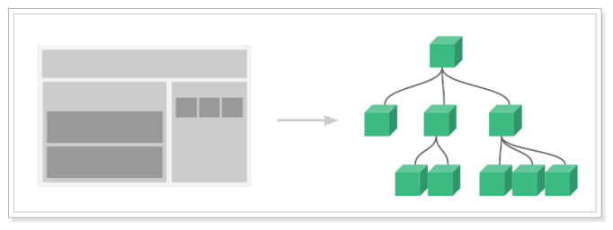

* 页面首先分成了顶部导航、左侧内容区、右侧边栏三部分
* 左侧内容区又分为上下两个组件
* 右侧边栏中又包含了 3 个子组件

各个组件之间以嵌套的关系组合在一起，那么这个时候不可避免的会有组件间通信的需求。


##### 父向子传递 props

* 这个子组件中要使用 title 属性渲染页面，但是自己并没有 title 属性
* 通过 props 来接收父组件属性，名为 title

```html
<div id="app">
    <introduce :title="msg"></introduce>
</div>

<script type="text/javascript">

    //定义组件
    const introduce = {
        template: "<h2>{{title}}</h2>",
        //定义接收父组件的属性
        props: ["title"]
    };

    Vue.component("introduce", introduce);

    var app = new Vue({
        el: "#app",
        data: {
            msg: "父组件的 msg 属性数据内容"
        }
    });

</script>
```


##### 传递复杂数据

* 这个子组件可以对 items 进行迭代，并输出到页面。
* 但是组件中并未定义 items 属性。
* 通过 props 来定义需要从父组件中接收的属性
  * items：是要接收的属性名称
    * type：限定父组件传递来的必须是数组，否则报错 type 的值可以是 Array 或者 Object
      （传递对象的 时候使用）
    * default：默认值， 如果是对象则需要写成方法的方式返回默认值。
      如： default(){ return {"xxx":"默认值"}; }

```html
<div id="app">
    <!--
        接受来自父组件的属性值，使用v-bind指向父组件的属性lessons
        如果定义的组件中有大写字母，则换为小写加上"-"，既 my-list
        -->
    <my-list :items="lessons"></my-list>
</div>

<script type="text/javascript">

    //定义组件
    const myList = {
        //可以使用双引号、单引号或者如下使用的 ` 飘号
        template: `
          <ul>
            <li v-for="item in items" :key="item.id">{{item.id}} --- {{item.name}}</li>
          </ul>
        `,
        //定义接收父组件的属性
        props: {
            //定义数组属性
            items: {
                //数据类型，如果是数组则是 Array，如果是对象则是 Object
                type: Array,
                //默认为空数组
                default: []
            }
        }
    };

    var app = new Vue({
        el: "#app",
        data: {
            lessons: [
                {"id":1, "name":"Java"},
                {"id":2, "name":"c#"},
                {"id":3, "name":"Python"}
            ]
        },
        components: {
            //如果组件 key 和 value 一致可以简写如下
            myList
        }
    });

</script>
```


##### 子向父的通信

​	错误案例：

```html
<div id="app">
    <h2>num = {{num}}</h2>
    <counter :snum="num"></counter>
</div>

<script type="text/javascript">
    //定义组件
    const counter = {
        template: `
            <div>
              <button @click='snum++'>+</button>
              <button @click='snum--'>-</button>
            </div>
        `,
        props: ["snum"]
    }

    var app = new Vue({
        el: "#app",
        data: {
            num: 0
        },
        //局部注册
        components: {
            counter: counter
        }
    });

</script>
```

​	子组件接收父组件的 num 属性，子组件定义点击按钮，点击后对 num 进行加或减操作。但是子组件接收到父组件属性后，默认是不允许修改的。

​	既然只有父组件能修改，那么加和减的操作一定是放在父组件：

```javascript
var app = new Vue({
    el: "#app",
    data: {
        num: 0
    },
    //局部注册
    components: {
        counter: counter
    },
    methods: {
        numPlus() {
            this.num++;
        },
        numReduce() {
            this.num--;
        }
    }
});
```

​	但是，点击按钮是在子组件中，那就是说需要子组件来调用父组件的函数。可以通过 v-on 指令将父组件的函数绑定到子组件上：

```html
<div id="app">
    <h2>num = {{num}}</h2>
    <!-- 注意：方法括号可以省略，如 @plus="numPlus()"，@plus 为绑定到自定义属性 plus -->
    <counter @plus="numPlus" @reduce="numReduce" :snum="num"></counter>
</div>
```

​	然后，当子组件中按钮被点击时，调用绑定的函数：

```javascript
//定义组件
const counter = {
    template: `
        <div>
          <button @click='incrNum'>+</button>
          <button @click='decrNum'>-</button>
        </div>
    `,
    props: ["snum"],
    methods: {
        incrNum() {
            //调用到父组件中的方法，$emit 为触发当前实例中属性对应的方法
            return this.$emit("plus");
        },
        decrNum() {
            return this.$emit("reduce");
        }
    }
}
```

​	完成页面如下：

```html
<div id="app">
    <h2>num = {{num}}</h2>
    <!-- 注意：方法括号可以省略，如 @plus="numPlus()"，@plus 为绑定到自定义属性 plus -->
    <counter @plus="numPlus" @reduce="numReduce" :snum="num"></counter>
</div>

<script type="text/javascript">
    //定义组件
    const counter = {
        template: `
            <div>
              <button @click='incrNum'>+</button>
              <button @click='decrNum'>-</button>
            </div>
        `,
        props: ["snum"],
        methods: {
            incrNum() {
                //调用到父组件中的方法，$emit 为触发当前实例中属性对应的方法
                return this.$emit("plus");
            },
            decrNum() {
                return this.$emit("reduce");
            }
        }
    }

    var app = new Vue({
        el: "#app",
        data: {
            num: 0
        },
        //局部注册
        components: {
            counter: counter
        },
        methods: {
            numPlus() {
                this.num++;
            },
            numReduce() {
                this.num--;
            }
        }
    });

</script>
```

​	vue提供了一个内置的 this.$emit 函数，用来调用父组件绑定的函数。

​	如果将来需要向父属性传值，则在调用时候加上需要传递的值，如：

```javascript
methods: {
    incrNum() {
        //调用到父组件中的方法，$emit 为触发当前实例中属性对应的方法
        return this.$emit("plus", 123);
    }
}
```

​	并在父属性中接收即可：

```javascript
methods: {
    numPlus(myNum) {
        this.num++;
    }
}
```


### axios

​	Vue 并没有直接处理 ajax 的组件，但可以使用 axios 或 vue-resource 组件实现对异步请求的操作。

​	vue-resource 是 Vue.js 的插件提供了使用 XMLHttpRequest 或 JSONP 进行 Web 请求和处理响应的服务。 当 Vue 更新 到 2.0 之后，作者就宣告不再对 vue-resource 更新，而是推荐 axios。

​	vue-resource 的 github地址： https://github.com/pagekit/vue-resource


##### 简介

​	Axios 是一个基于 promise 的 HTTP 库，可以用在浏览器和 node.js 中。 

​	axios 的 github 地址：https://github.com/axios/axios

​	特性：

> * 给浏览器创建 XMLHttpRequests 对象
> * 给 node.js 创建 http 模块
> * 支持 Promise API
> * 拦截请求和响应
> * 转换请求与响应数据
> * 取消请求
> * 自动转换 JSON 数据
> * 防止跨段请求伪造

​	可以使用 npm 安装方式：

```
npm install axios
```

​	或者也可以直接使用公共的CDN（内容分发网络）服务：

```html
<!-- 开发环境版本，包含了用帮助的命令行警告 -->
<script src="https://unpkg.com/axios/dist/axios.min.js"></script>
```

​	作用：发送异步请求获取数据

​	常见方法：get、post；在发送时可以指定参数（地址、请求方式、请求头信息等）；返回数据结构（data/status/statusText/headers/config）


##### 方法说明

​	axios可以使用的方法有：

* axios(config)
* axios.get(url[, config])
* axios.delete(url[, config])
* axios.head(url[, config])
* axios.post(url[, data[, config]])
* axios.put(url[, data[, config]])
* axios.patch(url[, data[, config]])


##### config 请求配置

​	这些是创建请求时可以用的配置选项。只有 url 是必需的。如果没有指定 method ，请求将默认使用 get 方法。

```javascript
{
	// `url` 是用于请求的服务器 URL
	url: '/user',
	
	// `method` 是创建请求时使用的方法
	method: 'get', // 默认是 get
	
	// `baseURL` 将自动加在 `url` 前面，除非 `url` 是一个绝对 URL。
	// 它可以通过设置一个 `baseURL` 便于为 axios 实例的方法传递相对 URL
	baseURL: 'https://some-domain.com/api/',
	
	// `transformRequest` 允许在向服务器发送前，修改请求数据
	// 只能用在 'PUT', 'POST' 和 'PATCH' 这几个请求方法
	// 后面数组中的函数必须返回一个字符串，或 ArrayBuffer，或 Stream
	transformRequest: [function (data) {
	
		// 对 data 进行任意转换处理
		return data;
		
	}],
		
	// `transformResponse` 在传递给 then/catch 前，允许修改响应数据
	transformResponse: [function (data) {
	
		// 对 data 进行任意转换处理
		return data;
		
	}],
	
	// `headers` 是即将被发送的自定义请求头
	headers: {
		'X-Requested-With': 'XMLHttpRequest',
		'Content-Type': 'application/json'
	},
        
	// `params` 是即将与请求一起发送的 URL 参数
	// 必须是一个无格式对象(plain object)或 URLSearchParams 对象
	params: {
		ID: 12345
	},
        
	// `data` 是作为请求主体被发送的数据
	// 只适用于这些请求方法 'PUT', 'POST', 和 'PATCH'
	// 在没有设置 `transformRequest` 时，必须是以下类型之一：
	// - string, plain object, ArrayBuffer, ArrayBufferView, URLSearchParams
	// - 浏览器专属：FormData, File, Blob
	// - Node 专属： Stream
	data: {
		firstName: 'Fred'
	},
        
	// `timeout` 指定请求超时的毫秒数(0 表示无超时时间)
	// 如果请求话费了超过 `timeout` 的时间，请求将被中断
	timeout: 1000,
        
	// `withCredentials` 表示跨域请求时是否需要使用凭证
	withCredentials: false, // 默认的
        
	// `responseType` 表示服务器响应的数据类型
	//可以是 'arraybuffer', 'blob', 'document','json', 'text', 'stream'
	responseType: 'json', // 默认的
        
	// `maxContentLength` 定义允许的响应内容的最大尺寸
	maxContentLength: 2000,
        
	// `validateStatus` 定义对于给定的HTTP 响应状态码是 resolve 或 reject promise。
    //如果`validateStatus` 返回 `true` (或者设置为 `null` 或 `undefined`)，promise 将被 resolve; 否则，promise 将被 rejecte
        
	validateStatus: function (status) {
		return status >= 200 && status < 300; // 默认的
	},
        
	// `maxRedirects` 定义在 node.js 中 follow 的最大重定向数目
	// 如果设置为0，将不会 follow 任何重定向
	maxRedirects: 5 // 默认的
    
}
```


##### 响应结构

```javascript
{
	// `data` 由服务器提供的响应
	data: {},
        
	// `status` 来自服务器响应的 HTTP 状态码
	status: 200,
        
	// `statusText` 来自服务器响应的 HTTP 状态信息
	statusText: 'OK',
        
	// `headers` 服务器响应的头
	headers: {},
        
	// `config` 是为请求提供的配置信息
	config: {}
}
```

使用 then 时，你将接收下面这样的响应：

```javascript
//发送 get 请求
axios.get('/user/12345')
	//如果成功，则触发 then
	.then(function(response) {
		console.log(response.data);
		console.log(response.status);
		console.log(response.statusText);
		console.log(response.headers);
		console.log(response.config);
}).catch();	//如果失败，触发 catch
```

​	在使用 catch 时，或传递 rejection callback 作为 then 的第二个参数时，响应可以通过 error 对象可被使用。


##### axios 方法示例

> 注意：如果使用 axios 访问跨域数据的时候，只需要在服务提供方中，在方法上面使用 SpringMVC 的跨域注解即可解决数据跨域问题（允许哪些域名请求）。
>
> 如在方法上添加：@CrossOrigin(origins = "http://localhost:10000")
>
> ​		或：@CrossOrigin(origins = "*")
>
> 如果请求的地址是使用了网关，那么在网关服务器上配置跨域就可以了；不能同时在网关服务器和服务提供服务工程中同时配置。

​	可以通过向 axios 传递相关配置来创建请求

​	axios(config)：

```html
<div id="app">
    <ul>
        <li v-for="(user, index) in users" :key="index">
            {{index}} -- {{user.name}} -- {{user.age}} -- {{user.gender}}
        </li>
    </ul>
</div>

<script type="text/javascript">
    var app = new Vue({
        el: "#app",
        data: {
            users: []
        },
        created() {
            //初始化加载数据，成功则存入 res 变量中并进行处理
            axios({
                url: "data.json",
                method: "get"
            }).then(res => {
                console.log(res);
                //将数据复制到 vue 实例中的数据属性 users，数据在 data 域中
                //不能使用 this，在 axios 回调函数中表示窗口，不是 vue 实例
                app.users = res.data;
            }).catch(err => alert(err));    //失败则打印错误信息
        }
    });
</script>
```

​	data.json：

```json
[
  {"name":"zhangsan", "age": 13, "gender": "男"},
  {"name":"lisi", "age": 14, "gender": "女"},
  {"name":"wangwu", "age": 15, "gender": "男"}
]
```


##### get 方法示例

​	将上述示例中的 axios 操作部分修改为如下：

```javascript
var app = new Vue({
    el: "#app",
    data: {
        users: []
    },
    created() {
        //get 只需指定请求的地址
        axios.get("data.json").then(res => {
            console.log(res);
            app.users = res.data;
        }).catch(err => alert(err));
    }
});
```


##### post 方法示例

```javascript
var app = new Vue({
    el: "#app",
    data: {
        users: []
    },
    created() {
        //post 只需指定请求的地址
        axios.post("data.json").then(res => {
            console.log(res);
            app.users = res.data;
        }).catch(err => alert(err));
    }
});
```


# Spring Boot

### 简介

##### 学习目标

1. 能够理解Spring的优缺点
2. 能够理解SpringBoot的特点
3. 能够理解SpringBoot的核心功能
4. 能够搭建SpringBoot的环境
5. 能够完成application.properties配置文件的配置
6. 能够完成application.yml配置文件的配置
7. 能够使用SpringBoot集成Mybatis
8. 能够使用SpringBoot集成Junit
9. 能够使用SpringBoot集成SpringData JPA


##### 原有 Spring 优缺点

> 优点

​	Spring 是 Java 企业版（Java Enterprise Edition，JEE，也称J2EE）的轻量级代替品。无需开发重量级的 Enterprise JavaBean（EJB），Spring 为企业级 Java 开发提供了一种相对简单的方法，通过依赖注入和面向切面编程，用简单的 Java 对象（Plain Old Java Object，POJO）实现了 EJB 的功能。


>  缺点

​	虽然 Spring 的组件代码是轻量级的，但它的配置却是重量级的。一开始，Spring 用 XML 配置，而且是很多 XML 配置。Spring 2.5 引入了基于注解的组件扫描，这消除了大量针对应用程序自身组件的显式XML 配置。Spring 3.0 引入了基于 Java 的配置，这是一种类型安全的可重构配置方式，可以代替 XML。

​	所有这些配置都代表了开发时的损耗。因为在思考 Spring 特性配置和解决业务问题之间需要进行思维切换，所以编写配置挤占了编写应用程序逻辑的时间。和所有框架一样，Spring 实用，但与此同时它要求的回报也不少。

​	除此之外，项目的依赖管理也是一件耗时耗力的事情。在环境搭建时，需要分析要导入哪些库的坐标，而且还需要分析导入与之有依赖关系的其他库的坐标，一旦选错了依赖的版本，随之而来的不兼容问题就会严重阻碍项目的开发进度。


##### Spring boot 概述

> SpringBoot 解决上述 Spring 的缺点

​	SpringBoot 对上述 Spring 的缺点进行的改善和优化，基于约定优于配置的思想，可以让开发人员不必在配置与逻辑业务之间进行思维的切换，全身心的投入到逻辑业务的代码编写中，从而大大提高了开发的效率，一定程度上缩短了项目周期。


> SpringBoot 的特点

- 为基于 Spring 的开发提供更快的入门体验
- 开箱即用，没有代码生成，也无需 XML 配置。同时也可以修改默认值来满足特定的需求
- 提供了一些大型项目中常见的非功能性特性，如嵌入式服务器、安全、指标，健康检测、外部配置等
- SpringBoot 不是对 Spring 功能上的增强，而是提供了一种快速使用 Spring 的方式


> SpringBoot 的核心功能

- 起步依赖

  起步依赖本质上是一个 Maven 项目对象模型（Project Object Model，POM），定义了对其他库的传递依赖，这些东西加在一起即支持某项功能。

  简单的说，起步依赖就是将具备某种功能的坐标打包到一起，并提供一些默认的功能。

- 自动配置

  Spring Boot 的自动配置是一个运行时（更准确地说，是应用程序启动时）的过程，考虑了众多因素，才决定 Spring 配置应该用哪个，不该用哪个。该过程是 Spring 自动完成的。


​	注意：起步依赖和自动配置的原理剖析会在第三章《SpringBoot 原理分析》进行详细讲解


### 快速入门

##### 代码实现

​	1）使用 idea 工具创建一个 maven 工程，该工程为普通的 java 工程即可

​	2）pom.xml 引入继承与起步依赖

```xml
<!-- 所有 springboot 工程都必须继承 spring-boot-starter-parent -->
<parent>
    <groupId>org.springframework.boot</groupId>
    <artifactId>spring-boot-starter-parent</artifactId>
    <version>2.5.4</version>
</parent>

<groupId>com.itcast</groupId>
<artifactId>springboot_quick</artifactId>
<version>1.0-SNAPSHOT</version>

<!-- SpringBoot要集成SpringMVC进行Controller的开发，所以项目要导入web的启动依赖 -->
<dependencies>
    <!-- web 功能的起步依赖（以功能为单位） -->
    <dependency>
        <groupId>org.springframework.boot</groupId>
        <artifactId>spring-boot-starter-web</artifactId>
    </dependency>
</dependencies>
```

​	3）编写 SpringBoot 引导类

```java
//声明该类是一个 SpringBoot 引导类（可指定其他类，但一般指定 main 所在类）
@SpringBootApplication
public class MySpringBootApplication {

    public static void main(String[] args) {
        //表示运行 SpringBoot 的引导类，run 参数就是 SpringBoot 引导类的字节码对象
        SpringApplication.run(MySpringBootApplication.class);
    }

}
```

​	4）编写 Controller 类

```java
@Controller
public class QuickController {

    @RequestMapping("/quick")
    @ResponseBody
    public String quick() {
        return "hello springboot";
    }

}
```


##### 工程热部署

​	我们在开发中反复修改类、页面等资源，每次修改后都是需要重新启动才生效，这样每次启动都很麻烦，浪费了大量的时间，我们可以在修改代码后不重启就能生效，在 pom.xml 中添加如下配置就可以实现这样的功能，我们称之为热部署。

```xml
<!--热部署配置-->
<dependency>
    <groupId>org.springframework.boot</groupId>
    <artifactId>spring-boot-devtools</artifactId>
</dependency>
```

​	注意：IDEA 进行 SpringBoot 热部署失败原因

​	出现这种情况，并不是热部署配置问题，其根本原因是因为 Intellij IEDA 默认情况下不会自动编译，需要对 IDEA 进行自动编译的设置，如下：


然后 Shift+Ctrl+Alt+/，选择 Registry


新版本 IDEA 则第二步替换为

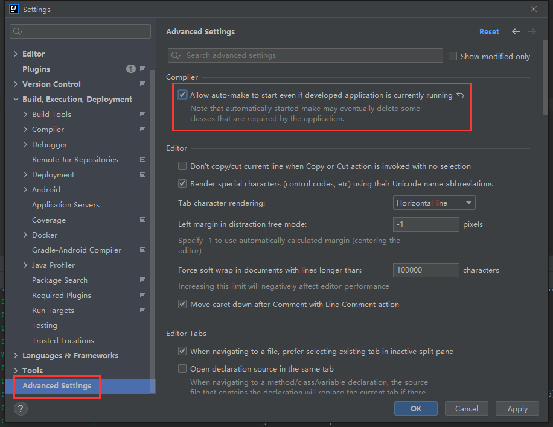


##### 使用 IDEA 快速创建 SpringBoot 项目

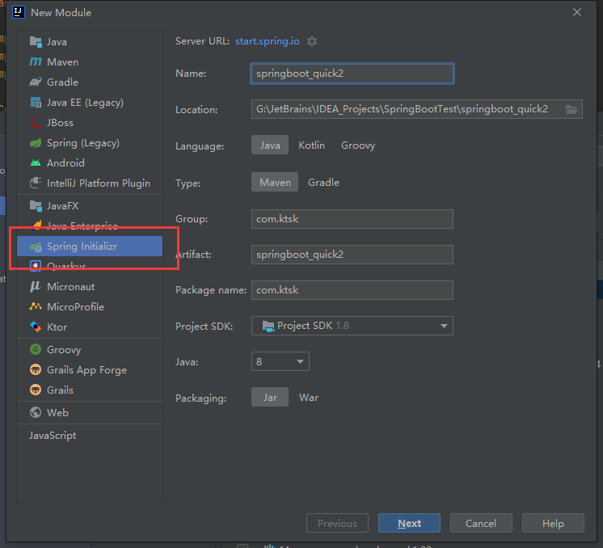

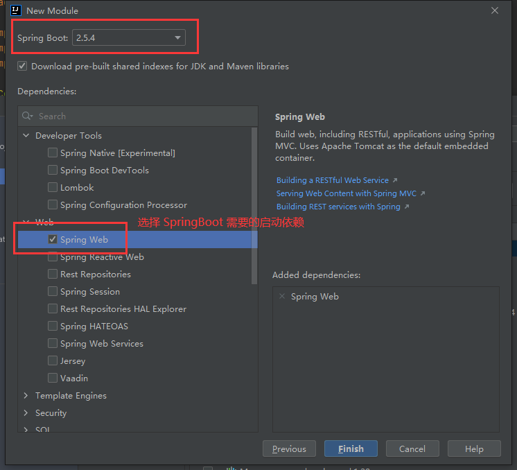

通过 IDEA 快速创建的 SpringBoot 项目的 pom.xml 中已经导入了我们选择的 web 的起步依赖的坐标，可以使用快速入门的方式创建 Controller 进行访问，此处不再赘述。


### SpringBoot 原理分析

##### 起步依赖原理分析

>  分析 spring-boot-starter-parent

​	按住 Ctrl 点击 pom.xml 中的 spring-boot-starter-parent，跳转到了 spring-boot-starter-parent 的 pom.xml，xml 配置如下（只摘抄了部分重点配置）：

```xml
<parent>
  <groupId>org.springframework.boot</groupId>
  <artifactId>spring-boot-dependencies</artifactId>
  <version>2.0.1.RELEASE</version>
  <relativePath>../../spring-boot-dependencies</relativePath>
</parent>
```

​	按住 Ctrl 点击 pom.xml 中的 spring-boot-starter-dependencies，跳转到了 spring-boot-starter-dependencies 的 pom.xml，xml 配置如下（只摘抄了部分重点配置）：

```xml
<properties>
  	<activemq.version>5.15.3</activemq.version>
  	<antlr2.version>2.7.7</antlr2.version>
  	<appengine-sdk.version>1.9.63</appengine-sdk.version>
  	<artemis.version>2.4.0</artemis.version>
  	<aspectj.version>1.8.13</aspectj.version>
  	<assertj.version>3.9.1</assertj.version>
  	<atomikos.version>4.0.6</atomikos.version>
  	<bitronix.version>2.1.4</bitronix.version>
  	<build-helper-maven-plugin.version>3.0.0</build-helper-maven-plugin.version>
  	<byte-buddy.version>1.7.11</byte-buddy.version>
  	... ... ...
</properties>
<dependencyManagement>
  	<dependencies>
      	<dependency>
        	<groupId>org.springframework.boot</groupId>
        	<artifactId>spring-boot</artifactId>
        	<version>2.0.1.RELEASE</version>
      	</dependency>
      	<dependency>
        	<groupId>org.springframework.boot</groupId>
        	<artifactId>spring-boot-test</artifactId>
        	<version>2.0.1.RELEASE</version>
      	</dependency>
      	... ... ...
	</dependencies>
</dependencyManagement>
<build>
  	<pluginManagement>
    	<plugins>
      		<plugin>
        		<groupId>org.jetbrains.kotlin</groupId>
        		<artifactId>kotlin-maven-plugin</artifactId>
        		<version>${kotlin.version}</version>
      		</plugin>
      		<plugin>
        		<groupId>org.jooq</groupId>
        		<artifactId>jooq-codegen-maven</artifactId>
        		<version>${jooq.version}</version>
      		</plugin>
      		<plugin>
        		<groupId>org.springframework.boot</groupId>
        		<artifactId>spring-boot-maven-plugin</artifactId>
        		<version>2.0.1.RELEASE</version>
      		</plugin>
          	... ... ...
    	</plugins>
  	</pluginManagement>
</build>
```

​	从上面的 spring-boot-starter-dependencies 的 pom.xml 中我们可以发现，一部分坐标的版本、依赖管理、插件管理已经定义好，所以我们的 SpringBoot 工程继承 spring-boot-starter-parent 后已经具备版本锁定等配置了。所以起步依赖的作用就是进行依赖的传递。


> 分析 spring-boot-starter-web

​	按住 Ctrl 点击 pom.xml 中的 spring-boot-starter-web，跳转到了 spring-boot-starter-web 的 pom.xml，xml 配置如下（只摘抄了部分重点配置）：

```xml
<?xml version="1.0" encoding="UTF-8"?>
<project xsi:schemaLocation="http://maven.apache.org/POM/4.0.0 http://maven.apache.org/xsd/maven-4.0.0.xsd" xmlns="http://maven.apache.org/POM/4.0.0"
    xmlns:xsi="http://www.w3.org/2001/XMLSchema-instance">
  	<modelVersion>4.0.0</modelVersion>
  	<parent>
    	<groupId>org.springframework.boot</groupId>
    	<artifactId>spring-boot-starters</artifactId>
    	<version>2.0.1.RELEASE</version>
  	</parent>
  	<groupId>org.springframework.boot</groupId>
  	<artifactId>spring-boot-starter-web</artifactId>
  	<version>2.0.1.RELEASE</version>
  	<name>Spring Boot Web Starter</name>
  
  	<dependencies>
    	<dependency>
      		<groupId>org.springframework.boot</groupId>
      		<artifactId>spring-boot-starter</artifactId>
      		<version>2.0.1.RELEASE</version>
      		<scope>compile</scope>
    	</dependency>
    	<dependency>
      		<groupId>org.springframework.boot</groupId>
      		<artifactId>spring-boot-starter-json</artifactId>
      		<version>2.0.1.RELEASE</version>
      		<scope>compile</scope>
    	</dependency>
    	<dependency>
      		<groupId>org.springframework.boot</groupId>
      		<artifactId>spring-boot-starter-tomcat</artifactId>
      		<version>2.0.1.RELEASE</version>
      		<scope>compile</scope>
    	</dependency>
    	<dependency>
      		<groupId>org.hibernate.validator</groupId>
      		<artifactId>hibernate-validator</artifactId>
      		<version>6.0.9.Final</version>
      		<scope>compile</scope>
    	</dependency>
    	<dependency>
      		<groupId>org.springframework</groupId>
      		<artifactId>spring-web</artifactId>
      		<version>5.0.5.RELEASE</version>
      		<scope>compile</scope>
    	</dependency>
    	<dependency>
      		<groupId>org.springframework</groupId>
      		<artifactId>spring-webmvc</artifactId>
      		<version>5.0.5.RELEASE</version>
      		<scope>compile</scope>
    	</dependency>
  	</dependencies>
</project>

```

​	从上面的 spring-boot-starter-web 的 pom.xml 中我们可以发现，spring-boot-starter-web 就是将 web 开发要使用的 spring-web、spring-webmvc 等坐标进行了“打包”，这样我们的工程只要引入 spring-boot-starter-web 起步依赖的坐标就可以进行 web 开发了，同样体现了依赖传递的作用。


##### 自动配置原理分析

​	按住 Ctrl 点击查看启动类 MySpringBootApplication 上的注解 @SpringBootApplication

```java
@SpringBootApplication
public class MySpringBootApplication {
    public static void main(String[] args) {
        SpringApplication.run(MySpringBootApplication.class);
    }
}
```

​	注解 @SpringBootApplication 的源码

```java
@Target(ElementType.TYPE)
@Retention(RetentionPolicy.RUNTIME)
@Documented
@Inherited
@SpringBootConfiguration
@EnableAutoConfiguration
@ComponentScan(excludeFilters = {
		@Filter(type = FilterType.CUSTOM, classes = TypeExcludeFilter.class),
		@Filter(type = FilterType.CUSTOM, classes = AutoConfigurationExcludeFilter.class) })
public @interface SpringBootApplication {

	/**
	 * Exclude specific auto-configuration classes such that they will never be applied.
	 * @return the classes to exclude
	 */
	@AliasFor(annotation = EnableAutoConfiguration.class)
	Class<?>[] exclude() default {};

	... ... ...

}
```

​	其中：（以下三个注解等同于 @SpringBootApplication 这个注解，可以直接使用这三个注解）

* @SpringBootConfiguration：等同与 @Configuration，既标注该类是 Spring 的一个配置类
* @ComponentScan：组件扫描，会扫描引导类所在包及其子包下的注解

* @EnableAutoConfiguration：SpringBoot 自动配置功能开启


​	按住 Ctrl 点击查看注解 @EnableAutoConfiguration

```java
@Target(ElementType.TYPE)
@Retention(RetentionPolicy.RUNTIME)
@Documented
@Inherited
@AutoConfigurationPackage
@Import(AutoConfigurationImportSelector.class)
public @interface EnableAutoConfiguration {
	... ... ...
}
```

​	其中，@Import(AutoConfigurationImportSelector.class) 导入了 AutoConfigurationImportSelector 类

按住 Ctrl 点击查看 AutoConfigurationImportSelector 源码

```java
public String[] selectImports(AnnotationMetadata annotationMetadata) {
        ... ... ...
        List<String> configurations = getCandidateConfigurations(annotationMetadata,
                                                                   attributes);
        configurations = removeDuplicates(configurations);
        Set<String> exclusions = getExclusions(annotationMetadata, attributes);
        checkExcludedClasses(configurations, exclusions);
        configurations.removeAll(exclusions);
        configurations = filter(configurations, autoConfigurationMetadata);
        fireAutoConfigurationImportEvents(configurations, exclusions);
        return StringUtils.toStringArray(configurations);
}


protected List<String> getCandidateConfigurations(AnnotationMetadata metadata,
			AnnotationAttributes attributes) {
		List<String> configurations = SpringFactoriesLoader.loadFactoryNames(
				getSpringFactoriesLoaderFactoryClass(), getBeanClassLoader());
		
		return configurations;
}

```

​	其中，SpringFactoriesLoader.loadFactoryNames 方法的作用就是从 META-INF/spring.factories 文件中读取指定类对应的类名称列表（一般情况下文件都在该类所在包下）


​	spring.factories 文件中有关自动配置的配置信息如下：

```
... ... ...

org.springframework.boot.autoconfigure.web.reactive.function.client.WebClientAutoConfiguration,\
org.springframework.boot.autoconfigure.web.servlet.DispatcherServletAutoConfiguration,\
org.springframework.boot.autoconfigure.web.servlet.ServletWebServerFactoryAutoConfiguration,\
org.springframework.boot.autoconfigure.web.servlet.error.ErrorMvcAutoConfiguration,\
org.springframework.boot.autoconfigure.web.servlet.HttpEncodingAutoConfiguration,\
org.springframework.boot.autoconfigure.web.servlet.MultipartAutoConfiguration,\

... ... ...
```

​	上面配置文件存在大量的以 AutoConfiguration 为结尾的类名称，这些类就是存有自动配置信息的类，而 SpringApplication 在获取这些类名后再加载

​	以 ServletWebServerFactoryAutoConfiguration 为例来分析源码：

```java
@Configuration
@AutoConfigureOrder(Ordered.HIGHEST_PRECEDENCE)
@ConditionalOnClass(ServletRequest.class)
@ConditionalOnWebApplication(type = Type.SERVLET)
@EnableConfigurationProperties(ServerProperties.class)
@Import({ ServletWebServerFactoryAutoConfiguration.BeanPostProcessorsRegistrar.class,
		ServletWebServerFactoryConfiguration.EmbeddedTomcat.class,
		ServletWebServerFactoryConfiguration.EmbeddedJetty.class,
		ServletWebServerFactoryConfiguration.EmbeddedUndertow.class })
public class ServletWebServerFactoryAutoConfiguration {
	... ... ...
}

```

​	其中，@EnableConfigurationProperties(ServerProperties.class) 代表加载 ServerProperties 服务器配置属性类

进入 ServerProperties.class 源码如下：

```java
@ConfigurationProperties(prefix = "server", ignoreUnknownFields = true)
public class ServerProperties {

	/**
	 * Server HTTP port.
	 */
	private Integer port;

	/**
	 * Network address to which the server should bind.
	 */
	private InetAddress address;
  
  	... ... ...
  
}
```

​	其中，prefix = "server" 表示 SpringBoot 配置文件中的前缀，SpringBoot 会将配置文件中以 server 开始的属性映射到该类的字段中。映射关系如下：

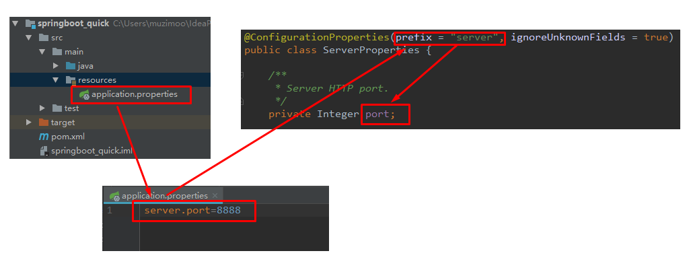

​	至此，分析可得知可在 application.properties 等配置文件中对所需要改动的项目进行配置，如：

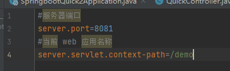


### SpringBoot 配置文件

​	SpringBoot 是基于约定的，所以很多配置都有默认值，但如果想使用自己的配置替换默认配置的话，就可以使用 application.properties 或者 application.yml（application.yaml）进行配置。

​	SpringBoot 默认会从 Resources 目录下加载 application.properties 或 application.yml（application.yaml）文件

​	其中，application.properties 文件是键值对类型的文件，之前一直在使用，所以此处不在对 properties 文件的格式进行阐述。除了 properties 文件外，SpringBoot 还可以使用 yml 文件进行配置，下面对 yml 文件进行讲解。


##### yml 配置文件

​	YML 文件格式是 YAML (YAML Aint Markup Language) 编写的文件格式，YAML 是一种直观的能够被电脑识别的的数据数据序列化格式，并且容易被人类阅读，容易和脚本语言交互的，可以被支持 YAML 库的不同的编程语言程序导入，比如： C/C++, Ruby, Python, Java, Perl, C#, PHP 等。YML 文件是以数据为核心的，比传统的 xml 方式更加简洁。

​	YML 文件的扩展名可以使用 .yml 或者 .yaml

> 语法如下：

```yml
#普通数据（注意空格）
name: zhangsan

#对象的配置（缩进代表层级）
person:
  name: zhangsan
  age: 21
  addr: beijin

server:
  port: 8082

#行内对象配置（不常用）
person2: {name: lisi, age: 21, addr: guangzhou}

#配置数组（List、Set）集合（普通字符串）
city:
  - beijin
  - shanghai
  - guangzhou
  - shenzhen

city2: [beijin, shanghai, guangzhou, shenzhen]

#配置数组（List、Set）集合（对象集合）
student:
  - name: zhangsan
    age: 18
    addr: beijin
  - name: lisi
    age: 19
    addr: guangzhou

student2: [{name: zhangsan, age: 18, addr: beijin}, {name: lisi, age: 19, addr: guangzhou}]

# Map 配置
map:
  key1: value1
  key2: value2
```


##### SpringBoot 配置信息的查询

​	上面提及过，SpringBoot 的配置文件，主要的目的就是对配置信息进行修改的，但在配置时的 key 从哪里去查询呢？我们可以查阅 SpringBoot 的官方文档

​	文档URL：https://docs.spring.io/spring-boot/docs/2.0.1.RELEASE/reference/htmlsingle/#common-application-properties

​	常用的配置摘抄如下：

```properties
# QUARTZ SCHEDULER (QuartzProperties)
spring.quartz.jdbc.initialize-schema=embedded # Database schema initialization mode.
spring.quartz.jdbc.schema=classpath:org/quartz/impl/jdbcjobstore/tables_@@platform@@.sql # Path to the SQL file to use to initialize the database schema.
spring.quartz.job-store-type=memory # Quartz job store type.
spring.quartz.properties.*= # Additional Quartz Scheduler properties.

# ----------------------------------------
# WEB PROPERTIES
# ----------------------------------------

# EMBEDDED SERVER CONFIGURATION (ServerProperties)
server.port=8080 # Server HTTP port.
server.servlet.context-path= # Context path of the application.
server.servlet.path=/ # Path of the main dispatcher servlet.

# HTTP encoding (HttpEncodingProperties)
spring.http.encoding.charset=UTF-8 # Charset of HTTP requests and responses. Added to the "Content-Type" header if not set explicitly.

# JACKSON (JacksonProperties)
spring.jackson.date-format= # Date format string or a fully-qualified date format class name. For instance, `yyyy-MM-dd HH:mm:ss`.

# SPRING MVC (WebMvcProperties)
spring.mvc.servlet.load-on-startup=-1 # Load on startup priority of the dispatcher servlet.
spring.mvc.static-path-pattern=/** # Path pattern used for static resources.
spring.mvc.view.prefix= # Spring MVC view prefix.
spring.mvc.view.suffix= # Spring MVC view suffix.

# DATASOURCE (DataSourceAutoConfiguration & DataSourceProperties)
spring.datasource.driver-class-name= # Fully qualified name of the JDBC driver. Auto-detected based on the URL by default.
spring.datasource.password= # Login password of the database.
spring.datasource.url= # JDBC URL of the database.
spring.datasource.username= # Login username of the database.

# JEST (Elasticsearch HTTP client) (JestProperties)
spring.elasticsearch.jest.password= # Login password.
spring.elasticsearch.jest.proxy.host= # Proxy host the HTTP client should use.
spring.elasticsearch.jest.proxy.port= # Proxy port the HTTP client should use.
spring.elasticsearch.jest.read-timeout=3s # Read timeout.
spring.elasticsearch.jest.username= # Login username.

```

​	我们可以通过配置 application.poperties 或者 application.yml 来修改 SpringBoot 的默认配置

​	例如：application.properties 文件

```properties
server.port=8888
server.servlet.context-path=demo
```

​	application.yml 文件

```yaml
server:
  port: 8888
  servlet:
    context-path: /demo
```


##### 配置文件与配置类的属性映射方式

> 使用注解 @Value 映射

​	我们可以通过@Value注解将配置文件中的值映射到一个Spring管理的Bean的字段上

​	例如：application.properties 配置如下：

```properties
name=zhangsan
person.name=zhangsan
person.age=21
person.addr=beijin
```

​	或者，application.yml 配置如下：

```yaml
name: zhangsan

person:
  name: zhangsan
  age: 21
  addr: beijin
```

​	实体 Bean 代码如下：

```java
@Controller
public class Quick2Controller {

    @Value("${name}")
    private String name;

    @Value("${person.addr}")
    private String addr;

    @RequestMapping("/quick2")
    @ResponseBody
    public String quick2() {
        return "name: " + name + ", addr: " + addr;
    }

}
```


> 使用注解 @ConfigurationProperties 映射

​	通过注解 @ConfigurationProperties(prefix="配置文件中的key的前缀") 可以将配置文件中的配置自动与实体进行映射，实体 Bean 类需要提供 setter 方法：

​	例如：application.properties 配置如下：

```properties
person.name=zhangsan
person.age=21
person.addr=beijin
```

​	或者，application.yml 配置如下：

```yaml
person:
  name: zhangsan
  age: 21
  addr: beijin
```

​	实体 Bean 代码如下：

```java
@Controller
@ConfigurationProperties(prefix = "person")
public class Quick3Controller {

    private String name;
    private String age;
    private String addr;

    @RequestMapping("/quick3")
    @ResponseBody
    public String quick3() {
        return "name: " + name + ", addr: " + addr + ", age: " + age;
    }

    public void setName(String name) {
        this.name = name;
    }

    public void setAge(String age) {
        this.age = age;
    }

    public void setAddr(String addr) {
        this.addr = addr;
    }
}
```

​	注意：使用 @ConfigurationProperties 方式可以进行配置文件与实体字段的自动映射，但需要字段必须提供 set 方法才可以，而使用 @Value 注解修饰的字段不需要提供 set 方法

​	使用此方法虽然能通过编译并运行，但是会出现缺少执行器错误：


​	此时需要在 pom.xml 中引入依赖：

```xml
<!-- 执行器配置 -->
<dependency>
    <groupId>org.springframework.boot</groupId>
    <artifactId>spring-boot-configuration-processor</artifactId>
    <optional>true</optional>
</dependency>
```

​	

### SpringBoot 集成其它技术

##### 整合 MyBatis

​	1）添加 MyBatis 起步依赖和数据库驱动坐标

```xml
<!-- mybatis 起步依赖 -->
<dependency>
    <groupId>org.mybatis.spring.boot</groupId>
    <artifactId>mybatis-spring-boot-starter</artifactId>
    <version>2.2.0</version>
</dependency>

<dependency>
    <groupId>mysql</groupId>
    <artifactId>mysql-connector-java</artifactId>
</dependency>
```

​	2.1）application.properties 添加数据库连接信息（二选一）

```properties
#数据库连接信息
spring.datasource.driver-class-name=com.mysql.cj.jdbc.Driver
spring.datasource.url=jdbc:mysql:///hm_db3
spring.datasource.username=root
spring.datasource.password=123456

#spring集成Mybatis环境
#pojo别名扫描包
mybatis.type-aliases-package=com.ktsk.domain
#加载Mybatis映射文件
mybatis.mapper-locations=classpath:mapper/*Mapper.xml
```

​	2.2）application.yml 添加数据库连接信息（二选一）

```yml
spring:
  datasource:
    driver-class-name: com.mysql.cj.jdbc.Driver
    url: jdbc:mysql:///hm_db3
    username: root
    password: 123456

mybatis:
  type-aliases-package: com.ktsk.domain
  mapper-locations: classpath:mapper/*Mapper.xml
```

​	3）创建实体 Bean

```java
public class User {

    private Integer id;
    private String username;
    private String password;
  
    //此处省略getter和setter方法 .. ..
    
}
```

​	4）编写 Mapper

```java
@Mapper
public interface UserMapper {
	public List<User> queryUserList();
}
```

​	注意：@Mapper 标记该类是一个 mybatis 的 mapper 接口，可以被 SpringBoot 自动扫描到 spring 上下文中

​	5）在 src\main\resources\mapper 路径下加入 UserMapper.xml 配置文件

```xml
<?xml version="1.0" encoding="utf-8" ?>
<!DOCTYPE mapper PUBLIC "-//mybatis.org//DTD Mapper 3.0//EN" "http://mybatis.org/dtd/mybatis-3-mapper.dtd" >
<mapper namespace="com.itheima.mapper.UserMapper">
    
    <select id="queryUserList" resultType="user">
        select * from user
    </select>
    
</mapper>
```

​	6）在 application.properties 中添加 mybatis 的信息（yml 二选一）

```properties
#spring集成Mybatis环境
#pojo别名扫描包
mybatis.type-aliases-package=com.itheima.domain
#加载Mybatis映射文件
mybatis.mapper-locations=classpath:mapper/*Mapper.xml
```

​	7）编写测试 Controller

```java
@Controller
public class MybatisController {

    @Autowired
    private UserMapper userMapper;

    @RequestMapping("/query")
    @ResponseBody
    public List<User> queryUserList() {
        return userMapper.queryUserList();
    }

}
```


##### 整合 Junit

​	1）添加 Junit 起步依赖与 Junit 包

```xml
<!-- SpringBoot 集成 Junit 的起步依赖 -->
<dependency>
    <groupId>org.springframework.boot</groupId>
    <artifactId>spring-boot-starter-test</artifactId>
    <scope>test</scope>
</dependency>

<dependency>
    <groupId>junit</groupId>
    <artifactId>junit</artifactId>
    <scope>test</scope>
</dependency>
```

​	2）编写测试类

```java
@RunWith(SpringRunner.class)
@SpringBootTest(classes = SpringbootMybatisApplication.class)
public class MyBatisTest {

    @Autowired
    private UserMapper userMapper;

    @Test
    public void test() {
        List<User> users = userMapper.queryUserList();
        System.out.println(users);
    }

}
```

​	其中，SpringRunner 继承自 SpringJUnit4ClassRunner，使用哪个 Spring 提供的测试引擎均可：

```java
public final class SpringRunner extends SpringJUnit4ClassRunner 
```

​	@SpringBootTest 的属性指定的是引导类的字节码对象


##### 整合 SpringDataJPA

​	1）添加 Spring Data JPA 起步依赖与数据库驱动

```xml
<!-- springBoot JPA 的起步依赖 -->
<dependency>
    <groupId>org.springframework.boot</groupId>
    <artifactId>spring-boot-starter-data-jpa</artifactId>
</dependency>

<!-- MySQL 连接驱动 -->
<dependency>
    <groupId>mysql</groupId>
    <artifactId>mysql-connector-java</artifactId>
</dependency>
```

​	2）在 application.properties 中配置数据库和 jpa 的相关属性

```properties
#DB Configuration:
spring.datasource.driverClassName=com.mysql.cj.jdbc.Driver
spring.datasource.url=jdbc:mysql:///hm_db3
spring.datasource.username=root
spring.datasource.password=123456

#JPA Configuration:
spring.jpa.database=MySQL
spring.jpa.show-sql=true
spring.jpa.generate-ddl=true
spring.jpa.hibernate.ddl-auto=update
spring.jpa.hibernate.naming_strategy=org.hibernate.cfg.ImprovedNamingStrategy
```

​	3）创建实体类并进行配置

```java
@Entity
public class User {
    
    // 主键
    @Id
    @GeneratedValue(strategy = GenerationType.IDENTITY)
    private Long id;
    private String username;
    private String password;
    private String name;
 
    //此处省略 setter 和 getter 方法... ...
}
```

​	4）编写 UserRepository

```java
public interface UserRepository extends JpaRepository<User, Long> {
    public List<User> findAll();
}
```

​	5）编写测试类

```java
@RunWith(SpringRunner.class)
@SpringBootTest(classes = SpringbootJpaApplication.class)
public class JpaTest {

    @Autowired
    private UserRepository userRepository;

    @Test
    public void test() {
        List<User> users = userRepository.findAll();
        System.out.println(users);
    }

}
```

​	注意：如果是 jdk9，执行报错如下：

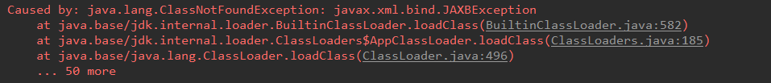

​	原因：jdk 缺少相应的 jar

​	解决方案：手动导入对应的 maven 坐标，如下：

```xml
<!--jdk9 需要导入如下坐标-->
<dependency>
    <groupId>javax.xml.bind</groupId>
    <artifactId>jaxb-api</artifactId>
    <version>2.3.0</version>
</dependency>
```


##### 整合 Redis

​	1）添加 Redis 的起步依赖

```xml
<!-- 配置使用 Redis 启动器 -->
<dependency>
    <groupId>org.springframework.boot</groupId>
    <artifactId>spring-boot-starter-data-redis</artifactId>
</dependency>
```

​	2）配置 Redis 的连接信息

```properties
#Redis
spring.redis.host=127.0.0.1
spring.redis.port=6379
```

​	3）注入 RedisTemplate 测试 Redis 操作

```java
@RunWith(SpringRunner.class)
@SpringBootTest(classes = SpringbootJpaApplication.class)
public class RedisTest {

    @Autowired
    private UserRepository userRepository;

    @Autowired
    private RedisTemplate<String, String> redisTemplate;

    @Test
    public void test() throws JsonProcessingException {
        //从 Redis 缓存中获取指定数据
        String userListData = redisTemplate.boundValueOps("user.findAll").get();
        //如果 Redis 中没有数据
        if (null == userListData) {
            //查询数据库获得数据
            List<User> users = userRepository.findAll();
            //转换为 json 格式字符串
            ObjectMapper objectMapper = new ObjectMapper();
            userListData = objectMapper.writeValueAsString(users);
            //将数据存储到 Redis 中，下次再查询时直接从 Redis 获取数据
            redisTemplate.boundValueOps("user.findAll").set(userListData);
            System.out.println("=============== 从数据库获得数据 ===============");
        } else {
            System.out.println("=============== 从 Redis 缓存中获得数据 ===============");
        }
        System.out.println(userListData);
    }

}
```


# RabbitMQ

### 消息中间件概述

​	MQ 全称 Message Queue（消息队列），是在消息的传输过程中保存消息的容器。多用于分布式系统之间进行通信。

* MQ，消息队列，存储消息的中间件
* 分布式系统通信两种方式：直接远程调用 和 借助第三方 完成间接通信
* 发送方称为生产者，接收方称为消费者


> 为什么使用MQ

​	在项目中，可将一些无需即时返回且耗时的操作提取出来，进行**异步处理**，而这种异步处理的方式大大的节省了服务器的请求响应时间，从而**提高**了**系统**的**吞吐量**。


##### MQ 的优势

>  任务**异步**处理

​	将不需要同步处理的并且耗时长的操作由消息队列通知消息接收方进行异步处理。提高了应用程序的响应时间。

​	如：用户在订单系统下单，订单系统分别访问三个子系统各花费 300ms 再返回，用时 900ms，而引入 MQ 后订单系统发送消息给 MQ 只需花费 5ms 并返回，子系统再向 MQ 提取消息进行处理。

>  应用程序**解耦合**

​	MQ相当于一个中介，生产方通过 MQ 与消费方交互，它将应用程序进行解耦合。

​	如：订单系统如果直接远程调用库存、支付等系统时，或业务经常需要为订单系统添加其他系统，此时会产生耦合，当库存系统出现问题时订单系统也会瘫痪。引入 MQ 后订单系统发送消息给 MQ，其他子系统再从 MQ 中取出数据进行处理即可，当子系统瘫痪时也不会影响订单系统（子系统故障恢复后可继续提取数据）

>  **削峰填谷**

​	如订单系统，在下单的时候就会往数据库写数据。但是数据库只能支撑每秒 1000 左右的并发写入，并发量再高就容易宕机。低峰期的时候并发也就 100 多个，但是在高峰期时候，并发量会突然激增到 5000 以上，这个时候数据库肯定卡死了。

新版/13-就业课(2.1)-消息忠简件-RabbitMQ/day01_RabbitMQ基础入门/讲义/assets/01.jpg)

​	引入 MQ 后消息被 MQ 保存起来了，然后系统就可以按照自己的消费能力来消费，比如每秒 1000 个数据，这样慢慢写入数据库，这样就不会卡死数据库了。

新版/13-就业课(2.1)-消息忠简件-RabbitMQ/day01_RabbitMQ基础入门/讲义/assets/02.jpg)

​	但是使用了 MQ 之后，限制消费消息的速度为 1000，但是这样一来，高峰期产生的数据势必会被积压在 MQ 中，高峰就被“削”掉了。但是因为消息积压，在高峰期过后的一段时间内，消费消息的速度还是会维持在 1000QPS，直到消费完积压的消息,这就叫做“填谷”


##### MQ 的劣势

> 系统可用性降低

​	系统引入的外部依赖越多，系统稳定性越差。一旦 MQ 宕机，就会对业务造成影响。如何保证 MQ 的高可用？

> 系统复杂度提高

​	MQ 的加入大大增加了系统的复杂度，以前系统间是同步的远程调用，现在是通过 MQ 进行异步调用。如何保证消息没有被重复消费？怎么处理消息丢失情况？那么保证消息传递的顺序性？

> 一致性问题

​	A 系统处理完业务，通过 MQ 给 B、C、D 三个系统发消息数据，如果 B 系统、C 系统处理成功，D 系统处理失败。如何保证消息数据处理的一致性？


> 既然 MQ 有优势也有劣势，那么使用 MQ 需要满足什么条件呢？

​	① 生产者不需要从消费者处获得反馈。引入消息队列之前的直接调用，其接口的返回值应该为空，这才让明明下层的动作还没做，上层却当成动作做完了继续往后走，即所谓异步成为了可能。

​	② 容许短暂的不一致性。

​	③ 确实是用了有效果。即解耦、提速、削峰这些方面的收益，超过加入 MQ，管理 MQ 这些成本。


##### 常见 MQ 产品

​	目前业界有很多的 MQ 产品，例如 RabbitMQ、RocketMQ、ActiveMQ、Kafka、ZeroMQ、MetaMq 等，也有直接使用 Redis 充当消息队列的案例，而这些消息队列产品，各有侧重，在实际选型时，需要结合自身需求及 MQ 产品特征，综合考虑。

|                | **RabbitMQ**                                                 | **ActiveMQ**                            | **RocketMQ**             | **Kafka**                                      |
| -------------- | ------------------------------------------------------------ | --------------------------------------- | ------------------------ | ---------------------------------------------- |
| 公司/社区      | Rabbit                                                       | Apache                                  | 阿里                     | Apache                                         |
| 开发语言       | Erlang                                                       | Java                                    | Java                     | Scala&Java                                     |
| 协议支持       | AMQP，XMPP，SMTP，STOMP                                      | OpenWire,STOMP，REST,XMPP,AMQP          | 自定义                   | 自定义协议，社区封装了http协议支持             |
| 客户端支持语言 | 官方支持Erlang，Java，Ruby等,社区产出多种API，几乎支持所有语言 | Java，C，C++，Python，PHP，Perl，.net等 | Java，C++（不成熟）      | 官方支持Java,社区产出多种API，如PHP，Python等  |
| 单机吞吐量     | 万级（其次）                                                 | 万级（最差）                            | 十万级（最好）           | 十万级（次之）                                 |
| 消息延迟       | 微妙级                                                       | 毫秒级                                  | 毫秒级                   | 毫秒以内                                       |
| 功能特性       | 并发能力强，性能极其好，延时低，社区活跃，管理界面丰富       | 老牌产品，成熟度高，文档较多            | MQ功能比较完备，扩展性佳 | 只支持主要的MQ功能，毕竟是为大数据领域准备的。 |


##### RabbitMQ 简介

​	AMQP，即 Advanced Message Queuing Protocol（高级消息队列协议），是一个网络协议，是应用层协议的一个开放标准，为面向消息的中间件设计。基于此协议的客户端与消息中间件可传递消息，并不受客户端/中间件不同产品，不同的开发语言等条件的限制。2006 年，AMQP 规范发布。类比 HTTP。

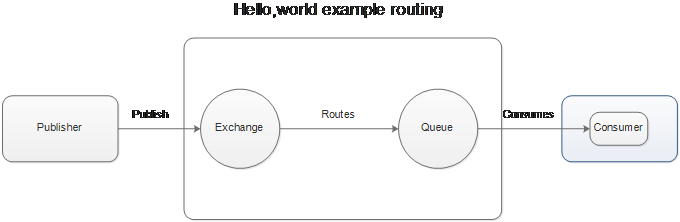


​	2007年，Rabbit 技术公司基于 AMQP 标准开发的 RabbitMQ 1.0 发布。RabbitMQ 采用 Erlang 语言开发。Erlang 语言由 Ericson 设计，专门为开发高并发和分布式系统的一种语言，在电信领域使用广泛。

​	RabbitMQ 基础架构如下图：

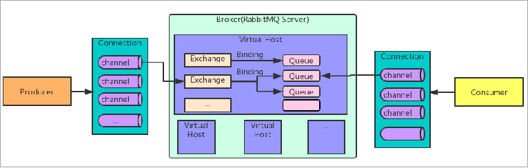


> RabbitMQ 中的相关概念

* **Broker**：接收和分发消息的应用，RabbitMQ Server 就是 Message Broker
* **Virtual host**：出于多租户和安全因素设计的，把 AMQP 的基本组件划分到一个虚拟的分组中，类似于网络中的 namespace 概念。当多个不同的用户使用同一个 RabbitMQ server 提供的服务时，可以划分出多个 vhost，每个用户在自己的 vhost 创建 exchange／queue 等
* **Connection**：publisher／consumer 和 broker 之间的 TCP 连接
* **Channel**：如果每一次访问 RabbitMQ 都建立一个 Connection，在消息量大的时候建立 TCP Connection 的开销将是巨大的，效率也较低。Channel 是在 connection 内部建立的逻辑连接，如果应用程序支持多线程，通常每个 thread 创建单独的 channel 进行通讯，AMQP method 包含了channel id 帮助客户端和message broker 识别 channel，所以 channel 之间是完全隔离的。Channel 作为轻量级的 Connection 极大减少了操作系统建立 TCP connection 的开销

* **Exchange**：message 到达 broker 的第一站，根据分发规则，匹配查询表中的 routing key，分发消息到 queue 中去。常用的类型有：direct (point-to-point), topic (publish-subscribe) and fanout (multicast)
* **Queue**：消息最终被送到这里等待 consumer 取走
* **Binding**：exchange 和 queue 之间的虚拟连接，binding 中可以包含 routing key。Binding 信息被保存到 exchange 中的查询表中，用于 message 的分发依据


> RabbitMQ 提供了 6 种工作模式

​	简单模式、work queues、Publish/Subscribe 发布与订阅模式、Routing 路由模式、Topics 主题模式、RPC 远程调用模式（远程调用，不太算 MQ；暂不作介绍）。

​	官网对应模式介绍：https://www.rabbitmq.com/getstarted.html

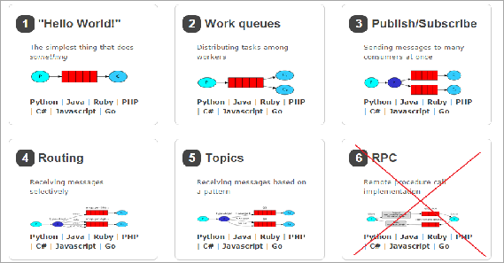


> JMS

​	 JMS 即 Java 消息服务（JavaMessage Service）应用程序接口，是一个 Java 平台中关于面向消息中间件的API，JMS 是 JavaEE 规范中的一种，类比 JDBC

​	 很多消息中间件都实现了JMS规范，例如：ActiveMQ。RabbitMQ 官方没有提供 JMS 的实现包，但是开源社区有


> 小结

* RabbitMQ 是基于 AMQP 协议使用 Erlang 语言开发的一款消息队列产品。
* RabbitMQ 提供了6种工作模式，学习前 5 种。
* AMQP 是协议，类比 HTTP。
* JMS 是 API 规范接口，类比 JDBC。


### RabbitMQ 安装与配置

##### 安装流程

> 查看 RabbitMQ 依赖

```http
https://www.rabbitmq.com/which-erlang.html
```

> 下载 RabbitMQ

```http
https://github.com/rabbitmq/rabbitmq-server/releases
```

> 安装依赖环境

```shell
yum install build-essential openssl openssl-devel unixODBC unixODBC-devel make gcc gcc-c++ kernel-devel m4 ncurses-devel tk tc xz
```

> 安装 Erlang

​	1、安装依赖项

```shell
yum install -y epel-release
```

​	2、添加存储库条目

```shell
wget https://packages.erlang-solutions.com/erlang-solutions-1.0-1.noarch.rpm
rpm -Uvh erlang-solutions-1.0-1.noarch.rpm
```

​	3、安装

```shell
yum install -y erlang
```

​	4、验证是否安装成功

```shell
erl -version
```

> 安装 socat

```shell
yum install -y socat
```

> 安装 RabbitMQ

```shell
rpm -ivh rabbitmq-server-3.9.6-1.el7.noarch.rpm
```

> 启动

```sh
service rabbitmq-server start	# 启动服务
service rabbitmq-server stop	# 停止服务
service rabbitmq-server restart	# 重启服务
```


##### 开启管理界面及配置

> 开启管理界面

```shell
rabbitmq-plugins enable rabbitmq_management
```

> 修改默认配置信息

​	1、打开配置及文件

```sh
#新版 RabbitMQ
vim /usr/lib/rabbitmq/lib/rabbitmq_server-3.9.6/plugins/rabbit-3.9.6/ebin/rabbit.app

#旧版 RabbitMQ
vim /usr/lib/rabbitmq/lib/rabbitmq_server-3.6.5/ebin/rabbit.app 
```

​	2、开放 guest 用户

```json
{loopback_users, [guest]},
```

​	3、重启服务

```sh
service rabbitmq-server restart
```

​	4、访问 RabbitMQ 控制台

```http
http://192.168.24.128:15672/
```


##### 配置虚拟主机及用户

> 用户角色

​	RabbitMQ 在安装好后，可以访问 `http://ip地址:15672` ；其自带了 guest/guest 的用户名和密码；如果需要创建自定义用户；那么也可以登录管理界面后，如下操作：

 


> **角色说明**

1、 超级管理员(administrator)

可登陆管理控制台，可查看所有的信息，并且可以对用户，策略(policy)进行操作。

2、 监控者(monitoring)

可登陆管理控制台，同时可以查看rabbitmq节点的相关信息(进程数，内存使用情况，磁盘使用情况等)

3、 策略制定者(policymaker)

可登陆管理控制台, 同时可以对policy进行管理。但无法查看节点的相关信息(上图红框标识的部分)。

4、 普通管理者(management)

仅可登陆管理控制台，无法看到节点信息，也无法对策略进行管理。

5、 其他

无法登陆管理控制台，通常就是普通的生产者和消费者。


> Virtual Hosts配置

​	像 mysql 拥有数据库的概念并且可以指定用户对库和表等操作的权限。RabbitMQ 也有类似的权限管理；在 RabbitMQ 中可以虚拟消息服务器 Virtual Host，每个 Virtual Hosts 相当于一个相对独立的 RabbitMQ 服务器，每个 VirtualHost 之间是相互隔离的。exchange、queue、message 不能互通。 相当于 mysql 的 db。Virtual Name 一般以 / 开头。


​	创建 Virtual Hosts：

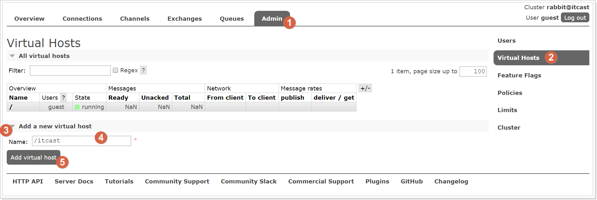

​	设置 Virtual Hosts 权限：


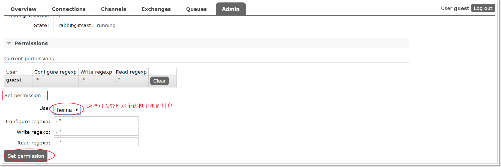


### RabbitMQ 快速入门

> 生产者与消费者添加依赖

```xml
<dependencies>
    <!-- RabbitMQ Java 客户端 -->
    <dependency>
        <groupId>com.rabbitmq</groupId>
        <artifactId>amqp-client</artifactId>
        <version>5.13.1</version>
    </dependency>
</dependencies>

<build>
    <plugins>
        <plugin>
            <groupId>org.apache.maven.plugins</groupId>
            <artifactId>maven-compiler-plugin</artifactId>
            <version>3.8.1</version>
            <configuration>
                <source>1.8</source>
                <target>1.8</target>
            </configuration>
        </plugin>
    </plugins>
</build>
```


##### 生产者

```java
public class Producer_HelloWorld {

    public static void main(String[] args) throws IOException, TimeoutException {
        //1.创建连接工厂
        ConnectionFactory factory = new ConnectionFactory();

        //2.设置工厂参数
        factory.setHost("192.168.24.128");  //ip，默认 localhost
        factory.setPort(5672);              //端口，默认 5672
        factory.setVirtualHost("/ktsk");    //虚拟机，默认 /
        factory.setUsername("ktsk");        //用户名，默认 guest
        factory.setPassword("ktsk");        //密码，默认 guest

        //3.创建连接 Connection
        Connection connection = factory.newConnection();

        //4.创建频道 Channel
        Channel channel = connection.createChannel();

        //5.创建队列 Queue，简单模式没有 Exchange 交换机
        /**
         * queueDeclare(String queue, boolean durable, boolean exclusive, boolean autoDelete, Map<String, Object> arguments)
         * 参数：
         *  1.queue：队列名称
         *  2.durable：是否持久化
         *  3.exclusive：
         *      1）是否独占，只能有一个消费者监听此队列
         *      2）当 Connection 关闭时，是否删除队列
         *  4.autoDelete：是否自动删除，当没有 Consumer 时，自动删除
         *  5.arguments：参数
         * 注意：如果没有名叫 hello_world 的队列，则会创建该队列，如果有则不创建
         */
        channel.queueDeclare("hello_world", true, false, false, null);  //声明队列

        //6.发送消息
        /**
         * basicPublish(String exchange, String routingKey, BasicProperties props, byte[] body)
         * 参数：
         *  1.exchange：交换机名称，简单模式下交换机会使用默认的 ""
         *  2.routingKey：路由名称，简单模式下与队列名相同才能路由到对应队列
         *  3.props：配置信息
         *  4.body：发送消息数据
         */
        String body = "Hello RabbitMQ !!!!";
        channel.basicPublish("", "hello_world", null, body.getBytes());

        //7.释放资源
        channel.close();
        connection.close();

    }

}
```

​	在执行上述的消息发送之后；可以登录 rabbitMQ 的管理控制台，可以发现队列和其消息：

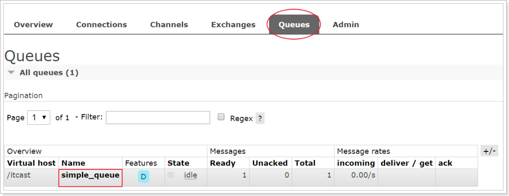

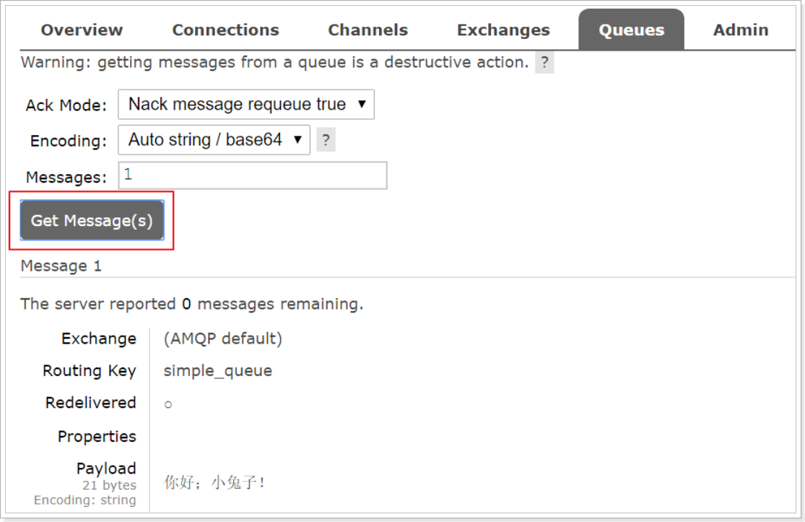


##### 消费者

```java
public class Consumer_HelloWorld {

    public static void main(String[] args) throws IOException, TimeoutException {
        //1.创建连接工厂
        ConnectionFactory factory = new ConnectionFactory();

        //2.设置工厂参数
        factory.setHost("192.168.24.128");  //ip，默认 localhost
        factory.setPort(5672);              //端口，默认 5672
        factory.setVirtualHost("/ktsk");    //虚拟机，默认 /
        factory.setUsername("ktsk");        //用户名，默认 guest
        factory.setPassword("ktsk");        //密码，默认 guest

        //3.创建连接 Connection
        Connection connection = factory.newConnection();

        //4.创建频道 Channel
        Channel channel = connection.createChannel();

        //5.创建队列 Queue，简单模式没有 Exchange 交换机
        channel.queueDeclare("hello_world", true, false, false, null);  //声明队列

        //6.接收消息
        /**
         * basicConsume(String queue, boolean autoAck, Consumer callback)
         * 参数：
         *  1.queue：队列名称
         *  2.autoAck：是否自动确认
         *  3.callback：回调对象
         */
        Consumer consumer = new DefaultConsumer(channel) {
            /**
             * 回调方法，当收到消息后，会自动执行该方法
             * 参数：
             *  1.consumerTag：消息唯一标识
             *  2.envelope：获取一些信息，如交换机、路由 key ...
             *  3.properties：配置信息
             *  4.body：数据
             */
            @Override
            public void handleDelivery(String consumerTag, Envelope envelope, AMQP.BasicProperties properties, byte[] body) throws IOException {
                System.out.println("consumerTag：" + consumerTag);
                System.out.println("Exchange：" + envelope.getExchange());
                System.out.println("RoutingKey：" + envelope.getRoutingKey());
                System.out.println("properties：" + properties);
                System.out.println("body：" + new String(body));
            }
        };
        channel.basicConsume("hello_world", true, consumer);

        //消费者无需关闭连接，需要一直监听消息
    }

}
```


##### 小结

​	上述的入门案例中其实使用的是如下的简单模式：


​	在上图的模型中，有以下概念：

* P：生产者，也就是要发送消息的程序
* C：消费者，消息的接收者，会一直等待消息到来
* queue：消息队列，图中红色部分。类似一个邮箱，可以缓存消息；生产者向其中投递消息，消费者从其中取出消息


### RabbitMQ 工作模式

##### Work Queues

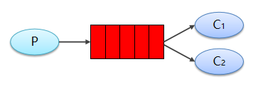

* Work Queues：与入门程序的简单模式相比，多了一个或一些消费端，多个消费端共同消费同一个队列中的消息。（不能同时消费同一份数据）
* 应用场景：对于任务过重或任务较多情况使用工作队列可以提高任务处理的速度。


> 代码实现

```java
public class Producer_WorkQueues {

    public static void main(String[] args) throws IOException, TimeoutException {
        //1.创建连接工厂
        ConnectionFactory factory = new ConnectionFactory();

        //2.设置工厂参数
        factory.setHost("192.168.24.128");  //ip，默认 localhost
        factory.setPort(5672);              //端口，默认 5672
        factory.setVirtualHost("/ktsk");    //虚拟机，默认 /
        factory.setUsername("ktsk");        //用户名，默认 guest
        factory.setPassword("ktsk");        //密码，默认 guest

        //3.创建连接 Connection
        Connection connection = factory.newConnection();

        //4.创建频道 Channel
        Channel channel = connection.createChannel();

        //5.创建队列 Queue
        channel.queueDeclare("work_queues", true, false, false, null);  //声明队列

        //6.发送消息
        for (int i = 0; i < 10; i++) {
            String body = i + " - Hello RabbitMQ !!!!";
            channel.basicPublish("", "work_queues", null, body.getBytes());
        }

        //7.释放资源
        channel.close();
        connection.close();

    }

}
```

```java
public class Consumer_WorkQueues1 {	//创建 2 个

    public static void main(String[] args) throws IOException, TimeoutException {
        //1.创建连接工厂
        ConnectionFactory factory = new ConnectionFactory();

        //2.设置工厂参数
        factory.setHost("192.168.24.128");  //ip，默认 localhost
        factory.setPort(5672);              //端口，默认 5672
        factory.setVirtualHost("/ktsk");    //虚拟机，默认 /
        factory.setUsername("ktsk");        //用户名，默认 guest
        factory.setPassword("ktsk");        //密码，默认 guest

        //3.创建连接 Connection
        Connection connection = factory.newConnection();

        //4.创建频道 Channel
        Channel channel = connection.createChannel();

        //5.创建队列 Queue
        channel.queueDeclare("work_queues", true, false, false, null);  //声明队列

        //6.接收消息
        Consumer consumer = new DefaultConsumer(channel) {
            @Override
            public void handleDelivery(String consumerTag, Envelope envelope, AMQP.BasicProperties properties, byte[] body) throws IOException {
                System.out.println("body：" + new String(body));
            }
        };
        channel.basicConsume("work_queues", true, consumer);

        //消费者无需关闭连接，需要一直监听消息
    }

}
```


> 测试

​	启动两个消费者，然后再启动生产者发送消息；到 IDEA 的两个消费者对应的控制台查看是否竞争性的接收到消息。

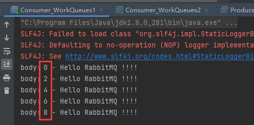

 throws IOException, TimeoutException {
        //1.创建连接工厂
        ConnectionFactory factory = new ConnectionFactory();

        //2.设置工厂参数
        factory.setHost("192.168.24.128");  //ip，默认 localhost
        factory.setPort(5672);              //端口，默认 5672
        factory.setVirtualHost("/ktsk");    //虚拟机，默认 /
        factory.setUsername("ktsk");        //用户名，默认 guest
        factory.setPassword("ktsk");        //密码，默认 guest

        //3.创建连接 Connection
        Connection connection = factory.newConnection();

        //4.创建频道 Channel
        Channel channel = connection.createChannel();

        //5.创建交换机
        /**
         * exchangeDeclare(String exchange, BuiltinExchangeType type, boolean durable, boolean autoDelete, boolean internal, Map<String, Object> arguments)
         * 参数：
         *  1.exchange：交换机名称
         *  2.type：交换机类型
         *     1）DIRECT("direct")：定向
         *     2）FANOUT("fanout"):扇形（广播），发送消息到每个绑定的队列
         *     3）TOPIC("topic"):通配符方式
         *     4）HEADERS("headers"):参数匹配
         *  3.durable：是否持久化
         *  4.autoDelete：自动删除
         *  5.internal：内部使用，一般为 false
         *  6.arguments：参数
         */
        String exchangeName = "test_fanout";
        channel.exchangeDeclare(exchangeName, BuiltinExchangeType.FANOUT, true, false, false, null);

        //6.创建队列
        String queue1Name = "test_fanout_queue1";
        String queue2Name = "test_fanout_queue2";
        channel.queueDeclare(queue1Name, true, false, false, null);
        channel.queueDeclare(queue2Name, true, false, false, null);

        //7.绑定队列和交换机
        /**
         * queueBind(String queue, String exchange, String routingKey)
         * 参数：
         *  1.queue：队列名称
         *  2.exchange：交换机名称
         *  3.routingKey：路由键，绑定规则
         *      如果交换机类型为 fanout，routingKey 设置为 ""，表示交换机会分发到与之绑定的所有 queue
         */
        channel.queueBind(queue1Name, exchangeName, "");
        channel.queueBind(queue2Name, exchangeName, "");

        //8.发送消息
        String body = "[日志信息] KTSK 调用了 findAll 方法 ... 日志级别：info ...";
        channel.basicPublish(exchangeName, "", null, body.getBytes());

        //9.释放资源
        channel.close();
        connection.close();

    }

}
```

```java
public class Consumer_PubSub1 {	//创建 2 个

    public static void main(String[] args) throws IOException, TimeoutException {
        //1.创建连接工厂
        ConnectionFactory factory = new ConnectionFactory();

        //2.设置工厂参数
        factory.setHost("192.168.24.128");  //ip，默认 localhost
        factory.setPort(5672);              //端口，默认 5672
        factory.setVirtualHost("/ktsk");    //虚拟机，默认 /
        factory.setUsername("ktsk");        //用户名，默认 guest
        factory.setPassword("ktsk");        //密码，默认 guest

        //3.创建连接 Connection
        Connection connection = factory.newConnection();

        //4.创建频道 Channel
        Channel channel = connection.createChannel();

        //5.队列无需创建，接收即可
        String queue1Name = "test_fanout_queue1";
        //第二个：String queue2Name = "test_fanout_queue2";

        //6.接收消息
        Consumer consumer = new DefaultConsumer(channel) {
            @Override
            public void handleDelivery(String consumerTag, Envelope envelope, AMQP.BasicProperties properties, byte[] body) throws IOException {
                System.out.println("body：" + new String(body));
                System.out.println("[队列1] 将日志信息打印到控制台 ...");
                //第二个：System.out.println("[队列2] 将日志信息保存到数据库 ...");
            }
        };
        channel.basicConsume(queue1Name, true, consumer);

    }

}
```


> 小结

1. 交换机需要与队列进行绑定，绑定之后；一个消息可以被多个消费者都收到。
2. 发布订阅模式与工作队列模式的区别：
   * 工作队列模式不用定义交换机，而发布/订阅模式需要定义交换机
   * 发布/订阅模式的生产方是面向交换机发送消息，工作队列模式的生产方是面向队列发送消息(底层使用默认交换机)
   * 发布/订阅模式需要设置队列和交换机的绑定，工作队列模式不需要设置，实际上工作队列模式会将队列绑 定到默认的交换机 


##### Routing 路由模式

- 队列与交换机的绑定，不能是任意绑定了，而是要指定一个 `RoutingKey`（路由key）
- 消息的发送方在向 Exchange 发送消息时，也必须指定消息的 `RoutingKey`。
- Exchange 不再把消息交给每一个绑定的队列，而是根据消息的 `Routing Key` 进行判断，只有队列的 `Routingkey` 与消息的 `Routing key` 完全一致，才会接收到消息


图解：

- P：生产者，向 Exchange 发送消息，发送消息时，会指定一个 routing key。
- X：Exchange（交换机），接收生产者的消息，然后把消息递交给与 routing key 完全匹配的队列
- C1：消费者，其所在队列指定了需要 routing key 为 error 的消息
- C2：消费者，其所在队列指定了需要 routing key 为 info、error、warning 的消息


> 代码实现

​	在编码上与 `Publish/Subscribe发布与订阅模式` 的区别是交换机的类型为：Direct，还有队列绑定交换机的时候需要指定 routing key。

```java
public class Producer_Routing {

    public static void main(String[] args) throws IOException, TimeoutException {
        //1.创建连接工厂
        ConnectionFactory factory = new ConnectionFactory();

        //2.设置工厂参数
        factory.setHost("192.168.24.128");  //ip，默认 localhost
        factory.setPort(5672);              //端口，默认 5672
        factory.setVirtualHost("/ktsk");    //虚拟机，默认 /
        factory.setUsername("ktsk");        //用户名，默认 guest
        factory.setPassword("ktsk");        //密码，默认 guest

        //3.创建连接 Connection
        Connection connection = factory.newConnection();

        //4.创建频道 Channel
        Channel channel = connection.createChannel();

        //5.创建交换机
        /**
         * exchangeDeclare(String exchange, BuiltinExchangeType type, boolean durable, boolean autoDelete, boolean internal, Map<String, Object> arguments)
         * 参数：
         *  1.exchange：交换机名称
         *  2.type：交换机类型
         *     1）DIRECT("direct")：定向
         *     2）FANOUT("fanout"):扇形（广播），发送消息到每个绑定的队列
         *     3）TOPIC("topic"):通配符方式
         *     4）HEADERS("headers"):参数匹配
         *  3.durable：是否持久化
         *  4.autoDelete：自动删除
         *  5.internal：内部使用，一般为 false
         *  6.arguments：参数
         */
        String exchangeName = "test_direct";
        channel.exchangeDeclare(exchangeName, BuiltinExchangeType.DIRECT, true, false, false, null);

        //6.创建队列
        String queue1Name = "test_direct_queue1";
        String queue2Name = "test_direct_queue2";
        channel.queueDeclare(queue1Name, true, false, false, null);
        channel.queueDeclare(queue2Name, true, false, false, null);

        //7.绑定队列和交换机
        /**
         * queueBind(String queue, String exchange, String routingKey)
         * 参数：
         *  1.queue：队列名称
         *  2.exchange：交换机名称
         *  3.routingKey：路由键，绑定规则
         *      如果交换机类型为 fanout，routingKey 设置为 ""，表示交换机会分发到与之绑定的所有 queue
         */
        //队列 1 绑定 error
        channel.queueBind(queue1Name, exchangeName, "error");
        //队列 2 绑定 info  error  warning
        channel.queueBind(queue2Name, exchangeName, "info");
        channel.queueBind(queue2Name, exchangeName, "error");
        channel.queueBind(queue2Name, exchangeName, "warning");

        //8.发送消息
        String body = "[日志信息] KTSK 调用了 delete 方法 ... 出错 日志级别：error ...";
        channel.basicPublish(exchangeName, "error", null, body.getBytes());

        //9.释放资源
        channel.close();
        connection.close();

    }

}
```

```java
public class Consumer_Routing1 {

    public static void main(String[] args) throws IOException, TimeoutException {
        //1.创建连接工厂
        ConnectionFactory factory = new ConnectionFactory();

        //2.设置工厂参数
        factory.setHost("192.168.24.128");  //ip，默认 localhost
        factory.setPort(5672);              //端口，默认 5672
        factory.setVirtualHost("/ktsk");    //虚拟机，默认 /
        factory.setUsername("ktsk");        //用户名，默认 guest
        factory.setPassword("ktsk");        //密码，默认 guest

        //3.创建连接 Connection
        Connection connection = factory.newConnection();

        //4.创建频道 Channel
        Channel channel = connection.createChannel();

        //5.队列无需创建，接收即可
        String queue1Name = "test_direct_queue1";
        //String queue1Name = "test_direct_queue2";

        //6.接收消息
        Consumer consumer = new DefaultConsumer(channel) {
            @Override
            public void handleDelivery(String consumerTag, Envelope envelope, AMQP.BasicProperties properties, byte[] body) throws IOException {
                System.out.println("body：" + new String(body));
                System.out.println("[队列1] 将日志信息存储到数据库 ...");
                //System.out.println("[队列2] 将日志信息打印到控制台 ...");
            }
        };
        channel.basicConsume(queue1Name, true, consumer);

    }

}
```


> 小结

* 启动所有消费者，然后使用生产者发送消息；在消费者对应的控制台可以查看到生产者发送对应routing key 对应队列的消息；到达**按照需要接收**的效果。
* Routing 模式要求队列在绑定交换机时指定 routing key，消息会转发到符合 routing key 的队列。


##### Topic 通配符模式

* `Topic` 类型与 `Direct` 相比，都是可以根据 `RoutingKey` 把消息路由到不同的队列。只不过 `Topic` 类型 `Exchange` 可以让队列在绑定 `Routing key` 的时候**使用通配符**！
* `Routingkey`  一般都是有一个或多个单词组成，多个单词之间以”.”分割，例如：`item.insert`
*  通配符规则：
  * `#`：匹配一个或多个词
  * `*`：匹配不多不少恰好1个


​	举例：

​		`item.#`：能够匹配 `item.insert.abc` 或者 `item.insert`

​		`item.*`：只能匹配 `item.insert`


​	图解：

- 红色Queue：绑定的是 `usa.#` ，因此凡是以 `usa.` 开头的 `routing key` 都会被匹配到
- 黄色Queue：绑定的是 `#.news` ，因此凡是以 `.news` 结尾的 `routing key` 都会被匹配


> 代码实现

```java
public class Producer_Topic {

    public static void main(String[] args) throws IOException, TimeoutException {
        //1.创建连接工厂
        ConnectionFactory factory = new ConnectionFactory();

        //2.设置工厂参数
        factory.setHost("192.168.24.128");  //ip，默认 localhost
        factory.setPort(5672);              //端口，默认 5672
        factory.setVirtualHost("/ktsk");    //虚拟机，默认 /
        factory.setUsername("ktsk");        //用户名，默认 guest
        factory.setPassword("ktsk");        //密码，默认 guest

        //3.创建连接 Connection
        Connection connection = factory.newConnection();

        //4.创建频道 Channel
        Channel channel = connection.createChannel();

        //5.创建交换机
        /**
         * exchangeDeclare(String exchange, BuiltinExchangeType type, boolean durable, boolean autoDelete, boolean internal, Map<String, Object> arguments)
         * 参数：
         *  1.exchange：交换机名称
         *  2.type：交换机类型
         *     1）DIRECT("direct")：定向
         *     2）FANOUT("fanout"):扇形（广播），发送消息到每个绑定的队列
         *     3）TOPIC("topic"):通配符方式
         *     4）HEADERS("headers"):参数匹配
         *  3.durable：是否持久化
         *  4.autoDelete：自动删除
         *  5.internal：内部使用，一般为 false
         *  6.arguments：参数
         */
        String exchangeName = "test_topic";
        channel.exchangeDeclare(exchangeName, BuiltinExchangeType.TOPIC, true, false, false, null);

        //6.创建队列
        String queue1Name = "test_topic_queue1";
        String queue2Name = "test_topic_queue2";
        channel.queueDeclare(queue1Name, true, false, false, null);
        channel.queueDeclare(queue2Name, true, false, false, null);

        //7.绑定队列和交换机
        /**
         * queueBind(String queue, String exchange, String routingKey)
         * 参数：
         *  1.queue：队列名称
         *  2.exchange：交换机名称
         *  3.routingKey：路由键，绑定规则
         *      如果交换机类型为 fanout，routingKey 设置为 ""，表示交换机会分发到与之绑定的所有 queue
         */
        //routing key = 系统名称.日志级别
        //需求：所有 order 系统和 error 日志级别的信息都存入数据库
        channel.queueBind(queue1Name, exchangeName, "order.#");
        channel.queueBind(queue1Name, exchangeName, "*.error");
        channel.queueBind(queue2Name, exchangeName, "*.*");

        //8.发送消息
        String body = "[日志信息] KTSK 调用了 goods.info 方法 ... 日志级别：info ...";
        channel.basicPublish(exchangeName, "goods.info", null, body.getBytes());

        //9.释放资源
        channel.close();
        connection.close();

    }

}
```

```java
public class Consumer_Topic1 {

    public static void main(String[] args) throws IOException, TimeoutException {
        //1.创建连接工厂
        ConnectionFactory factory = new ConnectionFactory();

        //2.设置工厂参数
        factory.setHost("192.168.24.128");  //ip，默认 localhost
        factory.setPort(5672);              //端口，默认 5672
        factory.setVirtualHost("/ktsk");    //虚拟机，默认 /
        factory.setUsername("ktsk");        //用户名，默认 guest
        factory.setPassword("ktsk");        //密码，默认 guest

        //3.创建连接 Connection
        Connection connection = factory.newConnection();

        //4.创建频道 Channel
        Channel channel = connection.createChannel();

        //5.队列无需创建，接收即可
        String queue1Name = "test_topic_queue1";
        //String queue1Name = "test_topic_queue2";

        //6.接收消息
        Consumer consumer = new DefaultConsumer(channel) {
            @Override
            public void handleDelivery(String consumerTag, Envelope envelope, AMQP.BasicProperties properties, byte[] body) throws IOException {
                System.out.println("body：" + new String(body));
                System.out.println("[队列1] 将日志信息存储到数据库 ...");
                //System.out.println("[队列2] 将日志信息打印到控制台 ...");
            }
        };
        channel.basicConsume(queue1Name, true, consumer);

    }

}
```


> 小结

​	Topic 主题模式可以实现 Pub/Sub 发布与订阅模式和 Routing 路由模式的功能，只是 Topic 在配置routing key 的时候可以使用通配符，显得更加灵活。


##### 工作模式总结

> 简单模式 HelloWorld

​      一个生产者、一个消费者，不需要设置交换机（使用默认的交换机）。

> 工作队列模式 Work Queue

​      一个生产者、多个消费者（竞争关系），不需要设置交换机（使用默认的交换机）。

> 发布订阅模式 Publish/subscribe

​      需要设置类型为 fanout 的交换机，并且交换机和队列进行绑定，当发送消息到交换机后，交换机会将消息发送到绑定的队列。

> 路由模式 Routing

​      需要设置类型为 direct 的交换机，交换机和队列进行绑定，并且指定 routing key，当发送消息到交换机后，交换机会根据 routing key 将消息发送到对应的队列。

> 通配符模式 Topic

​      需要设置类型为 topic 的交换机，交换机和队列进行绑定，并且指定通配符方式的 routing key，当发送消息到交换机后，交换机会根据 routing key 将消息发送到对应的队列。


### Spring 整合 RabbitMQ

##### 生产者

> 添加依赖

```xml
<dependencies>
    <dependency>
        <groupId>org.springframework</groupId>
        <artifactId>spring-context</artifactId>
        <version>5.2.16.RELEASE</version>
    </dependency>
    <dependency>
        <groupId>org.springframework.amqp</groupId>
        <artifactId>spring-rabbit</artifactId>
        <version>2.2.18.RELEASE</version>
    </dependency>
    <dependency>
        <groupId>junit</groupId>
        <artifactId>junit</artifactId>
        <version>4.13.2</version>
        <scope>test</scope>
    </dependency>
    <dependency>
        <groupId>org.springframework</groupId>
        <artifactId>spring-test</artifactId>
        <version>5.2.16.RELEASE</version>
    </dependency>
</dependencies>

<build>
    <plugins>
        <plugin>
            <groupId>org.apache.maven.plugins</groupId>
            <artifactId>maven-compiler-plugin</artifactId>
            <version>3.8.1</version>
            <configuration>
                <source>1.8</source>
                <target>1.8</target>
            </configuration>
        </plugin>
    </plugins>
</build>
```


> 创建 RabbitMQ 连接配置文件 rabbitmq.properties

```properties
rabbitmq.host=192.168.24.128
rabbitmq.port=5672
rabbitmq.username=ktsk
rabbitmq.password=ktsk
rabbitmq.virtual-host=/ktsk
```


> 创建 spring-rabbitmq-producer.xml 整合配置文件

```xml
<?xml version="1.0" encoding="UTF-8"?>
<beans xmlns="http://www.springframework.org/schema/beans"
       xmlns:xsi="http://www.w3.org/2001/XMLSchema-instance"
       xmlns:context="http://www.springframework.org/schema/context"
       xmlns:rabbit="http://www.springframework.org/schema/rabbit"
       xsi:schemaLocation="http://www.springframework.org/schema/beans
       http://www.springframework.org/schema/beans/spring-beans.xsd
       http://www.springframework.org/schema/context
       https://www.springframework.org/schema/context/spring-context.xsd
       http://www.springframework.org/schema/rabbit
       http://www.springframework.org/schema/rabbit/spring-rabbit.xsd">
    <!--加载配置文件-->
    <context:property-placeholder location="classpath:rabbitmq.properties"/>

    <!-- 定义rabbitmq connectionFactory -->
    <rabbit:connection-factory id="connectionFactory" host="${rabbitmq.host}"
                               port="${rabbitmq.port}"
                               username="${rabbitmq.username}"
                               password="${rabbitmq.password}"
                               virtual-host="${rabbitmq.virtual-host}"/>
    <!--定义管理交换机、队列-->
    <rabbit:admin connection-factory="connectionFactory"/>

    <!--定义持久化队列，不存在则自动创建；不绑定到交换机则绑定到默认交换机
    默认交换机类型为direct，名字为：""，路由键为队列的名称
    -->

    <!--
        id：bean 名称
        name：queue 名称
        auto-declare：自动创建
        auto-delete：自动删除，最后一个消费者和该队列断开连接后，自动删除队列
        exclusive：是否独占
        durable：是否持久化
     -->
    <rabbit:queue id="spring_queue" name="spring_queue" auto-declare="true"/>

    <!-- ~~~~~~~~~~~~~~~~~~~~~~~~~~~~广播；所有队列都能收到消息~~~~~~~~~~~~~~~~~~~~~~~~~~~~ -->
    <!--定义广播交换机中的持久化队列，不存在则自动创建-->
    <rabbit:queue id="spring_fanout_queue_1" name="spring_fanout_queue_1" auto-declare="true"/>

    <!--定义广播交换机中的持久化队列，不存在则自动创建-->
    <rabbit:queue id="spring_fanout_queue_2" name="spring_fanout_queue_2" auto-declare="true"/>

    <!--定义广播类型交换机；并绑定上述两个队列-->
    <rabbit:fanout-exchange id="spring_fanout_exchange" name="spring_fanout_exchange" auto-declare="true">
        <rabbit:bindings>
            <rabbit:binding queue="spring_fanout_queue_1"/>
            <rabbit:binding queue="spring_fanout_queue_2"/>
        </rabbit:bindings>
    </rabbit:fanout-exchange>

    <!--<rabbit:direct-exchange name="aa">
        <rabbit:bindings>
            &lt;!&ndash; direct 类型的交换机绑定队列必须指定路由 key &ndash;&gt;
            <rabbit:binding queue="spring_queue" key="xxx"/>
        </rabbit:bindings>
    </rabbit:direct-exchange>-->

    <!-- ~~~~~~~~~~~~~~~~~~~~~~~~~~~~通配符；*匹配一个单词，#匹配多个单词 ~~~~~~~~~~~~~~~~~~~~~~~~~~~~ -->
    <!--定义广播交换机中的持久化队列，不存在则自动创建-->
    <rabbit:queue id="spring_topic_queue_star" name="spring_topic_queue_star" auto-declare="true"/>
    <!--定义广播交换机中的持久化队列，不存在则自动创建-->
    <rabbit:queue id="spring_topic_queue_well" name="spring_topic_queue_well" auto-declare="true"/>
    <!--定义广播交换机中的持久化队列，不存在则自动创建-->
    <rabbit:queue id="spring_topic_queue_well2" name="spring_topic_queue_well2" auto-declare="true"/>

    <rabbit:topic-exchange id="spring_topic_exchange" name="spring_topic_exchange" auto-declare="true">
        <rabbit:bindings>
            <rabbit:binding pattern="ktsk.*" queue="spring_topic_queue_star"/>
            <rabbit:binding pattern="ktsk.#" queue="spring_topic_queue_well"/>
            <rabbit:binding pattern="itktsk.#" queue="spring_topic_queue_well2"/>
        </rabbit:bindings>
    </rabbit:topic-exchange>

    <!--定义rabbitTemplate对象操作可以在代码中方便发送消息-->
    <rabbit:template id="rabbitTemplate" connection-factory="connectionFactory"/>
</beans>
```


> 创建测试类 ProducerTest 发送消息

```java
@RunWith(SpringJUnit4ClassRunner.class)
@ContextConfiguration(locations = "classpath:spring-rabbitmq-producer.xml")
public class ProducerTest {

    //1.注入 RabbitTemplate
    @Autowired
    private RabbitTemplate rabbitTemplate;

    @Test
    public void testHelloWorld() {
        /**
         * 只发队列消息，默认交换机类型 direct，交换机名称为空，路由键为队列名称
         */
        //2.发送消息
        rabbitTemplate.convertAndSend("spring_queue", "hello world spring ...");
    }

    @Test
    public void testFanout() {
        /**
         * 发送广播，交换机类型 fanout，绑定到该交换机的所有队列都能收到消息
         * 参数1：交换机名
         * 参数2：路由键名（广播模式设置为空）
         * 参数3：发送的消息内容
         */
        rabbitTemplate.convertAndSend("spring_fanout_exchange", "", "spring fanout ...");
    }

    @Test
    public void testTopic() {
        /**
         * 通配符模式，交换机类型 topic，匹配路由键的通配符
         */
        rabbitTemplate.convertAndSend("spring_topic_exchange", "ktsk.hehe.haha", "spring topic ...");
    }

}
```


##### 消费者

> 添加依赖与连接配置文件（同生产者）后，添加 spring-rabbitmq-consumer.xml 整合配置文件

```xml
<?xml version="1.0" encoding="UTF-8"?>
<beans xmlns="http://www.springframework.org/schema/beans"
       xmlns:xsi="http://www.w3.org/2001/XMLSchema-instance"
       xmlns:context="http://www.springframework.org/schema/context"
       xmlns:rabbit="http://www.springframework.org/schema/rabbit"
       xsi:schemaLocation="http://www.springframework.org/schema/beans
       http://www.springframework.org/schema/beans/spring-beans.xsd
       http://www.springframework.org/schema/context
       https://www.springframework.org/schema/context/spring-context.xsd
       http://www.springframework.org/schema/rabbit
       http://www.springframework.org/schema/rabbit/spring-rabbit.xsd">
    <!--加载配置文件-->
    <context:property-placeholder location="classpath:rabbitmq.properties"/>

    <!-- 定义rabbitmq connectionFactory -->
    <rabbit:connection-factory id="connectionFactory" host="${rabbitmq.host}"
                               port="${rabbitmq.port}"
                               username="${rabbitmq.username}"
                               password="${rabbitmq.password}"
                               virtual-host="${rabbitmq.virtual-host}"/>

    <bean id="springQueueListener" class="com.ktsk.rabbitmq.listener.SpringQueueListener"/>
    <!--<bean id="fanoutListener1" class="com.ktsk.rabbitmq.listener.FanoutListener1"/>
    <bean id="fanoutListener2" class="com.ktsk.rabbitmq.listener.FanoutListener2"/>
    <bean id="topicListenerStar" class="com.ktsk.rabbitmq.listener.TopicListenerStar"/>
    <bean id="topicListenerWell" class="com.ktsk.rabbitmq.listener.TopicListenerWell"/>
    <bean id="topicListenerWell2" class="com.ktsk.rabbitmq.listener.TopicListenerWell2"/>-->

    <rabbit:listener-container connection-factory="connectionFactory" auto-declare="true">
        <rabbit:listener ref="springQueueListener" queue-names="spring_queue"/>
        <!--<rabbit:listener ref="fanoutListener1" queue-names="spring_fanout_queue_1"/>
        <rabbit:listener ref="fanoutListener2" queue-names="spring_fanout_queue_2"/>
        <rabbit:listener ref="topicListenerStar" queue-names="spring_topic_queue_star"/>
        <rabbit:listener ref="topicListenerWell" queue-names="spring_topic_queue_well"/>
        <rabbit:listener ref="topicListenerWell2" queue-names="spring_topic_queue_well2"/>-->
    </rabbit:listener-container>
</beans>
```


> 添加消息监听器（所有监听器代码相同）

```java
public class SpringQueueListener implements MessageListener {

    @Override
    public void onMessage(Message message) {    //监听回调方法
        System.out.println(new String(message.getBody()));
    }
}
```


> 添加测试方法运行监听器

```java
@RunWith(SpringJUnit4ClassRunner.class)
@ContextConfiguration(locations = "classpath:spring-rabbitmq-consumer.xml")
public class ConsumerTest {

    @Test
    public void test1() {
        while (true) { }
    }

}
```


### SpringBoot 整合 RabbitMQ

##### 生产者

> 引入依赖坐标

```xml
<parent>
    <groupId>org.springframework.boot</groupId>
    <artifactId>spring-boot-starter-parent</artifactId>
    <version>2.5.4</version>
</parent>

<dependencies>
    <dependency>
        <groupId>org.springframework.boot</groupId>
        <artifactId>spring-boot-starter-amqp</artifactId>
    </dependency>
    <dependency>
        <groupId>org.springframework.boot</groupId>
        <artifactId>spring-boot-starter-test</artifactId>
    </dependency>
    <dependency>
        <groupId>junit</groupId>
        <artifactId>junit</artifactId>
        <scope>test</scope>
    </dependency>
</dependencies>
```


> 编写 application.yml 文件配置 RabbitMQ 基本信息

```yml
spring:
  rabbitmq:
    host: 192.168.24.128
    port: 5672
    username: ktsk
    password: ktsk
    virtual-host: /ktsk
```


> 编写 SpringBoot 启动类

```java
@SpringBootApplication
public class ProducerApplication {

    public static void main(String[] args) {
        SpringApplication.run(ProducerApplication.class);
    }

}
```


> 编写 RabbitMQ 配置类

```java
package com.ktsk.rabbitmq.config;

import org.springframework.amqp.core.*;
import org.springframework.beans.factory.annotation.Qualifier;
import org.springframework.context.annotation.Bean;
import org.springframework.context.annotation.Configuration;

@Configuration
public class RabbitMQConfig {

    public static final String EXCHANGE_NAME = "boot_topic_exchange";
    public static final String QUEUE_NAME = "boot_queue";

    //1.交换机
    @Bean("bootExchange")
    public Exchange bootExchange() {
        return ExchangeBuilder.topicExchange(EXCHANGE_NAME).durable(true).build();
    }

    //2.队列
    @Bean("bootQueue")
    public Queue bootQueue() {
        return QueueBuilder.durable(QUEUE_NAME).build();
    }

    //3.队列和交换机绑定关系 Binding
    @Bean
    public Binding bindQueueExchange(@Qualifier("bootQueue") Queue queue,@Qualifier("bootExchange") Exchange exchange) {
        return BindingBuilder.bind(queue).to(exchange).with("boot.#").noargs();
    }

}
```


> 编写测试类

```java
@SpringBootTest
@RunWith(SpringRunner.class)
public class ProducerTest {

    @Autowired
    private RabbitTemplate rabbitTemplate;

    @Test
    public void testSend() {
        rabbitTemplate.convertAndSend(RabbitMQConfig.EXCHANGE_NAME, "boot.haha", "boot mq hello !!!");
    }

}
```


##### 消费者

> 导入依赖、配置文件、编写启动类后，编写 RabbitMQListener

```java
@Component
public class RabbitMQListener {

    @RabbitListener(queues = "boot_queue")
    public void ListenerQueue(Message message) {
        System.out.println(new String(message.getBody()));
    }

}
```

​	最后运行启动类即可。


> 小结

* SpringBoot 提供了快速整合 RabbitMQ 的方式
* 基本信息在 yml 中配置，队列交换机及绑定关系在配置类中使用 Bean 的方式配置
* 生产端直接注入 RabbitTemplate 完成消息发送
* 消费端直接使用 @RabbitListener 完成消息接收


### RabbitMQ 高级特性

##### 消息可靠性投递

​	在使用 RabbitMQ 的时候，作为消息发送方希望杜绝任何消息丢失或者投递失败场景。RabbitMQ 为我们提供了两种方式用来控制消息的投递可靠性模式。

* confirm 确认模式
* return  回退模式


​	rabbitmq 整个消息投递的路径为：

​		producer ---> rabbitmq broker ---> exchange ---> queue ---> consumer

* 消息从 producer 到 exchange 则会返回一个 confirmCallback 。
* 消息从 exchange --> queue 投递**失败**则会返回一个 returnCallback 。

我们将利用这两个 callback 控制消息的可靠性投递。


> confirm 确认模式

​	1.导入坐标：

```xml
<dependencies>
    <dependency>
        <groupId>org.springframework</groupId>
        <artifactId>spring-context</artifactId>
        <version>5.2.16.RELEASE</version>
    </dependency>
    <dependency>
        <groupId>org.springframework.amqp</groupId>
        <artifactId>spring-rabbit</artifactId>
        <version>2.2.18.RELEASE</version>
    </dependency>
    <dependency>
        <groupId>junit</groupId>
        <artifactId>junit</artifactId>
        <version>4.13.2</version>
        <scope>test</scope>
    </dependency>
    <dependency>
        <groupId>org.springframework</groupId>
        <artifactId>spring-test</artifactId>
        <version>5.2.16.RELEASE</version>
    </dependency>
</dependencies>

<build>
    <plugins>
        <plugin>
            <groupId>org.apache.maven.plugins</groupId>
            <artifactId>maven-compiler-plugin</artifactId>
            <version>3.8.1</version>
            <configuration>
                <source>1.8</source>
                <target>1.8</target>
            </configuration>
        </plugin>
    </plugins>
</build>
```


​	2.编写 rabbitmq.properties 配置文件

```properties
rabbitmq.host=192.168.24.128
rabbitmq.port=5672
rabbitmq.username=ktsk
rabbitmq.password=ktsk
rabbitmq.virtual-host=/ktsk
```


​	3.编写 spring-rabbitmq-producer.xml 配置文件

```xml
<?xml version="1.0" encoding="UTF-8"?>
<beans xmlns="http://www.springframework.org/schema/beans"
       xmlns:xsi="http://www.w3.org/2001/XMLSchema-instance"
       xmlns:context="http://www.springframework.org/schema/context"
       xmlns:rabbit="http://www.springframework.org/schema/rabbit"
       xsi:schemaLocation="http://www.springframework.org/schema/beans
       http://www.springframework.org/schema/beans/spring-beans.xsd
       http://www.springframework.org/schema/context
       https://www.springframework.org/schema/context/spring-context.xsd
       http://www.springframework.org/schema/rabbit
       http://www.springframework.org/schema/rabbit/spring-rabbit.xsd">
    <!--加载配置文件-->
    <context:property-placeholder location="classpath:rabbitmq.properties"/>

    <!-- 定义rabbitmq connectionFactory -->
    <rabbit:connection-factory id="connectionFactory" host="${rabbitmq.host}"
                               port="${rabbitmq.port}"
                               username="${rabbitmq.username}"
                               password="${rabbitmq.password}"
                               virtual-host="${rabbitmq.virtual-host}"
                               publisher-confirms="true"
                               publisher-returns="true"
    />

    <!-- 定义管理交换机、队列 -->
    <rabbit:admin connection-factory="connectionFactory" />

    <!-- 定义 rabbitTemplate 对象方便在代码中发送消息 -->
    <rabbit:template id="rabbitTemplate" connection-factory="connectionFactory" />

    <!-- 消息可靠性投递（生产端） -->
    <!-- 定义消息队列 -->
    <rabbit:queue id="test_queue_confirm" name="test_queue_confirm" />

    <!-- 定义交换机 -->
    <rabbit:direct-exchange name="test_exchange_confirm">
        <rabbit:bindings>
            <rabbit:binding queue="test_queue_confirm" key="confirm" />
        </rabbit:bindings>
    </rabbit:direct-exchange>

</beans>
```


​	4.编写测试类：

```java
@RunWith(SpringJUnit4ClassRunner.class)
@ContextConfiguration(locations = "classpath:spring-rabbitmq-producer.xml")
public class ProducerTest {

    @Autowired
    private RabbitTemplate rabbitTemplate;

    /**
     * 确认模式：
     * 步骤：
     *      1.确认模式开启：ConnectionFactory 中开启 publisher-confirms="true"
     *      2.在 rabbitTemplate 定义 ConfirmCallBack 回调函数
     */
    @Test
    public void testConfirm() {
        //定义回调
        rabbitTemplate.setConfirmCallback(new RabbitTemplate.ConfirmCallback() {
            /**
             * @param correlationData 相关配置信息
             * @param ack 表示 exchange 交换机是否成功收到消息
             * @param cause 失败原因
             */
            @Override
            public void confirm(CorrelationData correlationData, boolean ack, String cause) {
                System.out.println("confirm 方法被执行 ...");
                if (ack) {
                    System.out.println("交换机接收成功：" + cause);
                } else {
                    System.out.println("交换机接收失败：" + cause);
                }
            }
        });

        //发送消息
        rabbitTemplate.convertAndSend("test_exchange_confirm", "confirm", "message confirm ...");
    }

}
```


> return  回退模式

​	在上面的测试方法中添加此方法：

```java
/**
 * 回退模式：当消息发送给 exchange 后，exchange 路由到 queue 失败时，才会执行 ReturnCallBack
 * 步骤：
 *      1.开启回退模式：publisher-returns="true"
 *      2.设置交换机处理失败消息的模式：rabbitTemplate.setMandatory(true);
 *      3.设置 ReturnCallBack 方法
 *      4.设置 exchange 处理消息的模式：
 *          1）如果消息没有路由到 queue，则丢弃消息（默认）
 *          2）如果消息没有路由到 queue，则返回消息给发送方的 ReturnCallBack 方法
 */
@Test
public void testReturn() {
    //设置交换机处理失败消息的模式
    rabbitTemplate.setMandatory(true);

    //设置 ReturnCallBack
    rabbitTemplate.setReturnCallback(new RabbitTemplate.ReturnCallback() {
        /**
         * @param message       消息对象
         * @param replyCode     错误码
         * @param replyText     错误信息
         * @param exchange      交换机
         * @param routingKey    路由键
         */
        @Override
        public void returnedMessage(Message message, int replyCode, String replyText, String exchange, String routingKey) {
            System.out.println("路由出错，return 方法执行 ...");
            System.out.println(message);
            System.out.println(replyCode);
            System.out.println(replyText);
            System.out.println(exchange);
            System.out.println(routingKey);
        }
    });

    //发送消息
    rabbitTemplate.convertAndSend("test_exchange_confirm", "confirm1", "message return ...");
}
```


> 小结

* 设置 ConnectionFactory 的 publisher-confirms="true" 开启 确认模式。
* 使用 rabbitTemplate.setConfirmCallback 设置回调函数。当消息发送到 exchange 后回调 confirm 方法。在方法中判断 ack，如果为 true，则发送成功，如果为 false，则发送失败，需要处理。


* 设置 ConnectionFactory 的 publisher-returns="true" 开启 回退模式。
* 使用 rabbitTemplate.setReturnCallback 设置退回函数，当消息从 exchange 路由到 queue 失败后，如果设置了 rabbitTemplate.setMandatory(true) 参数，则会将消息退回给 producer。并执行回调函数 returnedMessage。


​	在 RabbitMQ 中也提供了事务机制，但是性能较差，此处不做讲解。

​	使用 channel 下列方法，完成事务控制：

​		1）txSelect()，用于将当前 channel 设置成 transaction 模式

​		2）txCommit()，用于提交事务

​		3）txRollback()，用于回滚事务


##### Consumer Ack

​	ack指Acknowledge，确认。 表示消费端收到消息后的确认方式。

有三种确认方式：

* 自动确认：acknowledge="none"
* 手动确认：acknowledge="manual"
* 根据异常情况确认：acknowledge="auto"，（这种方式使用麻烦，不作讲解）

​	其中自动确认是指，当消息一旦被 Consumer 接收到，则自动确认收到，并将相应 message 从 RabbitMQ 的消息缓存中移除。但是在实际业务处理中，很可能消息接收到，业务处理出现异常，那么该消息就会丢失。

​	如果设置了手动确认方式，则需要在业务处理成功后，调用 channel.basicAck()，手动签收，如果出现异常，则调用 channel.basicNack() 方法，让其自动重新发送消息。


> 导入 pom 依赖和 rabbitmq.properties，编写 spring-rabbitmq-consumer.xml

```xml
<!--加载配置文件-->
<context:property-placeholder location="classpath:rabbitmq.properties"/>

<!-- 定义rabbitmq connectionFactory -->
<rabbit:connection-factory id="connectionFactory" host="${rabbitmq.host}"
                           port="${rabbitmq.port}"
                           username="${rabbitmq.username}"
                           password="${rabbitmq.password}"
                           virtual-host="${rabbitmq.virtual-host}"
/>

<!-- 定义监听器 Bean -->
<context:component-scan base-package="com.ktsk.listener" />

<!-- 定义监听器容器 -->
<rabbit:listener-container connection-factory="connectionFactory" acknowledge="manual">
    <rabbit:listener ref="ackListener" queue-names="test_queue_confirm" />
</rabbit:listener-container>
```


> 编写 AckListener 监听类

```java
/**
 * Consumer Ack 机制：
 *      1.设置手动签收 acknowledge="manual"
 *      2.让监听器类实现 ChannelAwareMessageListener 接口
 *      3.如果消息成功处理，则调用 channel 的 basicAck() 签收
 *      4.如果消息成功失败，则调用 channel 的 basicNack() 拒绝签收，broker 重新发送给 consumer
 */
@Component
public class AckListener implements ChannelAwareMessageListener {

    @Override
    public void onMessage(Message message, Channel channel) throws Exception {
        long deliveryTag = message.getMessageProperties().getDeliveryTag();

        try {
            //1.接收转换消息
            System.out.println(new String(message.getBody()));

            //2.处理业务逻辑
            System.out.println("处理业务逻辑 ...");

            //int i = 3 / 0;  //手动出错

            /**
             * 参数1：所收到消息的 tag 标签
             * 参数2：允许多条信息同时被签收
             */
            //3.手动签收
            channel.basicAck(deliveryTag, true);
        } catch (Exception e) {
            /**
             * 参数3：requeue 重回队列，如果设置为 true 则消息重回 queue，broker 会重发该消息给消费端
             */
            //4.拒绝签收
            channel.basicNack(deliveryTag, true, true);

            //channel.basicReject(deliveryTag, true);   //老式方法，一次只能处理一条消息
        }
    }
}
```


> 编写测试类启动监听

```java
@RunWith(SpringJUnit4ClassRunner.class)
@ContextConfiguration(locations = "classpath:spring-rabbitmq-consumer.xml")
public class ConsumerTest {

    @Test
    public void test() {
        while (true) { }
    }

}
```


> 小结

* 在 rabbit:listener-container 标签中设置 acknowledge 属性，设置 ack 方式 none：自动确认，manual：手动确认
* 如果在消费端没有出现异常，则调用 channel.basicAck(deliveryTag,false); 方法确认签收消息
* 如果出现异常，则在 catch 中调用 basicNack 或 basicReject，拒绝消息，让MQ重新发送消息


> 消息可靠性总结

1.持久化

* exchange要持久化
* queue要持久化
* message要持久化

2.生产方确认Confirm

3.消费方确认Ack

4.Broker高可用


##### 消费端限流

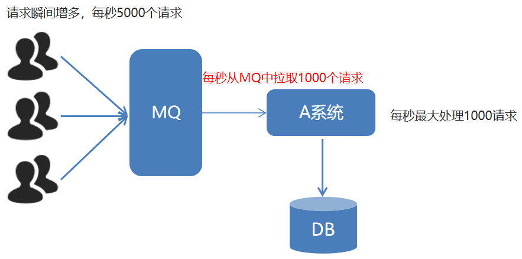

* 在<rabbit:listener-container> 中配置 prefetch 属性设置消费端一次拉取多少消息
* 消费端的确认模式一定为手动确认：acknowledge="manual"

```xml
<!-- 定义监听器容器 -->
<rabbit:listener-container connection-factory="connectionFactory" acknowledge="manual" prefetch="1">
    <!--<rabbit:listener ref="ackListener" queue-names="test_queue_confirm" />-->
    <rabbit:listener ref="qosListener" queue-names="test_queue_confirm" />
</rabbit:listener-container>
```

```java
/**
 * Consumer 限流机制：
 *      1.确保 ack 机制为手动确认
 *      2.listener-container 配置属性
 *          prefetch="1" 表示消费端每次从 mq 拉取一条消息来消费，制动手动确认消费完毕后，再继续拉取下一条
 */
@Component
public class QosListener implements ChannelAwareMessageListener {

    @Override
    public void onMessage(Message message, Channel channel) throws Exception {
        System.out.println(new String(message.getBody()));
        Thread.sleep(1000);
        channel.basicAck(message.getMessageProperties().getDeliveryTag(), true);
    }
}
```


##### TTL（存活时间）

* TTL 全称 Time To Live（存活时间/过期时间）。
* 当消息到达存活时间后，还没有被消费，会被自动清除。
* RabbitMQ 可以对消息设置过期时间，也可以对整个队列（Queue）设置过期时间。


> 控制台方式

​	1.添加队列

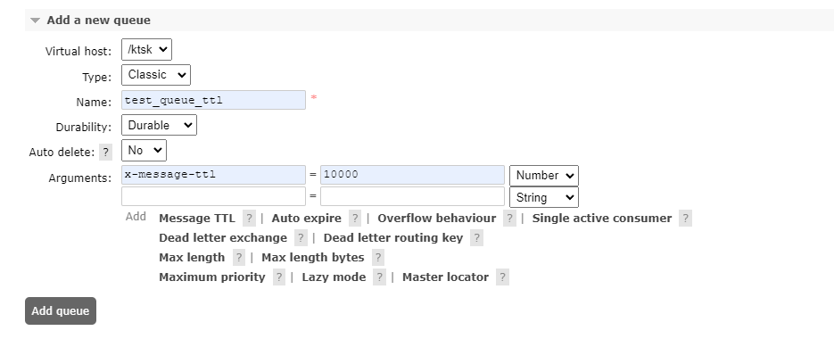

​	2.添加交换机

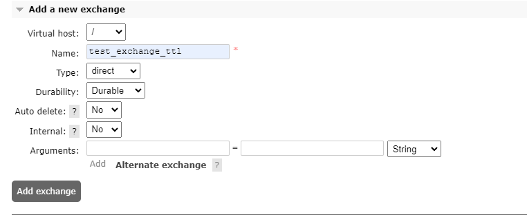

​	3.绑定队列

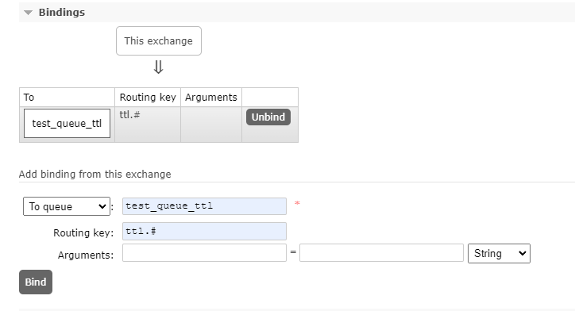

​	4.发送消息

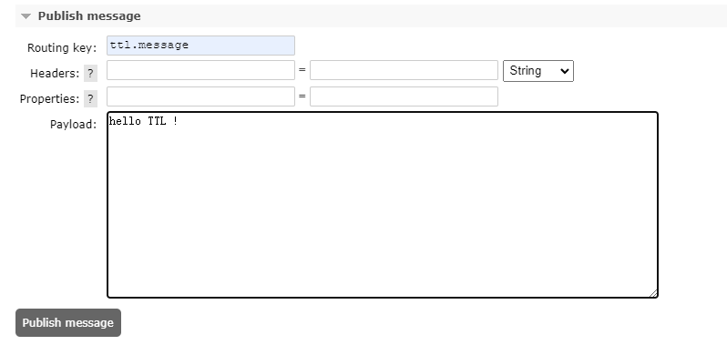

​		5.10秒后消息会被删除

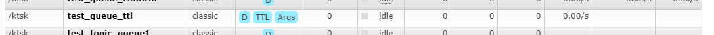


> 代码方式1：消息统一过期

```xml
<rabbit:queue name="test_queue_ttl" id="test_queue_ttl">
    <!-- 设置 queue 参数 -->
    <rabbit:queue-arguments>
        <entry key="x-message-ttl" value="10000" value-type="java.lang.Integer" />
    </rabbit:queue-arguments>
</rabbit:queue>

<rabbit:topic-exchange name="test_exchange_ttl">
    <rabbit:bindings>
        <rabbit:binding pattern="ttl.#" queue="test_queue_ttl"></rabbit:binding>
    </rabbit:bindings>
</rabbit:topic-exchange>
```

```java
/**
 * TTL：过期时间
 *      1.队列统一过期
 *      2.消息单独过期
 *
 * 如果设置了消息的过期时间，也设置了队列的过期时间，会以时间短的为准
 * 队列过期后，会将队列所有消息全部移除
 * 消息过期后，只有消息在队列顶端，才会判断其是否过期（移除掉）
 */
@Test
public void testTTL() {
    for (int i=0; i<10; i++) {
        rabbitTemplate.convertAndSend("test_exchange_ttl", "ttl.message", "message TTL ...");
    }
}
```


> 代码方式2：消息单独过期

```java
@Test
public void testTTL() {
    //消息单独过期
    MessagePostProcessor messagePostProcessor = new MessagePostProcessor() {
        @Override
        public Message postProcessMessage(Message message) throws AmqpException {
            message.getMessageProperties().setExpiration("5000");
            return message;
        }
    };

    rabbitTemplate.convertAndSend("test_exchange_ttl", "ttl.message", "message TTL ...", messagePostProcessor);
}
```


> 小结

* 设置队列过期时间使用参数：x-message-ttl，单位：ms(毫秒)，会对整个队列消息统一过期。
* 设置消息单独过期时间使用参数：expiration。单位：ms(毫秒)，当该消息在队列头部时（消费时），会单独判断这一消息是否过期。
* 如果两者都进行了设置，以时间短的为准。


##### 死信队列

​	英文缩写：DLX  。Dead Letter Exchange（死信交换机），当消息成为 Dead message 后，可以被重新发送到另一个交换机，这个交换机就是DLX。（同类产品中一般没有交换机，所以叫死信队列）


> 消息成为死信的三种情况

​	1.队列消息长度到达限制

​	2.消费者拒接消费消息 basicNack/basicReject，并且不把消息重新放入原目标队列 requeue=false

​	3.原队列存在消息过期设置，消息到达超时时间未被消费


> 队列绑定死信交换机

​	给队列设置参数： x-dead-letter-exchange 和 x-dead-letter-routing-key

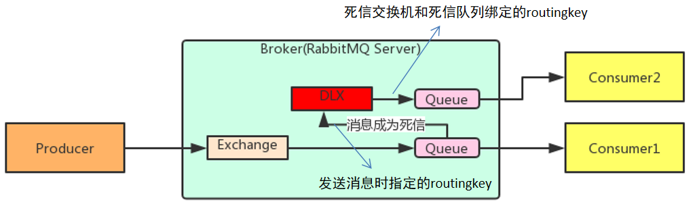


> 代码实现

​	1.生产者声明队列与交换机

```xml
<!-- ######################### 死信队列 ######################### -->
<!--
    死信队列：
        1.声明正常队列（test_queue_dlx）和交换机（test_exchange_dlx）
        2.声明死信队列（queue_dlx）和死信交换机（exchange_dlx）
        3.正常队列绑定死信交换机（设置两个参数）
            参数1：x-dead-letter-exchange 死信交换机名称
            参数2：x-dead-letter-routing-key 发送给死信交换机的 routingkey
 -->
<!-- 1.声明正常队列和交换机 -->
<rabbit:queue name="test_queue_dlx" id="test_queue_dlx">
    <rabbit:queue-arguments>
        <!-- 3.正常队列绑定死信交换机 -->
        <entry key="x-dead-letter-exchange" value="exchange_dlx" />
        <entry key="x-dead-letter-routing-key" value="dlx.hehe" />

        <!-- 4.设置队列过期时间、队列长度 -->
        <entry key="x-message-ttl" value="10000" value-type="java.lang.Integer" />
        <entry key="x-max-length" value="10" value-type="java.lang.Integer" />
    </rabbit:queue-arguments>
</rabbit:queue>
<rabbit:topic-exchange name="test_exchange_dlx">
    <rabbit:bindings>
        <rabbit:binding pattern="test.dlx.#" queue="test_queue_dlx"></rabbit:binding>
    </rabbit:bindings>
</rabbit:topic-exchange>

<!-- 2.声明死信队列和死信交换机 -->
<rabbit:queue name="queue_dlx" id="queue_dlx"></rabbit:queue>
<rabbit:topic-exchange name="exchange_dlx">
    <rabbit:bindings>
        <rabbit:binding pattern="dlx.#" queue="queue_dlx"></rabbit:binding>
    </rabbit:bindings>
</rabbit:topic-exchange>
```

​	2.编写发送测试方法

```java
/**
 * 发送测试死信消息：
 *      1.过期时间
 *      2.长度限制
 *      3.消息拒收
 */
@Test
public void testDlx() {
    //1.测试过期时间
    rabbitTemplate.convertAndSend("test_exchange_dlx", "test.dlx.haha", "hello dlx 1 ...");

    //2.测试长度限制
    for (int i = 0; i < 20; i++) {
        rabbitTemplate.convertAndSend("test_exchange_dlx", "test.dlx.haha", "hello dlx 2 ...");
    }

    //3.测试消息拒收
    rabbitTemplate.convertAndSend("test_exchange_dlx", "test.dlx.haha", "hello dlx 3 ...");
}
```

​	3.编写消费者监听类，并拒绝消息

```java
@Component
public class DlxListener implements ChannelAwareMessageListener {

    @Override
    public void onMessage(Message message, Channel channel) throws Exception {
        long deliveryTag = message.getMessageProperties().getDeliveryTag();

        try {
            System.out.println(new String(message.getBody()));
            System.out.println("处理业务逻辑 ...");
            int i = 3 / 0;  //手动错误
            channel.basicAck(deliveryTag, true);
        } catch (Exception e) {
            System.out.println("出现异常，拒收消息");
            //拒收后不重回队列
            channel.basicNack(deliveryTag, true, false);
        }
    }
}
```

​	4.定义监听容器

```xml
<!-- 定义监听器容器 -->
<rabbit:listener-container connection-factory="connectionFactory" acknowledge="manual" prefetch="1">
    <rabbit:listener ref="dlxListener" queue-names="test_queue_dlx" />
</rabbit:listener-container>
```


##### 延迟队列

​	延迟队列，即消息进入队列后不会立即被消费，只有到达指定时间后，才会被消费。

​	需求：

​		1）下单后，30分钟未支付，取消订单，回滚库存。

​		2）新用户注册成功7天后，发送短信问候。

​	实现方式：

​		1）定时器

​		2）延迟队列


​	在 RabbitMQ 中并未提供延迟队列功能。但是可以使用：**TTL+死信队列** 组合实现延迟队列的效果。

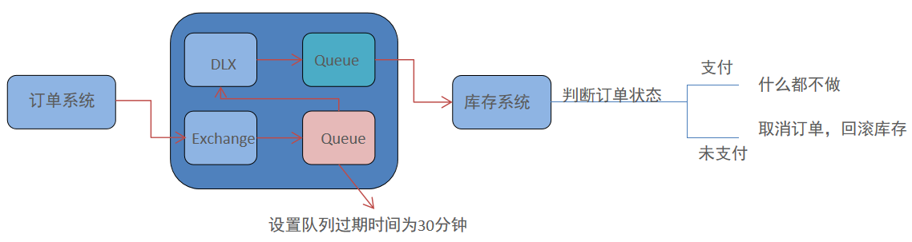


> spring-rabbitmq-producer.xml 中配置交换机和队列

```xml
<!-- ######################### 延迟队列 ######################### -->
<!-- 1.定义正常交换机（order_exchange）和队列（order_queue） -->
<rabbit:queue id="order_queue" name="order_queue">
    <!-- 3.绑定，设置正常队列过期时间 -->
    <rabbit:queue-arguments>
        <entry key="x-dead-letter-exchange" value="order_exchange_dlx" />
        <entry key="x-dead-letter-routing-key" value="dlx.order.cancel" />
        <entry key="x-message-ttl" value="10000" value-type="java.lang.Integer" />
    </rabbit:queue-arguments>
</rabbit:queue>
<rabbit:topic-exchange name="order_exchange">
    <rabbit:bindings>
        <rabbit:binding pattern="order.#" queue="order_queue" />
    </rabbit:bindings>
</rabbit:topic-exchange>

<!-- 2.定义死信交换机（order_exchange_dlx）和队列（order_queue_dlx） -->
<rabbit:queue id="order_queue_dlx" name="order_queue_dlx"></rabbit:queue>
<rabbit:topic-exchange name="order_exchange_dlx">
    <rabbit:bindings>
        <rabbit:binding pattern="dlx.order.#" queue="order_queue_dlx" />
    </rabbit:bindings>
</rabbit:topic-exchange>
```


> ProducerTest.java 发送消息

```java
@Test
public void testDelay() throws InterruptedException {
    //1.发送订单信息。将来是在订单系统中，下单成功后，发送消息
    rabbitTemplate.convertAndSend("order_exchange", "order.msg", "订单信息： ... ...");

    //2.打印倒计时 10 秒
    for (int i=10; i>0; i--) {
        System.out.println(i + " ...");
        Thread.sleep(1000);
    }
    return;
}
```


> spring-rabbitmq-consumer.xml 定义监听容器

```xml
<!-- 定义监听器容器 -->
<rabbit:listener-container connection-factory="connectionFactory" acknowledge="manual" prefetch="1">
    <rabbit:listener ref="orderListener" queue-names="order_queue_dlx" />
</rabbit:listener-container>
```


> OrderListener.java 编写消费者监听

```java
@Component
public class OrderListener implements ChannelAwareMessageListener {

    @Override
    public void onMessage(Message message, Channel channel) throws Exception {
        long deliveryTag = message.getMessageProperties().getDeliveryTag();

        try {
            System.out.println(new String(message.getBody()));

            System.out.println("处理业务逻辑 ...");
            System.out.println("根据订单 id 查询其状态 ...");
            System.out.println("判断状态是否为支付成功");
            System.out.println("取消订单，回滚库存 ...");

            channel.basicAck(deliveryTag, true);
        } catch (Exception e) {
            System.out.println("出现异常，拒收消息");
            //拒收后不重回队列
            channel.basicNack(deliveryTag, true, false);
        }
    }
}
```


##### 日志与监控

​	RabbitMQ 默认日志存放路径： /var/log/rabbitmq/rabbit@xxx.log

​	日志包含了 RabbitMQ 的版本号、Erlang 的版本号、RabbitMQ 服务节点名称、cookie 的 hash 值、RabbitMQ 配置文件地址、内存限制、磁盘限制、默认账户 guest 的创建以及权限配置等等。


> 监控指令

​	查看队列：rabbitmqctl list_queues

​	查看 exchanges：rabbitmqctl list_exchanges

​	查看用户：rabbitmqctl list_users

​	查看连接：rabbitmqctl list_connections

​	查看消费者信息：rabbitmqctl list_consumers

​	查看环境变量：rabbitmqctl environment

​	查看未被确认的队列：rabbitmqctl list_queues  name messages_unacknowledged

​	查看单个队列的内存使用：rabbitmqctl list_queues name memory

​	查看准备就绪的队列：rabbitmqctl list_queues name messages_ready


##### 消息追踪

​	在使用任何消息中间件的过程中，难免会出现某条消息异常丢失的情况。对于 RabbitMQ 而言，可能是因为生产者或消费者与 RabbitMQ 断开了连接，而它们与 RabbitMQ 又采用了不同的确认机制；也有可能是因为交换器与队列之间不同的转发策略；甚至是交换器并没有与任何队列进行绑定，生产者又不感知或者没有采取相应的措施；另外 RabbitMQ 本身的集群策略也可能导致消息的丢失。这个时候就需要有一个较好的机制跟踪记录消息的投递过程，以此协助开发和运维人员进行问题的定位。

​	在 RabbitMQ 中可以使用 Firehose 和 rabbitmq_tracing 插件功能来实现消息追踪。


> Firehose

​	firehose 的机制是将生产者投递给 rabbitmq 的消息，rabbitmq 投递给消费者的消息按照指定的格式发送到默认的 exchange 上。这个默认的 exchange 的名称为 amq.rabbitmq.trace，它是一个 topic 类型的 exchange。发送到这个 exchange 上的消息的 routing key 为 publish.exchangename 和 deliver.queuename。其中 exchangename 和 queuename 为实际 exchange 和 queue 的名称，分别对应生产者投递到 exchange 的消息，和消费者从 queue 上获取的消息。

​	注意：打开 trace 会影响消息写入功能，适当打开后请关闭。

* rabbitmqctl trace_on：开启 Firehose 命令
* rabbitmqctl trace_off：关闭 Firehose 命令


​	1.启用 Firehose 后添加一个队列：

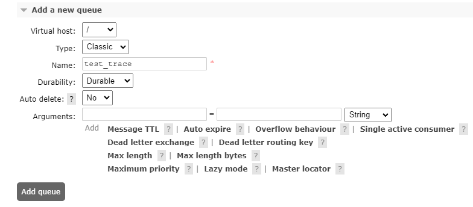

​	2.绑定交换机：

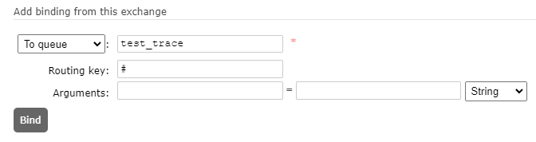

​	3.查看消息：

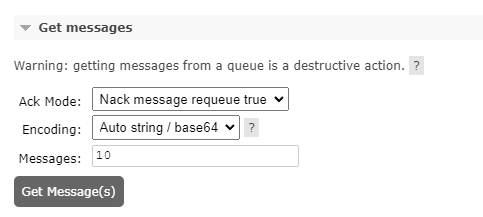


> rabbitmq_tracing 插件

​	rabbitmq_tracing 和 Firehose 在实现上如出一辙，只不过 rabbitmq_tracing 的方式比 Firehose 多了一层 GUI 的包装，更容易使用和管理。

​	启用插件：rabbitmq-plugins enable rabbitmq_tracing


​	1.开启插件后可在 Admin 下 Tracing 中添加 trace：

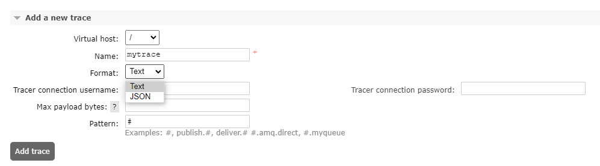

​	其中：Text 利于程序员查看，JSON 利于程序解析，Max payload bytes 为最长记录长度（填 10 则单条信息最长 10 字节），Pattern 为接收类型（如果只想接收发送的则填 publish.#）

​	

​	2.添加后可发送任意消息即可再 mytrace.log 中查看记录：

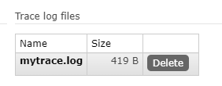

​	注意：开启消费追踪会损耗性能，一般只在生产环境中开启。


### RabbitMQ 应用问题

##### 消息可靠性保障

​	消息补偿属于消息可靠性保障，需求为确保消息 100% 发送成功。

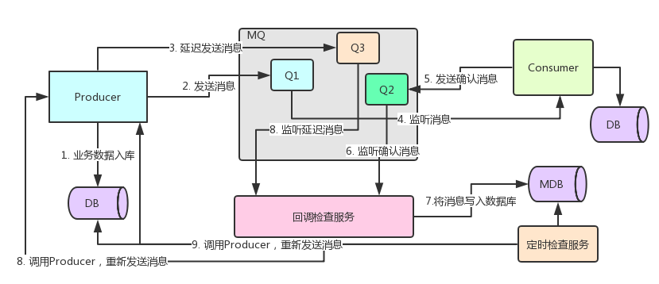

​	简单概括：生产者发送消息后过一段时间再发送一条延迟消息，消费者收到消息后会发送确认消息。回调检查服务会检查延迟消息是否有对应的消费者的确认消息（无则重发），定时检查服务是预防生产者两条消息都丢失的最后保险，原理为对比 MDB 与 生产者 DB 中的数据。


##### 消息幂等性保障

​	乐观锁解决方案属于消息幂等性保障。

​	幂等性指一次和多次请求某一个资源，对于资源本身应该具有同样的结果。也就是说，其任意多次执行对资源本身所产生的影响均与一次执行的影响相同。

​	在 MQ 中指，消费多条相同的消息，得到与消费该消息一次相同的结果。

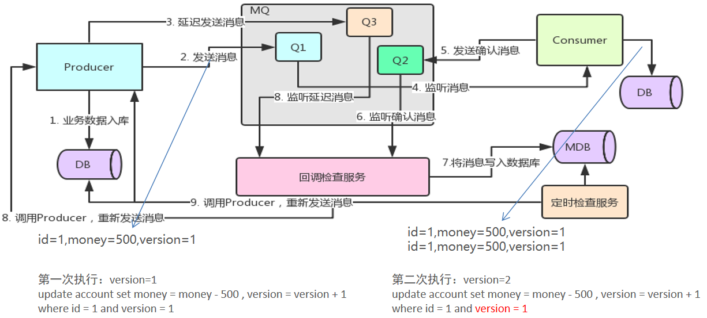


### RabbitMQ 集群搭建

​	摘要：实际生产应用中都会采用消息队列的集群方案，如果选择 RabbitMQ 那么有必要了解下它的集群方案原理

​	一般来说，如果只是为了学习 RabbitMQ 或者验证业务工程的正确性那么在本地环境或者测试环境上使用其单实例部署就可以了，但是出于 MQ 中间件本身的可靠性、并发性、吞吐量和消息堆积能力等问题的考虑，在生产环境上一般都会考虑使用 RabbitMQ 的集群方案。


##### 集群方案的原理

​	RabbitMQ 这款消息队列中间件产品本身是基于 Erlang 编写，Erlang 语言天生具备分布式特性（通过同步 Erlang 集群各节点的 magic cookie 来实现）。因此，RabbitMQ 天然支持 Clustering。这使得 RabbitMQ 本身不需要像 ActiveMQ、Kafka 那样通过 ZooKeeper 分别来实现 HA 方案和保存集群的元数据。集群是保证可靠性的一种方式，同时可以通过水平扩展以达到增加消息吞吐量能力的目的。


##### 单机多实例部署

​	由于某些因素的限制，有时候你不得不在一台机器上去搭建一个 rabbitmq 集群，这个有点类似 zookeeper 的单机版。真实生成环境还是要配成多机集群的。有关怎么配置多机集群的可以参考其他的资料，这里主要论述如何在单机中配置多个 rabbitmq 实例。

​	主要参考官方文档：https://www.rabbitmq.com/clustering.html

​	1）首先确保RabbitMQ运行没有问题

```shell
[root@super ~]# rabbitmqctl status
Status of node rabbit@super ...
[{pid,10232},
 {running_applications,
     [{rabbitmq_management,"RabbitMQ Management Console","3.6.5"},
      {rabbitmq_web_dispatch,"RabbitMQ Web Dispatcher","3.6.5"},
      {webmachine,"webmachine","1.10.3"},
      {mochiweb,"MochiMedia Web Server","2.13.1"},
      {rabbitmq_management_agent,"RabbitMQ Management Agent","3.6.5"},
      {rabbit,"RabbitMQ","3.6.5"},
      {os_mon,"CPO  CXC 138 46","2.4"},
      {syntax_tools,"Syntax tools","1.7"},
      {inets,"INETS  CXC 138 49","6.2"},
      {amqp_client,"RabbitMQ AMQP Client","3.6.5"},
      {rabbit_common,[],"3.6.5"},
      {ssl,"Erlang/OTP SSL application","7.3"},
      {public_key,"Public key infrastructure","1.1.1"},
      {asn1,"The Erlang ASN1 compiler version 4.0.2","4.0.2"},
      {ranch,"Socket acceptor pool for TCP protocols.","1.2.1"},
      {mnesia,"MNESIA  CXC 138 12","4.13.3"},
      {compiler,"ERTS  CXC 138 10","6.0.3"},
      {crypto,"CRYPTO","3.6.3"},
      {xmerl,"XML parser","1.3.10"},
      {sasl,"SASL  CXC 138 11","2.7"},
      {stdlib,"ERTS  CXC 138 10","2.8"},
      {kernel,"ERTS  CXC 138 10","4.2"}]},
 {os,{unix,linux}},
 {erlang_version,
     "Erlang/OTP 18 [erts-7.3] [source] [64-bit] [async-threads:64] [hipe] [kernel-poll:true]\n"},
 {memory,
     [{total,56066752},
      {connection_readers,0},
      {connection_writers,0},
      {connection_channels,0},
      {connection_other,2680},
      {queue_procs,268248},
      {queue_slave_procs,0},
      {plugins,1131936},
      {other_proc,18144280},
      {mnesia,125304},
      {mgmt_db,921312},
      {msg_index,69440},
      {other_ets,1413664},
      {binary,755736},
      {code,27824046},
      {atom,1000601},
      {other_system,4409505}]},
 {alarms,[]},
 {listeners,[{clustering,25672,"::"},{amqp,5672,"::"}]},
 {vm_memory_high_watermark,0.4},
 {vm_memory_limit,411294105},
 {disk_free_limit,50000000},
 {disk_free,13270233088},
 {file_descriptors,
     [{total_limit,924},{total_used,6},{sockets_limit,829},{sockets_used,0}]},
 {processes,[{limit,1048576},{used,262}]},
 {run_queue,0},
 {uptime,43651},
 {kernel,{net_ticktime,60}}]
```

​	

​	2）停止 rabbitmq 服务

```shell
[root@super sbin]# service rabbitmq-server stop
Stopping rabbitmq-server: rabbitmq-server.
```


​	3）启动第一个节点：（第一个节点 web 管理插件端口为默认的 15672）

```shell
[root@super sbin]# RABBITMQ_NODE_PORT=5673 RABBITMQ_NODENAME=rabbit1 rabbitmq-server start

              RabbitMQ 3.6.5. Copyright (C) 2007-2016 Pivotal Software, Inc.
  ##  ##      Licensed under the MPL.  See http://www.rabbitmq.com/
  ##  ##
  ##########  Logs: /var/log/rabbitmq/rabbit1.log
  ######  ##        /var/log/rabbitmq/rabbit1-sasl.log
  ##########
              Starting broker...
 completed with 6 plugins.
```


​	4）启动第二个节点：

> ​	web管理插件端口占用,所以还要指定其web插件占用的端口号。

```shell
[root@super ~]# RABBITMQ_NODE_PORT=5674 RABBITMQ_SERVER_START_ARGS="-rabbitmq_management listener [{port,15674}]" RABBITMQ_NODENAME=rabbit2 rabbitmq-server start

              RabbitMQ 3.6.5. Copyright (C) 2007-2016 Pivotal Software, Inc.
  ##  ##      Licensed under the MPL.  See http://www.rabbitmq.com/
  ##  ##
  ##########  Logs: /var/log/rabbitmq/rabbit2.log
  ######  ##        /var/log/rabbitmq/rabbit2-sasl.log
  ##########
              Starting broker...
 completed with 6 plugins.

```


​	5）rabbit1 操作作为主节点：

```shell
[root@super ~]# rabbitmqctl -n rabbit1 stop_app  
Stopping node rabbit1@super ...
[root@super ~]# rabbitmqctl -n rabbit1 reset	 
Resetting node rabbit1@super ...
[root@super ~]# rabbitmqctl -n rabbit1 start_app
Starting node rabbit1@super ...
[root@super ~]# 
```


​	6）rabbit2 操作为从节点：

```shell
[root@super ~]# rabbitmqctl -n rabbit2 stop_app
Stopping node rabbit2@super ...
[root@super ~]# rabbitmqctl -n rabbit2 reset
Resetting node rabbit2@super ...
[root@super ~]# rabbitmqctl -n rabbit2 join_cluster rabbit1@'ljh' ###''内是主机名换成自己的
Clustering node rabbit2@super with rabbit1@super ...
[root@super ~]# rabbitmqctl -n rabbit2 start_app
Starting node rabbit2@super ...

```


​	7）查看集群状态：

```
[root@super ~]# rabbitmqctl cluster_status -n rabbit1
Cluster status of node rabbit1@super ...
[{nodes,[{disc,[rabbit1@super,rabbit2@super]}]},
 {running_nodes,[rabbit2@super,rabbit1@super]},
 {cluster_name,<<"rabbit1@super">>},
 {partitions,[]},
 {alarms,[{rabbit2@super,[]},{rabbit1@super,[]}]}]
```


​	8）web监控：


​	9）附加：结束命令

```shell
rabbitmqctl -n rabbit1 stop
rabbitmqctl -n rabbit2 stop
```


##### 集群管理

​	**rabbitmqctl join_cluster {cluster_node} [–ram]**
​	将节点加入指定集群中。在这个命令执行前需要停止 RabbitMQ 应用并重置节点。

​	**rabbitmqctl cluster_status**
​	显示集群的状态。

​	**rabbitmqctl change_cluster_node_type {disc|ram}**
​	修改集群节点的类型。在这个命令执行前需要停止 RabbitMQ 应用。

​	**rabbitmqctl forget_cluster_node [–offline]**
​	将节点从集群中删除，允许离线执行。

​	**rabbitmqctl update_cluster_nodes {clusternode}**
​	在集群中的节点应用启动前咨询 clusternode 节点的最新信息，并更新相应的集群信息。这个和 join_cluster 不同，它不加入集群。考虑这样一种情况，节点 A 和节点 B 都在集群中，当节点 A 离线了，节点 C 又和节点 B组 成了一个集群，然后节点 B 又离开了集群，当 A 醒来的时候，它会尝试联系节点 B，但是这样会失败，因为节点 B 已经不在集群中了。

​	**rabbitmqctl cancel_sync_queue [-p vhost] {queue}**
​	取消队列 queue 同步镜像的操作。

​	**rabbitmqctl set_cluster_name {name}**
​	设置集群名称。集群名称在客户端连接时会通报给客户端。Federation 和 Shovel 插件也会有用到集群名称的地方。集群名称默认是集群中第一个节点的名称，通过这个命令可以重新设置。


##### RabbitMQ 镜像集群配置

> ​	上面已经完成 RabbitMQ 默认集群模式，但并不保证队列的高可用性，尽管交换机、绑定这些可以复制到集群里的任何一个节点，但是队列内容不会复制。虽然该模式解决一项目组节点压力，但队列节点宕机直接导致该队列无法应用，只能等待重启，所以要想在队列节点宕机或故障也能正常应用，就要复制队列内容到集群里的每个节点，必须要创建镜像队列。
>
> ​	镜像队列是基于普通的集群模式的，然后再添加一些策略，所以你还是得先配置普通集群，然后才能设置镜像队列，我们就以上面的集群接着做。


​	**设置的镜像队列可以通过开启的网页的管理端 Admin->Policies，也可以通过命令。**

> ​	rabbitmqctl set_policy my_ha "^" '{"ha-mode":"all"}'

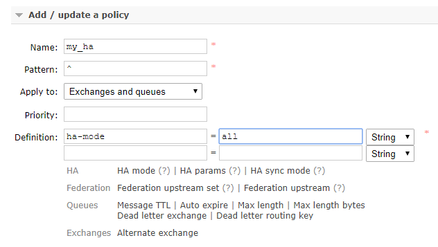

> - Name：策略名称
> - Pattern：匹配的规则，如果是匹配所有的队列，是 ^
> - Definition：使用 ha-mode 模式的 all，也就是同步所有匹配的队列，问号链接帮助文档


##### 负载均衡-HAProxy

​	HAProxy 提供高可用性、负载均衡以及基于 TCP 和 HTTP 应用的代理，支持虚拟主机，它是免费、快速并且可靠的一种解决方案,包括 Twitter，Reddit，StackOverflow，GitHub 在内的多家知名互联网公司在使用。HAProxy 实现了一种事件驱动、单一进程模型，此模型支持非常大的并发连接数。

​	1）安装 HAProxy

```shell
//1）下载依赖包
yum install gcc vim wget

//2）上传 haproxy 源码包 https://src.fedoraproject.org/repo/pkgs/haproxy/

//3）解压
tar -zxvf haproxy-2.4.4.tar.gz -C /usr/local

//4）进入目录、进行编译、安装
cd /usr/local/haproxy-2.4.4/
make TARGET=linux31 PREFIX=/usr/local/haproxy
make install PREFIX=/usr/local/haproxy
mkdir /etc/haproxy

//5）赋权
groupadd -r -g 149 haproxy
useradd -g haproxy -r -s /sbin/nologin -u 149 haproxy

//6）创建haproxy配置文件
vim /etc/haproxy/haproxy.cfg
```


​	2）配置 HAProxy

​		配置文件路径：/etc/haproxy/haproxy.cfg

```shell
#logging options
global
	log 127.0.0.1 local0 info
	maxconn 5120
	chroot /usr/local/haproxy
	uid 99
	gid 99
	daemon
	quiet
	nbproc 20
	pidfile /var/run/haproxy.pid

defaults
	log global
	
	mode tcp

	option tcplog
	option dontlognull
	retries 3
	option redispatch
	maxconn 2000
	timeout connect 5s
   
     timeout client 60s

     timeout server 15s	
#front-end IP for consumers and producters

listen rabbitmq_cluster
	bind 0.0.0.0:5672
	
	mode tcp
	#balance url_param userid
	#balance url_param session_id check_post 64
	#balance hdr(User-Agent)
	#balance hdr(host)
	#balance hdr(Host) use_domain_only
	#balance rdp-cookie
	#balance leastconn
	#balance source //ip
	
	balance roundrobin
	
        server node1 127.0.0.1:5673 check inter 5000 rise 2 fall 2
        server node2 127.0.0.1:5674 check inter 5000 rise 2 fall 2

listen stats
	bind 192.168.24.128:8100
	mode http
	option httplog
	stats enable
	stats uri /rabbitmq-stats
	stats refresh 5s
```


​	3）启动 HAproxy 负载

```shell
//依据配置文件启动 HAproxy
/usr/local/haproxy/sbin/haproxy -f /etc/haproxy/haproxy.cfg

//查看 HAproxy 进程状态
ps -ef | grep haproxy

访问如下地址对 mq 节点进行监控
http://192.168.24.128:8100/rabbitmq-stats
```

​	代码中访问 mq 集群地址，则变为访问 haproxy 地址：5672


# Spring Cloud

### 概述

​	微服务技术栈导图：

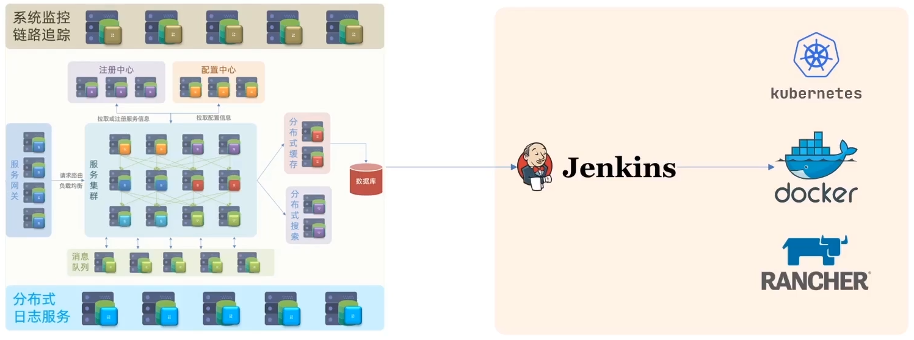


##### 服务架构演变

>  单体架构

​	将业务的所有功能集中在一个项目中开发，打成一个包部署。

优点：

* 架构简单
* 部署成本低

缺点：

* 耦合度搞


> 分布式架构

​	根据业务功能对系统进行拆分，每个业务模块作为独立项目开发，称为一个服务。

优点：

* 降低服务耦合
* 有利于服务扩展升级

分布式架构需要考虑的问题：

* 服务拆分粒度
* 服务集群地址如何维护
* 服务之间如何实现远程调用
* 服务健康状态如何感知


> 微服务

微服务是一种经过良好架构设计的分布式架构方案，微服务架构特征：

* 单一职责：微服务拆分粒度更小，每一个服务对应唯一的业务能力，做到单一职责，避免重复业务开发。
* 面向服务：微服务对外暴露业务接口
* 自治：团队独立、技术独立、数据独立、部署独立
* 隔离性强：服务调用做好隔离、容错、降级、避免出现级联问题


##### 微服务技术对比

|                | **Dubbo**           | **SpringCloud**          | **SpringCloudAlibaba**   |
| -------------- | ------------------- | ------------------------ | ------------------------ |
| 注册中心       | zookeeper、Redis    | Eureka、Consul           | Nacos、Eureka            |
| 服务远程调用   | Dubbo协议           | Feign（http协议）        | Dubbo、Feign             |
| 配置中心       | 无                  | SpringCloudConfig        | SpringCloudConfig、Nacos |
| 服务网关       | 无                  | SpringCloudGateway、Zuul | SpringCloudGateway、Zuul |
| 服务监控和保护 | dubbo-admin，功能弱 | Hystix                   | Sentinel                 |

​	

​	微服务企业应用场景：

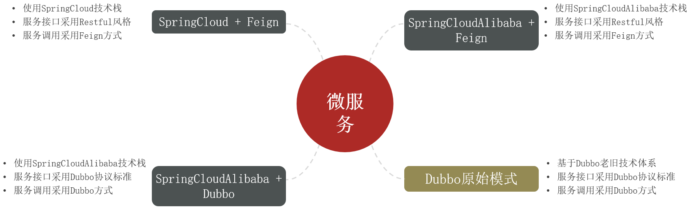


##### Spring Cloud 简介

​	SpringCloud 是目前国内使用最广泛的微服务框架。官网地址：https://spring.io/projects/spring-cloud。

​	SpringCloud 集成了各种微服务功能组件，并基于 SpringBoot 实现了这些组件的自动装配，从而提供了良好的开箱即用体验：

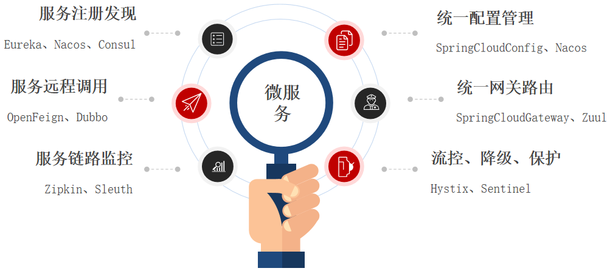


​	SpringCloud 与 SpringBoot 的版本兼容关系如下：

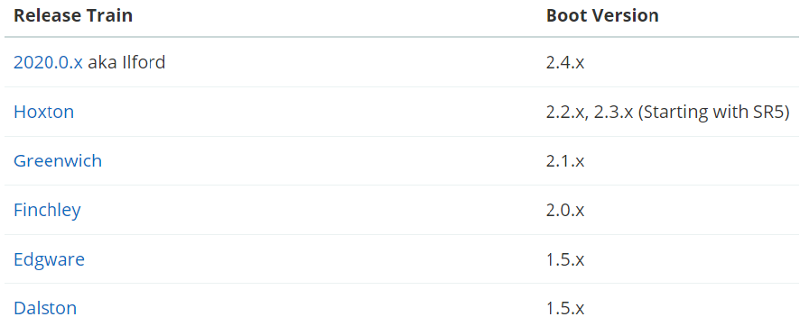

​	学习使用的版本是 Hoxton.SR10，因此对应的 SpringBoot 版本是 2.3.x 版本。


​	Spring Cloud 运行图：

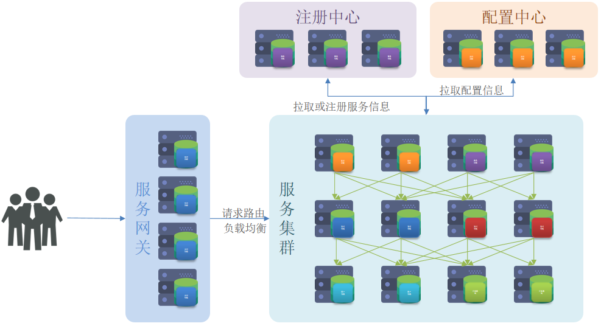


##### 服务拆分及远程调用

​	服务拆分注意事项：

​		1）单一职责：不同微服务，不要重复开发相同业务

​		2）数据独立：不要访问其它微服务的数据库

​		3）面向服务：将自己的业务暴露为接口，供其它微服务调用


​	本次案例：

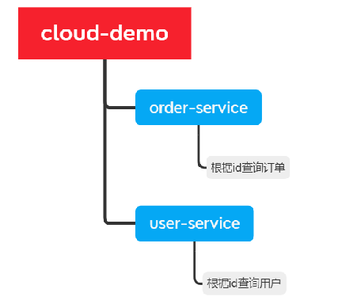


​	需求：根据订单id查询订单的同时，把订单所属的用户信息一起返回

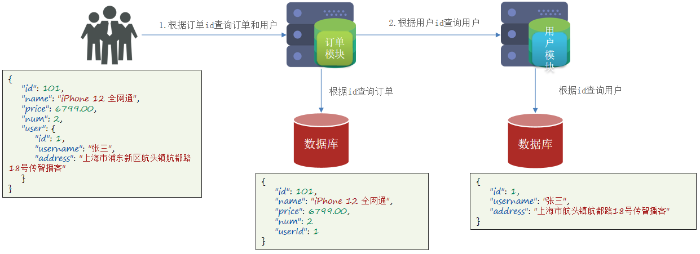


​	远程调用分析：

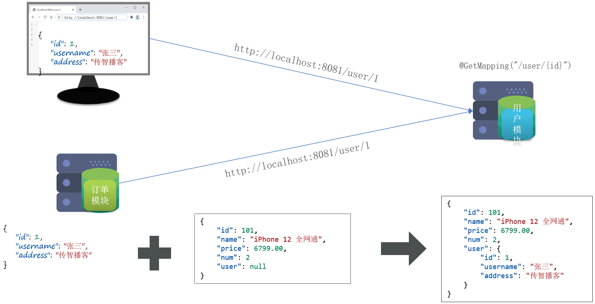


> 1）注册 RestTemplate，在 order-service 的 OrderApplication 中注册 RestTemplate

```java
@MapperScan("cn.itcast.order.mapper")
@SpringBootApplication
public class OrderApplication {

    public static void main(String[] args) {
        SpringApplication.run(OrderApplication.class, args);
    }

    @Bean
    public RestTemplate restTemplate() {
        return new RestTemplate();
    }

}
```


> 2）使用 RestTemplate 进行服务远程调用，修改 order-service 中的 OrderService 的 queryOrderById 方法

```java
@Service
public class OrderService {

    @Autowired
    private OrderMapper orderMapper;

    @Autowired
    private RestTemplate restTemplate;

    public Order queryOrderById(Long orderId) {
        // 1.查询订单
        Order order = orderMapper.findById(orderId);
        //2.利用 RestTemplate 发起 http 请求，查询用户
        String url = "http://localhost:8081/user/" + order.getUserId();
        User user = restTemplate.getForObject(url, User.class);
        //3.封装 user 到 Order
        order.setUser(user);
        // 4.返回
        return order;
    }
}
```


> 总结

微服务调用方式：

* 基于 RestTemplate 发起的 http 请求实现远程调用
* http 请求做远程调用与语言无关的调用，只要知道对方的 ip、端口、接口路径、请求参数即可。


### Eureka 服务注册中心

##### 服务调用

> 服务调用关系

​	服务提供者：一次业务中，被其它微服务调用的服务。（提供接口给其它微服务）

​	服务消费者：一次业务中，调用其它微服务的服务。（调用其它微服务提供的接口）

​	提供者与消费者角色其实是相对的，一个服务可以同时是服务提供者和服务消费者


>  服务调用中出现的问题

* 服务消费者该如何获取服务提供者的地址信息？
* 如果有多个服务提供者，消费者该如何选择？
* 消费者如何得知服务提供者的健康状态？

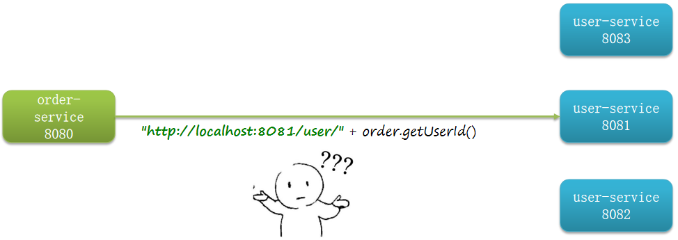


##### Eureka 作用

​	1.消费者该如何获取服务提供者具体信息？

​		1）服务提供者启动时向 Eureka 注册自己的信息

​		2）Eureka 保存这些信息

​		3）消费者根据服务名称向 Eureka 拉取提供者信息

​	2.如果有多个服务提供者，消费者该如何选择？

​		服务消费者利用负载均衡算法，从服务列表中挑选一个

​	3.消费者如何感知服务提供者健康状态？

​		1）服务提供者会每隔 30 秒向 EurekaServer 发送心跳请求，报告健康状态

​		2）Eureka 会更新记录服务列表信息，心跳不正常会被剔除

​		3）消费者就可以拉取到最新的信息

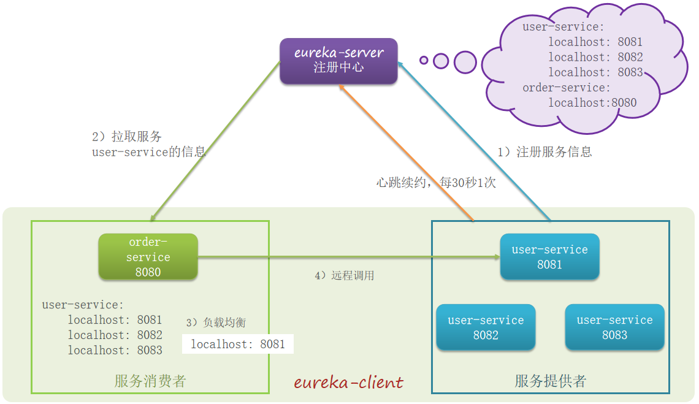


##### Eureka 服务器搭建

> 1.创建项目，引入spring-cloud-starter-netflix-eureka-server的依赖

```xml
<dependency>
    <groupId>org.springframework.cloud</groupId>
    <artifactId>spring-cloud-starter-netflix-eureka-server</artifactId>
</dependency>
```


> 编写启动类，添加 @EnableEurekaServer 注解

```java
@EnableEurekaServer
@SpringBootApplication
public class EurekaApplication {

    public static void main(String[] args) {
        SpringApplication.run(EurekaApplication.class);
    }

}
```


> 3.添加 application.yml 文件，编写下面的配置：

```yml
server:
  port: 10086
spring:
  application:
    name: eurekaserver  #Eureka 服务名称
eureka:
  client:
    service-url:  #Eureka 地址信息，Eureka 本身也是微服务，启动时会将自己也注册到 Eureka 上，方便集群中其他 Eureka 调用
      defaultZone: http://127.0.0.1:10086/eureka/
```


> 4.查看 Eureka 控制台：（下图为注册到 Eureka 的实例）

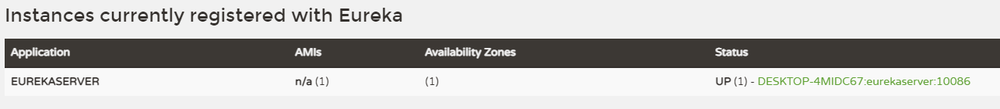


##### Eureka 服务注册

> 1.在 user-service 项目引入 spring-cloud-starter-netflix-eureka-client 的依赖

```xml
<dependency>
    <groupId>org.springframework.cloud</groupId>
    <artifactId>spring-cloud-starter-netflix-eureka-client</artifactId>
</dependency>
```


> 2.在 application.yml 文件，编写下面的配置：

```yml
spring:
    application:
      name: userservice
eureka:
  client:
    service-url:
      defaultZone: http://127.0.0.1:10086/eureka
```


> 另外，我们可以将 user-service 多次启动， 模拟多实例部署，但为了避免端口冲突，需要修改端口设置：

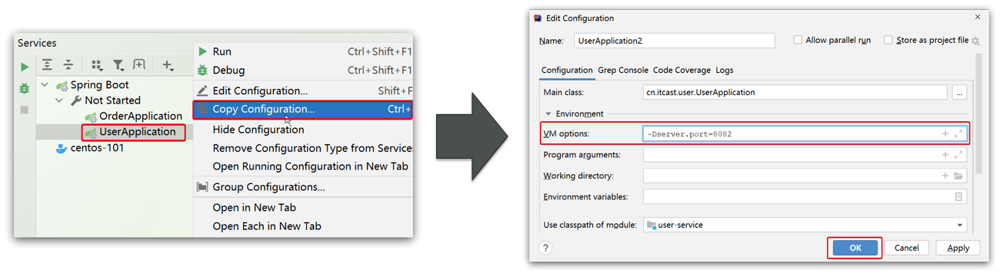


##### Eureka 服务发现（拉取）

​	服务拉取是基于服务名称获取服务列表，然后在对服务列表做负载均衡

> 1.修改 OrderService 的代码，修改访问的 url 路径，用服务名代替 ip、端口：

```java
String url = "http://userservice/user/" + order.getUserId();
```


> 在 order-service 项目的启动类 OrderApplication 中的 RestTemplate 添加负载均衡注解：

```java
@Bean
@LoadBalanced
public RestTemplate restTemplate() {
    return new RestTemplate();
}
```


> 小结

​	搭建 EurekaServer

​		1）引入 eureka-server 依赖
​		2）添加 @EnableEurekaServer 注解
​		3）在 application.yml 中配置 eureka 地址

​	服务注册

​		1）引入 eureka-client 依赖
​		2）在 application.yml 中配置 eureka 地址

​	服务发现

​		1）引入 eureka-client 依赖
​		2）在 application.yml 中配置 eureka 地址
​		3）给 RestTemplate 添加 @LoadBalanced 注解
​		4）用服务提供者的服务名称远程调用


### Ribbon 负载均衡

​	上一节中，我们添加了 @LoadBalanced 注解，即可实现负载均衡功能，这是什么原理呢？


##### 负载均衡原理

​	SpringCloud 底层其实是利用了一个名为 Ribbon 的组件，来实现负载均衡功能的。


​	发出的请求是http://userservice/user/1，如何变成http://localhost:8081？


##### 源码跟踪

​	为什么我们只输入了 service 名称就可以访问？之前还要获取 ip 和端口。

​	显然有人帮我们根据 service 名称，获取到了服务实例的 ip 和端口。它就是`LoadBalancerInterceptor`，这个类会在对 RestTemplate 的请求进行拦截，然后从 Eureka 根据服务 id 获取服务列表，随后利用负载均衡算法得到真实的服务地址信息，替换服务 id。

​	我们进行源码跟踪：

> 1）LoadBalancerIntercepor


​	可以看到这里的 intercept 方法，拦截了用户的 HttpRequest 请求，然后做了几件事：

- `request.getURI()`：获取请求 uri，本例中就是 http://user-service/user/8
- `originalUri.getHost()`：获取 uri 路径的主机名，其实就是服务 id，`user-service`
- `this.loadBalancer.execute()`：处理服务 id，和用户请求。

​	这里的`this.loadBalancer`是`LoadBalancerClient`类型，我们继续跟入。


> 2）LoadBalancerClient

​	继续跟入 execute 方法：


​	代码是这样的：

- getLoadBalancer(serviceId)：根据服务 id 获取 ILoadBalancer，而 ILoadBalancer 会拿着服务 id 去 eureka 中获取服务列表并保存起来。
- getServer(loadBalancer)：利用内置的负载均衡算法，从服务列表中选择一个。本例中，可以看到获取了 8082 端口的服务


​	放行后，再次访问并跟踪，发现获取的是8081：

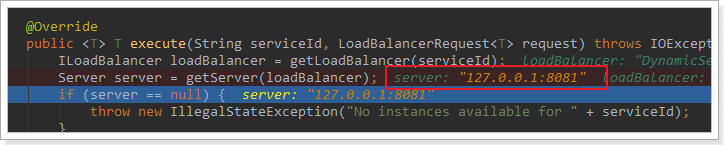

​	果然实现了负载均衡。


> 3）负载均衡策略 IRule

​	在刚才的代码中，可以看到获取服务使通过一个`getServer`方法来做负载均衡:


​	继续跟入：


​	继续跟踪源码 chooseServer 方法，发现这么一段代码：

 

​	查看这个 rule ：


这里的rule默认值是一个`RoundRobinRule`，看类的介绍：

 

​	就是轮询的意思。到这里，整个负载均衡的流程就清楚了。


> 总结

​	SpringCloudRibbon 的底层采用了一个拦截器，拦截了 RestTemplate 发出的请求，对地址做了修改。用一幅图来总结一下：


​	基本流程如下：

- 拦截我们的 RestTemplate 请求 http://userservice/user/1
- RibbonLoadBalancerClient 会从请求 url 中获取服务名称，也就是 user-service
- DynamicServerListLoadBalancer 根据 user-service 到 eureka 拉取服务列表
- eureka 返回列表，localhost:8081、localhost:8082
- IRule 利用内置负载均衡规则，从列表中选择一个，例如 localhost:8081
- RibbonLoadBalancerClient 修改请求地址，用 localhost:8081 替代 userservice，得到 http://localhost:8081/user/1，发起真实请求


##### 负载均衡策略

​	负载均衡的规则都定义在 IRule 接口中，而 IRule 有很多不同的实现类：


​	不同规则的含义如下：

| **内置负载均衡规则类**    | **规则描述**                                                 |
| ------------------------- | ------------------------------------------------------------ |
| RoundRobinRule            | 简单轮询服务列表来选择服务器。它是Ribbon默认的负载均衡规则。 |
| AvailabilityFilteringRule | 对以下两种服务器进行忽略：   （1）在默认情况下，这台服务器如果3次连接失败，这台服务器就会被设置为“短路”状态。短路状态将持续30秒，如果再次连接失败，短路的持续时间就会几何级地增加。  （2）并发数过高的服务器。如果一个服务器的并发连接数过高，配置了AvailabilityFilteringRule规则的客户端也会将其忽略。并发连接数的上限，可以由客户端的<clientName>.<clientConfigNameSpace>.ActiveConnectionsLimit属性进行配置。 |
| WeightedResponseTimeRule  | 为每一个服务器赋予一个权重值。服务器响应时间越长，这个服务器的权重就越小。这个规则会随机选择服务器，这个权重值会影响服务器的选择。 |
| **ZoneAvoidanceRule**     | 以区域可用的服务器为基础进行服务器的选择。使用Zone对服务器进行分类，这个Zone可以理解为一个机房、一个机架等。而后再对Zone内的多个服务做轮询。 |
| BestAvailableRule         | 忽略那些短路的服务器，并选择并发数较低的服务器。             |
| RandomRule                | 随机选择一个可用的服务器。                                   |
| RetryRule                 | 重试机制的选择逻辑                                           |

​	默认的实现就是 ZoneAvoidanceRule，是一种轮询方案


##### 自定义负载均衡策略

​	通过定义 IRule 实现可以修改负载均衡规则，有两种方式：

> 1）代码方式：在 order-service 中的 OrderApplication 类中，定义一个新的 IRule：

```java
@Bean
public IRule randomRule(){	//此方法为全局方式
    return new RandomRule();
}
```


> 2）配置文件方式：在 order-service 的 application.yml 文件中，添加新的配置也可以修改规则：

```yaml
userservice: # 给某个微服务配置负载均衡规则，这里是userservice服务
  ribbon:
    NFLoadBalancerRuleClassName: com.netflix.loadbalancer.RandomRule # 负载均衡规则
```

> **注意**，一般用默认的负载均衡规则，不做修改。


##### 饥饿加载

​	Ribbon 默认是采用懒加载，即第一次访问时才会去创建 LoadBalanceClient，请求时间会很长。

​	而饥饿加载则会在项目启动时创建，降低第一次访问的耗时，通过下面配置开启饥饿加载：

```yaml
ribbon:
  eager-load:
    enabled: true #开启饥饿加载
    clients:  #指定饥饿加载的服务名称（数组）
      - userservice
```


> 总结

​	1.Ribbon 负载均衡规则

​		1）规则接口是 IRule
​		2）默认实现是 ZoneAvoidanceRule，根据 zone 选择服务列表，然后轮询

​	2.负载均衡自定义方式

​		1）代码方式：配置灵活，但修改时需要重新打包发布
​		2）配置方式：直观，方便，无需重新打包发布，但是无法做全局配置

​	3.饥饿加载

​		1）开启饥饿加载
​		2）指定饥饿加载的微服务名称


### Nacos 服务注册中心

​	国内公司一般都推崇阿里巴巴的技术，比如注册中心，SpringCloudAlibaba 也推出了一个名为 Nacos 的注册中心，现在是 [SpringCloud](https://spring.io/projects/spring-cloud) 中的一个组件。相比 [Eureka](https://github.com/Netflix/eureka) 功能更加丰富，在国内受欢迎程度较高。


##### Nacos安装指南

> 1.Windows安装

​	开发阶段采用单机安装即可。


1）下载安装包

​	在 Nacos 的 GitHub 页面，提供有下载链接，可以下载编译好的 Nacos 服务端或者源代码：

​	GitHub 主页：https://github.com/alibaba/nacos

​	GitHub 的 Release 下载页：https://github.com/alibaba/nacos/releases

​	如图：


​	本课程采用 1.4.1 版本的 Nacos，课前资料已经准备了安装包：

​	windows版本使用`nacos-server-1.4.1.zip`包即可。


2）解压

​	将这个包解压到任意非中文目录下，如图：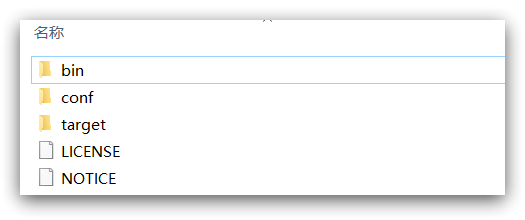

​	目录说明：

- bin：启动脚本
- conf：配置文件


3）端口配置

​	Nacos的默认端口是 8848，如果你电脑上的其它进程占用了 8848 端口，请先尝试关闭该进程。

​	**如果无法关闭占用 8848 端口的进程**，也可以进入 nacos 的 conf 目录，修改配置文件中的端口：

​	修改其中的内容：


4）启动

​	启动非常简单，进入 bin 目录，结构如下：


​	然后执行命令即可：

- windows命令：

  ```
  startup.cmd -m standalone
  ```


  执行后的效果如图：

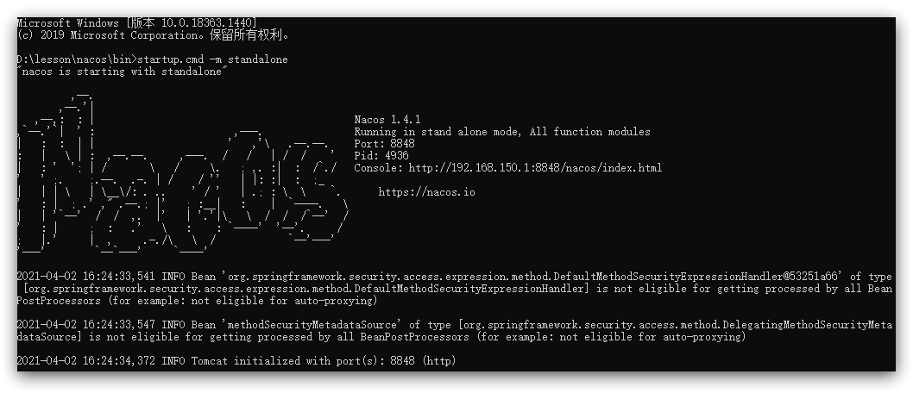


5）访问

​	在浏览器输入地址：http://127.0.0.1:8848/nacos即可：

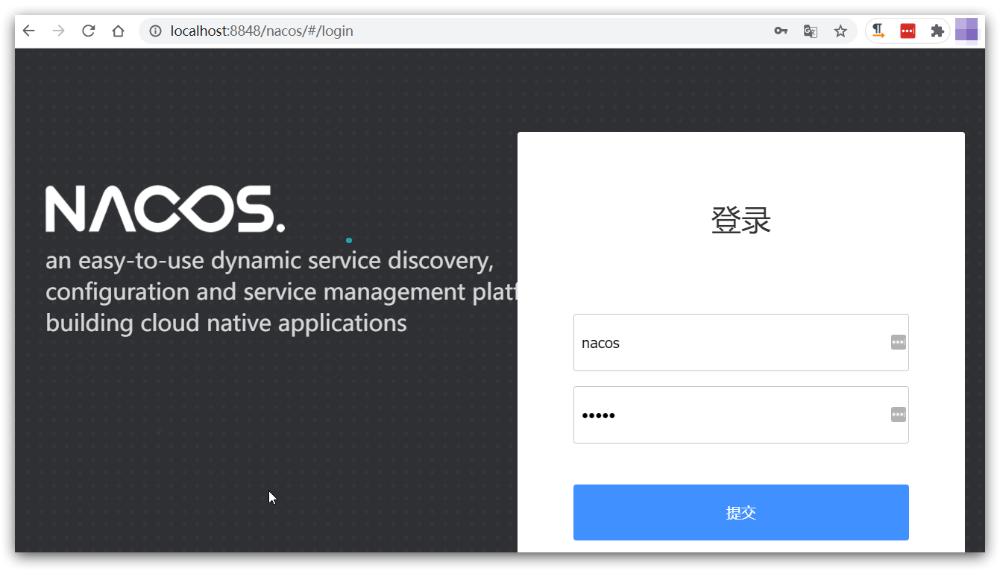

​	默认的账号和密码都是 nacos，进入后：


> 2.Linux安装

​	Linux 或者 Mac 安装方式与 Windows 类似。

1）安装 JDK

​	Nacos 依赖于 JDK 运行，索引 Linux 上也需要安装 JDK 才行。

​	上传 jdk 安装包：

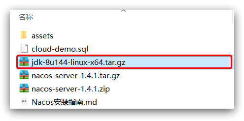

​	上传到某个目录，例如：`/usr/local/`

​	然后解压缩：

```sh
tar -xvf jdk-8u144-linux-x64.tar.gz
```

​	然后重命名为 java

​	配置环境变量：

```sh
export JAVA_HOME=/usr/local/java
export PATH=$PATH:$JAVA_HOME/bin
```

​	设置环境变量：

```sh
source /etc/profile
```


2）上传安装包

​	如图：


​	也可以直接使用课前资料中的 tar.gz：


​	上传到 Linux 服务器的某个目录，例如`/usr/local/src`目录下：


3）解压

​	命令解压缩安装包：

```sh
tar -xvf nacos-server-1.4.1.tar.gz
```

​	然后删除安装包：

```sh
rm -rf nacos-server-1.4.1.tar.gz
```

​	目录中最终样式：

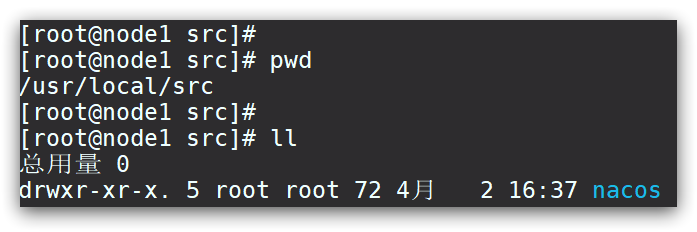

​	目录内部：


4）端口配置

​	与 windows 中类似


5）启动

​	在 nacos/bin 目录中，输入命令启动 Nacos：

```sh
sh startup.sh -m standalone
```


> 3.Nacos 的依赖

​	父工程：

```xml
<dependency>
    <groupId>com.alibaba.cloud</groupId>
    <artifactId>spring-cloud-alibaba-dependencies</artifactId>
    <version>2.2.5.RELEASE</version>
    <type>pom</type>
    <scope>import</scope>
</dependency>
```


​	客户端：

```xml
<!-- nacos客户端依赖包 -->
<dependency>
    <groupId>com.alibaba.cloud</groupId>
    <artifactId>spring-cloud-starter-alibaba-nacos-discovery</artifactId>
</dependency>
```


##### 服务注册到 nacos

​	Nacos 是 SpringCloudAlibaba 的组件，而 SpringCloudAlibaba 也遵循 SpringCloud 中定义的服务注册、服务发现规范。因此使用 Nacos 和使用 Eureka 对于微服务来说，并没有太大区别。

​	主要差异在于：

- 依赖不同
- 服务地址不同


> 1）引入依赖

​	在 cloud-demo 父工程的 pom 文件中的 `<dependencyManagement>` 中引入 SpringCloudAlibaba 的依赖：

```xml
<dependency>
    <groupId>com.alibaba.cloud</groupId>
    <artifactId>spring-cloud-alibaba-dependencies</artifactId>
    <version>2.2.6.RELEASE</version>
    <type>pom</type>
    <scope>import</scope>
</dependency>
```

​	然后在 user-service 和 order-service 中的 pom 文件中引入 nacos-discovery 依赖：

```xml
<dependency>
    <groupId>com.alibaba.cloud</groupId>
    <artifactId>spring-cloud-starter-alibaba-nacos-discovery</artifactId>
</dependency>
```

​	**注意**：不要忘了注释掉eureka的依赖。


> 2）配置 nacos 地址

​	在 user-service 和 order-service 的 application.yml 中添加 nacos 地址：

```yaml
spring:
  cloud:
    nacos:
      server-addr: localhost:8848
```

​	**注意**：不要忘了注释掉 eureka 的地址


> 3）重启

​	重启微服务后，登录 nacos 管理页面，可以看到微服务信息：


> 总结

​	1.Nacos 服务搭建

​		1）下载安装包
​		2）解压
​		3）在 bin 目录下运行指令：startup.cmd -m standalone

​	2.Nacos 服务注册或发现

​		1）引入 nacos.discovery 依赖
​		2）配置 nacos 地址 spring.cloud.nacos.server-addr


##### 服务分级存储模型

​	一个**服务**可以有多个**实例**，例如我们的 user-service，可以有:

- 127.0.0.1:8081
- 127.0.0.1:8082
- 127.0.0.1:8083

​	假如这些实例分布于全国各地的不同机房，例如：

- 127.0.0.1:8081，在上海机房
- 127.0.0.1:8082，在上海机房
- 127.0.0.1:8083，在杭州机房

​	Nacos 就将同一机房内的实例 划分为一个**集群**。

​	也就是说，user-service 是服务，一个服务可以包含多个集群，如杭州、上海，每个集群下可以有多个实例，形成分级模型，如图：


​	微服务互相访问时，应该尽可能访问同集群实例，因为本地访问速度更快。当本集群内不可用时，才访问其它集群。例如：

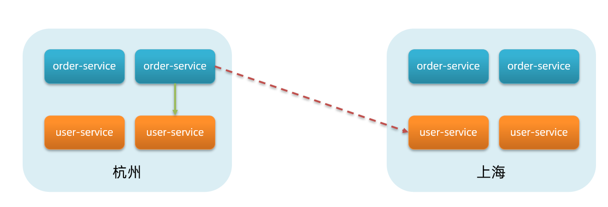

​	杭州机房内的 order-service 应该优先访问同机房的 user-service。


> 给 user-service 配置集群：

​	修改 user-service 的 application.yml 文件，添加集群配置：

```yaml
spring:
  cloud:
    nacos:
      server-addr: localhost:8848
      discovery:
        cluster-name: HZ # 集群名称
```

​	重启两个 user-service 实例后，我们可以在 nacos 控制台看到下面结果：


​	

​	我们再次复制一个 user-service 启动配置，添加属性：

```sh
-Dserver.port=8083 -Dspring.cloud.nacos.discovery.cluster-name=SH
```

​	配置如图所示：


​	启动 UserApplication3 后再次查看 nacos 控制台：


> 总结

​	1.Nacos 服务分级存储模型

​		1）一级是服务，例如 userservice
​		2）二级是集群，例如杭州或上海
​		3）三级是实例，例如杭州机房的某台部署了 userservice 的服务器

​	2.如何设置实例的集群属性

​		修改 application.yml 文件，添加 spring.cloud.nacos.discovery.cluster-name 属性即可


##### 同集群优先的负载均衡

​	默认的`ZoneAvoidanceRule`并不能实现根据同集群优先来实现负载均衡。

​	因此 Nacos 中提供了一个`NacosRule`的实现，可以优先从同集群中挑选实例。

> 1）给 order-service 配置集群信息

​	修改 order-service 的 application.yml 文件，添加集群配置：

```sh
spring:
  cloud:
    nacos:
      server-addr: localhost:8848
      discovery:
        cluster-name: HZ # 集群名称
```


> 2）修改负载均衡规则

​	修改 order-service 的 application.yml 文件，修改负载均衡规则：

```yaml
userservice:
  ribbon:
    NFLoadBalancerRuleClassName: com.alibaba.cloud.nacos.ribbon.NacosRule # 负载均衡规则 
```


##### 权重配置

​	实际部署中会出现这样的场景：

​	服务器设备性能有差异，部分实例所在机器性能较好，另一些较差，我们希望性能好的机器承担更多的用户请求。但默认情况下 NacosRule 是同集群内随机挑选，不会考虑机器的性能问题。因此，Nacos 提供了权重配置来控制访问频率，权重越大则访问频率越高。

​	在 nacos 控制台，找到 user-service 的实例列表，点击编辑，即可修改权重：


​	在弹出的编辑窗口，修改权重：

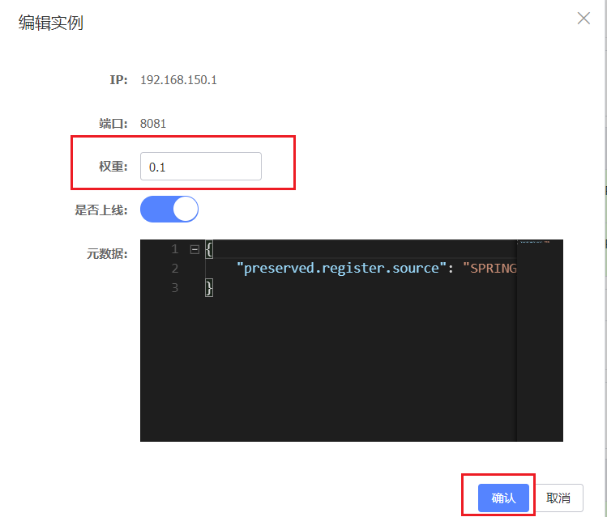

> **注意**：如果权重修改为0，则该实例永远不会被访问


##### 环境隔离

​	Nacos 提供了 namespace 来实现环境隔离功能。

- nacos 中可以有多个 namespace
- namespace 下可以有 group、service 等
- 不同 namespace 之间相互隔离，例如不同 namespace 的服务互相不可见


> 创建 namespace

​	默认情况下，所有 service、data、group 都在同一个 namespace，名为 public：


​	可以点击页面新增按钮，添加一个 namespace：


​	然后，填写表单：


​	就能在页面看到一个新的 namespace：


> 给微服务配置 namespace

​	给微服务配置 namespace 只能通过修改配置来实现。

​	例如，修改 order-service 的 application.yml 文件：

```yaml
spring:
  cloud:
    nacos:
      server-addr: localhost:8848
      discovery:
        cluster-name: HZ
        namespace: 492a7d5d-237b-46a1-a99a-fa8e98e4b0f9 # 命名空间，填ID
```


​	重启 order-service 后，访问控制台，可以看到下面的结果：

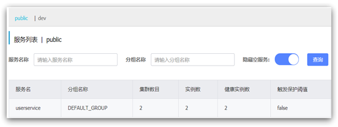


​	此时访问 order-service，因为 namespace 不同，会导致找不到 userservice，控制台会报错：


##### Nacos 与 Eureka 的区别

​	Nacos 的服务实例分为两种l类型：

- 临时实例：如果实例宕机超过一定时间，会从服务列表剔除，默认的类型。

- 非临时实例：如果实例宕机，不会从服务列表剔除，也可以叫永久实例。


​	配置一个服务实例为永久实例：

```yaml
spring:
  cloud:
    nacos:
      discovery:
        ephemeral: false # 设置为非临时实例
```


​	Nacos 和 Eureka 整体结构类似，服务注册、服务拉取、心跳等待，但是也存在一些差异：


- Nacos 与 eureka 的共同点
  - 都支持服务注册和服务拉取
  - 都支持服务提供者心跳方式做健康检测

- Nacos 与 Eureka 的区别
  - Nacos 支持服务端主动检测提供者状态：临时实例采用心跳模式，非临时实例采用主动检测模式
  - 临时实例心跳不正常会被剔除，非临时实例则不会被剔除
  - Nacos 支持服务列表变更的消息推送模式，服务列表更新更及时
  - Nacos 集群默认采用 AP 方式，当集群中存在非临时实例时，采用 CP 模式；Eureka 采用 AP 方式


### Nacos 配置中心

​	Nacos 除了可以做注册中心，同样可以做配置管理来使用。


##### 统一配置管理

​	当微服务部署的实例越来越多，达到数十、数百时，逐个修改微服务配置就会让人抓狂，而且很容易出错。我们需要一种统一配置管理方案，可以集中管理所有实例的配置。


​	Nacos 一方面可以将配置集中管理，另一方可以在配置变更时，及时通知微服务，实现配置的热更新。


> 在 nacos 中添加配置文件


​	然后在弹出的表单中，填写配置信息：


> 注意：项目的核心配置，需要热更新的配置才有放到 nacos 管理的必要。基本不会变更的一些配置还是保存在微服务本地比较好。


##### 从微服务拉取配置

​	微服务要拉取 nacos 中管理的配置，并且与本地的 application.yml 配置合并，才能完成项目启动。

​	但如果尚未读取 application.yml，又如何得知 nacos 地址呢？

​	因此 spring 引入了一种新的配置文件：bootstrap.yaml 文件，会在 application.yml 之前被读取，流程如下：


> 1）引入 nacos-config 依赖

​	首先，在 user-service 服务中，引入 nacos-config 的客户端依赖：

```xml
<!--nacos配置管理依赖-->
<dependency>
    <groupId>com.alibaba.cloud</groupId>
    <artifactId>spring-cloud-starter-alibaba-nacos-config</artifactId>
</dependency>
```

> 2）添加 bootstrap.yaml

​	然后，在 user-service 中添加一个 bootstrap.yaml 文件，内容如下：

```yaml
spring:
  application:
    name: userservice # 服务名称
  profiles:
    active: dev #开发环境，这里是dev 
  cloud:
    nacos:
      server-addr: localhost:8848 # Nacos地址
      config:
        file-extension: yaml # 文件后缀名
```

​	这里会根据 spring.cloud.nacos.server-addr 获取 nacos 地址，再根据

`${spring.application.name}-${spring.profiles.active}.${spring.cloud.nacos.config.file-extension}`作为文件id，来读取配置。

​	本例中，就是去读取`userservice-dev.yaml`：


> 3）读取 nacos 配置

​	在 user-service 中的 UserController 中添加业务逻辑，读取 pattern.dateformat 配置：


​	完整代码：

```java
package cn.itcast.user.web;

import cn.itcast.user.pojo.User;
import cn.itcast.user.service.UserService;
import lombok.extern.slf4j.Slf4j;
import org.springframework.beans.factory.annotation.Autowired;
import org.springframework.beans.factory.annotation.Value;
import org.springframework.web.bind.annotation.*;

import java.time.LocalDateTime;
import java.time.format.DateTimeFormatter;

@Slf4j
@RestController
@RequestMapping("/user")
public class UserController {

    @Autowired
    private UserService userService;

    @Value("${pattern.dateformat}")
    private String dateformat;
    
    @GetMapping("now")
    public String now(){
        return LocalDateTime.now().format(DateTimeFormatter.ofPattern(dateformat));
    }
    // ...略
}
```


​	在页面访问，可以看到效果：


##### 配置热更新

​	我们最终的目的，是修改 nacos 中的配置后，微服务中无需重启即可让配置生效，也就是**配置热更新**。要实现配置热更新，可以使用两种方式：

> 方式一

​	在 @Value 注入的变量所在类上添加注解 @RefreshScope：


> 方式二（推荐）

​	使用 @ConfigurationProperties 注解代替 @Value 注解。

​	在 user-service 服务中，添加一个类，读取 patterrn.dateformat 属性：

```java
package cn.itcast.user.config;

import lombok.Data;
import org.springframework.boot.context.properties.ConfigurationProperties;
import org.springframework.stereotype.Component;

@Component
@Data
@ConfigurationProperties(prefix = "pattern")
public class PatternProperties {
    private String dateformat;
}
```


​	在 UserController 中使用这个类代替 @Value：


##### 多环境配置共享

​	其实微服务启动时，会去 nacos 读取多个配置文件，例如：

- `[spring.application.name]-[spring.profiles.active].yaml`，例如：userservice-dev.yaml

- `[spring.application.name].yaml`，例如：userservice.yaml

​	而`[spring.application.name].yaml`不包含环境，因此可以被多个环境共享。


> 1）添加一个环境共享配置

​	在 nacos 中添加一个 userservice.yaml 文件：


> 2）在 user-service 中读取共享配置

在 user-service 服务中，修改 PatternProperties 类，读取新添加的属性：


​	在 user-service 服务中，修改 UserController，添加一个方法：


> 3）运行两个 UserApplication，使用不同的 profile

修改 UserApplication2 这个启动项，改变其 profile 值：


​	这样，UserApplication(8081) 使用的 profile 是 dev，UserApplication2(8082) 使用的 profile 是 test。启动 UserApplication 和 UserApplication2

​	访问http://localhost:8081/user/prop，结果：


​	访问http://localhost:8082/user/prop，结果：


​	可以看出来，不管是 dev，还是 test 环境，都读取到了 envSharedValue 这个属性的值。


> 4）配置共享的优先级

当 nacos、服务本地同时出现相同属性时，优先级有高低之分：


##### Nacos集群搭建

> 1.集群结构图

​	官方给出的 Nacos 集群图：


​	其中包含 3 个 nacos 节点，然后一个负载均衡器代理 3 个 Nacos。这里负载均衡器可以使用 nginx。我们计划的集群结构：


三个 nacos 节点的地址：

| 节点   | ip            | port |
| ------ | ------------- | ---- |
| nacos1 | 192.168.150.1 | 8845 |
| nacos2 | 192.168.150.1 | 8846 |
| nacos3 | 192.168.150.1 | 8847 |


> 2.搭建集群

​	搭建集群的基本步骤：

- 搭建数据库，初始化数据库表结构
- 下载 nacos 安装包
- 配置 nacos
- 启动 nacos 集群
- nginx 反向代理


> 2.1.初始化数据库

​	Nacos 默认数据存储在内嵌数据库 Derby 中，不属于生产可用的数据库。

​	官方推荐的最佳实践是使用带有主从的高可用数据库集群，主从模式的高可用数据库可以参考**传智教育**的后续高手课程。这里以单点的数据库为例来讲解。

​	首先新建一个数据库，命名为 nacos，而后导入下面的 SQL：

```sql
CREATE TABLE `config_info` (
  `id` bigint(20) NOT NULL AUTO_INCREMENT COMMENT 'id',
  `data_id` varchar(255) NOT NULL COMMENT 'data_id',
  `group_id` varchar(255) DEFAULT NULL,
  `content` longtext NOT NULL COMMENT 'content',
  `md5` varchar(32) DEFAULT NULL COMMENT 'md5',
  `gmt_create` datetime NOT NULL DEFAULT CURRENT_TIMESTAMP COMMENT '创建时间',
  `gmt_modified` datetime NOT NULL DEFAULT CURRENT_TIMESTAMP COMMENT '修改时间',
  `src_user` text COMMENT 'source user',
  `src_ip` varchar(50) DEFAULT NULL COMMENT 'source ip',
  `app_name` varchar(128) DEFAULT NULL,
  `tenant_id` varchar(128) DEFAULT '' COMMENT '租户字段',
  `c_desc` varchar(256) DEFAULT NULL,
  `c_use` varchar(64) DEFAULT NULL,
  `effect` varchar(64) DEFAULT NULL,
  `type` varchar(64) DEFAULT NULL,
  `c_schema` text,
  PRIMARY KEY (`id`),
  UNIQUE KEY `uk_configinfo_datagrouptenant` (`data_id`,`group_id`,`tenant_id`)
) ENGINE=InnoDB DEFAULT CHARSET=utf8 COLLATE=utf8_bin COMMENT='config_info';

/******************************************/
/*   数据库全名 = nacos_config   */
/*   表名称 = config_info_aggr   */
/******************************************/
CREATE TABLE `config_info_aggr` (
  `id` bigint(20) NOT NULL AUTO_INCREMENT COMMENT 'id',
  `data_id` varchar(255) NOT NULL COMMENT 'data_id',
  `group_id` varchar(255) NOT NULL COMMENT 'group_id',
  `datum_id` varchar(255) NOT NULL COMMENT 'datum_id',
  `content` longtext NOT NULL COMMENT '内容',
  `gmt_modified` datetime NOT NULL COMMENT '修改时间',
  `app_name` varchar(128) DEFAULT NULL,
  `tenant_id` varchar(128) DEFAULT '' COMMENT '租户字段',
  PRIMARY KEY (`id`),
  UNIQUE KEY `uk_configinfoaggr_datagrouptenantdatum` (`data_id`,`group_id`,`tenant_id`,`datum_id`)
) ENGINE=InnoDB DEFAULT CHARSET=utf8 COLLATE=utf8_bin COMMENT='增加租户字段';


/******************************************/
/*   数据库全名 = nacos_config   */
/*   表名称 = config_info_beta   */
/******************************************/
CREATE TABLE `config_info_beta` (
  `id` bigint(20) NOT NULL AUTO_INCREMENT COMMENT 'id',
  `data_id` varchar(255) NOT NULL COMMENT 'data_id',
  `group_id` varchar(128) NOT NULL COMMENT 'group_id',
  `app_name` varchar(128) DEFAULT NULL COMMENT 'app_name',
  `content` longtext NOT NULL COMMENT 'content',
  `beta_ips` varchar(1024) DEFAULT NULL COMMENT 'betaIps',
  `md5` varchar(32) DEFAULT NULL COMMENT 'md5',
  `gmt_create` datetime NOT NULL DEFAULT CURRENT_TIMESTAMP COMMENT '创建时间',
  `gmt_modified` datetime NOT NULL DEFAULT CURRENT_TIMESTAMP COMMENT '修改时间',
  `src_user` text COMMENT 'source user',
  `src_ip` varchar(50) DEFAULT NULL COMMENT 'source ip',
  `tenant_id` varchar(128) DEFAULT '' COMMENT '租户字段',
  PRIMARY KEY (`id`),
  UNIQUE KEY `uk_configinfobeta_datagrouptenant` (`data_id`,`group_id`,`tenant_id`)
) ENGINE=InnoDB DEFAULT CHARSET=utf8 COLLATE=utf8_bin COMMENT='config_info_beta';

/******************************************/
/*   数据库全名 = nacos_config   */
/*   表名称 = config_info_tag   */
/******************************************/
CREATE TABLE `config_info_tag` (
  `id` bigint(20) NOT NULL AUTO_INCREMENT COMMENT 'id',
  `data_id` varchar(255) NOT NULL COMMENT 'data_id',
  `group_id` varchar(128) NOT NULL COMMENT 'group_id',
  `tenant_id` varchar(128) DEFAULT '' COMMENT 'tenant_id',
  `tag_id` varchar(128) NOT NULL COMMENT 'tag_id',
  `app_name` varchar(128) DEFAULT NULL COMMENT 'app_name',
  `content` longtext NOT NULL COMMENT 'content',
  `md5` varchar(32) DEFAULT NULL COMMENT 'md5',
  `gmt_create` datetime NOT NULL DEFAULT CURRENT_TIMESTAMP COMMENT '创建时间',
  `gmt_modified` datetime NOT NULL DEFAULT CURRENT_TIMESTAMP COMMENT '修改时间',
  `src_user` text COMMENT 'source user',
  `src_ip` varchar(50) DEFAULT NULL COMMENT 'source ip',
  PRIMARY KEY (`id`),
  UNIQUE KEY `uk_configinfotag_datagrouptenanttag` (`data_id`,`group_id`,`tenant_id`,`tag_id`)
) ENGINE=InnoDB DEFAULT CHARSET=utf8 COLLATE=utf8_bin COMMENT='config_info_tag';

/******************************************/
/*   数据库全名 = nacos_config   */
/*   表名称 = config_tags_relation   */
/******************************************/
CREATE TABLE `config_tags_relation` (
  `id` bigint(20) NOT NULL COMMENT 'id',
  `tag_name` varchar(128) NOT NULL COMMENT 'tag_name',
  `tag_type` varchar(64) DEFAULT NULL COMMENT 'tag_type',
  `data_id` varchar(255) NOT NULL COMMENT 'data_id',
  `group_id` varchar(128) NOT NULL COMMENT 'group_id',
  `tenant_id` varchar(128) DEFAULT '' COMMENT 'tenant_id',
  `nid` bigint(20) NOT NULL AUTO_INCREMENT,
  PRIMARY KEY (`nid`),
  UNIQUE KEY `uk_configtagrelation_configidtag` (`id`,`tag_name`,`tag_type`),
  KEY `idx_tenant_id` (`tenant_id`)
) ENGINE=InnoDB DEFAULT CHARSET=utf8 COLLATE=utf8_bin COMMENT='config_tag_relation';

/******************************************/
/*   数据库全名 = nacos_config   */
/*   表名称 = group_capacity   */
/******************************************/
CREATE TABLE `group_capacity` (
  `id` bigint(20) unsigned NOT NULL AUTO_INCREMENT COMMENT '主键ID',
  `group_id` varchar(128) NOT NULL DEFAULT '' COMMENT 'Group ID，空字符表示整个集群',
  `quota` int(10) unsigned NOT NULL DEFAULT '0' COMMENT '配额，0表示使用默认值',
  `usage` int(10) unsigned NOT NULL DEFAULT '0' COMMENT '使用量',
  `max_size` int(10) unsigned NOT NULL DEFAULT '0' COMMENT '单个配置大小上限，单位为字节，0表示使用默认值',
  `max_aggr_count` int(10) unsigned NOT NULL DEFAULT '0' COMMENT '聚合子配置最大个数，，0表示使用默认值',
  `max_aggr_size` int(10) unsigned NOT NULL DEFAULT '0' COMMENT '单个聚合数据的子配置大小上限，单位为字节，0表示使用默认值',
  `max_history_count` int(10) unsigned NOT NULL DEFAULT '0' COMMENT '最大变更历史数量',
  `gmt_create` datetime NOT NULL DEFAULT CURRENT_TIMESTAMP COMMENT '创建时间',
  `gmt_modified` datetime NOT NULL DEFAULT CURRENT_TIMESTAMP COMMENT '修改时间',
  PRIMARY KEY (`id`),
  UNIQUE KEY `uk_group_id` (`group_id`)
) ENGINE=InnoDB DEFAULT CHARSET=utf8 COLLATE=utf8_bin COMMENT='集群、各Group容量信息表';

/******************************************/
/*   数据库全名 = nacos_config   */
/*   表名称 = his_config_info   */
/******************************************/
CREATE TABLE `his_config_info` (
  `id` bigint(64) unsigned NOT NULL,
  `nid` bigint(20) unsigned NOT NULL AUTO_INCREMENT,
  `data_id` varchar(255) NOT NULL,
  `group_id` varchar(128) NOT NULL,
  `app_name` varchar(128) DEFAULT NULL COMMENT 'app_name',
  `content` longtext NOT NULL,
  `md5` varchar(32) DEFAULT NULL,
  `gmt_create` datetime NOT NULL DEFAULT CURRENT_TIMESTAMP,
  `gmt_modified` datetime NOT NULL DEFAULT CURRENT_TIMESTAMP,
  `src_user` text,
  `src_ip` varchar(50) DEFAULT NULL,
  `op_type` char(10) DEFAULT NULL,
  `tenant_id` varchar(128) DEFAULT '' COMMENT '租户字段',
  PRIMARY KEY (`nid`),
  KEY `idx_gmt_create` (`gmt_create`),
  KEY `idx_gmt_modified` (`gmt_modified`),
  KEY `idx_did` (`data_id`)
) ENGINE=InnoDB DEFAULT CHARSET=utf8 COLLATE=utf8_bin COMMENT='多租户改造';


/******************************************/
/*   数据库全名 = nacos_config   */
/*   表名称 = tenant_capacity   */
/******************************************/
CREATE TABLE `tenant_capacity` (
  `id` bigint(20) unsigned NOT NULL AUTO_INCREMENT COMMENT '主键ID',
  `tenant_id` varchar(128) NOT NULL DEFAULT '' COMMENT 'Tenant ID',
  `quota` int(10) unsigned NOT NULL DEFAULT '0' COMMENT '配额，0表示使用默认值',
  `usage` int(10) unsigned NOT NULL DEFAULT '0' COMMENT '使用量',
  `max_size` int(10) unsigned NOT NULL DEFAULT '0' COMMENT '单个配置大小上限，单位为字节，0表示使用默认值',
  `max_aggr_count` int(10) unsigned NOT NULL DEFAULT '0' COMMENT '聚合子配置最大个数',
  `max_aggr_size` int(10) unsigned NOT NULL DEFAULT '0' COMMENT '单个聚合数据的子配置大小上限，单位为字节，0表示使用默认值',
  `max_history_count` int(10) unsigned NOT NULL DEFAULT '0' COMMENT '最大变更历史数量',
  `gmt_create` datetime NOT NULL DEFAULT CURRENT_TIMESTAMP COMMENT '创建时间',
  `gmt_modified` datetime NOT NULL DEFAULT CURRENT_TIMESTAMP COMMENT '修改时间',
  PRIMARY KEY (`id`),
  UNIQUE KEY `uk_tenant_id` (`tenant_id`)
) ENGINE=InnoDB DEFAULT CHARSET=utf8 COLLATE=utf8_bin COMMENT='租户容量信息表';


CREATE TABLE `tenant_info` (
  `id` bigint(20) NOT NULL AUTO_INCREMENT COMMENT 'id',
  `kp` varchar(128) NOT NULL COMMENT 'kp',
  `tenant_id` varchar(128) default '' COMMENT 'tenant_id',
  `tenant_name` varchar(128) default '' COMMENT 'tenant_name',
  `tenant_desc` varchar(256) DEFAULT NULL COMMENT 'tenant_desc',
  `create_source` varchar(32) DEFAULT NULL COMMENT 'create_source',
  `gmt_create` bigint(20) NOT NULL COMMENT '创建时间',
  `gmt_modified` bigint(20) NOT NULL COMMENT '修改时间',
  PRIMARY KEY (`id`),
  UNIQUE KEY `uk_tenant_info_kptenantid` (`kp`,`tenant_id`),
  KEY `idx_tenant_id` (`tenant_id`)
) ENGINE=InnoDB DEFAULT CHARSET=utf8 COLLATE=utf8_bin COMMENT='tenant_info';

CREATE TABLE `users` (
	`username` varchar(50) NOT NULL PRIMARY KEY,
	`password` varchar(500) NOT NULL,
	`enabled` boolean NOT NULL
);

CREATE TABLE `roles` (
	`username` varchar(50) NOT NULL,
	`role` varchar(50) NOT NULL,
	UNIQUE INDEX `idx_user_role` (`username` ASC, `role` ASC) USING BTREE
);

CREATE TABLE `permissions` (
    `role` varchar(50) NOT NULL,
    `resource` varchar(255) NOT NULL,
    `action` varchar(8) NOT NULL,
    UNIQUE INDEX `uk_role_permission` (`role`,`resource`,`action`) USING BTREE
);

INSERT INTO users (username, password, enabled) VALUES ('nacos', '$2a$10$EuWPZHzz32dJN7jexM34MOeYirDdFAZm2kuWj7VEOJhhZkDrxfvUu', TRUE);

INSERT INTO roles (username, role) VALUES ('nacos', 'ROLE_ADMIN');
```


> 2.2.下载 nacos

​	nacos 在 GitHub 上有下载地址：https://github.com/alibaba/nacos/tags，可以选择任意版本下载。本例中采用 1.4.1 版本：

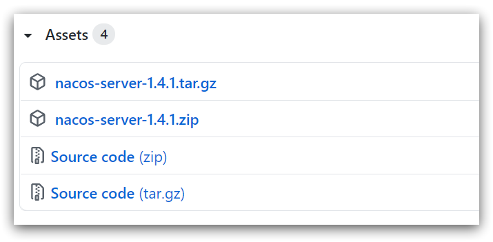


> 2.3.配置 Nacos

​	将这个包解压到任意非中文目录下，如图：


​	目录说明：

- bin：启动脚本
- conf：配置文件

​	进入 nacos 的 conf 目录，修改配置文件 cluster.conf.example，重命名为 cluster.conf：


​	然后添加内容：

```
127.0.0.1:8845
127.0.0.1.8846
127.0.0.1.8847
```


​	然后修改 application.properties 文件，添加数据库配置：

```properties
spring.datasource.platform=mysql

db.num=1

db.url.0=jdbc:mysql://127.0.0.1:3306/nacos?characterEncoding=utf8&connectTimeout=1000&socketTimeout=3000&autoReconnect=true&useUnicode=true&useSSL=false&serverTimezone=UTC
db.user.0=root
db.password.0=123
```


> 2.4.启动

​	将 nacos 文件夹复制三份，分别命名为：nacos1、nacos2、nacos3

 

​	然后分别修改三个文件夹中的 application.properties，

​	nacos1:

```properties
server.port=8845
```

​	nacos2:

```properties
server.port=8846
```

​	nacos3:

```properties
server.port=8847
```


​	然后分别启动三个 nacos 节点：

```
startup.cmd
```


> 2.5.nginx反向代理

​	找到课前资料提供的 nginx 安装包： 

 

​	解压到任意非中文目录下：

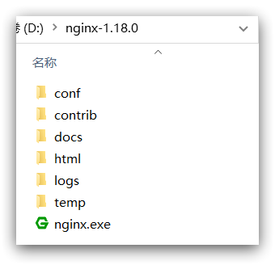 

​	修改 conf/nginx.conf 文件，配置如下：（粘贴到 http 内部）

```nginx
upstream nacos-cluster {
    server 127.0.0.1:8845;
	server 127.0.0.1:8846;
	server 127.0.0.1:8847;
}

server {
    listen       80;
    server_name  localhost;

    location /nacos {
        proxy_pass http://nacos-cluster;
    }
}
```

​	启动 nginx，而后在浏览器访问：http://localhost/nacos即可。

​	代码中 application.yml 文件配置如下：

```yaml
spring:
  cloud:
    nacos:
      server-addr: localhost:80 # Nacos地址
```


> 2.6.优化

- 实际部署时，需要给做反向代理的 nginx 服务器设置一个域名，这样后续如果有服务器迁移 nacos 的客户端也无需更改配置.

- Nacos 的各个节点应该部署到多个不同服务器，做好容灾和隔离


### Feigin 远程调用

​	先来看我们以前利用 RestTemplate 发起远程调用的代码：


​	存在下面的问题：

* 代码可读性差，编程体验不统一
* 参数复杂 URL 难以维护


​	Feign 是一个声明式的 http 客户端，官方地址：https://github.com/OpenFeign/feign

​	其作用就是帮助我们优雅的实现 http 请求的发送，解决上面提到的问题。


##### Feign 替代 RestTemplate

​	Fegin 的使用步骤如下：

> 1）引入依赖

​	我们在 order-service 服务的 pom 文件中引入 feign 的依赖：

```xml
<dependency>
    <groupId>org.springframework.cloud</groupId>
    <artifactId>spring-cloud-starter-openfeign</artifactId>
</dependency>
```


> 2）添加注解

​	在 order-service 的启动类添加注解开启 Feign 的功能：


> 3）编写 Feign 的客户端

​	在 order-service 中新建一个接口，内容如下：

```java
package cn.itcast.order.client;

import cn.itcast.order.pojo.User;
import org.springframework.cloud.openfeign.FeignClient;
import org.springframework.web.bind.annotation.GetMapping;
import org.springframework.web.bind.annotation.PathVariable;

@FeignClient("userservice")
public interface UserClient {
    @GetMapping("/user/{id}")
    User findById(@PathVariable("id") Long id);
}
```

​	这个客户端主要是基于 SpringMVC 的注解来声明远程调用的信息，比如：

- 服务名称：userservice
- 请求方式：GET
- 请求路径：/user/{id}
- 请求参数：Long id
- 返回值类型：User

​	这样，Feign 就可以帮助我们发送 http 请求，无需自己使用 RestTemplate 来发送了。


> 4）测试

​	修改 order-service 中的 OrderService 类中的 queryOrderById 方法，使用 Feign 客户端代替 RestTemplate：


> 5）总结

​	使用 Feign的步骤：

​		① 引入依赖

​		② 添加 @EnableFeignClients 注解

​		③ 编写 FeignClient 接口

​		④ 使用 FeignClient 中定义的方法代替 RestTemplate


##### 自定义配置

​	Feign 可以支持很多的自定义配置，如下表所示：

| 类型                   | 作用             | 说明                                                   |
| ---------------------- | ---------------- | ------------------------------------------------------ |
| **feign.Logger.Level** | 修改日志级别     | 包含四种不同的级别：NONE、BASIC、HEADERS、FULL         |
| feign.codec.Decoder    | 响应结果的解析器 | http远程调用的结果做解析，例如解析json字符串为java对象 |
| feign.codec.Encoder    | 请求参数编码     | 将请求参数编码，便于通过http请求发送                   |
| feign. Contract        | 支持的注解格式   | 默认是SpringMVC的注解                                  |
| feign. Retryer         | 失败重试机制     | 请求失败的重试机制，默认是没有，不过会使用Ribbon的重试 |

​	一般情况下，默认值就能满足我们使用，如果要自定义时，只需要创建自定义的 @Bean 覆盖默认 Bean 即可。

​	下面以日志为例来演示如何自定义配置。


> 配置文件方式

​	基于配置文件修改 feign 的日志级别可以针对单个服务：

```yaml
feign:  
  client:
    config: 
      userservice: # 针对某个微服务的配置
        loggerLevel: FULL #  日志级别 
```

​	也可以针对所有服务：

```yaml
feign:  
  client:
    config: 
      default: # 这里用default就是全局配置，如果是写服务名称，则是针对某个微服务的配置
        loggerLevel: FULL #  日志级别 
```


​	而日志的级别分为四种：

- NONE：不记录任何日志信息，这是默认值。
- BASIC：仅记录请求的方法，URL 以及响应状态码和执行时间
- HEADERS：在 BASIC 的基础上，额外记录了请求和响应的头信息
- FULL：记录所有请求和响应的明细，包括头信息、请求体、元数据。


> Java 代码方式

​	也可以基于 Java 代码来修改日志级别，先声明一个类，然后声明一个 Logger.Level 的对象：

```java
public class DefaultFeignConfiguration  {
    @Bean
    public Logger.Level feignLogLevel(){
        return Logger.Level.BASIC; // 日志级别为BASIC
    }
}
```


​	如果要**全局生效**，将其放到启动类的 @EnableFeignClients 这个注解中：

```java
@EnableFeignClients(defaultConfiguration = DefaultFeignConfiguration .class) 
```


​	如果是**局部生效**，则把它放到对应的 @FeignClient 这个注解中：

```java
@FeignClient(value = "userservice", configuration = DefaultFeignConfiguration .class) 
```


##### Feign使用优化

​	Feign 底层发起 http 请求，依赖于其它的框架。其底层客户端实现包括：

* URLConnection：默认实现，不支持连接池
* Apache HttpClient ：支持连接池
* OKHttp：支持连接池

​	因此提高 Feign 的性能主要手段就是使用**连接池**代替默认的 URLConnection。

​	这里用 Apache 的 HttpClient 来演示。


> 1）引入依赖

​	在 order-service 的 pom 文件中引入 Apache 的 HttpClient 依赖：

```xml
<!--httpClient的依赖 -->
<dependency>
    <groupId>io.github.openfeign</groupId>
    <artifactId>feign-httpclient</artifactId>
</dependency>
```


> 2）配置连接池

​	在 order-service 的 application.yml 中添加配置：

```yaml
feign:
  client:
    config:
      default: # default全局的配置
        loggerLevel: BASIC # 日志级别，BASIC就是基本的请求和响应信息
  httpclient:
    enabled: true # 开启feign对HttpClient的支持
    max-connections: 200 # 最大的连接数
    max-connections-per-route: 50 # 每个路径的最大连接数
```


​	接下来，在 FeignClientFactoryBean 中的 loadBalance 方法中打断点：

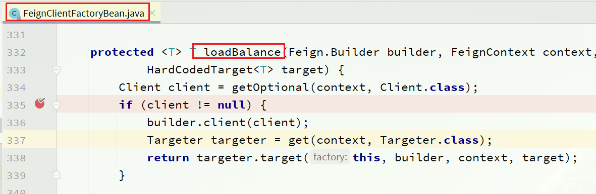

​	Debug 方式启动 order-service 服务，可以看到这里的 client，底层就是 Apache HttpClient：


> 总结，Feign的优化：

​	1.日志级别尽量用 basic

​	2.使用 HttpClient 或 OKHttp 代替 URLConnection

​		①  引入 feign-httpClient 依赖

​		②  配置文件开启 httpClient 功能，设置连接池参数


##### 最佳实践

​	所谓最近实践，就是使用过程中总结的经验，最好的一种使用方式。

​	自习观察可以发现，Feign 的客户端与服务提供者的 controller 代码非常相似：

​	feign 客户端：

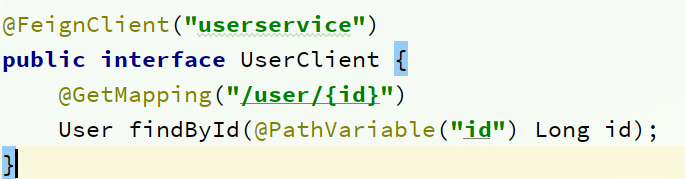

​	UserController：

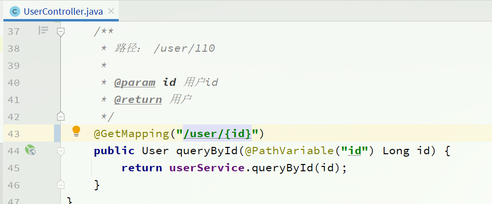

​	有没有一种办法简化这种重复的代码编写呢？


> 继承方式

​	一样的代码可以通过继承来共享：

​		1）定义一个 API 接口，利用定义方法，并基于 SpringMVC 注解做声明。

​		2）Feign 客户端和 Controller 都集成改接口


​	优点：

- 简单
- 实现了代码共享

​	缺点：

- 服务提供方、服务消费方紧耦合

- 参数列表中的注解映射并不会继承，因此 Controller 中必须再次声明方法、参数列表、注解


> 抽取方式

​	将 Feign 的 Client 抽取为独立模块，并且把接口有关的 POJO、默认的 Feign 配置都放到这个模块中，提供给所有消费者使用。

​	例如，将 UserClient、User、Feign 的默认配置都抽取到一个 feign-api 包中，所有微服务引用该依赖包，即可直接使用。


> 实现基于抽取的最佳实践

​	1）抽取

​		首先创建一个 module，命名为 feign-api：

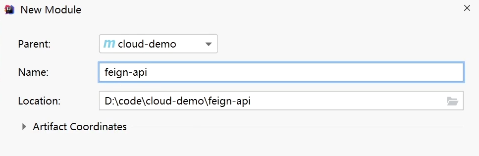

​		项目结构：

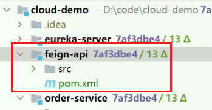

​		在 feign-api 中然后引入 feign 的 starter 依赖

```xml
<dependency>
    <groupId>org.springframework.cloud</groupId>
    <artifactId>spring-cloud-starter-openfeign</artifactId>
</dependency>
```

​	然后，order-service 中编写的 UserClient、User、DefaultFeignConfiguration 都复制到 feign-api 项目中：


​	2）在 order-service 中使用 feign-api

​		首先，删除 order-service 中的 UserClient、User、DefaultFeignConfiguration 等类或接口。

​		在 order-service 的 pom 文件中中引入 feign-api 的依赖：

```xml
<dependency>
    <groupId>cn.itcast.demo</groupId>
    <artifactId>feign-api</artifactId>
    <version>1.0</version>
</dependency>
```

​		修改 order-service 中的所有与上述三个组件有关的导包部分，改成导入 feign-api 中的包


​	3）重启测试

​		重启后，发现服务报错了：


​		这是因为 UserClient 现在在 cn.itcast.feign.clients 包下，

​		而 order-service 的 @EnableFeignClients 注解是在 cn.itcast.order 包下，不在同一个包，无法扫描到 UserClient。


​	4）解决扫描包问题

​		方式一：指定Feign应该扫描的包

```java
@EnableFeignClients(basePackages = "cn.itcast.feign.clients")
```

​		方式二：指定需要加载的Client接口

```java
@EnableFeignClients(clients = {UserClient.class})
```


### Gateway 服务网关

​	Spring Cloud Gateway 是 Spring Cloud 的一个全新项目，该项目是基于 Spring 5.0，Spring Boot 2.0 和 Project Reactor 等响应式编程和事件流技术开发的网关，它旨在为微服务架构提供一种简单有效的统一的 API 路由管理方式。


##### 为什么需要网关

​	Gateway 网关是我们服务的守门神，所有微服务的统一入口。

​	网关的**核心功能特性**：

- 请求路由
- 权限控制
- 限流

​	架构图：


​	**权限控制**：网关作为微服务入口，需要校验用户是是否有请求资格，如果没有则进行拦截。

​	**路由和负载均衡**：一切请求都必须先经过 gateway，但网关不处理业务，而是根据某种规则，把请求转发到某个微服务，这个过程叫做路由。当然路由的目标服务有多个时，还需要做负载均衡。

​	**限流**：当请求流量过高时，在网关中按照下流的微服务能够接受的速度来放行请求，避免服务压力过大。


​	在 SpringCloud 中网关的实现包括两种：

- gateway
- zuul

​	Zuul 是基于 Servlet 的实现，属于阻塞式编程。而 SpringCloudGateway 则是基于 Spring5 中提供的 WebFlux，属于响应式编程的实现，具备更好的性能。


##### gateway快速入门

​	下面演示下网关的基本路由功能。基本步骤如下：

1. 创建 SpringBoot 工程 gateway，引入网关依赖
2. 编写启动类
3. 编写基础配置和路由规则
4. 启动网关服务进行测试


> 1）创建 gateway 服务，引入依赖

​	创建服务：


​	引入依赖：

```xml
<!--网关-->
<dependency>
    <groupId>org.springframework.cloud</groupId>
    <artifactId>spring-cloud-starter-gateway</artifactId>
</dependency>
<!--nacos服务发现依赖-->
<dependency>
    <groupId>com.alibaba.cloud</groupId>
    <artifactId>spring-cloud-starter-alibaba-nacos-discovery</artifactId>
</dependency>
```


> 2）编写启动类

```java
package cn.itcast.gateway;

import org.springframework.boot.SpringApplication;
import org.springframework.boot.autoconfigure.SpringBootApplication;

@SpringBootApplication
public class GatewayApplication {

	public static void main(String[] args) {
		SpringApplication.run(GatewayApplication.class, args);
	}
}
```


> 3）编写基础配置和路由规则

​	创建 application.yml 文件，内容如下：

```yaml
server:
  port: 10010 #网关端口
spring:
  application:
    name: gateway #服务名称
  cloud:
    nacos:
      server-addr: localhost:8848 #nacos地址
    gateway:
      routes:
        - id: user-service    #路由id，自定义，只要唯一即可
          # uri: http://127.0.0.1:8081 #路由的目标地址 http就是固定地址
          uri: lb://userservice   #路由的目标地址 lb就是负载均衡，后面跟服务名称
          predicates:   #路由断言，也就是判断请求是否符合路由规则的条件
            - Path=/user/**   #这个是按照路径匹配，只要以/user/开头就符合要求
        - id: order-service
          uri: lb://orderservice
          predicates:
            - Path=/order/**
```

​	我们将符合`Path` 规则的一切请求，都代理到 `uri`参数指定的地址。

本例中，我们将 `/user/**`开头的请求，代理到`lb://userservice`，lb是负载均衡，根据服务名拉取服务列表，实现负载均衡。


> 4）重启测试

​	重启网关，访问http://localhost:10010/user/1时，符合`/user/**`规则，请求转发到uri：http://userservice/user/1，得到了结果：


> 5）网关路由的流程图

​	整个访问的流程如下：


> 总结

网关搭建步骤：

1. 创建项目，引入 nacos 服务发现和 gateway 依赖

2. 配置 application.yml，包括服务基本信息、nacos 地址、路由

路由配置包括：

1. 路由 id：路由的唯一标示

2. 路由目标（uri）：路由的目标地址，http 代表固定地址，lb 代表根据服务名负载均衡

3. 路由断言（predicates）：判断路由的规则，

4. 路由过滤器（filters）：对请求或响应做处理

接下来，就重点来学习路由断言和路由过滤器的详细知识


##### 断言工厂

​	我们在配置文件中写的断言规则只是字符串，这些字符串会被 Predicate Factory 读取并处理，转变为路由判断的条件

​	例如 Path=/user/** 是按照路径匹配，这个规则是由

`org.springframework.cloud.gateway.handler.predicate.PathRoutePredicateFactory`类来

处理的，像这样的断言工厂在 SpringCloudGateway 还有十几个:

| **名称**   | **说明**                       | **示例**                                                     |
| ---------- | ------------------------------ | ------------------------------------------------------------ |
| After      | 是某个时间点后的请求           | -  After=2037-01-20T17:42:47.789-07:00[America/Denver]       |
| Before     | 是某个时间点之前的请求         | -  Before=2031-04-13T15:14:47.433+08:00[Asia/Shanghai]       |
| Between    | 是某两个时间点之前的请求       | -  Between=2037-01-20T17:42:47.789-07:00[America/Denver],  2037-01-21T17:42:47.789-07:00[America/Denver] |
| Cookie     | 请求必须包含某些cookie         | - Cookie=chocolate, ch.p                                     |
| Header     | 请求必须包含某些header         | - Header=X-Request-Id, \d+                                   |
| Host       | 请求必须是访问某个host（域名） | -  Host=**.somehost.org,**.anotherhost.org                   |
| Method     | 请求方式必须是指定方式         | - Method=GET,POST                                            |
| Path       | 请求路径必须符合指定规则       | - Path=/red/{segment},/blue/**                               |
| Query      | 请求参数必须包含指定参数       | - Query=name, Jack或者-  Query=name                          |
| RemoteAddr | 请求者的ip必须是指定范围       | - RemoteAddr=192.168.1.1/24                                  |
| Weight     | 权重处理                       |                                                              |

​	一般只需要掌握 Path 这种路由工厂就可以了。


##### 过滤器工厂

​	GatewayFilter 是网关中提供的一种过滤器，可以对进入网关的请求和微服务返回的响应做处理：


> 路由过滤器的种类

​	Spring 提供了 31 种不同的路由过滤器工厂。例如：

| **名称**             | **说明**                     |
| -------------------- | ---------------------------- |
| AddRequestHeader     | 给当前请求添加一个请求头     |
| RemoveRequestHeader  | 移除请求中的一个请求头       |
| AddResponseHeader    | 给响应结果中添加一个响应头   |
| RemoveResponseHeader | 从响应结果中移除有一个响应头 |
| RequestRateLimiter   | 限制请求的流量               |


> 请求头过滤器

​	下面以 AddRequestHeader 为例来讲解。

​	**需求**：给所有进入 userservice 的请求添加一个请求头：Truth=Spring is freaking awesome!


​	只需要修改 gateway 服务的 application.yml 文件，添加路由过滤即可：

```yaml
spring:
  cloud:
    gateway:
      routes:
      - id: user-service 
        uri: lb://userservice 
        predicates: 
        - Path=/user/** 
        filters: # 过滤器
        - AddRequestHeader=Truth, Spring is freaking awesome! # 添加请求头
```

​	当前过滤器写在 userservice 路由下，因此仅仅对访问 userservice 的请求有效。


> 默认过滤器

​	如果要对所有的路由都生效，则可以将过滤器工厂写到 default 下。格式如下：

```yaml
spring:
  cloud:
    gateway:
      routes:
      - id: user-service 
        uri: lb://userservice 
        predicates: 
        - Path=/user/**
      default-filters: # 默认过滤项
      - AddRequestHeader=Truth, Spring is freaking awesome! 
```


> 修改 UserController 接收请求头

```java
@GetMapping("/{id}")
public User queryById(@PathVariable("id") Long id,
                      @RequestHeader(value = "Truth", required = false) String truth) {
    System.out.println("Truth: " + truth);
    return userService.queryById(id);
}
```


> 总结

​	过滤器的作用是什么？

​		① 对路由的请求或响应做加工处理，比如添加请求头

​		② 配置在路由下的过滤器只对当前路由的请求生效

​	defaultFilters 的作用是什么？

​		① 对所有路由都生效的过滤器


##### 全局过滤器

​	上一节学习的过滤器，网关提供了 31 种，但每一种过滤器的作用都是固定的。如果我们希望拦截请求，做自己的业务逻辑则没办法实现。


> 全局过滤器作用

​	全局过滤器的作用也是处理一切进入网关的请求和微服务响应，与 GatewayFilter 的作用一样。区别在于 GatewayFilter 通过配置定义，处理逻辑是固定的；而 GlobalFilter 的逻辑需要自己写代码实现。

​	定义方式是实现 GlobalFilter 接口。

```java
public interface GlobalFilter {
    /**
     *  处理当前请求，有必要的话通过{@link GatewayFilterChain}将请求交给下一个过滤器处理
     *
     * @param exchange 请求上下文，里面可以获取Request、Response等信息
     * @param chain 用来把请求委托给下一个过滤器 
     * @return {@code Mono<Void>} 返回标示当前过滤器业务结束
     */
    Mono<Void> filter(ServerWebExchange exchange, GatewayFilterChain chain);
}
```

​	在 filter 中编写自定义逻辑，可以实现下列功能：

- 登录状态判断
- 权限校验
- 请求限流等


> 自定义全局过滤器

​	需求：定义全局过滤器，拦截请求，判断请求的参数是否满足下面条件：

- 参数中是否有 authorization，
- authorization 参数值是否为 admin

​	如果同时满足则放行，否则拦截


> 在 gateway 中定义一个过滤器

```java
package cn.itcast.gateway.filters;

import org.springframework.cloud.gateway.filter.GatewayFilterChain;
import org.springframework.cloud.gateway.filter.GlobalFilter;
import org.springframework.core.Ordered;
import org.springframework.core.annotation.Order;
import org.springframework.http.HttpStatus;
import org.springframework.http.server.reactive.ServerHttpRequest;
import org.springframework.stereotype.Component;
import org.springframework.util.MultiValueMap;
import org.springframework.web.server.ServerWebExchange;
import reactor.core.publisher.Mono;

//@Order(-1)	//可注解也可实现接口来定义过滤器优先级
@Component
public class AuthorizeFilter implements GlobalFilter, Ordered {

    @Override
    public Mono<Void> filter(ServerWebExchange exchange, GatewayFilterChain chain) {
        //1.获取请求参数
        ServerHttpRequest request = exchange.getRequest();
        MultiValueMap<String, String> params = request.getQueryParams();
        //2.获取 authorization 参数
        String auth = params.getFirst("authorization");
        //3.校验
        if ("admin".equals(auth)) {
            //放行
            return chain.filter(exchange);
        }
        //4.拦截
        //4.1禁止访问，设置状态码
        exchange.getResponse().setStatusCode(HttpStatus.UNAUTHORIZED);
        //4.2结束处理
        return exchange.getResponse().setComplete();
    }

    @Override
    public int getOrder() {
        return -0;
    }
}

```


> 总结

1.全局过滤器的作用是什么？

​	1）对所有路由都生效的过滤器，并且可以自定义处理逻辑

2.实现全局过滤器的步骤？

​	1）实现 GlobalFilter 接口
​	2）添加 @Order 注解或实现 Ordered 接口
​	3）编写处理逻辑

​	

##### 过滤器执行顺序

​	请求进入网关会碰到三类过滤器：当前路由的过滤器、DefaultFilter、GlobalFilter

​	请求路由后，会将当前路由过滤器和 DefaultFilter、GlobalFilter，合并到一个过滤器链（集合）中，排序后依次执行每个过滤器：


​	排序的规则是什么呢？

- 每一个过滤器都必须指定一个 int 类型的 order 值，**order 值越小，优先级越高，执行顺序越靠前**。
- GlobalFilter 通过实现 Ordered 接口，或者添加 @Order 注解来指定 order 值，由我们自己指定
- 路由过滤器和 defaultFilter 的 order 由 Spring 指定，默认是按照声明顺序从 1 递增。
- 当过滤器的 order 值一样时，会按照 defaultFilter > 路由过滤器 > GlobalFilter 的顺序执行。


​	详细内容，可以查看源码：

​	`org.springframework.cloud.gateway.route.RouteDefinitionRouteLocator#getFilters()`方法是先加载defaultFilters，然后再加载某个route的filters，然后合并。

​	`org.springframework.cloud.gateway.handler.FilteringWebHandler#handle()`方法会加载全局过滤器，与前面的过滤器合并后根据order排序，组织过滤器链


##### 跨域问题

​	跨域：域名不一致就是跨域，主要包括：

- 域名不同： www.taobao.com 和 www.taobao.org 和 www.jd.com 和 miaosha.jd.com

- 域名相同，端口不同：localhost:8080 和 localhost8081

​	跨域问题：浏览器禁止请求的发起者与服务端发生跨域 ajax 请求，请求被浏览器拦截的问题


​	解决方案：CORS，这个以前应该学习过，可以查看https://www.ruanyifeng.com/blog/2016/04/cors.html


> 模拟跨域问题

​	找到课前资料的页面文件：


​	放入 tomcat 或者 nginx 这样的 web 服务器中，启动并访问。

​	可以在浏览器控制台看到下面的错误：

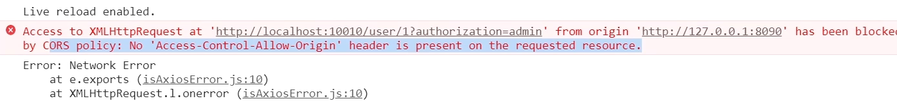

​	从 localhost:8090 访问 localhost:10010，端口不同，显然是跨域的请求。


> 解决跨域问题

​	在 gateway 服务的 application.yml 文件中，添加下面的配置：

```yaml
spring:
  cloud:
    gateway:
      # 。。。
      globalcors: # 全局的跨域处理
        add-to-simple-url-handler-mapping: true # 解决options请求被拦截问题
        corsConfigurations:
          '[/**]':
            allowedOrigins: # 允许哪些网站的跨域请求 
              - "http://localhost:8090"
            allowedMethods: # 允许的跨域ajax的请求方式
              - "GET"
              - "POST"
              - "DELETE"
              - "PUT"
              - "OPTIONS"
            allowedHeaders: "*" # 允许在请求中携带的头信息
            allowCredentials: true # 是否允许携带cookie
            maxAge: 360000 # 这次跨域检测的有效期
```


# Docker

### Docker 概述

##### 什么是 Docker

​	微服务虽然具备各种各样的优势，但服务的拆分通用给部署带来了很大的麻烦。

- 分布式系统中，依赖的组件非常多，不同组件之间部署时往往会产生一些冲突。
- 在数百上千台服务中重复部署，环境不一定一致，会遇到各种问题


##### 应用部署的环境问题

​	大型项目组件较多，运行环境也较为复杂，部署时会碰到一些问题：

- 依赖关系复杂，容易出现兼容性问题

- 开发、测试、生产环境有差异


​	例如一个项目中，部署时需要依赖于 node.js、Redis、RabbitMQ、MySQL 等，这些服务部署时所需要的函数库、依赖项各不相同，甚至会有冲突。给部署带来了极大的困难。


##### Docker解决依赖兼容问题

​	而 Docker 却巧妙的解决了这些问题，Docker 是如何实现的呢？

​	Docker 为了解决依赖的兼容问题的，采用了两个手段：

- 将应用的 Libs（函数库）、Deps（依赖）、配置与应用一起打包

- 将每个应用放到一个隔离**容器**去运行，避免互相干扰


​	这样打包好的应用包中，既包含应用本身，也保护应用所需要的 Libs、Deps，无需再操作系统上安装这些，自然就不存在不同应用之间的兼容问题了。

​	虽然解决了不同应用的兼容问题，但是开发、测试等环境会存在差异，操作系统版本也会有差异，怎么解决这些问题呢？


##### Docker 解决操作系统环境差异

​	要解决不同操作系统环境差异问题，必须先了解操作系统结构。以一个 Ubuntu 操作系统为例，结构如下：


​	结构包括：

- 计算机硬件：例如 CPU、内存、磁盘等
- 系统内核：所有 Linux 发行版的内核都是 Linux，例如 CentOS、Ubuntu、Fedora 等。内核可以与计算机硬件交互，对外提供**内核指令**，用于操作计算机硬件。
- 系统应用：操作系统本身提供的应用、函数库。这些函数库是对内核指令的封装，使用更加方便。


​	应用于计算机交互的流程如下：

​		1）应用调用操作系统应用（函数库），实现各种功能

​		2）系统函数库是对内核指令集的封装，会调用内核指令

​		3）内核指令操作计算机硬件


​	Ubuntu 和 CentOS 都是基于Linux内核，无非是系统应用不同，提供的函数库有差异：


​	此时，如果将一个 Ubuntu 版本的 MySQL 应用安装到 CentOS 系统，MySQL 在调用 Ubuntu 函数库时，会发现找不到或者不匹配，就会报错了：


​	Docker 如何解决不同系统环境的问题？

- Docker 将用户程序与所需要调用的系统 (比如 Ubuntu ) 函数库一起打包
- Docker 运行到不同操作系统时，直接基于打包的函数库，借助于操作系统的 Linux 内核来运行

​	如图：


##### 小结

​	Docker 如何解决大型项目依赖关系复杂，不同组件依赖的兼容性问题？

- Docker 允许开发中将应用、依赖、函数库、配置一起**打包**，形成可移植镜像
- Docker 应用运行在容器中，使用沙箱机制，相互**隔离**


​	Docker 如何解决开发、测试、生产环境有差异的问题？

- Docker 镜像中包含完整运行环境，包括系统函数库，仅依赖系统的 Linux 内核，因此可以在任意 Linux 操作系统上运行


​	Docker 是一个快速交付应用、运行应用的技术，具备下列优势：

- 可以将程序及其依赖、运行环境一起打包为一个镜像，可以迁移到任意 Linux 操作系统
- 运行时利用沙箱机制形成隔离容器，各个应用互不干扰
- 启动、移除都可以通过一行命令完成，方便快捷


##### Docker和虚拟机的区别

​	Docker 可以让一个应用在任何操作系统中非常方便的运行。而以前我们接触的虚拟机，也能在一个操作系统中，运行另外一个操作系统，保护系统中的任何应用。


​	**虚拟机**（virtual machine）是在操作系统中**模拟**硬件设备，然后运行另一个操作系统，比如在 Windows 系统里面运行 Ubuntu 系统，这样就可以运行任意的 Ubuntu 应用了。

​	**Docker** 仅仅是封装函数库，并没有模拟完整的操作系统，如图：


​	对比来看：


​	小结：

​	Docker 和虚拟机的差异：

- docker 是一个系统进程；虚拟机是在操作系统中的操作系统

- docker 体积小、启动速度快、性能好；虚拟机体积大、启动速度慢、性能一般


### Docker架构

##### 镜像和容器

​	Docker 中有几个重要的概念：

​	**镜像（Image）**：Docker 将应用程序及其所需的依赖、函数库、环境、配置等文件打包在一起，称为镜像。

​	**容器（Container）**：镜像中的应用程序运行后形成的进程就是**容器**，只是 Docker 会给容器进程做隔离，对外不可见。


​	一切应用最终都是代码组成，都是硬盘中的一个个的字节形成的**文件**。只有运行时，才会加载到内存，形成进程。

​	而**镜像**，就是把一个应用在硬盘上的文件、及其运行环境、部分系统函数库文件一起打包形成的文件包。这个文件包是只读的。

​	**容器**呢，就是将这些文件中编写的程序、函数加载到内存中允许，形成进程，只不过要隔离起来。因此一个镜像可以启动多次，形成多个容器进程。


​	例如你下载了一个QQ，如果我们将QQ在磁盘上的运行**文件**及其运行的操作系统依赖打包，形成QQ镜像。然后你可以启动多次，双开、甚至三开QQ，跟多个妹子聊天。


##### DockerHub

​	开源应用程序非常多，打包这些应用往往是重复的劳动。为了避免这些重复劳动，人们就会将自己打包的应用镜像，例如 Redis、MySQL 镜像放到网络上，共享使用，就像 GitHub 的代码共享一样。

- DockerHub：DockerHub 是一个官方的 Docker 镜像的托管平台。这样的平台称为 Docker Registry。

- 国内也有类似于 DockerHub 的公开服务，比如 [网易云镜像服务](https://c.163yun.com/hub)、[阿里云镜像库](https://cr.console.aliyun.com/)等。


​	我们一方面可以将自己的镜像共享到 DockerHub，另一方面也可以从 DockerHub 拉取镜像：

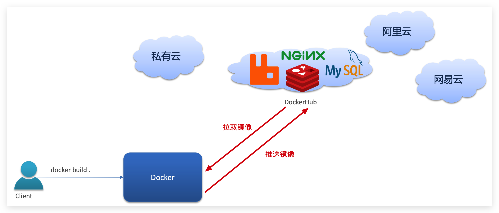


##### Docker架构

​	我们要使用 Docker 来操作镜像、容器，就必须要安装 Docker。

​	Docker 是一个 CS 架构的程序，由两部分组成：

- 服务端(server)：Docker 守护进程，负责处理 Docker 指令，管理镜像、容器等

- 客户端(client)：通过命令或 RestAPI 向 Docker 服务端发送指令。可以在本地或远程向服务端发送指令。


​	如图：


##### 小结

镜像：

- 将应用程序及其依赖、环境、配置打包在一起

容器：

- 镜像运行起来就是容器，一个镜像可以运行多个容器

Docker 结构：

- 服务端：接收命令或远程请求，操作镜像或容器

- 客户端：发送命令或者请求到 Docker 服务端

DockerHub：

- 一个镜像托管的服务器，类似的还有阿里云镜像服务，统称为 DockerRegistry


### 安装Docker

​	Docker 分为 CE 和 EE 两大版本。CE 即社区版（免费，支持周期 7 个月），EE 即企业版，强调安全，付费使用，支持周期 24 个月。

​	Docker CE 分为 `stable` `test` 和 `nightly` 三个更新频道。

​	官方网站上有各种环境下的 [安装指南](https://docs.docker.com/install/)，这里主要介绍 Docker CE 在 CentOS上的安装。


##### CentOS安装Docker

​	Docker CE 支持 64 位版本 CentOS 7，并且要求内核版本不低于 3.10， CentOS 7 满足最低内核的要求，所以我们在 CentOS 7 安装 Docker。


> 卸载（可选）

​	如果之前安装过旧版本的 Docker，可以使用下面命令卸载：

```
yum remove docker \
                  docker-client \
                  docker-client-latest \
                  docker-common \
                  docker-latest \
                  docker-latest-logrotate \
                  docker-logrotate \
                  docker-selinux \
                  docker-engine-selinux \
                  docker-engine \
                  docker-ce
```


> 安装 docker

​	首先需要虚拟机联网，安装 yum 工具

```sh
yum install -y yum-utils \
           device-mapper-persistent-data \
           lvm2 --skip-broken
```

​	然后更新本地镜像源：

```shell
# 设置docker镜像源
yum-config-manager \
    --add-repo \
    https://mirrors.aliyun.com/docker-ce/linux/centos/docker-ce.repo
    
sed -i 's/download.docker.com/mirrors.aliyun.com\/docker-ce/g' /etc/yum.repos.d/docker-ce.repo

yum makecache fast
```

​	然后输入命令：

```shell
yum install -y docker-ce
```

​	docker-ce 为社区免费版本。稍等片刻，docker 即可安装成功。


> 启动 docker

​	Docker 应用需要用到各种端口，逐一去修改防火墙设置。非常麻烦，因此建议直接关闭防火墙！启动docker前，一定要关闭防火墙！！

```sh
# 关闭
systemctl stop firewalld
# 禁止开机启动防火墙
systemctl disable firewalld
```

​	通过命令启动 docker：

```sh
systemctl start docker  # 启动docker服务

systemctl stop docker  # 停止docker服务

systemctl restart docker  # 重启docker服务

systemctl status docker	#查看 docker 服务状态

systemctl enable docker	#设置开机启动 docker 服务
```

​	然后输入命令，可以查看 docker 版本：

```
docker -v
```

如图：

 


##### 配置镜像加速

​	docker 官方镜像仓库网速较差，我们需要设置国内镜像服务：

​	参考阿里云的镜像加速文档：https://cr.console.aliyun.com/cn-hangzhou/instances/mirrors


### 镜像操作与命令

##### 镜像名称

​	首先来看下镜像的名称组成：

- 镜名称一般分两部分组成：[repository]:[tag]。
- 在没有指定 tag 时，默认是 latest，代表最新版本的镜像

​	如图：


​	这里的 mysql 就是 repository，5.7 就是 tag，合一起就是镜像名称，代表 5.7 版本的 MySQL 镜像。


##### 镜像命令

​	常见的镜像操作命令如图：


​	注意：不需要死记，需要用时查看 docker --help 即可


##### 案例 1 - 拉取、查看镜像

​	需求：从 DockerHub 中拉取一个 nginx 镜像并查看

​		1）首先去镜像仓库搜索 nginx 镜像，比如 [DockerHub](https://hub.docker.com/):


​		2）根据查看到的镜像名称，拉取自己需要的镜像，通过命令：docker pull nginx


​		3）通过命令：docker images 查看拉取到的镜像


##### 案例 2 - 保存、导入镜像

​	需求：利用 docker save 将 nginx 镜像导出磁盘，然后再通过 load 加载回来

1）利用 docker xx --help 命令查看 docker save 和 docker load 的语法

​	例如，查看save命令用法，可以输入命令：

```sh
docker save --help
```

​	结果：

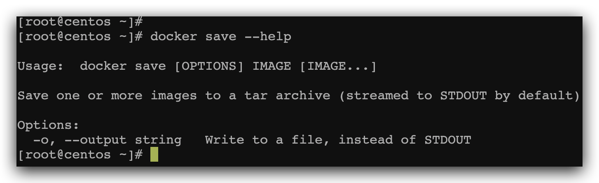

​	命令格式：

```shell
docker save -o [保存的目标文件名称] [镜像名称]
```


2）使用docker save导出镜像到磁盘 

​	运行命令：

```sh
docker save -o nginx.tar nginx:latest
```

​	结果如图：


3）使用 docker load 加载镜像

​	先删除本地的 nginx 镜像：

```sh
docker rmi nginx:latest
```

​	然后运行命令，加载本地文件：

```sh
docker load -i nginx.tar
```

​	结果：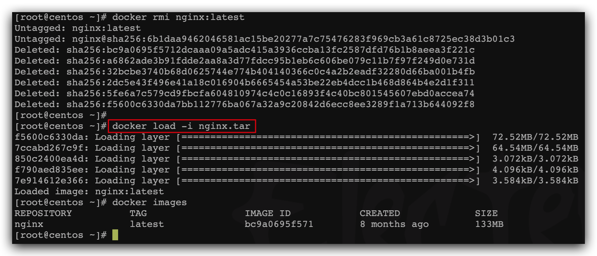


##### 练习

​	需求：去 DockerHub 搜索并拉取一个 Redis 镜像

​	目标：

​		1）去 DockerHub 搜索 Redis 镜像

​		2）查看 Redis 镜像的名称和版本

​		3）利用 docker pull 命令拉取镜像

​		4）利用 docker save 命令将 redis:latest 打包为一个 redis.tar 包

​		5）利用 docker rmi 删除本地的 redis:latest

​		6）利用 docker load 重新加载 redis.tar 文件

 

### 容器操作与命令

##### 容器相关命令


​	容器保护三个状态：

- 运行：进程正常运行
- 暂停：进程暂停，CPU 不再运行，并不释放内存
- 停止：进程终止，回收进程占用的内存、CPU 等资源


​	其中：

- docker run：创建并运行一个容器，处于运行状态
- docker pause：让一个运行的容器暂停
- docker unpause：让一个容器从暂停状态恢复运行
- docker stop：停止一个运行的容器
- docker start：让一个停止的容器再次运行
- docker rm：删除一个容器
- docker exec：进入容器执行命令
- docker logs：查看容器运行日志
- docker ps：查看所有运行的容器及状态


##### 案例 - 创建并运行一个容器

​	创建并运行 nginx 容器的命令：

```sh
docker run --name containerName -p 80:80 -d nginx
```

​	命令解读：

- docker run ：创建并运行一个容器
- --name : 给容器起一个名字，比如叫做 mn
- -p ：将宿主机端口与容器端口映射，冒号左侧是宿主机端口，右侧是容器端口
- -d：后台运行容器
- nginx：镜像名称，例如 nginx


​	这里的`-p`参数，是将容器端口映射到宿主机端口。

​	默认情况下，容器是隔离环境，我们直接访问宿主机的 80 端口，肯定访问不到容器中的 nginx。

​	现在，将容器的 80 与宿主机的 80 关联起来，当我们访问宿主机的 80 端口时，就会被映射到容器的 80，这样就能访问到 nginx 了：

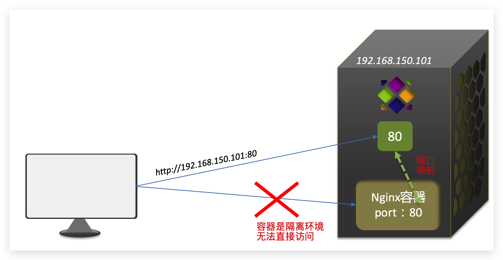


##### 案例 - 进入容器，修改文件

​	**需求**：进入 Nginx 容器，修改 HTML 文件内容，添加 “学的我好累啊！！！”

​	**提示**：进入容器要用到 docker exec 命令。


​	**步骤**：

​	1）进入容器。进入我们刚刚创建的 nginx 容器的命令为：

```sh
docker exec -it mn bash
```

​	命令解读：

- docker exec ：进入容器内部，执行一个命令

- -it : 给当前进入的容器创建一个标准输入、输出终端，允许我们与容器交互

- mn ：要进入的容器的名称

- bash：进入容器后执行的命令，bash 是一个 linux 终端交互命令


​	2）进入 nginx 的 HTML 所在目录 /usr/share/nginx/html

​	容器内部会模拟一个独立的 Linux 文件系统，看起来如同一个 linux 服务器一样：

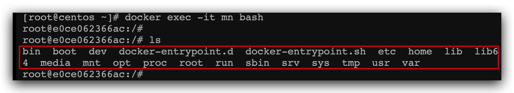

​	nginx 的环境、配置、运行文件全部都在这个文件系统中，包括我们要修改的 html 文件。

​	查看 DockerHub 网站中的 nginx 页面，可以知道 nginx 的 html 目录位置在`/usr/share/nginx/html`

​	我们执行命令，进入该目录：

```sh
cd /usr/share/nginx/html
```

 	查看目录下文件：


​	3）修改 index.html 的内容

​	容器内没有 vi 命令，无法直接修改，用下面的命令来修改：

```sh
sed -i -e 's#Welcome to nginx#学的我好累啊！！！#g' -e 's#<head>#<head><meta charset="utf-8">#g' index.html
```

​	在浏览器访问自己的虚拟机地址，例如我的是：http://192.168.150.101，即可看到结果


##### 小结

docker run 命令的常见参数有哪些？

- --name：指定容器名称
- -p：指定端口映射
- -d：让容器后台运行

查看容器日志的命令：

- docker logs
- 添加 -f 参数可以持续查看日志

查看容器状态：

- docker ps
- docker ps -a 查看所有容器，包括已经停止的


##### 练习

需求：创建并运行一个 redis 容器，并且支持数据持久化

​	步骤一：到 DockerHub 搜索 Redis 镜像
​	步骤二：查看 Redis 镜像文档中的帮助信息
​	步骤三：利用 docker run 命令运行一个 Redis 容器


详细代码：

​	1）创建支持持久化的 Redis 容器：

```sh
docker run --name MyRedis -p 6379:6379 -d redis redis-server --appendonly yes
```

​	2）进入容器并执行 redis-cli 客户端命令：

```sh
docker exec -it MyRedis redis-cli
```

​	3）设置数据 num=666

```sh
set num 666
```


### 数据卷操作与命令

​	在之前的 nginx 案例中，修改 nginx 的 html 页面时，需要进入 nginx 内部。并且因为没有编辑器，修改文件也很麻烦。

​	这就是因为容器与数据（容器内文件）耦合带来的后果。


​	要解决这个问题，必须将数据与容器解耦，这就要用到数据卷了。


##### 什么是数据卷

​	**数据卷（volume）**是一个虚拟目录，指向宿主机文件系统中的某个目录。


​	一旦完成数据卷挂载，对容器的一切操作都会作用在数据卷对应的宿主机目录了。

​	这样，我们操作宿主机的 /var/lib/docker/volumes/html 目录，就等于操作容器内的 /usr/share/nginx/html 目录了


##### 数据卷操作命令

​	数据卷操作的基本语法如下：

```sh
docker volume [COMMAND]
```

​	docker volume 命令是数据卷操作，根据命令后跟随的 command 来确定下一步的操作：

- create：创建一个 volume
- inspect：显示一个或多个 volume 的信息
- ls：列出所有的 volume
- prune：删除未使用的 volume
- rm：删除一个或多个指定的 volume


##### 创建和查看数据卷

​	**需求**：创建一个数据卷，并查看数据卷在宿主机的目录位置

​	① 创建数据卷

```sh
docker volume create html
```

​	② 查看所有数据

```sh
docker volume ls
```

​	结果：


​	③ 查看数据卷详细信息卷

```sh
docker volume inspect html
```

​	结果：


​	可以看到，我们创建的 html 这个数据卷关联的宿主机目录为`/var/lib/docker/volumes/html/_data`目录。


> 小结

数据卷的作用：

- 将容器与数据分离，解耦合，方便操作容器内数据，保证数据安全

数据卷操作：

- docker volume create：创建数据卷
- docker volume ls：查看所有数据卷
- docker volume inspect：查看数据卷详细信息，包括关联的宿主机目录位置
- docker volume rm：删除指定数据卷
- docker volume prune：删除所有未使用的数据卷


##### 挂载数据卷

​	我们在创建容器时，可以通过 -v 参数来挂载一个数据卷到某个容器内目录，命令格式如下：

```sh
docker run \
  --name mn \
  -v html:/root/html \
  -p 8080:80
  nginx \
```

​	这里的 -v 就是挂载数据卷的命令：

- `-v html:/root/html` ：把 html 数据卷挂载到容器内的 /root/html 这个目录中

​	数据卷挂载方式：
​		-v volumeName: /targetContainerPath
​		如果容器运行时 volume 不存在，会自动被创建出来


##### 案例 - 给 nginx 挂载数据卷

​	**需求**：创建一个nginx容器，修改容器内的html目录内的index.html内容

​	**分析**：上个案例中，我们进入nginx容器内部，已经知道nginx的html目录所在位置/usr/share/nginx/html ，我们需要把这个目录挂载到html这个数据卷上，方便操作其中的内容。

​	**提示**：运行容器时使用 -v 参数挂载数据卷

​	步骤：

​		① 创建容器并挂载数据卷到容器内的 HTML 目录

```sh
docker run --name mn -v html:/usr/share/nginx/html -p 80:80 -d nginx
```

​	注意：如果事先没有创建数据卷，在使用 -v 挂载数据卷时，docker 会自动创建数据卷


​		② 进入 html 数据卷所在位置，并修改 HTML 内容

```sh
# 查看html数据卷的位置
docker volume inspect html
# 进入该目录
cd /var/lib/docker/volumes/html/_data
# 修改文件
vi index.html
```


##### 案例 - 给 MySQL 挂载本地目录

​	容器不仅仅可以挂载数据卷，也可以直接挂载到宿主机目录上。关联关系如下：

- 带数据卷模式：宿主机目录 --> 数据卷 ---> 容器内目录
- 直接挂载模式：宿主机目录 ---> 容器内目录

​	如图：

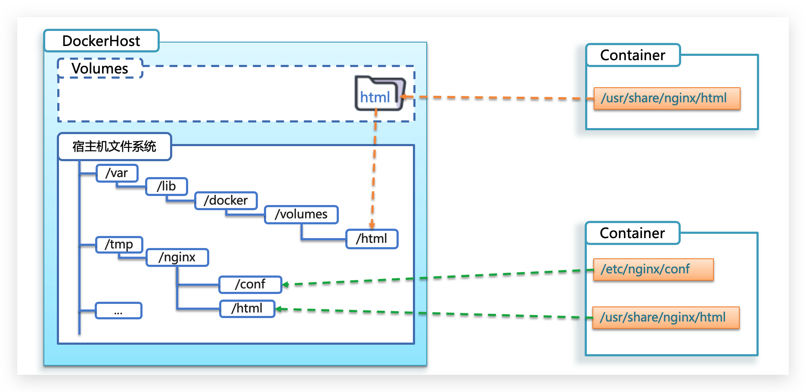

​	**语法**：

​	目录挂载与数据卷挂载的语法是类似的：

- -v [宿主机目录]:[容器内目录]
- -v [宿主机文件]:[容器内文件]


​	**需求**：创建并运行一个MySQL容器，将宿主机目录直接挂载到容器

​	实现思路如下：

​		1）在将课前资料中的 mysql.tar 文件上传到虚拟机，通过 load 命令加载为镜像

​		2）创建目录 /tmp/mysql/data

​		3）创建目录 /tmp/mysql/conf，将课前资料提供的 hmy.cnf 文件上传到 /tmp/mysql/conf

​		4）去 DockerHub 查阅资料，创建并运行 MySQL 容器，要求：

​			① 挂载 /tmp/mysql/data 到 mysql 容器内数据存储目录

​			② 挂载 /tmp/mysql/conf/hmy.cnf 到 mysql 容器的配置文件

​			③ 设置 MySQL 密码


> 具体操作

```sh
#1.上传 mysql.tar

#2.加载 mysql 镜像
docker load -i mysql.tar

#3.创建配置文件与数据目录
mkdir -p mysql/data
mkdir -p mysql/conf

#4.上传配置文件

#5.创建容器并映射
docker run \
--name MyMysql \
-e MYSQL_ROOT_PASSWORD=123456 \
-p 3306:3306 \
-v /root/Docker/mysql/conf/hmy.cnf:/etc/mysql/conf.d/hmy.cnf \
-v /root/Docker/mysql/data:/var/lib/mysql \
-d \
mysql:5.7.25
```


> 小结

docker run 的命令中通过 -v 参数挂载文件或目录到容器中：

- -v volume 名称：容器内目录
- -v 宿主机文件：容器内文
- -v 宿主机目录：容器内目录

数据卷挂载与目录直接挂载的

- 数据卷挂载耦合度低，由 docker 来管理目录，但是目录较深，不好找
- 目录挂载耦合度高，需要我们自己管理目录，不过目录容易寻找查看


### Dockerfile 自定义镜像

​	常见的镜像在 DockerHub 就能找到，但是我们自己写的项目就必须自己构建镜像了。

​	而要自定义镜像，就必须先了解镜像的结构才行。


##### 镜像结构

​	镜像是将应用程序及其需要的系统函数库、环境、配置、依赖打包而成。

​	以 MySQL 为例，来看镜像的组成结构：


​	简单来说，镜像就是在系统函数库、运行环境基础上，添加应用程序文件、配置文件、依赖文件等组合，然后编写好启动脚本打包在一起形成的文件。要构建镜像，其实就是实现上述打包的过程。


##### 容器转为镜像

​	更新镜像：docker commit 容器id 镜像名称:版本号

​	打包镜像：docker save -o 亚瑟文件名称 镜像名称:版本号

​	加载镜像：docker load -i 压缩文件名称


##### Dockerfile语法

​	构建自定义的镜像时，并不需要一个个文件去拷贝，打包。

​	我们只需要告诉 Docker，我们的镜像的组成，需要哪些 BaseImage、需要拷贝什么文件、需要安装什么依赖、启动脚本是什么，将来 Docker 会帮助我们构建镜像。

​	而描述上述信息的文件就是 Dockerfile 文件。


​	**Dockerfile** 就是一个文本文件，其中包含一个个的**指令(Instruction)**，用指令来说明要执行什么操作来构建镜像。每一个指令都会形成一层Layer。


​	更新详细语法说明，请参考官网文档： https://docs.docker.com/engine/reference/builder


##### 构建Java项目

> 基于 Ubuntu 构建 Java 项目

​	需求：基于 Ubuntu 镜像构建一个新镜像，运行一个 java 项目

- 步骤1：新建一个空文件夹 docker-demo

- 步骤2：拷贝课前资料中的 docker-demo.jar、jdk8.tar.gz、Dockerfile 这三个文件到 docker-demo 这个目录

  其中 Dockerfile 的内容如下：

  ```dockerfile
  # 指定基础镜像
  FROM ubuntu:16.04
  # 配置环境变量，JDK的安装目录
  ENV JAVA_DIR=/usr/local
  
  # 拷贝jdk和java项目的包
  COPY ./jdk8.tar.gz $JAVA_DIR/
  COPY ./docker-demo.jar /tmp/app.jar
  
  # 安装JDK
  RUN cd $JAVA_DIR \
   && tar -xf ./jdk8.tar.gz \
   && mv ./jdk1.8.0_144 ./java8
  
  # 配置环境变量
  ENV JAVA_HOME=$JAVA_DIR/java8
  ENV PATH=$PATH:$JAVA_HOME/bin
  
  # 暴露端口
  EXPOSE 8090
  # 入口，java项目的启动命令
  ENTRYPOINT java -jar /tmp/app.jar
  ```

  

- 步骤3：进入 docker-demo

  将准备好的 docker-demo 上传到虚拟机任意目录，然后进入 docker-demo 目录下

- 步骤4：运行命令：（最后的 . 表示 Dockerfile 所在的目录）

  ```sh
  docker build -t javaweb:1.0 .
  docker run --name javaweb1.0 -p 8090:8090 -d javaweb:1.0
  ```


最后访问 http://192.168.24.128:8090/hello/count，其中的 ip 改成虚拟机 ip


> 基于 java8 构建 Java 项目

​	虽然我们可以基于 Ubuntu 基础镜像，添加任意自己需要的安装包，构建镜像，但是却比较麻烦。所以大多数情况下，我们都可以在一些安装了部分软件的基础镜像上做改造。

​	例如，构建 java 项目的镜像，可以在已经准备了 JDK 的基础镜像基础上构建。


​	需求：基于 java:8-alpine 镜像，将一个 Java 项目构建为镜像

​	实现思路如下：

- ① 新建一个空的目录，然后在目录中新建一个文件，命名为 Dockerfile

- ② 拷贝课前资料提供的 docker-demo.jar 到这个目录中

- ③ 编写 Dockerfile 文件：

  - a ）基于 java:8-alpine 作为基础镜像

  - b ）将 app.jar 拷贝到镜像中

  - c ）暴露端口

  - d ）编写入口 ENTRYPOINT

    内容如下：

    ```dockerfile
    FROM java:8-alpine
    COPY ./docker-demo.jar /tmp/app.jar
    EXPOSE 8090
    ENTRYPOINT java -jar /tmp/app.jar
    ```

    

- ④ 使用 docker build 命令构建镜像

- ⑤ 使用 docker run 创建容器并运行


> 小结

1. Dockerfile 的本质是一个文件，通过指令描述镜像的构建过程

2. Dockerfile 的第一行必须是 FROM，从一个基础镜像来构建

3. 基础镜像可以是基本操作系统，如 Ubuntu。也可以是其他人制作好的镜像，例如：java:8-alpine


### Docker-Compose

​	Docker Compose 可以基于 Compose 文件帮我们快速的部署分布式应用，而无需手动一个个创建和运行容器！


> 初识 DockerCompose

​	Compose 文件是一个文本文件，通过指令定义集群中的每个容器如何运行。格式如下：

```json
version: "3.8"
 services:
  mysql:
    image: mysql:5.7.25
    environment:
     MYSQL_ROOT_PASSWORD: 123 
    volumes:
     - "/tmp/mysql/data:/var/lib/mysql"
     - "/tmp/mysql/conf/hmy.cnf:/etc/mysql/conf.d/hmy.cnf"
  web:
    build: .
    ports:
     - "8090:8090"
```

​	上面的 Compose 文件就描述一个项目，其中包含两个容器：

- mysql：一个基于`mysql:5.7.25`镜像构建的容器，并且挂载了两个目录
- web：一个基于`docker build`临时构建的镜像容器，映射端口时 8090


​	DockerCompose 的详细语法参考官网：https://docs.docker.com/compose/compose-file/

​	其实 DockerCompose 文件可以看做是将多个 docker run 命令写到一个文件，只是语法稍有差异。


##### CentOS7 安装 DockerCompose

> 下载

​	Linux下需要通过命令下载：

```sh
# 安装
curl -L https://github.com/docker/compose/releases/download/1.23.1/docker-compose-`uname -s`-`uname -m` > /usr/local/bin/docker-compose
```

​	如果下载速度较慢，或者下载失败，可以使用课前资料提供的 docker-compose 文件：


​	上传到`/usr/local/bin/`目录也可以。


> 修改文件权限

```sh
# 修改权限
chmod +x /usr/local/bin/docker-compose
```


> Base自动补全命令

```sh
# 补全命令
curl -L https://raw.githubusercontent.com/docker/compose/1.29.1/contrib/completion/bash/docker-compose > /etc/bash_completion.d/docker-compose
```

​	如果这里出现错误，需要修改自己的 hosts 文件：

```sh
echo "199.232.68.133 raw.githubusercontent.com" >> /etc/hosts
```


##### 部署微服务集群

​	**需求**：将之前学习的 cloud-demo 微服务集群利用 DockerCompose 部署


​	**实现思路**：

​		① 查看课前资料提供的 cloud-demo 文件夹，里面已经编写好了 docker-compose 文件

​		② 修改自己的 cloud-demo 项目，将数据库、nacos 地址都命名为 docker-compose 中的服务名

​		③ 使用 maven 打包工具，将项目中的每个微服务都打包为 app.jar

​		④ 将打包好的 app.jar 拷贝到 cloud-demo 中的每一个对应的子目录中

​		⑤ 将 cloud-demo 上传至虚拟机，利用 docker-compose up -d 来部署


> compose 文件

​	查看课前资料提供的 cloud-demo 文件夹，里面已经编写好了 docker-compose 文件，而且每个微服务都准备了一个独立的目录：

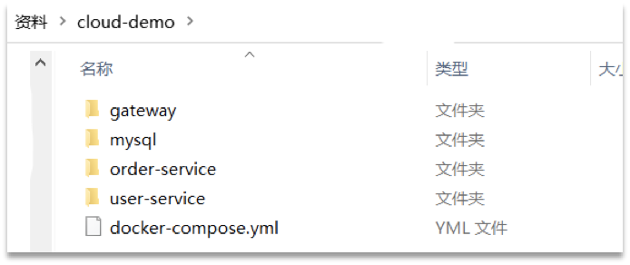

​	内容如下：

```yaml
version: "3.2"

services:
  nacos:
    image: nacos/nacos-server
    environment:
      MODE: standalone
    ports:
      - "8848:8848"
  mysql:
    image: mysql:5.7.25
    environment:
      MYSQL_ROOT_PASSWORD: 123
    volumes:
      - "$PWD/mysql/data:/var/lib/mysql"
      - "$PWD/mysql/conf:/etc/mysql/conf.d/"
  userservice:
    build: ./user-service
  orderservice:
    build: ./order-service
  gateway:
    build: ./gateway
    ports:
      - "10010:10010"
```

​	可以看到，其中包含 5 个 service 服务：

- `nacos`：作为注册中心和配置中心
  - `image: nacos/nacos-server`： 基于 nacos/nacos-server 镜像构建
  - `environment`：环境变量
    - `MODE: standalone`：单点模式启动
  - `ports`：端口映射，这里暴露了 8848 端口
- `mysql`：数据库
  - `image: mysql:5.7.25`：镜像版本是 mysql:5.7.25
  - `environment`：环境变量
    - `MYSQL_ROOT_PASSWORD: 123`：设置数据库 root 账户的密码为 123
  - `volumes`：数据卷挂载，这里挂载了 mysql 的 data、conf 目录，其中有我提前准备好的数据
- `userservice`、`orderservice`、`gateway`：都是基于 Dockerfile 临时构建的


​	查看 mysql 目录，可以看到其中已经准备好了 cloud_order、cloud_user 表：


​	查看微服务目录，可以看到都包含 Dockerfile 文件：


​	内容如下：

```dockerfile
FROM java:8-alpine
COPY ./app.jar /tmp/app.jar
ENTRYPOINT java -jar /tmp/app.jar
```


> 修改微服务配置

​	因为微服务将来要部署为 docker 容器，而容器之间互联不是通过 IP 地址，而是通过容器名。这里我们将 order-service、user-service、gateway 服务的 mysql、nacos 地址都修改为基于容器名的访问。

​	如下所示：

```yaml
spring:
  datasource:
    url: jdbc:mysql://mysql:3306/cloud_order?useSSL=false
    username: root
    password: 123
    driver-class-name: com.mysql.jdbc.Driver
  application:
    name: orderservice
  cloud:
    nacos:
      server-addr: nacos:8848 # nacos服务地址
```


> 打包

​	接下来需要将我们的每个微服务都打包。因为之前查看到 Dockerfile 中的 jar 包名称都是 app.jar，因此我们的每个微服务都需要用这个名称。

​	可以通过修改 pom.xml 中的打包名称来实现，每个微服务都需要修改：

```xml
<build>
  <!-- 服务打包的最终名称 -->
  <finalName>app</finalName>
  <plugins>
    <plugin>
      <groupId>org.springframework.boot</groupId>
      <artifactId>spring-boot-maven-plugin</artifactId>
    </plugin>
  </plugins>
</build>
```

​	打包后：

> 拷贝 jar 包到部署目录

​	编译打包好的 app.jar 文件，需要放到 Dockerfile 的同级目录中。注意：每个微服务的 app.jar 放到与服务名称对应的目录，别搞错了。

​	user-service：	order-service：	gateway：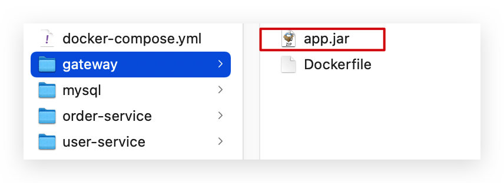

> 部署

​	最后，我们需要将文件整个 cloud-demo 文件夹上传到虚拟机中，理由 DockerCompose 部署。

​	上传到任意目录：


​	部署：

​	进入 cloud-demo 目录，然后运行下面的命令：

```sh
docker-compose up -d
```


### Docker镜像仓库 

##### 搭建私有镜像仓库

​	搭建镜像仓库可以基于 Docker 官方提供的 DockerRegistry 来实现。

​	官网地址：https://hub.docker.com/_/registry


> 简化版镜像仓库

​	Docker 官方的 Docker Registry 是一个基础版本的 Docker 镜像仓库，具备仓库管理的完整功能，但是没有图形化界面。

​	搭建方式比较简单，命令如下：

```sh
docker run -d \
    --restart=always \
    --name registry	\
    -p 5000:5000 \
    -v registry-data:/var/lib/registry \
    registry
```

​	命令中挂载了一个数据卷 registry-data 到容器内的 /var/lib/registry 目录，这是私有镜像库存放数据的目录。

​	访问http://YourIp:5000/v2/_catalog 可以查看当前私有镜像服务中包含的镜像


> 带有图形化界面版本

​	使用 DockerCompose 部署带有图象界面的 DockerRegistry，命令如下：

```yaml
version: '3.0'
services:
  registry:
    image: registry
    volumes:
      - ./registry-data:/var/lib/registry
  ui:
    image: joxit/docker-registry-ui:static
    ports:
      - 8180:80
    environment:
      - REGISTRY_TITLE=Ku_Tatsuko私有仓库
      - REGISTRY_URL=http://registry:5000
    depends_on:
      - registry
```

​	安装：

```sh
mkdir ~/Docker/registry-ui
cd ~/Docker/registry-ui
touch docker-compose.yml
docker-compose up -d
```


> 配置Docker信任地址

​	我们的私服采用的是 http 协议，默认不被 Docker 信任，所以需要做一个配置：

```sh
# 打开要修改的文件
vi /etc/docker/daemon.json
# 添加内容：
"insecure-registries":["http://192.168.24.128:8180"]
# 重加载
systemctl daemon-reload
# 重启docker
systemctl restart docker
```


##### 推送、拉取镜像

​	推送镜像到私有镜像服务必须先 tag，步骤如下：

​	① 重新 tag 本地镜像，名称前缀为私有仓库的地址：192.168.150.101:8080/

 ```sh
docker tag nginx:latest 192.168.24.128:8180/nginx:1.0 
 ```

​	② 推送镜像

```sh
docker push 192.168.24.128:8180/nginx:1.0 
```

​	③ 拉取镜像

```sh
docker pull 192.168.24.128:8180/nginx:1.0 
```


### Docker MySQL 补充

##### docker 安装 mysql8

> 查找mysql的**docker**镜像

```bash
docker search mysql
```

> 拉取镜像

```bash
docker pull mysql
```

> 查看最新版本号

```bash
mysql --version
mysql  Ver 8.0.21 for Linux on x86_64 (MySQL Community Server - GPL)
```

> 运行

```bash
mkdir -p ./mysql/conf 
mkdir -p ./mysql/logs
mkdir -p ./mysql/data

创建./mysql/conf/mysql.cnf 文件，并更新内容如下
[client]     
port=3306   
default-character-set=utf8
[mysql]   
default-character-set=utf8
[mysqld]
max_allowed_packet = 20M
#skip-grant-tables
sql_mode=STRICT_TRANS_TABLES,NO_ZERO_IN_DATE,NO_ZERO_DATE,ERROR_FOR_DIVISION_BY_ZERO,NO_ENGINE_SUBSTITUTION

运行命令启动mysql容器
docker run -p 3306:3306 --name msql -v $PWD/mysql/conf/:/etc/mysql/conf.d -v $PWD/mysql/logs:/logs  -v $PWD/mysql/data/:/var/lib/mysql -e MYSQL_ROOT_PASSWORD=123456 -d mysql


    -p 3306:3306：将容器的 3306 端口映射到主机的 3306 端口。
    -v $PWD/mysql/conf:/etc/mysql/conf.d：将主机当前目录下的 conf/my.cnf 挂载到容器的 /etc/mysql/my.cnf。
    -v $PWD/mysql/logs:/logs：将主机当前目录下的 logs 目录挂载到容器的 /logs。
    -v $PWD/mysql/data:/var/lib/mysql ：将主机当前目录下的data目录挂载到容器的 /var/lib/mysql 。
    -e MYSQL_ROOT_PASSWORD=123456：初始化 root 用户的密码。
```


##### Navicat 远程连接问题

> 如果需要远程连接mysql 3306端口，可以设置

- 建议方式

```bash
首先通过查看MySQL的的用户信息
mysql -uroot -p123456
mysql> use user;
mysql> select  host, user from user;
+-----------+------------------+
| host      | user             |
+-----------+------------------+
| %         | root             |
| localhost | mysql.infoschema |
| localhost | mysql.session    |
| localhost | mysql.sys        |
| localhost | root             |
+-----------+------------------+
5 rows in set (0.00 sec)
如果host字段均为localhost，意思是只允许本地IP访问，可以执行 
mysql> update mysql.user set host = '%' where user = 'root';
然后执行 
mysql> flush privileges;
让改动生效
例如上面的内容已经满足要求了，但是还是不能远程连接，则是因为MySql 8版本修改了默认的加密规则，用Navicat连接会报错，解决办法为执行如下语句
mysql> ALTER USER 'root'@'%' IDENTIFIED WITH mysql_native_password BY '123456';
'root'@'%' 中root为用户名，'%'为user表host字段的值。'root123'为用户密码。
然后就远程连接了
```

- 不建议使用的方式如下，虽然可以解决，但是通过本地连接会失败

```bash
docker exec -it msql /bin/bash
mysql -uroot -p123456
#授权
mysql> GRANT ALL ON *.* TO 'root'@'%';
#刷新
mysql> flush privileges;
#更新加密规则
mysql> ALTER USER 'root'@'localhost' IDENTIFIED BY 'password' PASSWORD EXPIRE NEVER;
mysql> flush privileges;
```


> 我通过 navcat 运行 sql 语句的时候出了如下的问题

- MySQL [Err] 1055 - Expression #1 of ORDER BY clause is not in GROUP BY clause

```bash
docker exec -it msql /bin/bash
mysql -uroot -p123456
#授权
mysql> select @@sql_mode;

将查询出来的内容去掉GROUP字样的字段后如下，并将如下内容放到配置文件里，重启容器
sql_mode=STRICT_TRANS_TABLES,NO_ZERO_IN_DATE,NO_ZERO_DATE,ERROR_FOR_DIVISION_BY_ZERO,NO_ENGINE_SUBSTITUTION
```

- mysql -uroot -p 本地连接时 **Access** **denied** **for** **user** ‘root’@‘localhost’ (using password: YES)

```bash
在mysql.cnf配置文件中添加 skip-grant-tables ，重启容器docker restart name
之后
docker exec -it msql /bin/bash
mysql -uroot -p123456
mysql> select @@sql_mode;
修改密码永不过期的
ALTER USER 'root'@'localhost' IDENTIFIED BY '新密码' PASSWORD EXPIRE NEVER;
mysql> select @@sql_mode;
其他：
密码有限期的
ALTER USER 'root'@'localhost' IDENTIFIED BY '新密码' PASSWORD EXPIRE;
```


# ElasticSearch

### ES 概述

##### elasticsearch 的发展

​	elasticsearch 是一款非常强大的开源搜索引擎，具备非常多强大功能，可以帮助我们从海量数据中快速找到需要的内容

​	例如：

- 在 GitHub 搜索代码

  

- 在电商网站搜索商品

  

- 在百度搜索答案

  

- 在打车软件搜索附近的车

  


> ELK 技术栈

​	elasticsearch 结合 kibana、Logstash、Beats，也就是 elastic stack（ELK）。被广泛应用在日志数据分析、实时监控等领域：


而elasticsearch是elastic stack的核心，负责存储、搜索、分析数据。


> elasticsearch 和 lucene

​	elasticsearch 底层是基于 **lucene** 来实现的。

​	**Lucene** 是一个 Java 语言的搜索引擎类库，是 Apache 公司的顶级项目，由 DougCutting 于 1999 年研发。官网地址：https://lucene.apache.org/ 。


​	**elasticsearch** 的发展历史：

- 2004 年 Shay Banon 基于 Lucene 开发了 Compass
- 2010 年 Shay Banon 重写了 Compass，取名为 Elasticsearch。


> 为何不用其他搜索技术？

​	目前比较知名的搜索引擎技术排名：


​	虽然在早期，Apache Solr 是最主要的搜索引擎技术，但随着发展 elasticsearch 已经渐渐超越了 Solr，独占鳌头：


> 总结

什么是 elasticsearch ？

- 一个开源的分布式搜索引擎，可以用来实现搜索、日志统计、分析、系统监控等功能

什么是 elastic stack（ELK）？

- 是以elasticsearch为核心的技术栈，包括b eats、Logstash、kibana、elasticsearch

什么是 Lucene？

- 是 Apache 的开源搜索引擎类库，提供了搜索引擎的核心 API


##### 倒排索引

​	倒排索引的概念是基于 MySQL 这样的正向索引而言的。

> 正向索引

​	那么什么是正向索引呢？例如给下表（tb_goods）中的 id 创建索引：

​	如果是根据 id 查询，那么直接走索引，查询速度非常快。

​	但如果是基于 title 做模糊查询，只能是逐行扫描数据，流程如下：

​		1）用户搜索数据，条件是 title 符合 `"%手机%"`

​		2）逐行获取数据，比如 id 为 1 的数据

​		3）判断数据中的 title 是否符合用户搜索条件

​		4）如果符合则放入结果集，不符合则丢弃。回到步骤 1

​	逐行扫描，也就是全表扫描，随着数据量增加，其查询效率也会越来越低。当数据量达到数百万时，就是一场灾难。


> 倒排索引

​	倒排索引中有两个非常重要的概念：

- 文档（`Document`）：用来搜索的数据，其中的每一条数据就是一个文档。例如一个网页、一个商品信息
- 词条（`Term`）：对文档数据或用户搜索数据，利用某种算法分词，得到的具备含义的词语就是词条。例如：我是中国人，就可以分为：我、是、中国人、中国、国人这样的几个词条


​	**创建倒排索引**是对正向索引的一种特殊处理，流程如下：

- 将每一个文档的数据利用算法分词，得到一个个词条
- 创建表，每行数据包括词条、词条所在文档 id、位置等信息
- 因为词条唯一性，可以给词条创建索引，例如 hash 表结构索引

​	如图：


​	倒排索引的**搜索流程**如下（以搜索"华为手机"为例）：

​		1）用户输入条件`"华为手机"`进行搜索。

​		2）对用户输入内容**分词**，得到词条：`华为`、`手机`。

​		3）拿着词条在倒排索引中查找，可以得到包含词条的文档id：1、2、3。

​		4）拿着文档 id 到正向索引中查找具体文档。

​	如图：


虽然要先查询倒排索引，再查询倒排索引，但是无论是词条、还是文档id都建立了索引，查询速度非常快！无需全表扫描。


##### 正向和倒排

​	那么为什么一个叫做正向索引，一个叫做倒排索引呢？

- **正向索引**是最传统的，根据id索引的方式。但根据词条查询时，必须先逐条获取每个文档，然后判断文档中是否包含所需要的词条，是**根据文档找词条的过程**。

- 而**倒排索引**则相反，是先找到用户要搜索的词条，根据词条得到保护词条的文档的 id，然后根据 id 获取文档。是**根据词条找文档的过程**。


​	两者方式的优缺点：

> 正向索引

- 优点：
  - 可以给多个字段创建索引
  - 根据索引字段搜索、排序速度非常快
- 缺点：
  - 根据非索引字段，或者索引字段中的部分词条查找时，只能全表扫描。

> 倒排索引

- 优点：
  - 根据词条搜索、模糊搜索时，速度非常快
- 缺点：
  - 只能给词条创建索引，而不是字段
  - 无法根据字段做排序


##### es 与 mysql 概念对比

​	elasticsearch 中有很多独有的概念，与 mysql 中略有差别，但也有相似之处。


> 文档和字段

​	elasticsearch 是面向**文档（Document）**存储的，可以是数据库中的一条商品数据，一个订单信息。文档数据会被序列化为 json 格式后存储在 elasticsearch 中：


​	而 Json 文档中往往包含很多的**字段（Field）**，类似于数据库中的列。


> 索引和映射

​	**索引（Index）**，就是相同类型的文档的集合。

​	例如：

- 所有用户文档，就可以组织在一起，称为用户的索引；
- 所有商品的文档，可以组织在一起，称为商品的索引；
- 所有订单的文档，可以组织在一起，称为订单的索引；


​	因此，我们可以把索引当做是数据库中的表。

​	数据库的表会有约束信息，用来定义表的结构、字段的名称、类型等信息。因此，索引库中就有**映射（mapping）**，是索引中文档的字段约束信息，类似表的结构约束。


> mysql 与 elasticsearch

​	我们统一的把 mysql 与 elasticsearch 的概念做一下对比：

| **MySQL** | **Elasticsearch** | **说明**                                                     |
| --------- | ----------------- | ------------------------------------------------------------ |
| Table     | Index             | 索引(index)，就是文档的集合，类似数据库的表(table)           |
| Row       | Document          | 文档（Document），就是一条条的数据，类似数据库中的行（Row），文档都是JSON格式 |
| Column    | Field             | 字段（Field），就是JSON文档中的字段，类似数据库中的列（Column） |
| Schema    | Mapping           | Mapping（映射）是索引中文档的约束，例如字段类型约束。类似数据库的表结构（Schema） |
| SQL       | DSL               | DSL是elasticsearch提供的JSON风格的请求语句，用来操作elasticsearch，实现CRUD |

​	是不是说，我们学习了 elasticsearch 就不再需要 mysql 了呢？

​	并不是如此，两者各自有自己的擅长支出：

- Mysql：擅长事务类型操作，可以确保数据的安全和一致性

- Elasticsearch：擅长海量数据的搜索、分析、计算


因此在企业中，往往是两者结合使用：

- 对安全性要求较高的写操作，使用 mysql 实现
- 对查询性能要求较高的搜索需求，使用 elasticsearch 实现
- 两者再基于某种方式，实现数据的同步，保证一致性


### 安装 elasticsearch


##### 部署单点 es

> 创建网络

​	因为我们还需要部署 kibana 容器，因此需要让 es 和 kibana 容器互联。这里先创建一个网络：

```sh
docker network create es-net
```


> 加载镜像

​	这里我们采用 elasticsearch 的 7.12.1 版本的镜像，这个镜像体积非常大，接近 1G。不建议自己pull。

​	课前资料提供了镜像的 tar 包：


​	将其上传到虚拟机中，然后运行命令加载即可：

```sh
# 导入数据
docker load -i es.tar
```

​	同理还有 `kibana` 的 tar 包也需要这样做。


> 运行

​	运行 docker 命令，部署单点 es：

```sh
docker run -d \
	--name es \
    -e "ES_JAVA_OPTS=-Xms512m -Xmx512m" \
    -e "discovery.type=single-node" \
    -v es-data:/usr/share/elasticsearch/data \
    -v es-plugins:/usr/share/elasticsearch/plugins \
    --privileged \
    --network es-net \
    -p 9200:9200 \
    -p 9300:9300 \
elasticsearch:7.12.1
```

​	命令解释：

- `-e "cluster.name=es-docker-cluster"`：设置集群名称
- `-e "http.host=0.0.0.0"`：监听的地址，可以外网访问
- `-e "ES_JAVA_OPTS=-Xms512m -Xmx512m"`：内存大小
- `-e "discovery.type=single-node"`：非集群模式
- `-v es-data:/usr/share/elasticsearch/data`：挂载逻辑卷，绑定 es 的数据目录
- `-v es-logs:/usr/share/elasticsearch/logs`：挂载逻辑卷，绑定 es 的日志目录
- `-v es-plugins:/usr/share/elasticsearch/plugins`：挂载逻辑卷，绑定 es 的插件目录
- `--privileged`：授予逻辑卷访问权
- `--network es-net` ：加入一个名为 es-net 的网络中
- `-p 9200:9200`：端口映射配置


​	在浏览器中输入：http://192.168.24.128:9200 即可看到 elasticsearch 的响应结果：


##### 部署 kibana

​	kibana 可以给我们提供一个 elasticsearch 的可视化界面，便于我们学习。

> 部署

​	运行 docker 命令，部署 kibana

```sh
docker run -d \
--name kibana \
-e ELASTICSEARCH_HOSTS=http://es:9200 \
--network=es-net \
-p 5601:5601  \
kibana:7.12.1
```

- `--network es-net` ：加入一个名为 es-net 的网络中，与 elasticsearch 在同一个网络中
- `-e ELASTICSEARCH_HOSTS=http://es:9200"`：设置 elasticsearch 的地址，因为 kibana 已经与 elasticsearch 在一个网络，因此可以用容器名直接访问 elasticsearch
- `-p 5601:5601`：端口映射配置

​	kibana 启动一般比较慢，需要多等待一会，可以通过命令：

```sh
docker logs -f kibana
```

​	查看运行日志，当查看到下面的日志，说明成功：


​	此时，在浏览器输入地址访问：http://192.168.24.128:5601，即可看到结果


> DevTools

​	kibana 中提供了一个 DevTools 界面：


​	这个界面中可以编写 DSL 来操作 elasticsearch。并且对 DSL 语句有自动补全功能。


##### 安装IK分词器

> 在线安装ik插件（较慢）

```shell
# 进入容器内部
docker exec -it elasticsearch /bin/bash

# 在线下载并安装
./bin/elasticsearch-plugin  install https://github.com/medcl/elasticsearch-analysis-ik/releases/download/v7.12.1/elasticsearch-analysis-ik-7.12.1.zip

#退出
exit
#重启容器
docker restart elasticsearch
```


> 离线安装ik插件（推荐）

​	1）查看数据卷目录

​		安装插件需要知道 elasticsearch 的 plugins 目录位置，而我们用了数据卷挂载，因此需要查看 elasticsearch 的数据卷目录，通过下面命令查看:

```sh
docker volume inspect es-plugins
```

​	显示结果：

```json
[
    {
        "CreatedAt": "2022-05-06T10:06:34+08:00",
        "Driver": "local",
        "Labels": null,
        "Mountpoint": "/var/lib/docker/volumes/es-plugins/_data",
        "Name": "es-plugins",
        "Options": null,
        "Scope": "local"
    }
]
```

​	说明 plugins 目录被挂载到了：`/var/lib/docker/volumes/es-plugins/_data `这个目录中。


​	2）解压缩分词器安装包

​		下面我们需要把课前资料中的ik分词器解压缩，重命名为 ik


​	3）上传到es容器的插件数据卷中

​		也就是`/var/lib/docker/volumes/es-plugins/_data `：

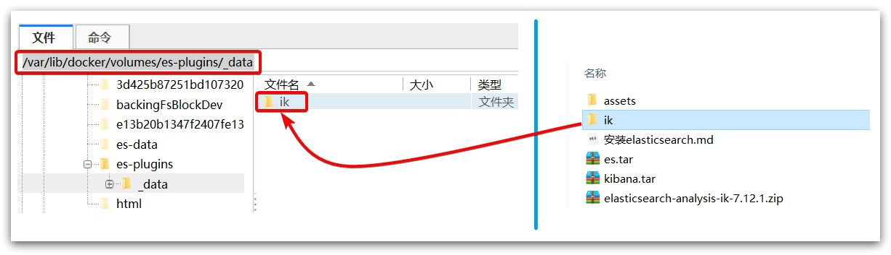


​	4）重启容器

```shell
# 4、重启容器
docker restart es
```

```sh
# 查看es日志
docker logs -f es
```


​	5）测试：

​		IK 分词器包含两种模式：

* `ik_smart`：最少切分

* `ik_max_word`：最细切分

```json
GET /_analyze
{
  "analyzer": "ik_max_word",
  "text": "黑马程序员学习java太棒了"
}
```

​	结果：

```json
{
  "tokens" : [
    {
      "token" : "黑马",
      "start_offset" : 0,
      "end_offset" : 2,
      "type" : "CN_WORD",
      "position" : 0
    },
    {
      "token" : "程序员",
      "start_offset" : 2,
      "end_offset" : 5,
      "type" : "CN_WORD",
      "position" : 1
    },
    {
      "token" : "程序",
      "start_offset" : 2,
      "end_offset" : 4,
      "type" : "CN_WORD",
      "position" : 2
    },
    {
      "token" : "员",
      "start_offset" : 4,
      "end_offset" : 5,
      "type" : "CN_CHAR",
      "position" : 3
    },
    {
      "token" : "学习",
      "start_offset" : 5,
      "end_offset" : 7,
      "type" : "CN_WORD",
      "position" : 4
    },
    {
      "token" : "java",
      "start_offset" : 7,
      "end_offset" : 11,
      "type" : "ENGLISH",
      "position" : 5
    },
    {
      "token" : "太棒了",
      "start_offset" : 11,
      "end_offset" : 14,
      "type" : "CN_WORD",
      "position" : 6
    },
    {
      "token" : "太棒",
      "start_offset" : 11,
      "end_offset" : 13,
      "type" : "CN_WORD",
      "position" : 7
    },
    {
      "token" : "了",
      "start_offset" : 13,
      "end_offset" : 14,
      "type" : "CN_CHAR",
      "position" : 8
    }
  ]
}
```


##### 扩展词词典

​	随着互联网的发展，“造词运动”也越发的频繁。出现了很多新的词语，在原有的词汇列表中并不存在。比如：“奥力给”，“传智播客” 等。

​	所以我们的词汇也需要不断的更新，IK 分词器提供了扩展词汇的功能。


​	1）打开IK分词器 config 目录：

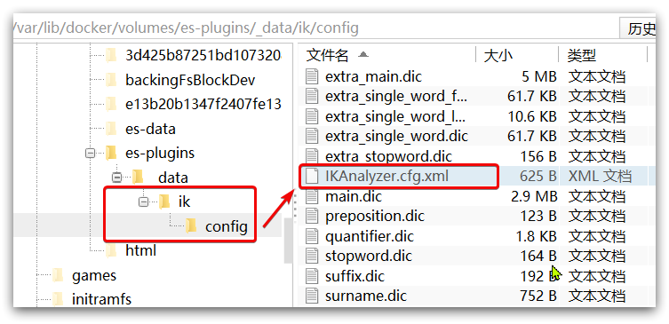

​	2）在 IKAnalyzer.cfg.xml 配置文件内容添加：

```xml
<?xml version="1.0" encoding="UTF-8"?>
<!DOCTYPE properties SYSTEM "http://java.sun.com/dtd/properties.dtd">
<properties>
        <comment>IK Analyzer 扩展配置</comment>
        <!--用户可以在这里配置自己的扩展字典 *** 添加扩展词典-->
        <entry key="ext_dict">ext.dic</entry>
</properties>
```

​	3）新建一个 ext.dic，可以参考 config 目录下复制一个配置文件进行修改

```properties
传智播客
奥力给
```

​	4）重启 elasticsearch 

```sh
docker restart es

# 查看 日志
docker logs -f elasticsearch
```


​	日志中已经成功加载ext.dic配置文件


​	5）测试效果：

```json
GET /_analyze
{
  "analyzer": "ik_max_word",
  "text": "传智播客Java就业超过90%,奥力给！"
}
```

> 注意当前文件的编码必须是 UTF-8 格式，严禁使用 Windows 记事本编辑


##### 停用词词典

​	在互联网项目中，在网络间传输的速度很快，所以很多语言是不允许在网络上传递的，如：关于宗教、政治等敏感词语，那么我们在搜索时也应该忽略当前词汇。

​	IK 分词器也提供了强大的停用词功能，让我们在索引时就直接忽略当前的停用词汇表中的内容。

​	1）IKAnalyzer.cfg.xml 配置文件内容添加：

```xml
<?xml version="1.0" encoding="UTF-8"?>
<!DOCTYPE properties SYSTEM "http://java.sun.com/dtd/properties.dtd">
<properties>
        <comment>IK Analyzer 扩展配置</comment>
        <!--用户可以在这里配置自己的扩展字典-->
        <entry key="ext_dict">ext.dic</entry>
         <!--用户可以在这里配置自己的扩展停止词字典  *** 添加停用词词典-->
        <entry key="ext_stopwords">stopword.dic</entry>
</properties>
```

​	2）在 stopword.dic 添加停用词

```properties
习大大
```

​	3）重启 elasticsearch 

```sh
# 重启服务
docker restart elasticsearch
docker restart kibana

# 查看 日志
docker logs -f elasticsearch
```

​	日志中已经成功加载stopword.dic配置文件


​	4）测试效果：

```json
GET /_analyze
{
  "analyzer": "ik_max_word",
  "text": "传智播客Java就业率超过95%,习大大都点赞,奥力给！"
}
```

> 注意当前文件的编码必须是 UTF-8 格式，严禁使用Windows记事本编辑


##### 部署es集群

​	部署 es 集群可以直接使用 docker-compose 来完成，不过要求你的 Linux 虚拟机至少有**4G**的内存空间

​	首先编写一个 docker-compose 文件，内容如下：

```sh
version: '2.2'
services:
  es01:
    image: docker.elastic.co/elasticsearch/elasticsearch:7.12.1
    container_name: es01
    environment:
      - node.name=es01
      - cluster.name=es-docker-cluster
      - discovery.seed_hosts=es02,es03
      - cluster.initial_master_nodes=es01,es02,es03
      - bootstrap.memory_lock=true
      - "ES_JAVA_OPTS=-Xms512m -Xmx512m"
    ulimits:
      memlock:
        soft: -1
        hard: -1
    volumes:
      - data01:/usr/share/elasticsearch/data
    ports:
      - 9200:9200
    networks:
      - elastic
  es02:
    image: docker.elastic.co/elasticsearch/elasticsearch:7.12.1
    container_name: es02
    environment:
      - node.name=es02
      - cluster.name=es-docker-cluster
      - discovery.seed_hosts=es01,es03
      - cluster.initial_master_nodes=es01,es02,es03
      - bootstrap.memory_lock=true
      - "ES_JAVA_OPTS=-Xms512m -Xmx512m"
    ulimits:
      memlock:
        soft: -1
        hard: -1
    volumes:
      - data02:/usr/share/elasticsearch/data
    networks:
      - elastic
  es03:
    image: docker.elastic.co/elasticsearch/elasticsearch:7.12.1
    container_name: es03
    environment:
      - node.name=es03
      - cluster.name=es-docker-cluster
      - discovery.seed_hosts=es01,es02
      - cluster.initial_master_nodes=es01,es02,es03
      - bootstrap.memory_lock=true
      - "ES_JAVA_OPTS=-Xms512m -Xmx512m"
    ulimits:
      memlock:
        soft: -1
        hard: -1
    volumes:
      - data03:/usr/share/elasticsearch/data
    networks:
      - elastic

volumes:
  data01:
    driver: local
  data02:
    driver: local
  data03:
    driver: local

networks:
  elastic:
    driver: bridge
```


​	Run `docker-compose` to bring up the cluster:

```sh
docker-compose up
```


### 索引库操作

​	索引库就类似数据库表，mapping 映射就类似表的结构。

​	我们要向 es 中存储数据，必须先创建“库”和“表”。

​	es 官方手册：https://www.elastic.co/guide/en/elasticsearch/reference/current/index.html


##### mapping 映射属性

​	mapping 是对索引库中文档的约束，常见的 mapping 属性包括：

- type：字段数据类型，常见的简单类型有：
  - 字符串：text（可分词的文本）、keyword（精确值，例如：品牌、国家、ip地址）
  - 数值：long、integer、short、byte、double、float、
  - 布尔：boolean
  - 日期：date
  - 对象：object
- index：是否创建索引，默认为 true
- analyzer：使用哪种分词器
- properties：该字段的子字段


​	例如下面的 json 文档：

```json
{
    "age": 21,
    "weight": 52.1,
    "isMarried": false,
    "info": "黑马程序员Java讲师",
    "email": "zy@itcast.cn",
    "score": [99.1, 99.5, 98.9],
    "name": {
        "firstName": "云",
        "lastName": "赵"
    }
}
```

​	对应的每个字段映射（mapping）：

- age：类型为 integer；参与搜索，因此需要index为true；无需分词器
- weight：类型为float；参与搜索，因此需要index为true；无需分词器
- isMarried：类型为boolean；参与搜索，因此需要index为true；无需分词器
- info：类型为字符串，需要分词，因此是text；参与搜索，因此需要index为true；分词器可以用ik_smart
- email：类型为字符串，但是不需要分词，因此是keyword；不参与搜索，因此需要index为false；无需分词器
- score：虽然是数组，但是我们只看元素的类型，类型为float；参与搜索，因此需要index为true；无需分词器
- name：类型为object，需要定义多个子属性
  - name.firstName；类型为字符串，但是不需要分词，因此是keyword；参与搜索，因此需要index为true；无需分词器
  - name.lastName；类型为字符串，但是不需要分词，因此是keyword；参与搜索，因此需要index为true；无需分词器


##### 创建索引库和映射

​	统一使用 Kibana 编写 DSL 的方式演示。


> 基本语法：

- 请求方式：PUT
- 请求路径：/索引库名，可以自定义
- 请求参数：mapping 映射


> 格式：

```json
PUT /索引库名称
{
  "mappings": {
    "properties": {
      "字段名":{
        "type": "text",
        "analyzer": "ik_smart"
      },
      "字段名2":{
        "type": "keyword",
        "index": "false"
      },
      "字段名3":{
        "properties": {
          "子字段": {
            "type": "keyword"
          }
        }
      },
      // ...略
    }
  }
}
```


> 示例：

```sh
#创建索引库
PUT /ktsk
{
  "mappings": {
    "properties": {
      "info": {
        "type": "text",
        "analyzer": "ik_smart"
      },
      "email": {
        "type": "keyword",
        "index": false
      },
      "name": {
        "type": "object",
        "properties": {
          "firstName": {
            "type": "keyword"
          },
          "lastName": {
            "type": "keyword"
          }
        }
      }
    }
  }
}
```


##### 查询索引库

> 基本语法：

- 请求方式：GET
- 请求路径：/索引库名
- 请求参数：无

> 格式：

```
GET /索引库名
```


##### 修改索引库

​	倒排索引结构虽然不复杂，但是一旦数据结构改变（比如改变了分词器），就需要重新创建倒排索引，这简直是灾难。因此索引库**一旦创建，无法修改 mapping**。

​	虽然无法修改 mapping 中已有的字段，但是却允许添加新的字段到 mapping 中，因为不会对倒排索引产生影响。

> 语法说明：

```json
PUT /索引库名/_mapping
{
  "properties": {
    "新字段名":{
      "type": "integer"
    }
  }
}
```


##### 删除索引库

> 语法：

- 请求方式：DELETE

- 请求路径：/索引库名

- 请求参数：无

> 格式：

```
DELETE /索引库名
```


##### 总结

- 创建索引库：PUT /索引库名
- 查询索引库：GET /索引库名
- 删除索引库：DELETE /索引库名
- 添加字段：PUT /索引库名/_mapping

 

### 文档操作

##### 新增文档

> **语法：**

```json
POST /索引库名/_doc/文档id
{
    "字段1": "值1",
    "字段2": "值2",
    "字段3": {
        "子属性1": "值3",
        "子属性2": "值4"
    },
    // ...
}
```

> **示例：**

```json
POST /heima/_doc/1
{
    "info": "黑马程序员Java讲师",
    "email": "zy@itcast.cn",
    "name": {
        "firstName": "云",
        "lastName": "赵"
    }
}
```

> **响应：**


##### 查询文档

​	根据 rest 风格，新增是 post，查询应该是 get，不过查询一般都需要条件，这里我们把文档 id 带上。

> **语法：**

```json
GET /{索引库名称}/_doc/{id}
```

> **通过 kibana 查看数据：**

```js
GET /heima/_doc/1
```

> **查看结果：**


##### 删除文档

​	删除使用 DELETE 请求，同样，需要根据 id 进行删除：

> **语法：**

```js
DELETE /{索引库名}/_doc/id值
```

> **示例：**

```json
# 根据id删除数据
DELETE /heima/_doc/1
```

> **结果：**

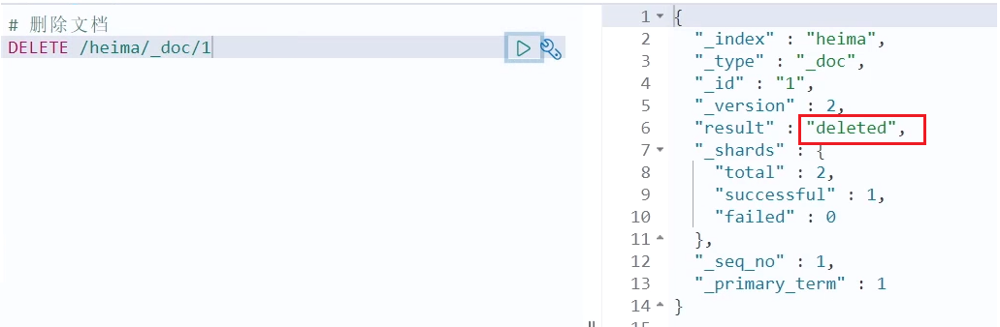


##### 修改文档

修改有两种方式：

- 全量修改：直接覆盖原来的文档
- 增量修改：修改文档中的部分字段


> 全量修改

​	全量修改是覆盖原来的文档，其本质是：

- 根据指定的id删除文档
- 新增一个相同id的文档

​	**注意**：如果根据id删除时，id不存在，第二步的新增也会执行，也就从修改变成了新增操作了。

​	**语法：**

```json
PUT /{索引库名}/_doc/文档id
{
    "字段1": "值1",
    "字段2": "值2",
    // ... 略
}

```

​	**示例：**

```json
PUT /heima/_doc/1
{
    "info": "黑马程序员高级Java讲师",
    "email": "zy@itcast.cn",
    "name": {
        "firstName": "云",
        "lastName": "赵"
    }
}
```


> 增量修改

​	增量修改是只修改指定 id 匹配的文档中的部分字段。

​	**语法：**

```json
POST /{索引库名}/_update/文档id
{
    "doc": {
         "字段名": "新的值",
    }
}
```

​	**示例：**

```json
POST /heima/_update/1
{
  "doc": {
    "email": "ZhaoYun@itcast.cn"
  }
}
```


##### 总结

​	文档操作有哪些？

- 创建文档：POST /{索引库名}/_doc/文档id   { json文档 }
- 查询文档：GET /{索引库名}/_doc/文档id
- 删除文档：DELETE /{索引库名}/_doc/文档id
- 修改文档：
  - 全量修改：PUT /{索引库名}/_doc/文档id { json文档 }
  - 增量修改：POST /{索引库名}/_update/文档id { "doc": {字段}}


### RestAPI 索引库操作

​	ES 官方提供了各种不同语言的客户端，用来操作 ES。这些客户端的本质就是组装 DSL 语句，通过 http 请求发送给 ES。官方文档地址：https://www.elastic.co/guide/en/elasticsearch/client/index.html

​	其中的 Java Rest Client 又包括两种：

- Java Low Level Rest Client
- Java High Level Rest Client

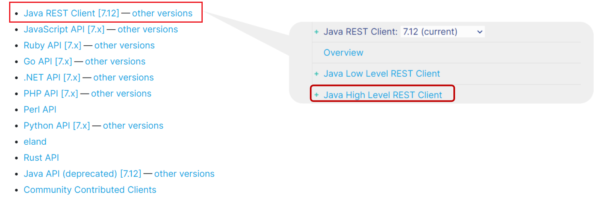

​	此次学习的是 Java HighLevel Rest Client 客户端 API（更多封装，更易用）


##### 导入Demo工程

> 导入数据

​	首先导入课前资料提供的数据库数据：

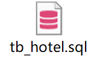 

​	数据结构如下：

```sql
CREATE TABLE `tb_hotel` (
  `id` bigint(20) NOT NULL COMMENT '酒店id',
  `name` varchar(255) NOT NULL COMMENT '酒店名称；例：7天酒店',
  `address` varchar(255) NOT NULL COMMENT '酒店地址；例：航头路',
  `price` int(10) NOT NULL COMMENT '酒店价格；例：329',
  `score` int(2) NOT NULL COMMENT '酒店评分；例：45，就是4.5分',
  `brand` varchar(32) NOT NULL COMMENT '酒店品牌；例：如家',
  `city` varchar(32) NOT NULL COMMENT '所在城市；例：上海',
  `star_name` varchar(16) DEFAULT NULL COMMENT '酒店星级，从低到高分别是：1星到5星，1钻到5钻',
  `business` varchar(255) DEFAULT NULL COMMENT '商圈；例：虹桥',
  `latitude` varchar(32) NOT NULL COMMENT '纬度；例：31.2497',
  `longitude` varchar(32) NOT NULL COMMENT '经度；例：120.3925',
  `pic` varchar(255) DEFAULT NULL COMMENT '酒店图片；例:/img/1.jpg',
  PRIMARY KEY (`id`)
) ENGINE=InnoDB DEFAULT CHARSET=utf8mb4;
```


> 导入项目

​	然后导入课前资料提供的项目:

 

​	项目结构如图：


> mapping 映射分析

​	创建索引库，最关键的是 mapping 映射，而 mapping 映射要考虑的信息包括：

- 字段名
- 字段数据类型
- 是否参与搜索
- 是否需要分词
- 如果分词，分词器是什么？

其中：

- 字段名、字段数据类型，可以参考数据表结构的名称和类型
- 是否参与搜索要分析业务来判断，例如图片地址，就无需参与搜索
- 是否分词呢要看内容，内容如果是一个整体就无需分词，反之则要分词
- 分词器，可以统一使用 ik_max_word


​	酒店数据的索引库结构:

```json
PUT /hotel
{
  "mappings": {
    "properties": {
      "id": {
        "type": "keyword"
      },
      "name":{
        "type": "text",
        "analyzer": "ik_max_word",
        "copy_to": "all"
      },
      "address":{
        "type": "keyword",
        "index": false
      },
      "price":{
        "type": "integer"
      },
      "score":{
        "type": "integer"
      },
      "brand":{
        "type": "keyword",
        "copy_to": "all"
      },
      "city":{
        "type": "keyword",
        "copy_to": "all"
      },
      "starName":{
        "type": "keyword"
      },
      "business":{
        "type": "keyword"
      },
      "location":{
        "type": "geo_point"
      },
      "pic":{
        "type": "keyword",
        "index": false
      },
      "all":{
        "type": "text",
        "analyzer": "ik_max_word"
      }
    }
  }
}
```


​	几个特殊字段说明：

- location：地理坐标，里面包含精度、纬度
- all：一个组合字段，其目的是将多字段的值 利用copy_to合并，提供给用户搜索


​	地理坐标说明：


​	copy_to 说明：

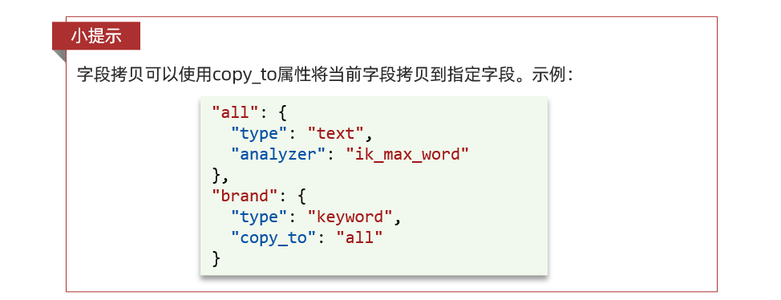


##### 初始化 RestClient

​	在 elasticsearch 提供的 API 中，与 elasticsearch 一切交互都封装在一个名为 RestHighLevelClient 的类中，必须先完成这个对象的初始化，建立与 elasticsearch 的连接。

​	分为三步：

​	1）引入 es 的 RestHighLevelClient 依赖：

```xml
<dependency>
    <groupId>org.elasticsearch.client</groupId>
    <artifactId>elasticsearch-rest-high-level-client</artifactId>
</dependency>
```


​	2）因为 SpringBoot 默认的 ES 版本是 7.6.2，所以我们需要覆盖默认的 ES 版本：

```xml
<properties>
    <java.version>1.8</java.version>
    <elasticsearch.version>7.12.1</elasticsearch.version>
</properties>
```


​	3）初始化 RestHighLevelClient：

​		初始化的代码如下：

```java
RestHighLevelClient client = new RestHighLevelClient(RestClient.builder(
        HttpHost.create("http://192.168.150.101:9200")
));
```


​	为了单元测试方便，创建一个测试类 HotelIndexTest，将初始化的代码编写在 @BeforeEach方法中：

```java
package cn.itcast.hotel;

import org.apache.http.HttpHost;
import org.elasticsearch.client.RestHighLevelClient;
import org.junit.jupiter.api.AfterEach;
import org.junit.jupiter.api.BeforeEach;
import org.junit.jupiter.api.Test;

import java.io.IOException;

public class HotelIndexTest {
    private RestHighLevelClient client;

    @BeforeEach
    void setUp() {
        this.client = new RestHighLevelClient(RestClient.builder(
                HttpHost.create("http://192.168.150.101:9200")
        ));
    }

    @AfterEach
    void tearDown() throws IOException {
        this.client.close();
    }
}
```


##### 创建索引库

> 代码解读

​	创建索引库的 API 如下：


​	代码分为三步：

- 1）创建 Request 对象。因为是创建索引库的操作，因此 Request 是 CreateIndexRequest。
- 2）添加请求参数，其实就是 DSL 的 JSON 参数部分。因为 json 字符串很长，这里是定义了静态字符串常量 MAPPING_TEMPLATE，让代码看起来更加优雅。
- 3）发送请求，client.indices() 方法的返回值是 IndicesClient 类型，封装了所有与索引库操作有关的方法。


> 完整示例

​	在 hotel-demo 的 cn.itcast.hotel.constants 包下，创建一个类，定义 mapping 映射的 JSON 字符串常量：

```java
package cn.itcast.hotel.constants;

public class HotelConstants {
    public static final String MAPPING_TEMPLATE = "{\n" +
            "  \"mappings\": {\n" +
            "    \"properties\": {\n" +
            "      \"id\": {\n" +
            "        \"type\": \"keyword\"\n" +
            "      },\n" +
            "      \"name\":{\n" +
            "        \"type\": \"text\",\n" +
            "        \"analyzer\": \"ik_max_word\",\n" +
            "        \"copy_to\": \"all\"\n" +
            "      },\n" +
            "      \"address\":{\n" +
            "        \"type\": \"keyword\",\n" +
            "        \"index\": false\n" +
            "      },\n" +
            "      \"price\":{\n" +
            "        \"type\": \"integer\"\n" +
            "      },\n" +
            "      \"score\":{\n" +
            "        \"type\": \"integer\"\n" +
            "      },\n" +
            "      \"brand\":{\n" +
            "        \"type\": \"keyword\",\n" +
            "        \"copy_to\": \"all\"\n" +
            "      },\n" +
            "      \"city\":{\n" +
            "        \"type\": \"keyword\",\n" +
            "        \"copy_to\": \"all\"\n" +
            "      },\n" +
            "      \"starName\":{\n" +
            "        \"type\": \"keyword\"\n" +
            "      },\n" +
            "      \"business\":{\n" +
            "        \"type\": \"keyword\"\n" +
            "      },\n" +
            "      \"location\":{\n" +
            "        \"type\": \"geo_point\"\n" +
            "      },\n" +
            "      \"pic\":{\n" +
            "        \"type\": \"keyword\",\n" +
            "        \"index\": false\n" +
            "      },\n" +
            "      \"all\":{\n" +
            "        \"type\": \"text\",\n" +
            "        \"analyzer\": \"ik_max_word\"\n" +
            "      }\n" +
            "    }\n" +
            "  }\n" +
            "}";
}
```


​	在 hotel-demo 中的 HotelIndexTest 测试类中，编写单元测试，实现创建索引：

```java
@Test
void createHotelIndex() throws IOException {
    // 1.创建Request对象
    CreateIndexRequest request = new CreateIndexRequest("hotel");
    // 2.准备请求的参数：DSL语句
    request.source(MAPPING_TEMPLATE, XContentType.JSON);
    // 3.发送请求
    client.indices().create(request, RequestOptions.DEFAULT);
}
```


##### 删除索引库

​	删除索引库的 DSL 语句非常简单：

```json
DELETE /hotel
```

​	与创建索引库相比：

- 请求方式从 PUT 变为 DELTE
- 请求路径不变
- 无请求参数

​	所以代码的差异，主要体现在 Request 对象上。依然是三步走：

- 1）创建 Request 对象。这次是 DeleteIndexRequest 对象
- 2）准备参数。这里是无参
- 3）发送请求。改用 delete 方法

​	在 hotel-demo 中的 HotelIndexTest 测试类中，编写单元测试，实现删除索引：

```java
@Test
void testDeleteHotelIndex() throws IOException {
    // 1.创建Request对象
    DeleteIndexRequest request = new DeleteIndexRequest("hotel");
    // 2.发送请求
    client.indices().delete(request, RequestOptions.DEFAULT);
}
```


##### 判断索引库是否存在

​	判断索引库是否存在，本质就是查询，对应的 DSL 是：

```json
GET /hotel
```


​	因此与删除的 Java 代码流程是类似的。依然是三步走：

- 1）创建 Request 对象。这次是 GetIndexRequest 对象
- 2）准备参数。这里是无参
- 3）发送请求。改用 exists 方法

```java
@Test
void testExistsHotelIndex() throws IOException {
    // 1.创建Request对象
    GetIndexRequest request = new GetIndexRequest("hotel");
    // 2.发送请求
    boolean exists = client.indices().exists(request, RequestOptions.DEFAULT);
    // 3.输出
    System.err.println(exists ? "索引库已经存在！" : "索引库不存在！");
}
```


##### 总结

​	JavaRestClient 操作 elasticsearch 的流程基本类似。核心是 client.indices() 方法来获取索引库的操作对象。

​	索引库操作的基本步骤：

- 初始化 RestHighLevelClient
- 创建 XxxIndexRequest。XXX 是 Create、Get、Delete
- 准备 DSL（ Create 时需要，其它是无参）
- 发送请求。调用 RestHighLevelClient#indices().xxx() 方法，xxx 是 create、exists、delete


### RestAPI 文档操作

​	为了与索引库操作分离，再次添加一个测试类，做两件事情：

- 初始化 RestHighLevelClient
- 我们的酒店数据在数据库，需要利用 IHotelService 去查询，所以注入这个接口

```java
package cn.itcast.hotel;

import cn.itcast.hotel.pojo.Hotel;
import cn.itcast.hotel.service.IHotelService;
import org.junit.jupiter.api.AfterEach;
import org.junit.jupiter.api.BeforeEach;
import org.junit.jupiter.api.Test;
import org.springframework.beans.factory.annotation.Autowired;
import org.springframework.boot.test.context.SpringBootTest;

import java.io.IOException;
import java.util.List;

@SpringBootTest
public class HotelDocumentTest {
    @Autowired
    private IHotelService hotelService;

    private RestHighLevelClient client;

    @BeforeEach
    void setUp() {
        this.client = new RestHighLevelClient(RestClient.builder(
                HttpHost.create("http://192.168.150.101:9200")
        ));
    }

    @AfterEach
    void tearDown() throws IOException {
        this.client.close();
    }
}

```


##### 新增文档

​	需求：将数据库的酒店数据查询出来，写入 elasticsearch 中。

> 索引库实体类

​	数据库查询后的结果是一个 Hotel 类型的对象。结构如下：

```java
@Data
@TableName("tb_hotel")
public class Hotel {
    @TableId(type = IdType.INPUT)
    private Long id;
    private String name;
    private String address;
    private Integer price;
    private Integer score;
    private String brand;
    private String city;
    private String starName;
    private String business;
    private String longitude;
    private String latitude;
    private String pic;
}
```

​	与索引库结构存在差异：

- longitude 和 latitude 需要合并为 location

​	因此，需要定义一个新的类型，与索引库结构吻合：

```java
package cn.itcast.hotel.pojo;

import lombok.Data;
import lombok.NoArgsConstructor;

@Data
@NoArgsConstructor
public class HotelDoc {
    private Long id;
    private String name;
    private String address;
    private Integer price;
    private Integer score;
    private String brand;
    private String city;
    private String starName;
    private String business;
    private String location;
    private String pic;

    public HotelDoc(Hotel hotel) {
        this.id = hotel.getId();
        this.name = hotel.getName();
        this.address = hotel.getAddress();
        this.price = hotel.getPrice();
        this.score = hotel.getScore();
        this.brand = hotel.getBrand();
        this.city = hotel.getCity();
        this.starName = hotel.getStarName();
        this.business = hotel.getBusiness();
        this.location = hotel.getLatitude() + ", " + hotel.getLongitude();
        this.pic = hotel.getPic();
    }
}

```


> 语法说明

​	新增文档的 DSL 语句如下：

```json
POST /{索引库名}/_doc/1
{
    "name": "Jack",
    "age": 21
}
```

​	对应的 java 代码如图：


​	可以看到与创建索引库类似，同样是三步走：

- 1）创建 Request 对象
- 2）准备请求参数，也就是 DSL 中的 JSON 文档
- 3）发送请求

​	变化的地方在于，这里直接使用 client.xxx() 的 API，不再需要 client.indices() 了。


> 完整代码

​	导入酒店数据，基本流程一致，但是需要考虑几点变化：

- 酒店数据来自于数据库，我们需要先查询出来，得到 hotel 对象
- hotel 对象需要转为 HotelDoc 对象
- HotelDoc 需要序列化为 json 格式

​	

​	因此，代码整体步骤如下：

- 1）根据id查询酒店数据 Hotel
- 2）将 Hotel 封装为 HotelDoc
- 3）将 HotelDoc 序列化为 JSON
- 4）创建 IndexRequest，指定索引库名和 id
- 5）准备请求参数，也就是 JSON 文档
- 6）发送请求


​	在 hotel-demo 的 HotelDocumentTest 测试类中，编写单元测试：

```java
@Test
void testAddDocument() throws IOException {
    // 1.根据id查询酒店数据
    Hotel hotel = hotelService.getById(61083L);
    // 2.转换为文档类型
    HotelDoc hotelDoc = new HotelDoc(hotel);
    // 3.将HotelDoc转json
    String json = JSON.toJSONString(hotelDoc);

    // 4.准备Request对象
    IndexRequest request = new IndexRequest("hotel").id(hotelDoc.getId().toString());
    // 5.准备Json文档
    request.source(json, XContentType.JSON);
    // 6.发送请求
    client.index(request, RequestOptions.DEFAULT);
}
```


##### 查询文档

> 语法说明

​	查询的 DSL 语句如下：

```json
GET /hotel/_doc/{id}
```

​	非常简单，因此代码大概分两步：

- 准备Request对象
- 发送请求

​	不过查询的目的是得到结果，解析为 HotelDoc，因此难点是结果的解析。完整代码如下：


​	可以看到，结果是一个 JSON，其中文档放在一个`_source`属性中，因此解析就是拿到`_source`，反序列化为 Java 对象即可。

​	与之前类似，也是三步走：

- 1）准备 Request 对象。这次是查询，所以是 GetRequest
- 2）发送请求，得到结果。因为是查询，这里调用 client.get() 方法
- 3）解析结果，就是对 JSON 做反序列化


> 完整代码

​	在 hotel-demo 的 HotelDocumentTest 测试类中，编写单元测试：

```java
@Test
void testGetDocumentById() throws IOException {
    // 1.准备Request
    GetRequest request = new GetRequest("hotel", "61082");
    // 2.发送请求，得到响应
    GetResponse response = client.get(request, RequestOptions.DEFAULT);
    // 3.解析响应结果
    String json = response.getSourceAsString();

    HotelDoc hotelDoc = JSON.parseObject(json, HotelDoc.class);
    System.out.println(hotelDoc);
}
```


##### 修改文档

> 语法说明

​	修改我们讲过两种方式：

- 全量修改：本质是先根据 id 删除，再新增
- 增量修改：修改文档中的指定字段值


​	在 RestClient 的 API 中，全量修改与新增的 API 完全一致，判断依据是 ID：

- 如果新增时，ID 已经存在，则修改
- 如果新增时，ID 不存在，则新增

​	这里不再赘述，我们主要关注增量修改。

​	代码示例如图：


​	与之前类似，也是三步走：

- 1）准备 Request 对象。这次是修改，所以是 UpdateRequest
- 2）准备参数。也就是 JSON 文档，里面包含要修改的字段
- 3）更新文档。这里调用 client.update() 方法


> 完整代码

​	在 hotel-demo 的 HotelDocumentTest 测试类中，编写单元测试：

```java
@Test
void testUpdateDocument() throws IOException {
    // 1.准备Request
    UpdateRequest request = new UpdateRequest("hotel", "61083");
    // 2.准备请求参数
    request.doc(
        "price", "952",
        "starName", "四钻"
    );
    // 3.发送请求
    client.update(request, RequestOptions.DEFAULT);
}
```


##### 删除文档

​	删除的 DSL 为：

```json
DELETE /hotel/_doc/{id}
```

​	与查询相比，仅仅是请求方式从 GET 变成 DELETE，可以想象 Java 代码应该依然是三步走：

- 1）准备 Request 对象，因为是删除，这次是 DeleteRequest 对象。要指定索引库名和 id
- 2）准备参数，无参
- 3）发送请求。因为是删除，所以是 client.delete() 方法


​	在 hotel-demo 的 HotelDocumentTest 测试类中，编写单元测试：

```java
@Test
void testDeleteDocument() throws IOException {
    // 1.准备Request
    DeleteRequest request = new DeleteRequest("hotel", "61083");
    // 2.发送请求
    client.delete(request, RequestOptions.DEFAULT);
}
```


##### 批量导入文档

​	案例需求：利用 BulkRequest 批量将数据库数据导入到索引库中。

​	步骤如下：

- 利用 mybatis-plus 查询酒店数据

- 将查询到的酒店数据（Hotel）转换为文档类型数据（HotelDoc）

- 利用 JavaRestClient 中的 BulkRequest 批处理，实现批量新增文档


> 语法说明

​	批量处理 BulkRequest，其本质就是将多个普通的 CRUD 请求组合在一起发送。

​	其中提供了一个 add 方法，用来添加其他请求：


​	可以看到，能添加的请求包括：

- IndexRequest，也就是新增
- UpdateRequest，也就是修改
- DeleteRequest，也就是删除

​	因此 Bulk 中添加了多个 IndexRequest，就是批量新增功能了。示例：


​	其实还是三步走：

- 1）创建 Request 对象。这里是 BulkRequest
- 2）准备参数。批处理的参数，就是其它 Request 对象，这里就是多个 IndexRequest
- 3）发起请求。这里是批处理，调用的方法为 client.bulk() 方法

​	我们在导入酒店数据时，将上述代码改造成for循环处理即可。


> 完整代码

​	在 hotel-demo 的 HotelDocumentTest 测试类中，编写单元测试：

```java
@Test
void testBulkRequest() throws IOException {
    // 批量查询酒店数据
    List<Hotel> hotels = hotelService.list();

    // 1.创建Request
    BulkRequest request = new BulkRequest();
    // 2.准备参数，添加多个新增的Request
    for (Hotel hotel : hotels) {
        // 2.1.转换为文档类型HotelDoc
        HotelDoc hotelDoc = new HotelDoc(hotel);
        // 2.2.创建新增文档的Request对象
        request.add(new IndexRequest("hotel")
                    .id(hotelDoc.getId().toString())
                    .source(JSON.toJSONString(hotelDoc), XContentType.JSON));
    }
    // 3.发送请求
    client.bulk(request, RequestOptions.DEFAULT);
}
```


##### 小结

文档操作的基本步骤：

- 初始化RestHighLevelClient
- 创建XxxRequest。XXX是Index、Get、Update、Delete、Bulk
- 准备参数（Index、Update、Bulk时需要）
- 发送请求。调用RestHighLevelClient#.xxx()方法，xxx是index、get、update、delete、bulk
- 解析结果（Get时需要）


### DSL 查询文档

​	以上部分已经导入了大量数据到 elasticsearch 中，实现了 elasticsearch 的数据存储功能。但 elasticsearch 最擅长的还是搜索和数据分析。所以以下则为 elasticsearch 的数据搜索功能，分别使用 **DSL** 和 **RestClient** 实现搜索。


##### DSL查询分类

​	Elasticsearch 提供了基于 JSON 的 DSL（[Domain Specific Language](https://www.elastic.co/guide/en/elasticsearch/reference/current/query-dsl.html)）来定义查询。常见的查询类型包括：

- **查询所有**：查询出所有数据，一般测试用。例如：match_all

- **全文检索（full text）查询**：利用分词器对用户输入内容分词，然后去倒排索引库中匹配。例如：
  - match_query
  - multi_match_query
- **精确查询**：根据精确词条值查找数据，一般是查找keyword、数值、日期、boolean等类型字段。例如：
  - ids
  - range
  - term
- **地理（geo）查询**：根据经纬度查询。例如：
  - geo_distance
  - geo_bounding_box
- **复合（compound）查询**：复合查询可以将上述各种查询条件组合起来，合并查询条件。例如：
  - bool
  - function_score


​	查询的语法基本一致：

```json
GET /indexName/_search
{
  "query": {
    "查询类型": {
      "查询条件": "条件值"
    }
  }
}
```

​	以查询所有为例，其中：

- 查询类型为 match_all
- 没有查询条件

```json
// 查询所有
GET /indexName/_search
{
  "query": {
    "match_all": {
    }
  }
}
```

​	其它查询无非就是**查询类型**、**查询条件**的变化。


##### 全文检索查询

> 使用场景

​	全文检索查询的基本流程如下：

- 对用户搜索的内容做分词，得到词条
- 根据词条去倒排索引库中匹配，得到文档 id
- 根据文档 id 找到文档，返回给用户

​	比较常用的场景包括：

- 商城的输入框搜索
- 百度输入框搜索

​	例如京东：

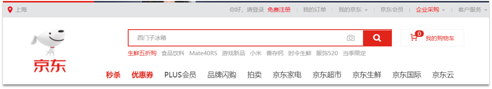

​	因为是拿着词条去匹配，因此参与搜索的字段也必须是可分词的 text 类型的字段。


> 基本语法

​	常见的全文检索查询包括：

- match 查询：单字段查询
- multi_match 查询：多字段查询，任意一个字段符合条件就算符合查询条件

​	match 查询语法如下：

```json
GET /indexName/_search
{
  "query": {
    "match": {
      "FIELD": "TEXT"
    }
  }
}
```

​	mulit_match 语法如下：

```json
GET /indexName/_search
{
  "query": {
    "multi_match": {
      "query": "TEXT",
      "fields": ["FIELD1", " FIELD12"]
    }
  }
}
```


> 示例

​	match 查询示例：

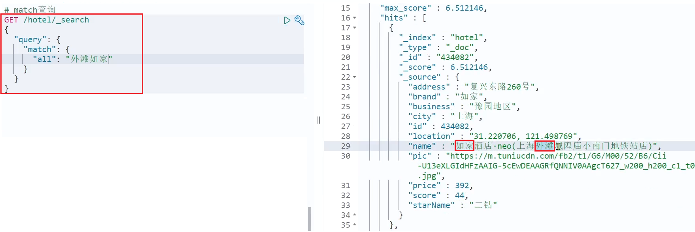


​	multi_match 查询示例：

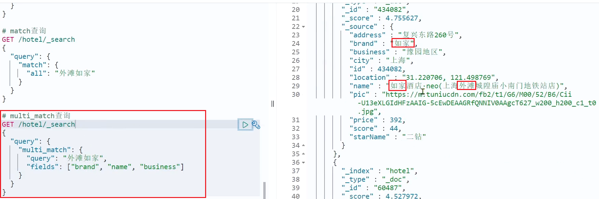


​	可以看到，两种查询结果是一样的，为什么？

​	因为我们将 brand、name、business 值都利用 copy_to 复制到了 all 字段中。因此你根据三个字段搜索，和根据 all 字段搜索效果当然一样了。

​	但是，搜索字段越多，对查询性能影响越大，因此建议采用 copy_to，然后单字段查询的方式。


> 总结

​	match 和 multi_match 的区别是什么？

- match：根据一个字段查询
- multi_match：根据多个字段查询，参与查询字段越多，查询性能越差


##### 精准查询

​	精确查询一般是查找 keyword、数值、日期、boolean 等类型字段。所以**不会**对搜索条件分词。常见的有：

- term：根据词条精确值查询
- range：根据值的范围查询


> term 查询

​	因为精确查询的字段搜是不分词的字段，因此查询的条件也必须是**不分词**的词条。查询时，用户输入的内容跟自动值完全匹配时才认为符合条件。如果用户输入的内容过多，反而搜索不到数据。

​	语法说明：

```json
// term查询
GET /indexName/_search
{
  "query": {
    "term": {
      "FIELD": {
        "value": "VALUE"
      }
    }
  }
}
```


​	示例：

​		当搜索的是精确词条时，能正确查询出结果：

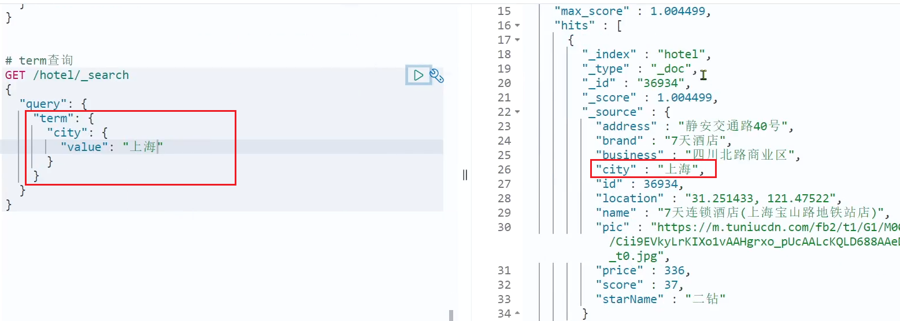

​	但是，当搜索的内容不是词条，而是多个词语形成的短语时，反而搜索不到：

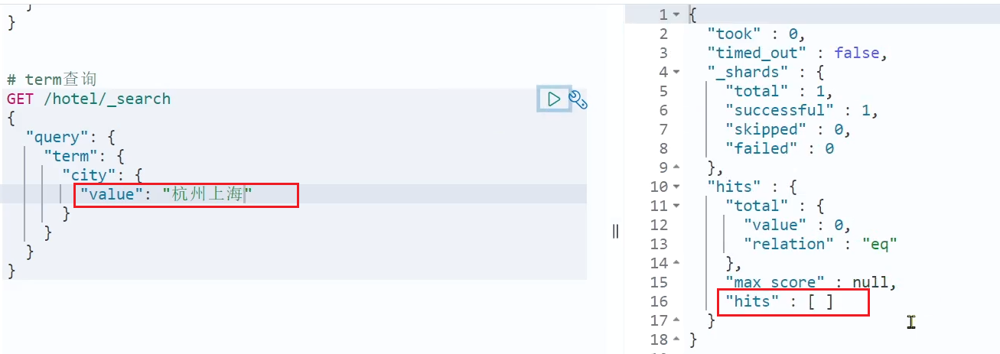


> range 查询

​	范围查询，一般应用在对数值类型做范围过滤的时候。比如做价格范围过滤。

​	基本语法：

```json
// range查询
GET /indexName/_search
{
  "query": {
    "range": {
      "FIELD": {
        "gte": 10, // 这里的gte代表大于等于，gt则代表大于
        "lte": 20 // lte代表小于等于，lt则代表小于
      }
    }
  }
}
```

​	示例：

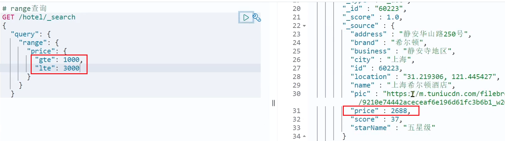


> 总结

精确查询常见的有哪些？

- term 查询：根据词条精确匹配，一般搜索 keyword 类型、数值类型、布尔类型、日期类型字段
- range 查询：根据数值范围查询，可以是数值、日期的范围


##### 地理坐标查询

​	所谓的地理坐标查询，其实就是根据经纬度查询，官方文档：https://www.elastic.co/guide/en/elasticsearch/reference/current/geo-queries.html

​	常见的使用场景包括：

- 携程：搜索我附近的酒店
- 滴滴：搜索我附近的出租车
- 微信：搜索我附近的人


​	附近的酒店：

 

​	附近的车：

 


> 矩形范围查询

​	矩形范围查询，也就是 geo_bounding_box 查询，查询坐标落在某个矩形范围的所有文档：


​	查询时，需要指定矩形的**左上**、**右下**两个点的坐标，然后画出一个矩形，落在该矩形内的都是符合条件的点。

​	语法如下：

```json
// geo_bounding_box查询
GET /indexName/_search
{
  "query": {
    "geo_bounding_box": {
      "FIELD": {
        "top_left": { // 左上点
          "lat": 31.1,
          "lon": 121.5
        },
        "bottom_right": { // 右下点
          "lat": 30.9,
          "lon": 121.7
        }
      }
    }
  }
}
```

​	这种并不符合“附近的人”这样的需求，所以就不做了。


> 附近查询

​	附近查询，也叫做距离查询（geo_distance）：查询到指定中心点小于某个距离值的所有文档。

​	换句话来说，在地图上找一个点作为圆心，以指定距离为半径，画一个圆，落在圆内的坐标都算符合条件：


​	语法说明：

```json
// geo_distance 查询
GET /indexName/_search
{
  "query": {
    "geo_distance": {
      "distance": "15km", // 半径
      "FIELD": "31.21,121.5" // 圆心
    }
  }
}
```


​	示例：

​		搜索陆家嘴附近 15km 的酒店：

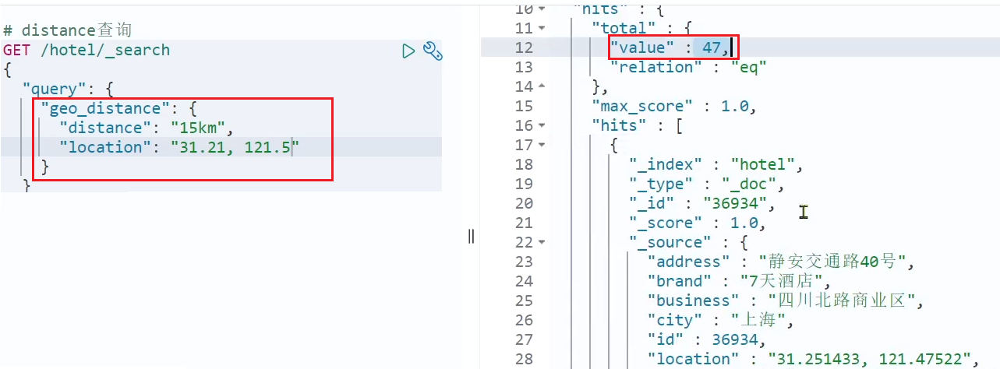

​	发现共有 47 家酒店，然后把半径缩短到 3 公里：

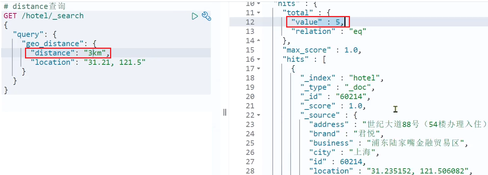

​	可以发现，搜索到的酒店数量减少到了 5 家。


##### 加权复合查询

​	复合（compound）查询：复合查询可以将其它简单查询组合起来，实现更复杂的搜索逻辑。常见的有两种：

- fuction score：算分函数查询，可以控制文档相关性算分，控制文档排名
- bool query：布尔查询，利用逻辑关系组合多个其它的查询，实现复杂搜索


> 相关性算分

​	当我们利用 match 查询时，文档结果会根据与搜索词条的关联度打分（_score），返回结果时按照分值降序排列。

​	例如，搜索 "虹桥如家"，结果如下：

```json
[
  {
    "_score" : 17.850193,
    "_source" : {
      "name" : "虹桥如家酒店真不错",
    }
  },
  {
    "_score" : 12.259849,
    "_source" : {
      "name" : "外滩如家酒店真不错",
    }
  },
  {
    "_score" : 11.91091,
    "_source" : {
      "name" : "迪士尼如家酒店真不错",
    }
  }
]
```


​	在 elasticsearch 中，早期使用的打分算法是 TF-IDF 算法，公式如下：


​	在后来的 5.1 版本升级中，elasticsearch 将算法改进为 BM25 算法，公式如下：


​	TF-IDF 算法有一各缺陷，就是词条频率越高，文档得分也会越高，单个词条对文档影响较大。而 BM25 则会让单个词条的算分有一个上限，曲线更加平滑：

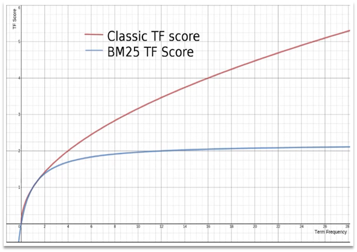


​	小结：elasticsearch 会根据词条和文档的相关度做打分，算法由两种：

- TF-IDF 算法
- BM25 算法，elasticsearch5.1 版本后采用的算法


> 算分函数查询

​	根据相关度打分是比较合理的需求，但**合理的不一定是产品经理需要**的。

​	以百度为例，你搜索的结果中，并不是相关度越高排名越靠前，而是谁掏的钱多排名就越靠前。要想认为控制相关性算分，就需要利用 elasticsearch 中的 function score 查询了。


1）语法说明


​	function score 查询中包含四部分内容：

- **原始查询**条件：quer y部分，基于这个条件搜索文档，并且基于 BM25 算法给文档打分，**原始算分**（query score)
- **过滤条件**：filter 部分，符合该条件的文档才会重新算分
- **算分函数**：符合 filter 条件的文档要根据这个函数做运算，得到的**函数算分**（function score），有四种函数
  - weight：函数结果是常量
  - field_value_factor：以文档中的某个字段值作为函数结果
  - random_score：以随机数作为函数结果
  - script_score：自定义算分函数算法
- **运算模式**：算分函数的结果、原始查询的相关性算分，两者之间的运算方式，包括：
  - multiply：相乘
  - replace：用 function score 替换 query score
  - 其它，例如：sum、avg、max、min


​	function score 的运行流程如下：

- 1）根据**原始条件**查询搜索文档，并且计算相关性算分，称为**原始算分**（query score）
- 2）根据**过滤条件**，过滤文档
- 3）符合**过滤条件**的文档，基于**算分函数**运算，得到**函数算分**（function score）
- 4）将**原始算分**（query score）和**函数算分**（function score）基于**运算模式**做运算，得到最终结果，作为相关性算分。


​	因此，其中的关键点是：

- 过滤条件：决定哪些文档的算分被修改
- 算分函数：决定函数算分的算法
- 运算模式：决定最终算分结果


2）示例

​	需求：给“如家”这个品牌的酒店排名靠前一些

​	翻译一下这个需求，转换为之前说的四个要点：

- 原始条件：不确定，可以任意变化
- 过滤条件：brand = "如家"
- 算分函数：可以简单粗暴，直接给固定的算分结果，weight
- 运算模式：比如求和

因此最终的 DSL 语句如下：

```json
GET /hotel/_search
{
  "query": {
    "function_score": {
      "query": {
      	"match": {
          "all": "外滩"
        }
      }, // 原始查询，可以是任意条件
      "functions": [ // 算分函数
        {
          "filter": { // 满足的条件，品牌必须是如家
            "term": {
              "brand": "如家"
            }
          },
          "weight": 2 // 算分权重为2
        }
      ],
      "boost_mode": "sum" // 加权模式，求和
    }
  }
}
```


​	测试，在未添加算分函数时，如家得分如下：


​	添加了算分函数后，如家得分就提升了：

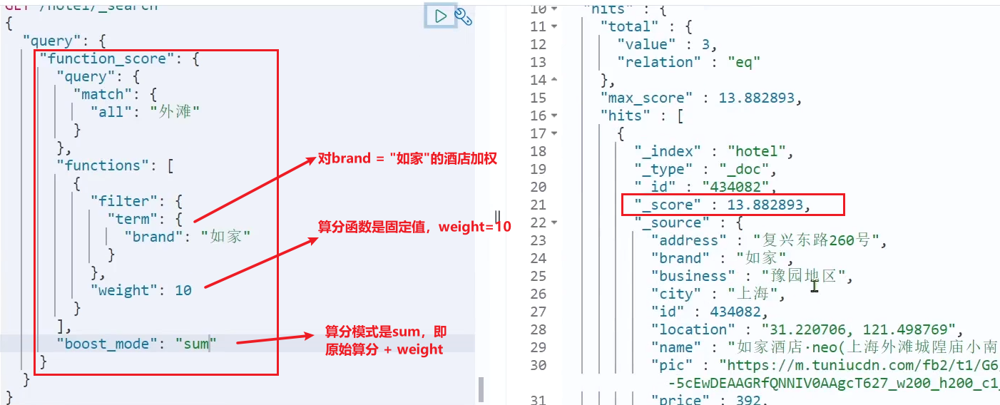


3）小结

​	function score query 定义的三要素是什么？

- 过滤条件：哪些文档要加分
- 算分函数：如何计算 function score
- 加权方式：function score 与 query score 如何运算


##### 布尔复合查询

​	布尔查询是一个或多个查询子句的组合，每一个子句就是一个**子查询**。子查询的组合方式有：

- must：必须匹配每个子查询，类似“与”
- should：选择性匹配子查询，类似“或”
- must_not：必须不匹配，**不参与算分**，类似“非”
- filter：必须匹配，**不参与算分**


​	比如在搜索酒店时，除了关键字搜索外，我们还可能根据品牌、价格、城市等字段做过滤：


​	每一个不同的字段，其查询的条件、方式都不一样，必须是多个不同的查询，而要组合这些查询，就必须用 bool 查询了。

​	需要注意的是，搜索时，参与**打分的字段越多，查询的性能也越差**。因此这种多条件查询时，建议这样做：

- 搜索框的关键字搜索，是全文检索查询，使用 must 查询，参与算分
- 其它过滤条件，采用 filter 查询。不参与算分


> 1）语法示例：

```json
GET /hotel/_search
{
  "query": {
    "bool": {
      "must": [
        {"term": {"city": "上海" }}
      ],
      "should": [
        {"term": {"brand": "皇冠假日" }},
        {"term": {"brand": "华美达" }}
      ],
      "must_not": [
        { "range": { "price": { "lte": 500 } }}
      ],
      "filter": [
        { "range": {"score": { "gte": 45 } }}
      ]
    }
  }
}
```


> 2）示例

​	需求：搜索名字包含“如家”，价格不高于 400，在坐标 31.21,121.5 周围 10km 范围内的酒店。

​	分析：

- 名称搜索，属于全文检索查询，应该参与算分。放到 must 中
- 价格不高于 400，用 range 查询，属于过滤条件，不参与算分。放到 must_not 中
- 周围 10km 范围内，用 geo_distance 查询，属于过滤条件，不参与算分。放到 filter 中


```json
GET /hotel/_search
{
  "query": {
    "bool": {
      "must": [
        {
          "match": {
            "brand": "如家"
          }
        }
      ],
      "must_not": [
        {
          "range": {
            "price": {
              "gt": 400
            }
          }
        }
      ],
      "filter": [
        {
          "geo_distance": {
            "distance": "10km",
            "location": {
              "lat": 31.21,
              "lon": 121.5
            }
          }
        }
      ]
    }
  }
}
```


> 3）小结

​	bool 查询有几种逻辑关系？

- must：必须匹配的条件，可以理解为“与”
- should：选择性匹配的条件，可以理解为“或”
- must_not：必须不匹配的条件，不参与打分
- filter：必须匹配的条件，不参与打分


### 搜索结果处理

##### 排序

​	elasticsearch 默认是根据相关度算分（_score）来排序，但是也支持自定义方式对搜索[结果排序](https://www.elastic.co/guide/en/elasticsearch/reference/current/sort-search-results.html)。可以排序字段类型有：keyword 类型、数值类型、地理坐标类型、日期类型等。

> 普通字段排序

​	keyword、数值、日期类型排序的语法基本一致。

​	**语法**：

```json
GET /indexName/_search
{
  "query": {
    "match_all": {}
  },
  "sort": [
    {
      "FIELD": "desc"  // 排序字段、排序方式ASC、DESC
    }
  ]
}
```

​	排序条件是一个数组，也就是可以写多个排序条件。按照声明的顺序，当第一个条件相等时，再按照第二个条件排序，以此类推


​	**示例**：

需求描述：酒店数据按照用户评价（score）降序排序，评价相同的按照价格（price）升序排序


> 地理坐标排序

​	地理坐标排序略有不同。

​	**语法说明**：

```json
GET /indexName/_search
{
  "query": {
    "match_all": {}
  },
  "sort": [
    {
      "_geo_distance" : {
          "FIELD" : "纬度，经度", // 文档中geo_point类型的字段名、目标坐标点
          "order" : "asc", // 排序方式
          "unit" : "km" // 排序的距离单位
      }
    }
  ]
}
```

​	这个查询的含义是：

- 指定一个坐标，作为目标点
- 计算每一个文档中，指定字段（必须是 geo_point 类型）的坐标 到目标点的距离是多少
- 根据距离排序


​	**示例：**

​	需求描述：实现对酒店数据按照到你的位置坐标的距离升序排序

​	提示：获取你的位置的经纬度的方式：https://lbs.amap.com/demo/jsapi-v2/example/map/click-to-get-lnglat/


​	假设我的位置是：31.034661，121.612282，寻找我周围距离最近的酒店。


##### 分页

​	elasticsearch 默认情况下只返回 top10 的数据。而如果要查询更多数据就需要修改分页参数了。elasticsearch 中通过修改 from、size 参数来控制要返回的分页结果：

- from：从第几个文档开始
- size：总共查询几个文档

​	类似于 mysql 中的`limit ?, ?`


> 基本的分页

​	分页的基本语法如下：

```json
GET /hotel/_search
{
  "query": {
    "match_all": {}
  },
  "from": 0, // 分页开始的位置，默认为0
  "size": 10, // 期望获取的文档总数
  "sort": [
    {"price": "asc"}
  ]
}
```


> 深度分页问题

​	现在，要查询 990~1000 的数据，查询逻辑要这么写：

```json
GET /hotel/_search
{
  "query": {
    "match_all": {}
  },
  "from": 990, // 分页开始的位置，默认为0
  "size": 10, // 期望获取的文档总数
  "sort": [
    {"price": "asc"}
  ]
}
```

​	这里是查询 990 开始的数据，也就是 第 990 ~ 第 1000 条 数据。

​	不过，elasticsearch 内部分页时，必须先查询 0~1000 条，然后截取其中的 990 ~ 1000 的这 10 条：


​	查询 TOP1000，如果 es 是单点模式，这并无太大影响。

​	但是 elasticsearch 将来一定是集群，例如我集群有 5 个节点，我要查询 TOP1000 的数据，并不是每个节点查询 200 条就可以了。

​	因为节点 A 的 TOP200，在另一个节点可能排到 10000 名以外了。

​	因此要想获取整个集群的 TOP1000，必须先查询出每个节点的 TOP1000，汇总结果后，重新排名，重新截取 TOP1000。


​	那如果要查询 9900~10000 的数据呢？是不是要先查询TOP10000呢？那每个节点都要查询 10000 条？汇总到内存中？

​	当查询分页深度较大时，汇总数据过多，对内存和 CPU 会产生非常大的压力，因此 elasticsearch 会禁止 from+ size 超过 10000 的请求。


​	针对深度分页，ES 提供了两种解决方案，[官方文档](https://www.elastic.co/guide/en/elasticsearch/reference/current/paginate-search-results.html)：

- search after：分页时需要排序，原理是从上一次的排序值开始，查询下一页数据。官方推荐使用的方式。
- scroll：原理将排序后的文档id形成快照，保存在内存。官方已经不推荐使用。


> 小结

​	分页查询的常见实现方案以及优缺点：

- `from + size`：
  - 优点：支持随机翻页
  - 缺点：深度分页问题，默认查询上限（from + size）是10000
  - 场景：百度、京东、谷歌、淘宝这样的随机翻页搜索
- `after search`：
  - 优点：没有查询上限（单次查询的size不超过10000）
  - 缺点：只能向后逐页查询，不支持随机翻页
  - 场景：没有随机翻页需求的搜索，例如手机向下滚动翻页

- `scroll`：
  - 优点：没有查询上限（单次查询的size不超过10000）
  - 缺点：会有额外内存消耗，并且搜索结果是非实时的
  - 场景：海量数据的获取和迁移。从ES7.1开始不推荐，建议用 after search方案。


##### 高亮

> 高亮原理

​	在百度，京东搜索时，关键字会变成红色，比较醒目，这叫高亮显示：


​	高亮显示的实现分为两步：

- 1）给文档中的所有关键字都添加一个标签，例如`<em>`标签
- 2）页面给`<em>`标签编写CSS样式


> 实现高亮

​	**高亮的语法**：

```json
GET /hotel/_search
{
  "query": {
    "match": {
      "FIELD": "TEXT" // 查询条件，高亮一定要使用全文检索查询
    }
  },
  "highlight": {
    "fields": { // 指定要高亮的字段
      "FIELD": {
        "pre_tags": "<em>",  // 用来标记高亮字段的前置标签
        "post_tags": "</em>" // 用来标记高亮字段的后置标签
      }
    }
  }
}
```


​	**注意：**

- 高亮是对关键字高亮，因此**搜索条件必须带有关键字**，而不能是范围这样的查询。
- 默认情况下，**高亮的字段，必须与搜索指定的字段一致**，否则无法高亮
- 如果要对非搜索字段高亮，则需要添加一个属性：required_field_match=false


​	**示例**：

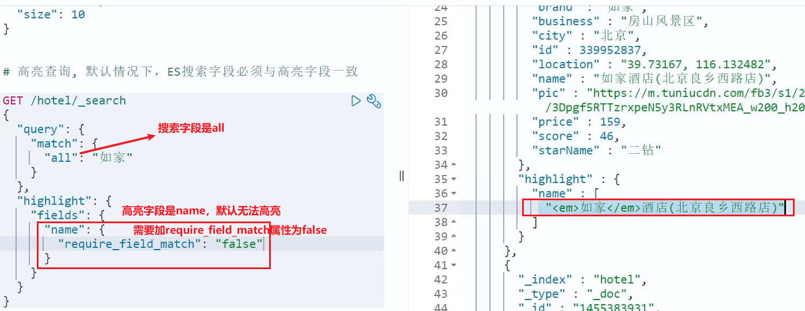


> 总结

​	查询的 DSL 是一个大的 JSON 对象，包含下列属性：

- query：查询条件
- from和size：分页条件
- sort：排序条件
- highlight：高亮条件

​	示例：


### RestClient 查询文档

​	文档的查询同样适用 RestHighLevelClient 对象，基本步骤包括：

- 1）准备 Request 对象
- 2）准备请求参数
- 3）发起请求
- 4）解析响应


##### 快速入门

​	以 match_all 查询为例

> 发起查询请求


​	代码解读：

- 第一步，创建`SearchRequest`对象，指定索引库名

- 第二步，利用`request.source()`构建DSL，DSL中可以包含查询、分页、排序、高亮等
  - `query()`：代表查询条件，利用`QueryBuilders.matchAllQuery()`构建一个match_all查询的DSL
- 第三步，利用 client.search() 发送请求，得到响应


​	这里关键的 API 有两个，一个是`request.source()`，其中包含了查询、排序、分页、高亮等所有功能：

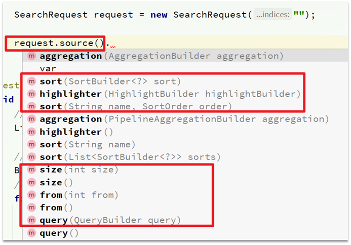

​	另一个是`QueryBuilders`，其中包含 match、term、function_score、bool 等各种查询：


> 解析响应

​	响应结果的解析：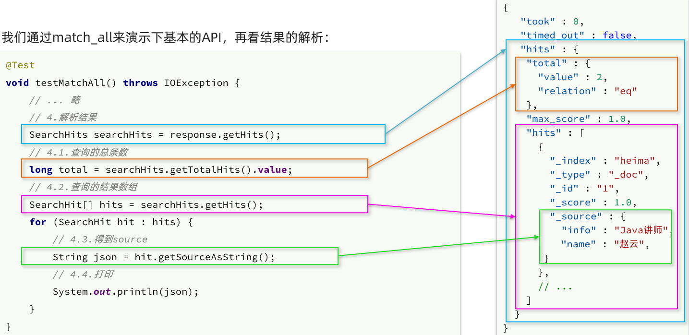


​	elasticsearch 返回的结果是一个 JSON 字符串，结构包含：

- `hits`：命中的结果
  - `total`：总条数，其中的 value 是具体的总条数值
  - `max_score`：所有结果中得分最高的文档的相关性算分
  - `hits`：搜索结果的文档数组，其中的每个文档都是一个 json 对象
    - `_source`：文档中的原始数据，也是 json 对象


​	因此，解析响应结果，就是逐层解析 JSON 字符串，流程如下：

- `SearchHits`：通过 response.getHits() 获取，就是 JSON 中的最外层的 hits，代表命中的结果
  - `SearchHits#getTotalHits().value`：获取总条数信息
  - `SearchHits#getHits()`：获取 SearchHit 数组，也就是文档数组
    - `SearchHit#getSourceAsString()`：获取文档结果中的 _source，也就是原始的 json 文档数据


> 完整代码

```java
@Test
void testMatchAll() throws IOException {
    //1.准备 Request
    SearchRequest request = new SearchRequest("hotel");
    //2.准备 DSL
    request.source().query(QueryBuilders.matchAllQuery());
    //3.发送请求
    SearchResponse response = client.search(request, RequestOptions.DEFAULT);

    //4.解析响应
    SearchHits searchHits = response.getHits();
    //4.1获取总条数
    long total = searchHits.getTotalHits().value;
    System.out.println("共搜索到数据条数：" + total);

    //4.2 文档数组
    SearchHit[] hits = searchHits.getHits();
    //4.3 遍历
    for (SearchHit hit : hits) {
        //获取 json 文档
        String json = hit.getSourceAsString();
        //反序列化
        HotelDoc hotelDoc = JSON.parseObject(json, HotelDoc.class);
        System.out.println("hotelDoc = " + hotelDoc);
    }
}
```


> 小结

​	查询的基本步骤是：

1. 创建 SearchRequest 对象

2. 准备 Request.source()，也就是 DSL。

   ① QueryBuilders 来构建查询条件

   ② 传入 Request.source() 的 query() 方法

3. 发送请求，得到结果

4. 解析结果（参考 JSON 结果，从外到内，逐层解析）


##### match查询

​	全文检索的 match 和 multi_match 查询与 match_all 的 API 基本一致。差别是查询条件，也就是 query 的部分。

 

​	因此，Java 代码上的差异主要是 request.source().query() 中的参数了。同样是利用 QueryBuilders 提供的方法：

 

​	而结果解析代码则完全一致，可以抽取并共享。


​	完整代码如下：

```java
@Test
void testMatch() throws IOException {
    // 1.准备Request
    SearchRequest request = new SearchRequest("hotel");
    // 2.准备DSL
    request.source()
        .query(QueryBuilders.matchQuery("all", "如家"));
    // 3.发送请求
    SearchResponse response = client.search(request, RequestOptions.DEFAULT);
    // 4.解析响应
    handleResponse(response);

}
```


##### 精确查询

​	精确查询主要是两者：

- term：词条精确匹配
- range：范围查询

​	与之前的查询相比，差异同样在查询条件，其它都一样。

​	查询条件构造的 API 如下：

 


##### 布尔查询

​	布尔查询是用 must、must_not、filter 等方式组合其它查询，代码示例如下：

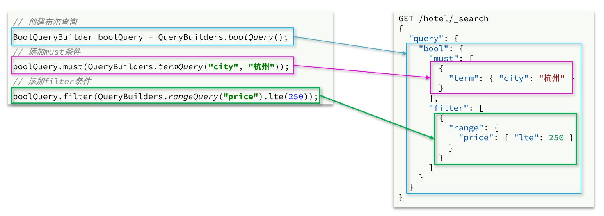


​	可以看到，API 与其它查询的差别同样是在查询条件的构建，QueryBuilders，结果解析等其他代码完全不变。


​	完整代码如下：

```java
@Test
void testBool() throws IOException {
    // 1.准备Request
    SearchRequest request = new SearchRequest("hotel");
    // 2.准备DSL
    // 2.1.准备BooleanQuery
    BoolQueryBuilder boolQuery = QueryBuilders.boolQuery();
    // 2.2.添加term
    boolQuery.must(QueryBuilders.termQuery("city", "杭州"));
    // 2.3.添加range
    boolQuery.filter(QueryBuilders.rangeQuery("price").lte(250));

    request.source().query(boolQuery);
    // 3.发送请求
    SearchResponse response = client.search(request, RequestOptions.DEFAULT);
    // 4.解析响应
    handleResponse(response);

}
```


##### 排序、分页

​	搜索结果的排序和分页是与 query 同级的参数，因此同样是使用 request.source() 来设置。

​	对应的 API 如下：

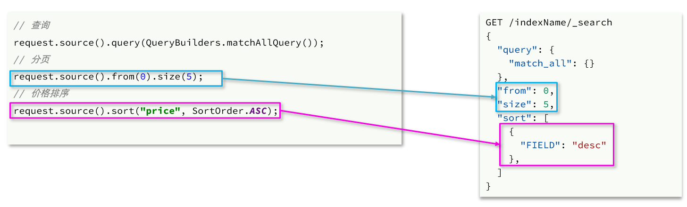

​	完整代码示例：

```java
@Test
void testPageAndSort() throws IOException {
    // 页码，每页大小
    int page = 1, size = 5;

    // 1.准备Request
    SearchRequest request = new SearchRequest("hotel");
    // 2.准备DSL
    // 2.1.query
    request.source().query(QueryBuilders.matchAllQuery());
    // 2.2.排序 sort
    request.source().sort("price", SortOrder.ASC);
    // 2.3.分页 from、size
    request.source().from((page - 1) * size).size(5);
    // 3.发送请求
    SearchResponse response = client.search(request, RequestOptions.DEFAULT);
    // 4.解析响应
    handleResponse(response);

}
```


##### 高亮

​	高亮的代码与之前代码差异较大，有两点：

- 查询的 DSL：其中除了查询条件，还需要添加高亮条件，同样是与 query 同级。
- 结果解析：结果除了要解析 _source 文档数据，还要解析高亮结果


> 高亮请求构建


​	上述代码省略了查询条件部分，高亮查询必须使用全文检索查询，并且要有搜索关键字，将来才可以对关键字高亮。

​	完整代码如下：

```java
@Test
void testHighlight() throws IOException {
    // 1.准备Request
    SearchRequest request = new SearchRequest("hotel");
    // 2.准备DSL
    // 2.1.query
    request.source().query(QueryBuilders.matchQuery("all", "如家"));
    // 2.2.高亮
    request.source().highlighter(new HighlightBuilder().field("name").requireFieldMatch(false));
    // 3.发送请求
    SearchResponse response = client.search(request, RequestOptions.DEFAULT);
    // 4.解析响应
    handleResponse(response);

}
```


> 高亮结果解析

​	高亮的结果与查询的文档结果默认是分离的，并不在一起。

​	因此解析高亮的代码需要额外处理：

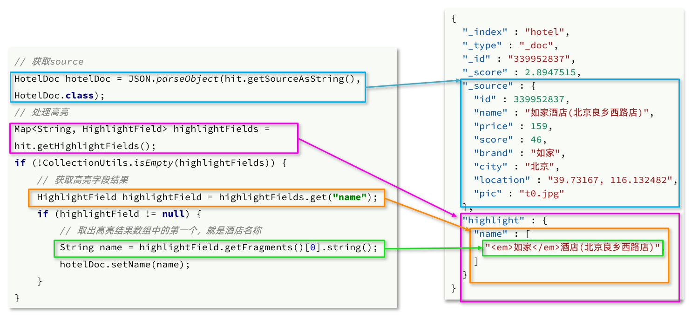

​	代码解读：

- 第一步：从结果中获取 source。hit.getSourceAsString()，这部分是非高亮结果，json 字符串。还需要反序列为 HotelDoc 对象
- 第二步：获取高亮结果。hit.getHighlightFields()，返回值是一个 Map，key 是高亮字段名称，值是 HighlightField 对象，代表高亮值
- 第三步：从 map 中根据高亮字段名称，获取高亮字段值对象 HighlightField
- 第四步：从 HighlightField 中获取 Fragments，并且转为字符串。这部分就是真正的高亮字符串了
- 第五步：用高亮的结果替换 HotelDoc 中的非高亮结果


​	完整代码如下：

```java
private void handleResponse(SearchResponse response) {
    // 4.解析响应
    SearchHits searchHits = response.getHits();
    // 4.1.获取总条数
    long total = searchHits.getTotalHits().value;
    System.out.println("共搜索到" + total + "条数据");
    // 4.2.文档数组
    SearchHit[] hits = searchHits.getHits();
    // 4.3.遍历
    for (SearchHit hit : hits) {
        // 获取文档source
        String json = hit.getSourceAsString();
        // 反序列化
        HotelDoc hotelDoc = JSON.parseObject(json, HotelDoc.class);
        // 获取高亮结果
        Map<String, HighlightField> highlightFields = hit.getHighlightFields();
        if (!CollectionUtils.isEmpty(highlightFields)) {
            // 根据字段名获取高亮结果
            HighlightField highlightField = highlightFields.get("name");
            if (highlightField != null) {
                // 获取高亮值
                String name = highlightField.getFragments()[0].string();
                // 覆盖非高亮结果
                hotelDoc.setName(name);
            }
        }
        System.out.println("hotelDoc = " + hotelDoc);
    }
}
```


### 旅游网案例

​	实现四部分功能：

- 酒店搜索和分页
- 酒店结果过滤
- 我周边的酒店
- 酒店竞价排名


​	启动提供的 hotel-demo 项目，其默认端口是 8089，访问http://localhost:8089，就能看到项目页面：


##### 酒店搜索和分页

​	案例需求：实现黑马旅游的酒店搜索功能，完成关键字搜索和分页


> 需求分析

​	在项目的首页，有一个大大的搜索框，还有分页按钮：


​	点击搜索按钮，可以看到浏览器控制台发出了请求：

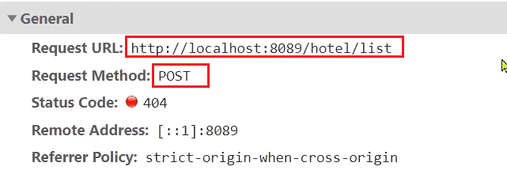

​	请求参数如下：

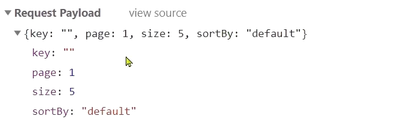


​	由此可以知道，我们这个请求的信息如下：

- 请求方式：POST
- 请求路径：/hotel/list
- 请求参数：JSON 对象，包含 4 个字段：
  - key：搜索关键字
  - page：页码
  - size：每页大小
  - sortBy：排序，目前暂不实现
- 返回值：分页查询，需要返回分页结果 PageResult，包含两个属性：
  - `total`：总条数
  - `List<HotelDoc>`：当前页的数据


​	因此，我们实现业务的流程如下：

- 步骤一：定义实体类，接收请求参数的 JSON 对象
- 步骤二：编写 controller，接收页面的请求
- 步骤三：编写业务实现，利用 RestHighLevelClient 实现搜索、分页


> 定义实体类

​	实体类有两个，一个是前端的请求参数实体，一个是服务端应该返回的响应结果实体。

​		1）请求参数

​	前端请求的 json 结构如下：

```json
{
    "key": "搜索关键字",
    "page": 1,
    "size": 3,
    "sortBy": "default"
}
```

​	因此，在`cn.itcast.hotel.pojo`包下定义一个实体类：

```java
package cn.itcast.hotel.pojo;

import lombok.Data;

@Data
public class RequestParams {
    private String key;
    private Integer page;
    private Integer size;
    private String sortBy;
}
```


​	2）返回值

​		分页查询，需要返回分页结果 PageResult，包含两个属性：

- `total`：总条数
- `List<HotelDoc>`：当前页的数据

​	因此，在`cn.itcast.hotel.pojo`中定义返回结果：

```java
package cn.itcast.hotel.pojo;

import lombok.Data;

import java.util.List;

@Data
public class PageResult {
    private Long total;
    private List<HotelDoc> hotels;

    public PageResult() {
    }

    public PageResult(Long total, List<HotelDoc> hotels) {
        this.total = total;
        this.hotels = hotels;
    }
}
```


> 定义controller

定义一个 HotelController，声明查询接口，满足下列要求：

- 请求方式：Post
- 请求路径：/hotel/list
- 请求参数：对象，类型为 RequestParam
- 返回值：PageResult，包含两个属性
  - `Long total`：总条数
  - `List<HotelDoc> hotels`：酒店数据


​	因此，在`cn.itcast.hotel.web`中定义 HotelController：

```java
@RestController
@RequestMapping("/hotel")
public class HotelController {

    @Autowired
    private IHotelService hotelService;
	// 搜索酒店数据
    @PostMapping("/list")
    public PageResult search(@RequestBody RequestParams params){
        return hotelService.search(params);
    }
}
```


> 实现搜索业务

​	我们在 controller 调用了 IHotelService，并没有实现该方法，因此下面我们就在 IHotelService 中定义方法，并且去实现业务逻辑。

​	1）在`cn.itcast.hotel.service`中的`IHotelService`接口中定义一个方法：

```java
/**
 * 根据关键字搜索酒店信息
 * @param params 请求参数对象，包含用户输入的关键字 
 * @return 酒店文档列表
 */
PageResult search(RequestParams params);
```


​	2）实现搜索业务，肯定离不开 RestHighLevelClient，我们需要把它注册到 Spring 中作为一个 Bean。在`cn.itcast.hotel`中的`HotelDemoApplication`中声明这个 Bean：

```java
@Bean
public RestHighLevelClient client(){
    return  new RestHighLevelClient(RestClient.builder(
        HttpHost.create("http://192.168.150.101:9200")
    ));
}
```


​	3）在`cn.itcast.hotel.service.impl`中的`HotelService`中实现 search 方法：

```java
@Override
public PageResult search(RequestParams params) {
    try {
        // 1.准备Request
        SearchRequest request = new SearchRequest("hotel");
        // 2.准备DSL
        // 2.1.query
        String key = params.getKey();
        if (key == null || "".equals(key)) {
            boolQuery.must(QueryBuilders.matchAllQuery());
        } else {
            boolQuery.must(QueryBuilders.matchQuery("all", key));
        }

        // 2.2.分页
        int page = params.getPage();
        int size = params.getSize();
        request.source().from((page - 1) * size).size(size);

        // 3.发送请求
        SearchResponse response = client.search(request, RequestOptions.DEFAULT);
        // 4.解析响应
        return handleResponse(response);
    } catch (IOException e) {
        throw new RuntimeException(e);
    }
}

// 结果解析
private PageResult handleResponse(SearchResponse response) {
    // 4.解析响应
    SearchHits searchHits = response.getHits();
    // 4.1.获取总条数
    long total = searchHits.getTotalHits().value;
    // 4.2.文档数组
    SearchHit[] hits = searchHits.getHits();
    // 4.3.遍历
    List<HotelDoc> hotels = new ArrayList<>();
    for (SearchHit hit : hits) {
        // 获取文档source
        String json = hit.getSourceAsString();
        // 反序列化
        HotelDoc hotelDoc = JSON.parseObject(json, HotelDoc.class);
		// 放入集合
        hotels.add(hotelDoc);
    }
    // 4.4.封装返回
    return new PageResult(total, hotels);
}
```


##### 酒店结果过滤

​	需求：添加品牌、城市、星级、价格等过滤功能

> 需求分析

​	在页面搜索框下面，会有一些过滤项：

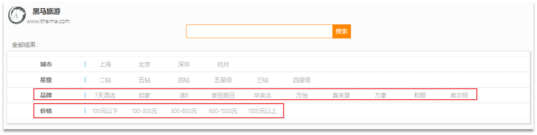

​	传递的参数如图：

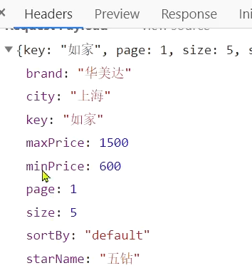 

​	包含的过滤条件有：

- brand：品牌值
- city：城市
- minPrice~maxPrice：价格范围
- starName：星级

​	所以需要做两件事情：

- 修改请求参数的对象 RequestParams，接收上述参数
- 修改业务逻辑，在搜索条件之外，添加一些过滤条件


> 修改实体类

​	修改在`cn.itcast.hotel.pojo`包下的实体类RequestParams：

```java
@Data
public class RequestParams {
    private String key;
    private Integer page;
    private Integer size;
    private String sortBy;
    // 下面是新增的过滤条件参数
    private String city;
    private String brand;
    private String starName;
    private Integer minPrice;
    private Integer maxPrice;
}
```


> 修改搜索业务

​	在 HotelService 的 search 方法中，只有一个地方需要修改：requet.source().query( ... ) 其中的查询条件。

​	在之前的业务中，只有 match 查询，根据关键字搜索，现在要添加条件过滤，包括：

- 品牌过滤：是 keyword 类型，用 term 查询
- 星级过滤：是keyword类型，用 term 查询
- 价格过滤：是数值类型，用 range 查询
- 城市过滤：是 keyword 类型，用 term 查询

多个查询条件组合，肯定是 boolean 查询来组合：

- 关键字搜索放到 must 中，参与算分
- 其它过滤条件放到 filter 中，不参与算分


​	因为条件构建的逻辑比较复杂，这里先封装为一个函数：


​	buildBasicQuery 的代码如下：

```java
private void buildBasicQuery(RequestParams params, SearchRequest request) {
    // 1.构建BooleanQuery
    BoolQueryBuilder boolQuery = QueryBuilders.boolQuery();
    // 2.关键字搜索
    String key = params.getKey();
    if (key == null || "".equals(key)) {
        boolQuery.must(QueryBuilders.matchAllQuery());
    } else {
        boolQuery.must(QueryBuilders.matchQuery("all", key));
    }
    // 3.城市条件
    if (params.getCity() != null && !params.getCity().equals("")) {
        boolQuery.filter(QueryBuilders.termQuery("city", params.getCity()));
    }
    // 4.品牌条件
    if (params.getBrand() != null && !params.getBrand().equals("")) {
        boolQuery.filter(QueryBuilders.termQuery("brand", params.getBrand()));
    }
    // 5.星级条件
    if (params.getStarName() != null && !params.getStarName().equals("")) {
        boolQuery.filter(QueryBuilders.termQuery("starName", params.getStarName()));
    }
	// 6.价格
    if (params.getMinPrice() != null && params.getMaxPrice() != null) {
        boolQuery.filter(QueryBuilders
                         .rangeQuery("price")
                         .gte(params.getMinPrice())
                         .lte(params.getMaxPrice())
                        );
    }
	// 7.放入source
    request.source().query(boolQuery);
}
```


##### 周边的酒店

> 需求分析

​	在酒店列表页的右侧，有一个小地图，点击地图的定位按钮，地图会找到你所在的位置：

 

​	并且，在前端会发起查询请求，将你的坐标发送到服务端：

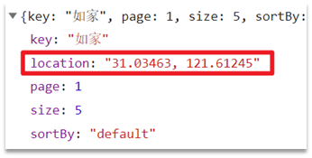 


​	我们要做的事情就是基于这个 location 坐标，然后按照距离对周围酒店排序。实现思路如下：

- 修改 RequestParams 参数，接收 location 字段
- 修改 search 方法业务逻辑，如果 location 有值，添加根据 geo_distance 排序的功能


> 修改实体类

​	修改在`cn.itcast.hotel.pojo`包下的实体类 RequestParams：

```java
package cn.itcast.hotel.pojo;

import lombok.Data;

@Data
public class RequestParams {
    private String key;
    private Integer page;
    private Integer size;
    private String sortBy;
    private String city;
    private String brand;
    private String starName;
    private Integer minPrice;
    private Integer maxPrice;
    // 我当前的地理坐标
    private String location;
}

```


> 距离排序API

​	我们以前学习过排序功能，包括两种：

- 普通字段排序
- 地理坐标排序

​	我们只讲了普通字段排序对应的 java 写法。地理坐标排序只学过 DSL 语法，如下：

```json
GET /indexName/_search
{
  "query": {
    "match_all": {}
  },
  "sort": [
    {
      "price": "asc"  
    },
    {
      "_geo_distance" : {
          "FIELD" : "纬度，经度",
          "order" : "asc",
          "unit" : "km"
      }
    }
  ]
}
```

​	对应的 java 代码示例：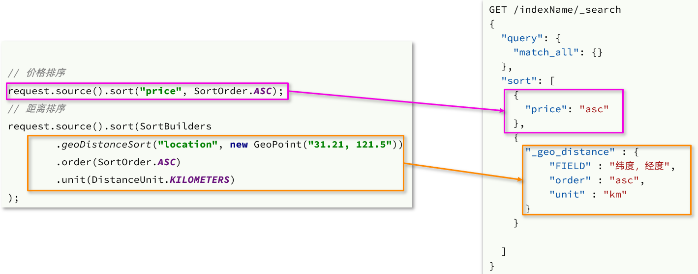


> 添加距离排序

​	在`cn.itcast.hotel.service.impl`的`HotelService`的`search`方法中，添加一个排序功能：


​	完整代码：

```java
@Override
public PageResult search(RequestParams params) {
    try {
        // 1.准备Request
        SearchRequest request = new SearchRequest("hotel");
        // 2.准备DSL
        // 2.1.query
        buildBasicQuery(params, request);

        // 2.2.分页
        int page = params.getPage();
        int size = params.getSize();
        request.source().from((page - 1) * size).size(size);

        // 2.3.排序
        String location = params.getLocation();
        if (location != null && !location.equals("")) {
            request.source().sort(SortBuilders
                                  .geoDistanceSort("location", new GeoPoint(location))
                                  .order(SortOrder.ASC)
                                  .unit(DistanceUnit.KILOMETERS)
                                 );
        }

        // 3.发送请求
        SearchResponse response = client.search(request, RequestOptions.DEFAULT);
        // 4.解析响应
        return handleResponse(response);
    } catch (IOException e) {
        throw new RuntimeException(e);
    }
}
```


​	结果处理方法：

```java
private PageResult handleResponse(SearchResponse response) {
    //4.解析响应
    SearchHits searchHits = response.getHits();
    //4.1 获取总条数
    long total = searchHits.getTotalHits().value;
    //4.2 文档数组
    SearchHit[] hits = searchHits.getHits();
    //4.3 遍历
    List<HotelDoc> hotels = new ArrayList<>();
    for (SearchHit hit : hits) {
        //获取 json 文档
        String json = hit.getSourceAsString();
        //反序列化
        HotelDoc hotelDoc = JSON.parseObject(json, HotelDoc.class);
        //获取排序数值
        Object[] sortValues = hit.getSortValues();
        if (sortValues.length > 0) {
            Object sortValue = sortValues[0];
            hotelDoc.setDistance(sortValue);
        }
        hotels.add(hotelDoc);
    }
    //4.4 封装返回
    return new PageResult(total, hotels);
}
```


> 排序距离显示

​	重启服务后，测试附件酒店功能：


​	发现确实可以实现对附近酒店的排序，不过并没有看到酒店到底距离我多远，这该怎么办？

​	排序完成后，页面还要获取我附近每个酒店的具体**距离**值，这个值在响应结果中是独立的：


​	因此，在结果解析阶段，除了解析 source 部分以外，还要得到 sort 部分，也就是排序的距离，然后放到响应结果中。

​	所以需要做两件事：

- 修改 HotelDoc，添加排序距离字段，用于页面显示
- 修改 HotelService 类中的 handleResponse 方法，添加对 sort 值的获取


​	1）修改 HotelDoc 类，添加距离字段

```java
package cn.itcast.hotel.pojo;

import lombok.Data;
import lombok.NoArgsConstructor;


@Data
@NoArgsConstructor
public class HotelDoc {
    private Long id;
    private String name;
    private String address;
    private Integer price;
    private Integer score;
    private String brand;
    private String city;
    private String starName;
    private String business;
    private String location;
    private String pic;
    // 排序时的 距离值
    private Object distance;

    public HotelDoc(Hotel hotel) {
        this.id = hotel.getId();
        this.name = hotel.getName();
        this.address = hotel.getAddress();
        this.price = hotel.getPrice();
        this.score = hotel.getScore();
        this.brand = hotel.getBrand();
        this.city = hotel.getCity();
        this.starName = hotel.getStarName();
        this.business = hotel.getBusiness();
        this.location = hotel.getLatitude() + ", " + hotel.getLongitude();
        this.pic = hotel.getPic();
    }
}

```


​	2）修改 HotelService 中的 handleResponse 方法

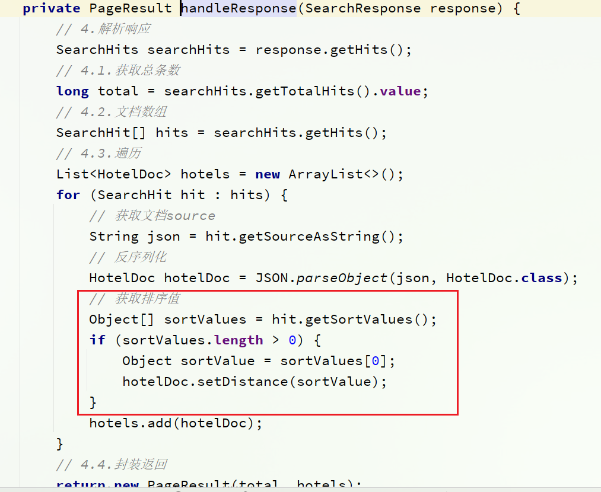


​	重启后测试，发现页面能成功显示距离了：

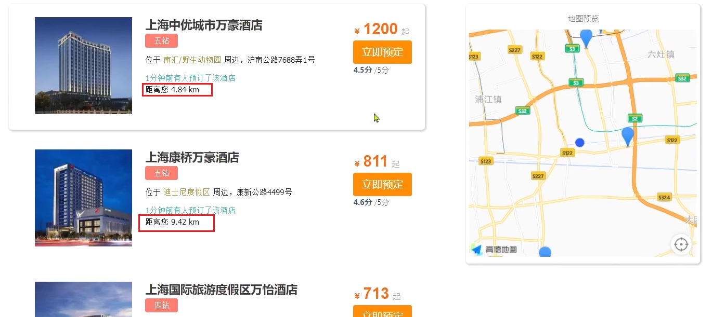


##### 酒店竞价排名

​	需求：让指定的酒店在搜索结果中排名置顶


> 需求分析

​	要让指定酒店在搜索结果中排名置顶，效果如图：


​	页面会给指定的酒店添加**广告**标记。

​	之前学习过的 function_score 查询可以影响算分，算分高了，自然排名也就高了。而 function_score 包含 3 个要素：

- 过滤条件：哪些文档要加分
- 算分函数：如何计算 function score
- 加权方式：function score 与 query score 如何运算


​	这里的需求是：让**指定酒店**排名靠前。因此需要给这些酒店添加一个标记，这样在过滤条件中就可以**根据这个标记来判断，是否要提高算分**。

​	比如，给酒店添加一个字段：isAD，Boolean 类型：

- true：是广告
- false：不是广告


​	这样 function_score 包含 3 个要素就很好确定了：

- 过滤条件：判断 isAD 是否为 true
- 算分函数：可以用最简单暴力的 weight，固定加权值
- 加权方式：可以用默认的相乘，大大提高算分


​	因此，业务的实现步骤包括：

1. 给 HotelDoc 类添加 isAD 字段，Boolean 类型

2. 挑选几个喜欢的酒店，给它的文档数据添加 isAD 字段，值为 true

3. 修改 search 方法，添加 function score 功能，给 isAD 值为 true 的酒店增加权重


> 修改 HotelDoc 实体

​	给`cn.itcast.hotel.pojo`包下的 HotelDoc 类添加 isAD 字段：

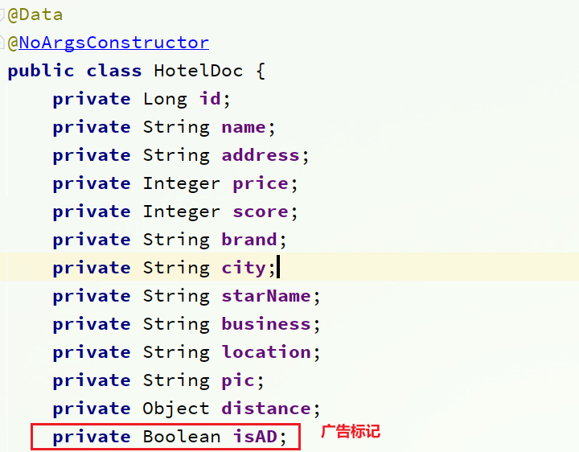


> 添加广告标记

​	接下来，我们挑几个酒店，添加 isAD 字段，设置为 true：

```json
POST /hotel/_update/527938
{
  "doc": {
    "isAD": true
  }
}
POST /hotel/_update/635963
{
  "doc": {
    "isAD": true
  }
}
POST /hotel/_update/200214538
{
  "doc": {
    "isAD": true
  }
}
POST /hotel/_update/1908594080
{
  "doc": {
    "isAD": true
  }
}
```


> 添加算分函数查询

​	接下来我们就要修改查询条件了。之前是用的 boolean 查询，现在要改成 function_socre 查询。

​	function_score 查询结构如下：


​	对应的 JavaAPI 如下：

​	可以将之前写的 boolean 查询作为**原始查询**条件放到 query 中，接下来就是添加**过滤条件**、**算分函数**、**加权模式**了。所以原来的代码依然可以沿用。

​	修改`cn.itcast.hotel.service.impl`包下的`HotelService`类中的`buildBasicQuery`方法，添加算分函数查询：

```java
private void buildBasicQuery(RequestParams params, SearchRequest request) {
    // 1.构建BooleanQuery
    BoolQueryBuilder boolQuery = QueryBuilders.boolQuery();
    // 关键字搜索
    String key = params.getKey();
    if (key == null || "".equals(key)) {
        boolQuery.must(QueryBuilders.matchAllQuery());
    } else {
        boolQuery.must(QueryBuilders.matchQuery("all", key));
    }
    // 城市条件
    if (params.getCity() != null && !params.getCity().equals("")) {
        boolQuery.filter(QueryBuilders.termQuery("city", params.getCity()));
    }
    // 品牌条件
    if (params.getBrand() != null && !params.getBrand().equals("")) {
        boolQuery.filter(QueryBuilders.termQuery("brand", params.getBrand()));
    }
    // 星级条件
    if (params.getStarName() != null && !params.getStarName().equals("")) {
        boolQuery.filter(QueryBuilders.termQuery("starName", params.getStarName()));
    }
    // 价格
    if (params.getMinPrice() != null && params.getMaxPrice() != null) {
        boolQuery.filter(QueryBuilders
                         .rangeQuery("price")
                         .gte(params.getMinPrice())
                         .lte(params.getMaxPrice())
                        );
    }

    // 2.算分控制
    FunctionScoreQueryBuilder functionScoreQuery =
        QueryBuilders.functionScoreQuery(
        // 原始查询，相关性算分的查询
        boolQuery,
        // function score的数组
        new FunctionScoreQueryBuilder.FilterFunctionBuilder[]{
            // 其中的一个function score 元素
            new FunctionScoreQueryBuilder.FilterFunctionBuilder(
                // 过滤条件
                QueryBuilders.termQuery("isAD", true),
                // 算分函数
                ScoreFunctionBuilders.weightFactorFunction(10)
            )
        });
    request.source().query(functionScoreQuery);
}
```


### 数据聚合

**[聚合（](https://www.elastic.co/guide/en/elasticsearch/reference/current/search-aggregations.html)[aggregations](https://www.elastic.co/guide/en/elasticsearch/reference/current/search-aggregations.html)[）](https://www.elastic.co/guide/en/elasticsearch/reference/current/search-aggregations.html)**可以让我们极其方便的实现对数据的统计、分析、运算。例如：

- 什么品牌的手机最受欢迎？
- 这些手机的平均价格、最高价格、最低价格？
- 这些手机每月的销售情况如何？

实现这些统计功能的比数据库的 sql 要方便的多，而且查询速度非常快，可以实现近实时搜索效果。


##### 聚合的种类

​	聚合常见的有三类：

- **桶（Bucket）**聚合：用来对文档做分组
  - TermAggregation：按照文档字段值分组，例如按照品牌值分组、按照国家分组
  - Date Histogram：按照日期阶梯分组，例如一周为一组，或者一月为一组

- **度量（Metric）**聚合：用以计算一些值，比如：最大值、最小值、平均值等
  - Avg：求平均值
  - Max：求最大值
  - Min：求最小值
  - Stats：同时求 max、min、avg、sum 等
- **管道（pipeline）**聚合：其它聚合的结果为基础做聚合


> **注意：**参加聚合的字段必须是 keyword、日期、数值、布尔类型


##### DLS 实现 Bucket 聚合

​	现在，我们要统计所有数据中的酒店品牌有几种，其实就是按照品牌对数据分组。此时可以根据酒店品牌的名称做聚合，也就是 Bucket 聚合。

​	语法如下：

```json
GET /hotel/_search
{
  "size": 0,  // 设置size为0，结果中不包含文档，只包含聚合结果
  "aggs": { // 定义聚合
    "brandAgg": { //给聚合起个名字
      "terms": { // 聚合的类型，按照品牌值聚合，所以选择term
        "field": "brand", // 参与聚合的字段
        "size": 20 // 希望获取的聚合结果数量
      }
    }
  }
}
```

​	结果如图：


> 聚合结果排序

​	默认情况下，Bucke t聚合会统计 Bucke t内的文档数量，记为 _count，并且按照 _count 降序排序。

​	我们可以指定 order 属性，自定义聚合的排序方式：

```json
GET /hotel/_search
{
  "size": 0, 
  "aggs": {
    "brandAgg": {
      "terms": {
        "field": "brand",
        "order": {
          "_count": "asc" // 按照_count升序排列
        },
        "size": 20
      }
    }
  }
}
```


> 限定聚合范围

​	默认情况下，Bucket 聚合是对索引库的所有文档做聚合，但真实场景下，用户会输入搜索条件，因此聚合必须是对搜索结果聚合。那么聚合必须添加限定条件。

​	我们可以限定要聚合的文档范围，只要添加 query 条件即可：

```json
GET /hotel/_search
{
  "query": {
    "range": {
      "price": {
        "lte": 200 // 只对200元以下的文档聚合
      }
    }
  }, 
  "size": 0, 
  "aggs": {
    "brandAgg": {
      "terms": {
        "field": "brand",
        "size": 20
      }
    }
  }
}
```


​	这次，聚合得到的品牌明显变少了：


##### DSL 实现 Metric 聚合

​	上节课，我们对酒店按照品牌分组，形成了一个个桶。现在我们需要对桶内的酒店做运算，获取每个品牌的用户评分的 min、max、avg 等值。

​	这就要用到 Metric 聚合了，例如 stat 聚合：就可以获取 min、max、avg 等结果。

​	语法如下：

```json
GET /hotel/_search
{
  "size": 0, 
  "aggs": {
    "brandAgg": { 
      "terms": { 
        "field": "brand", 
        "size": 20
      },
      "aggs": { // 是brands聚合的子聚合，也就是分组后对每组分别计算
        "score_stats": { // 聚合名称
          "stats": { // 聚合类型，这里stats可以计算min、max、avg等
            "field": "score" // 聚合字段，这里是score
          }
        }
      }
    }
  }
}
```

​	这次的 score_stats 聚合是在 brandAgg 的聚合内部嵌套的子聚合。因为我们需要在每个桶分别计算。

​	另外，还可以给聚合结果做个排序，例如按照每个桶的酒店平均分做排序：


> 小结

aggs 代表聚合，与 query 同级，此时 query 的作用是：

- 限定聚合的的文档范围

聚合必须的三要素：

- 聚合名称
- 聚合类型
- 聚合字段

聚合可配置属性有：

- size：指定聚合结果数量
- order：指定聚合结果排序方式
- field：指定聚合字段


##### RestAPI 实现搜索聚合

> API 语法

​	聚合条件与 query 条件同级别，因此需要使用 request.source() 来指定聚合条件。

​	聚合条件的语法：

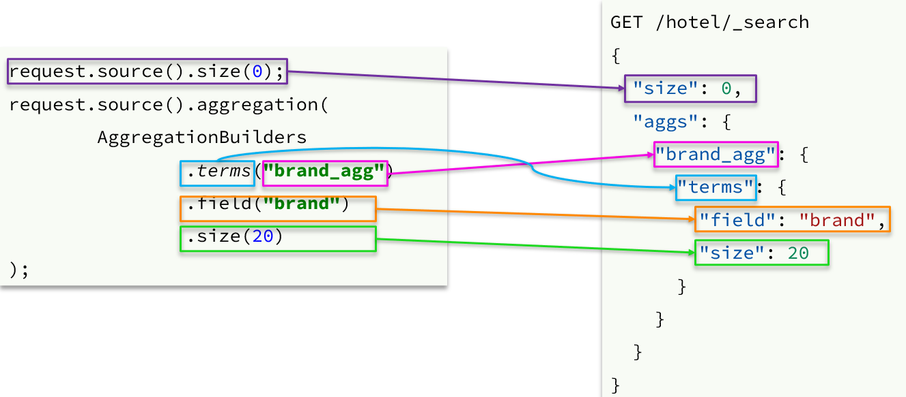


聚合的结果也与查询结果不同，API也比较特殊。不过同样是JSON逐层解析：


> 完整代码

```java
@Test
void testAggregation() throws IOException {
    SearchRequest request = new SearchRequest("hotel");
    request.source().size(0);
    request.source().aggregation(AggregationBuilders
            .terms("brandAgg")
            .field("brand")
            .size(10)
    );
    SearchResponse response = client.search(request, RequestOptions.DEFAULT);

    //解析结果
    Aggregations aggregations = response.getAggregations();
    Terms brandTerms = aggregations.get("brandAgg");
    List<? extends Terms.Bucket> buckets = brandTerms.getBuckets();
    for (Terms.Bucket bucket : buckets) {
        String key = bucket.getKeyAsString();
        System.out.println(key);
    }
}
```


> 业务需求

​	需求：搜索页面的品牌、城市等信息不应该是在页面写死，而是通过聚合索引库中的酒店数据得来的：

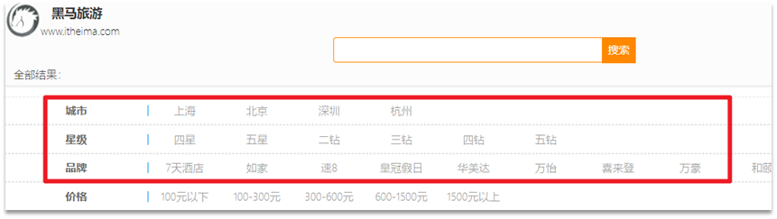


​	分析：目前，页面的城市列表、星级列表、品牌列表都是写死的，并不会随着搜索结果的变化而变化。但是用户搜索条件改变时，搜索结果会跟着变化。

​	例如：用户搜索“东方明珠”，那搜索的酒店肯定是在上海东方明珠附近，因此，城市只能是上海，此时城市列表中就不应该显示北京、深圳、杭州这些信息了。


​	也就是说，搜索结果中包含哪些城市，页面就应该列出哪些城市；搜索结果中包含哪些品牌，页面就应该列出哪些品牌。

​	如何得知搜索结果中包含哪些品牌？如何得知搜索结果中包含哪些城市？


​	使用聚合功能，利用 Bucket 聚合，对搜索结果中的文档基于品牌分组、基于城市分组，就能得知包含哪些品牌、哪些城市了。

​	因为是对搜索结果聚合，因此聚合是**限定范围的聚合**，也就是说聚合的限定条件跟搜索文档的条件一致。

​	

​	查看浏览器可以发现，前端其实已经发出了这样的一个请求：

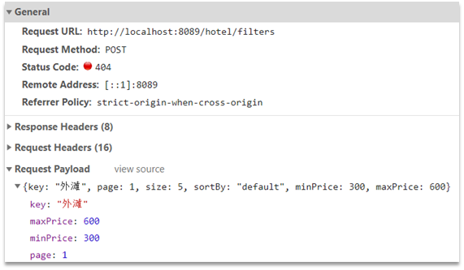

​	请求**参数与搜索文档的参数完全一致**。


​	返回值类型就是页面要展示的最终结果：

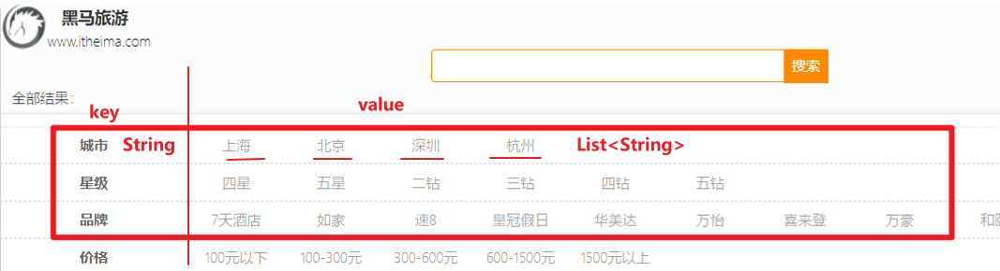

​	结果是一个 Map 结构：

- key 是字符串，城市、星级、品牌、价格
- value 是集合，例如多个城市的名称


> 业务实现

​	在`cn.itcast.hotel.web`包的`HotelController`中添加一个方法，遵循下面的要求：

- 请求方式：`POST`
- 请求路径：`/hotel/filters`
- 请求参数：`RequestParams`，与搜索文档的参数一致
- 返回值类型：`Map<String, List<String>>`

代码：

```java
    @PostMapping("filters")
    public Map<String, List<String>> getFilters(@RequestBody RequestParams params){
        return hotelService.getFilters(params);
    }
```


​	这里调用了 IHotelService 中的 getFilters 方法，尚未实现。

​	在`cn.itcast.hotel.service.IHotelService`中定义新方法：

```java
Map<String, List<String>> filters(RequestParams params);
```


​	在`cn.itcast.hotel.service.impl.HotelService`中实现该方法：

```java
@Override
public Map<String, List<String>> filters(RequestParams params) {
    try {
        // 1.准备Request
        SearchRequest request = new SearchRequest("hotel");
        // 2.准备DSL
        // 2.1.query
        buildBasicQuery(params, request);
        // 2.2.设置size
        request.source().size(0);
        // 2.3.聚合
        buildAggregation(request);
        // 3.发出请求
        SearchResponse response = client.search(request, RequestOptions.DEFAULT);
        // 4.解析结果
        Map<String, List<String>> result = new HashMap<>();
        Aggregations aggregations = response.getAggregations();
        // 4.1.根据品牌名称，获取品牌结果
        List<String> brandList = getAggByName(aggregations, "brandAgg");
        result.put("brand", brandList);
        // 4.2.根据品牌名称，获取品牌结果
        List<String> cityList = getAggByName(aggregations, "cityAgg");
        result.put("city", cityList);
        // 4.3.根据品牌名称，获取品牌结果
        List<String> starList = getAggByName(aggregations, "starAgg");
        result.put("starName", starList);

        return result;
    } catch (IOException e) {
        throw new RuntimeException(e);
    }
}

private void buildAggregation(SearchRequest request) {
    request.source().aggregation(AggregationBuilders
                                 .terms("brandAgg")
                                 .field("brand")
                                 .size(100)
                                );
    request.source().aggregation(AggregationBuilders
                                 .terms("cityAgg")
                                 .field("city")
                                 .size(100)
                                );
    request.source().aggregation(AggregationBuilders
                                 .terms("starAgg")
                                 .field("starName")
                                 .size(100)
                                );
}

private List<String> getAggByName(Aggregations aggregations, String aggName) {
    // 4.1.根据聚合名称获取聚合结果
    Terms brandTerms = aggregations.get(aggName);
    // 4.2.获取buckets
    List<? extends Terms.Bucket> buckets = brandTerms.getBuckets();
    // 4.3.遍历
    List<String> brandList = new ArrayList<>();
    for (Terms.Bucket bucket : buckets) {
        // 4.4.获取key
        String key = bucket.getKeyAsString();
        brandList.add(key);
    }
    return brandList;
}
```


### 自动补全

​	当用户在搜索框输入字符时，我们应该提示出与该字符有关的搜索项，如图：


​	这种根据用户输入的字母，提示完整词条的功能，就是自动补全了。

​	因为需要根据拼音字母来推断，因此要用到拼音分词功能。


##### 拼音分词器

​	要实现根据字母做补全，就必须对文档按照拼音分词。在 GitHub 上恰好有 elasticsearch 的拼音分词插件。地址：https://github.com/medcl/elasticsearch-analysis-pinyin

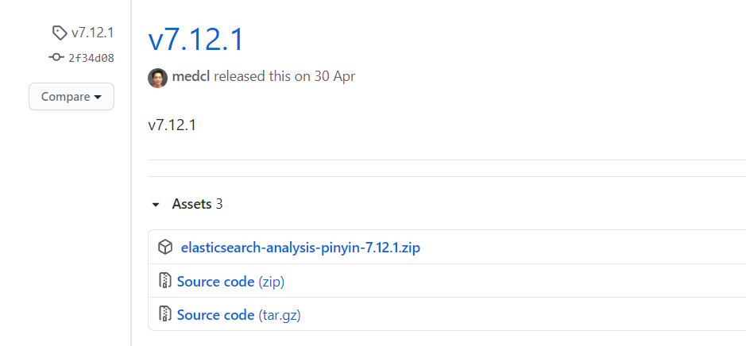


​	课前资料中也提供了拼音分词器的安装包：

 


​	安装方式与 IK 分词器一样，分三步：

​		①解压

​		②上传到虚拟机中，elasticsearch 的 plugin 目录

​		③重启 elasticsearch

​		④测试

​	详细安装步骤可以参考 IK 分词器的安装过程。


​	测试用法如下：

```json
POST /_analyze
{
  "text": "如家酒店还不错",
  "analyzer": "pinyin"
}
```

​	结果：

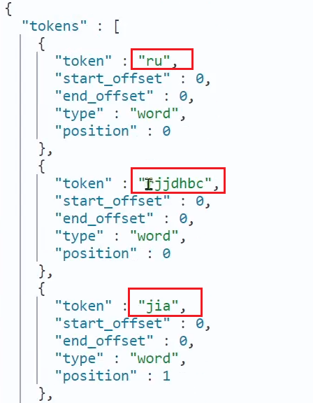 


##### 自定义分词器

​	默认的拼音分词器会将每个汉字单独分为拼音，而我们希望的是每个词条形成一组拼音，需要对拼音分词器做个性化定制，形成自定义分词器。


​	elasticsearch 中分词器（analyzer）的组成包含三部分：

- character filters：在 tokenizer 之前对文本进行处理。例如删除字符、替换字符
- tokenizer：将文本按照一定的规则切割成词条（term）。例如 keyword，就是不分词；还有 ik_smart
- tokenizer filter：将 tokenizer 输出的词条做进一步处理。如大小写转换、同义词处理、拼音处理等


​	文档分词时会依次由这三部分来处理文档：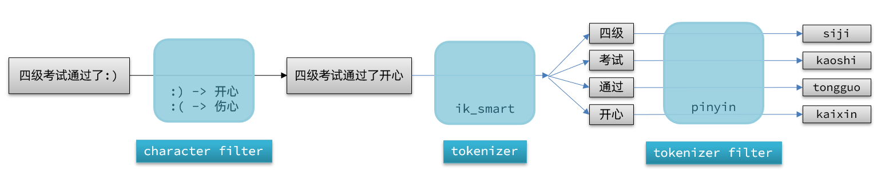

​	声明自定义分词器的语法如下：

```json
PUT /test
{
  "settings": {
    "analysis": {
      "analyzer": { // 自定义分词器
        "my_analyzer": {  // 分词器名称
          "tokenizer": "ik_max_word",
          "filter": "py"
        }
      },
      "filter": { // 自定义tokenizer filter
        "py": { // 过滤器名称
          "type": "pinyin", // 过滤器类型，这里是pinyin
		  "keep_full_pinyin": false,
          "keep_joined_full_pinyin": true,
          "keep_original": true,
          "limit_first_letter_length": 16,
          "remove_duplicated_term": true,
          "none_chinese_pinyin_tokenize": false
        }
      }
    }
  },
  "mappings": {
    "properties": {
      "name": {
        "type": "text",
        "analyzer": "my_analyzer",
        "search_analyzer": "ik_smart"
      }
    }
  }
}
```


​	测试：


> 总结：

如何使用拼音分词器？

- ①下载 pinyin 分词器

- ②解压并放到 elasticsearch 的 plugin 目录

- ③重启即可

如何自定义分词器？

- ①创建索引库时，在 settings 中配置，可以包含三部分

- ②character filter

- ③tokenizer

- ④filter

拼音分词器注意事项？

- 为了避免搜索到同音字，搜索时不要使用拼音分词器


##### 自动补全查询

​	elasticsearch 提供了 [Completion Suggester](https://www.elastic.co/guide/en/elasticsearch/reference/7.6/search-suggesters.html) 查询来实现自动补全功能。这个查询会匹配以用户输入内容开头的词条并返回。为了提高补全查询的效率，对于文档中字段的类型有一些约束：

- 参与补全查询的字段必须是 completion 类型。

- 字段的内容一般是用来补全的多个词条形成的数组。

​	比如，一个这样的索引库：

```json
// 创建索引库
PUT test
{
  "mappings": {
    "properties": {
      "title":{
        "type": "completion"
      }
    }
  }
}
```

​	然后插入下面的数据：

```json
// 示例数据
POST test/_doc
{
  "title": ["Sony", "WH-1000XM3"]
}
POST test/_doc
{
  "title": ["SK-II", "PITERA"]
}
POST test/_doc
{
  "title": ["Nintendo", "switch"]
}
```

​	查询的 DSL 语句如下：

```json
// 自动补全查询
GET /test/_search
{
  "suggest": {
    "title_suggest": {
      "text": "s", // 关键字
      "completion": {
        "field": "title", // 补全查询的字段
        "skip_duplicates": true, // 跳过重复的
        "size": 10 // 获取前10条结果
      }
    }
  }
}
```


##### 实现酒店搜索框自动补全

​	现在，hotel 索引库还没有设置拼音分词器，需要修改索引库中的配置。但是索引库是无法修改的，只能删除然后重新创建。

​	另外，需要添加一个字段，用来做自动补全，将 brand、suggestion、city 等都放进去，作为自动补全的提示。


​	因此，总结一下需要做的事情包括：

1. 修改 hotel 索引库结构，设置自定义拼音分词器

2. 修改索引库的 name、all 字段，使用自定义分词器

3. 索引库添加一个新字段 suggestion，类型为 completion 类型，使用自定义的分词器

4. 给 HotelDoc 类添加 suggestion 字段，内容包含 brand、business

5. 重新导入数据到 hotel 库


> 修改酒店映射结构

```json
// 酒店数据索引库
PUT /hotel
{
  "settings": {
    "analysis": {
      "analyzer": {
        "text_anlyzer": {
          "tokenizer": "ik_max_word",
          "filter": "py"
        },
        "completion_analyzer": {
          "tokenizer": "keyword",
          "filter": "py"
        }
      },
      "filter": {
        "py": {
          "type": "pinyin",
          "keep_full_pinyin": false,
          "keep_joined_full_pinyin": true,
          "keep_original": true,
          "limit_first_letter_length": 16,
          "remove_duplicated_term": true,
          "none_chinese_pinyin_tokenize": false
        }
      }
    }
  },
  "mappings": {
    "properties": {
      "id":{
        "type": "keyword"
      },
      "name":{
        "type": "text",
        "analyzer": "text_anlyzer",
        "search_analyzer": "ik_smart",
        "copy_to": "all"
      },
      "address":{
        "type": "keyword",
        "index": false
      },
      "price":{
        "type": "integer"
      },
      "score":{
        "type": "integer"
      },
      "brand":{
        "type": "keyword",
        "copy_to": "all"
      },
      "city":{
        "type": "keyword"
      },
      "starName":{
        "type": "keyword"
      },
      "business":{
        "type": "keyword",
        "copy_to": "all"
      },
      "location":{
        "type": "geo_point"
      },
      "pic":{
        "type": "keyword",
        "index": false
      },
      "all":{
        "type": "text",
        "analyzer": "text_anlyzer",
        "search_analyzer": "ik_smart"
      },
      "suggestion":{
          "type": "completion",
          "analyzer": "completion_analyzer"
      }
    }
  }
}
```


> 修改 HotelDoc 实体

​	HotelDoc 中要添加一个字段，用来做自动补全，内容可以是酒店品牌、城市、商圈等信息。按照自动补全字段的要求，最好是这些字段的数组。

​	因此我们在 HotelDoc 中添加一个 suggestion 字段，类型为 `List<String>`，然后将 brand、city、business 等信息放到里面。

​	代码如下：

```java
package cn.itcast.hotel.pojo;

import lombok.Data;
import lombok.NoArgsConstructor;

import java.util.ArrayList;
import java.util.Arrays;
import java.util.Collections;
import java.util.List;

@Data
@NoArgsConstructor
public class HotelDoc {
    private Long id;
    private String name;
    private String address;
    private Integer price;
    private Integer score;
    private String brand;
    private String city;
    private String starName;
    private String business;
    private String location;
    private String pic;
    private Object distance;
    private Boolean isAD;
    private List<String> suggestion;

    public HotelDoc(Hotel hotel) {
        this.id = hotel.getId();
        this.name = hotel.getName();
        this.address = hotel.getAddress();
        this.price = hotel.getPrice();
        this.score = hotel.getScore();
        this.brand = hotel.getBrand();
        this.city = hotel.getCity();
        this.starName = hotel.getStarName();
        this.business = hotel.getBusiness();
        this.location = hotel.getLatitude() + ", " + hotel.getLongitude();
        this.pic = hotel.getPic();
        // 组装suggestion
        if(this.business.contains("/")){
            // business有多个值，需要切割
            String[] arr = this.business.split("/");
            // 添加元素
            this.suggestion = new ArrayList<>();
            this.suggestion.add(this.brand);
            Collections.addAll(this.suggestion, arr);
        }else {
            this.suggestion = Arrays.asList(this.brand, this.business);
        }
    }
}
```


> 重新导入

​	重新执行之前编写的导入数据功能，可以看到新的酒店数据中包含了 suggestion：


> DLS 语句

```json
GET /hotel/_search
{
  "suggest": {
    "suggestions": {
      "text": "sd",
      "completion": {
        "field": "suggestion",
        "skip_duplicates": true,
        "size": 10
      }
    }
  }
}
```


> 自动补全查询的 JavaAPI

​	之前我们学习了自动补全查询的 DSL，而没有学习对应的 JavaAPI，这里给出一个示例：


​	而自动补全的结果也比较特殊，解析的代码如下：


> 实现搜索框自动补全

​	查看前端页面，可以发现当我们在输入框键入时，前端会发起 ajax 请求：

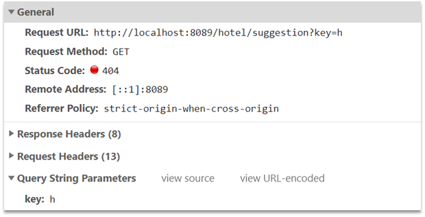

​	返回值是补全词条的集合，类型为`List<String>`


​	1）在`cn.itcast.hotel.web`包下的`HotelController`中添加新接口，接收新的请求：

```java
@GetMapping("suggestion")
public List<String> getSuggestions(@RequestParam("key") String prefix) {
    return hotelService.getSuggestions(prefix);
}
```


​	2）在`cn.itcast.hotel.service`包下的`IhotelService`中添加方法：

```java
List<String> getSuggestions(String prefix);
```


​	3）在`cn.itcast.hotel.service.impl.HotelService`中实现该方法：

```java
@Override
public List<String> getSuggestions(String prefix) {
    try {
        // 1.准备Request
        SearchRequest request = new SearchRequest("hotel");
        // 2.准备DSL
        request.source().suggest(new SuggestBuilder().addSuggestion(
            "suggestions",
            SuggestBuilders.completionSuggestion("suggestion")
            .prefix(prefix)
            .skipDuplicates(true)
            .size(10)
        ));
        // 3.发起请求
        SearchResponse response = client.search(request, RequestOptions.DEFAULT);
        // 4.解析结果
        Suggest suggest = response.getSuggest();
        // 4.1.根据补全查询名称，获取补全结果
        CompletionSuggestion suggestions = suggest.getSuggestion("suggestions");
        // 4.2.获取options
        List<CompletionSuggestion.Entry.Option> options = suggestions.getOptions();
        // 4.3.遍历
        List<String> list = new ArrayList<>(options.size());
        for (CompletionSuggestion.Entry.Option option : options) {
            String text = option.getText().toString();
            list.add(text);
        }
        return list;
    } catch (IOException e) {
        throw new RuntimeException(e);
    }
}
```


### 数据同步

​	elasticsearch 中的酒店数据来自于 mysql 数据库，因此 mysql 数据发生改变时，elasticsearch 也必须跟着改变，这个就是 elasticsearch 与 mysql 之间的**数据同步**。


##### 常见的数据同步方案

​	思路分析得常见的数据同步方案有三种：

- 同步调用
- 异步通知
- 监听 binlog


> 方案一：同步调用

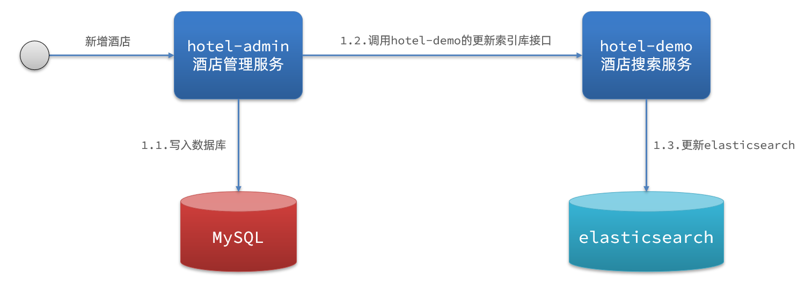

​	基本步骤如下：

- hotel-demo 对外提供接口，用来修改 elasticsearch 中的数据
- 酒店管理服务在完成数据库操作后，直接调用 hotel-demo 供的接口


> 方案二：异步通知


​	流程如下：

- hotel-admin 对 mysql 数据库数据完成增、删、改后，发送 MQ 消息
- hotel-demo 监听 MQ，接收到消息后完成 elasticsearch 数据修改


> 方案三：监听 binlog

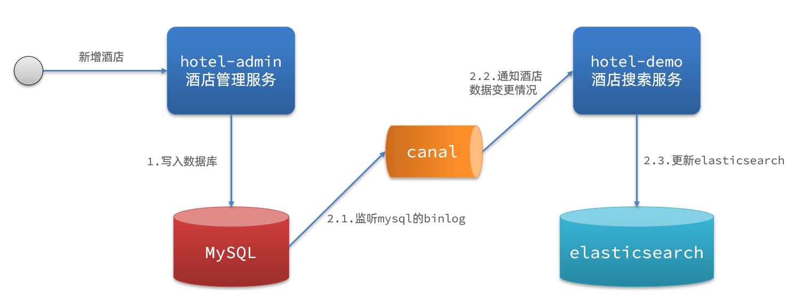

​	流程如下：

- 给mysql 开启 binlog 功能
- mysql 完成增、删、改操作都会记录在 binlog 中
- hotel-demo 基于 canal 监听 binlog 变化，实时更新 elasticsearch 中的内容


> 选择

方式一：同步调用

- 优点：实现简单，粗暴
- 缺点：业务耦合度高

方式二：异步通知

- 优点：低耦合，实现难度一般
- 缺点：依赖 mq 的可靠性

方式三：监听 binlog

- 优点：完全解除服务间耦合
- 缺点：开启 binlog 增加数据库负担、实现复杂度高


##### 实现数据同步

> 思路

​	利用课前资料提供的 hotel-admin 项目作为酒店管理的微服务。当酒店数据发生增、删、改时，要求对 elasticsearch 中数据也要完成相同操作。

​	步骤：

- 导入课前资料提供的 hotel-admin 项目，启动并测试酒店数据的 CRUD

- 声明 exchange、queue、RoutingKey

- 在 hotel-admin 中的增、删、改业务中完成消息发送

- 在 hotel-demo 中完成消息监听，并更新 elasticsearch 中数据

- 启动并测试数据同步功能


> 导入 demo

​	导入课前资料提供的 hotel-admin 项目：


​	运行后，访问 http://localhost:8099

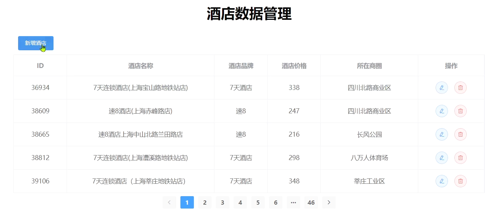


​	其中包含了酒店的 CRUD 功能：


##### 声明交换机、队列

​	MQ 结构如图：


> 1）引入依赖

​	在 hotel-admin、hotel-demo 中引入 rabbitmq 的依赖：

```xml
<!--amqp-->
<dependency>
    <groupId>org.springframework.boot</groupId>
    <artifactId>spring-boot-starter-amqp</artifactId>
</dependency>
```


> 2）声明队列交换机名称

​	在 hotel-admin 和 hotel-demo 中的`cn.itcast.hotel.constatnts`包下新建一个类`MqConstants`：

```java
package cn.itcast.hotel.constatnts;

    public class MqConstants {
    /**
     * 交换机
     */
    public final static String HOTEL_EXCHANGE = "hotel.topic";
    /**
     * 监听新增和修改的队列
     */
    public final static String HOTEL_INSERT_QUEUE = "hotel.insert.queue";
    /**
     * 监听删除的队列
     */
    public final static String HOTEL_DELETE_QUEUE = "hotel.delete.queue";
    /**
     * 新增或修改的RoutingKey
     */
    public final static String HOTEL_INSERT_KEY = "hotel.insert";
    /**
     * 删除的RoutingKey
     */
    public final static String HOTEL_DELETE_KEY = "hotel.delete";
}
```


> 3）声明队列交换机

​	在 hotel-demo 中，定义配置类，声明队列、交换机：

```java
package cn.itcast.hotel.config;

import cn.itcast.hotel.constants.MqConstants;
import org.springframework.amqp.core.Binding;
import org.springframework.amqp.core.BindingBuilder;
import org.springframework.amqp.core.Queue;
import org.springframework.amqp.core.TopicExchange;
import org.springframework.context.annotation.Bean;
import org.springframework.context.annotation.Configuration;

@Configuration
public class MqConfig {
    @Bean
    public TopicExchange topicExchange(){
        return new TopicExchange(MqConstants.HOTEL_EXCHANGE, true, false);
    }

    @Bean
    public Queue insertQueue(){
        return new Queue(MqConstants.HOTEL_INSERT_QUEUE, true);
    }

    @Bean
    public Queue deleteQueue(){
        return new Queue(MqConstants.HOTEL_DELETE_QUEUE, true);
    }

    @Bean
    public Binding insertQueueBinding(){
        return BindingBuilder.bind(insertQueue()).to(topicExchange()).with(MqConstants.HOTEL_INSERT_KEY);
    }

    @Bean
    public Binding deleteQueueBinding(){
        return BindingBuilder.bind(deleteQueue()).to(topicExchange()).with(MqConstants.HOTEL_DELETE_KEY);
    }
}
```


##### 发送 MQ 消息

​	导入依赖、配置、常量后，在 hotel-admin 中的增、删、改业务中分别发送 MQ 消息：


##### 接收MQ消息

​	hotel-demo 接收到 MQ 消息要做的事情包括：

- 新增消息：根据传递的 hotel 的 id 查询 hotel 信息，然后新增一条数据到索引库
- 删除消息：根据传递的 hotel 的 id 删除索引库中的一条数据


​	1）首先在 hotel-demo 的`cn.itcast.hotel.service`包下的`IHotelService`中新增新增、删除业务

```java
void deleteById(Long id);

void insertById(Long id);
```


​	2）给 hotel-demo 中的`cn.itcast.hotel.service.impl`包下的 HotelService 中实现业务：

```java
@Override
public void deleteById(Long id) {
    try {
        // 1.准备Request
        DeleteRequest request = new DeleteRequest("hotel", id.toString());
        // 2.发送请求
        client.delete(request, RequestOptions.DEFAULT);
    } catch (IOException e) {
        throw new RuntimeException(e);
    }
}

@Override
public void insertById(Long id) {
    try {
        // 0.根据id查询酒店数据
        Hotel hotel = getById(id);
        // 转换为文档类型
        HotelDoc hotelDoc = new HotelDoc(hotel);

        // 1.准备Request对象
        IndexRequest request = new IndexRequest("hotel").id(hotel.getId().toString());
        // 2.准备Json文档
        request.source(JSON.toJSONString(hotelDoc), XContentType.JSON);
        // 3.发送请求
        client.index(request, RequestOptions.DEFAULT);
    } catch (IOException e) {
        throw new RuntimeException(e);
    }
}
```


​	3）编写监听器

​		在 hotel-demo 中的`cn.itcast.hotel.mq`包新增一个类：

```java
package cn.itcast.hotel.mq;

import cn.itcast.hotel.constants.MqConstants;
import cn.itcast.hotel.service.IHotelService;
import org.springframework.amqp.rabbit.annotation.RabbitListener;
import org.springframework.beans.factory.annotation.Autowired;
import org.springframework.stereotype.Component;

@Component
public class HotelListener {

    @Autowired
    private IHotelService hotelService;

    /**
     * 监听酒店新增或修改的业务
     * @param id 酒店id
     */
    @RabbitListener(queues = MqConstants.HOTEL_INSERT_QUEUE)
    public void listenHotelInsertOrUpdate(Long id){
        hotelService.insertById(id);
    }

    /**
     * 监听酒店删除的业务
     * @param id 酒店id
     */
    @RabbitListener(queues = MqConstants.HOTEL_DELETE_QUEUE)
    public void listenHotelDelete(Long id){
        hotelService.deleteById(id);
    }
}
```


### ES 集群

​	单机的 elasticsearch 做数据存储，必然面临两个问题：海量数据存储问题、单点故障问题。

- 海量数据存储问题：将索引库从逻辑上拆分为N个分片（shard），存储到多个节点
- 单点故障问题：将分片数据在不同节点备份（replica ）

**ES集群相关概念**:

* 集群（cluster）：一组拥有共同的 cluster name 的 节点。

* <font color="red">节点（node)</font>   ：集群中的一个 Elasticearch 实例

* <font color="red">分片（shard）</font>：索引可以被拆分为不同的部分进行存储，称为分片。在集群环境下，一个索引的不同分片可以拆分到不同的节点中

  解决问题：数据量太大，单点存储量有限的问题。

  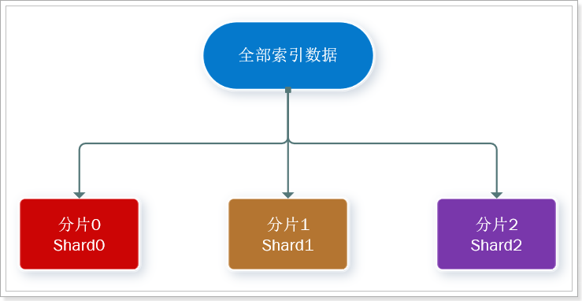

  > 此处，我们把数据分成3片：shard0、shard1、shard2

* 主分片（Primary shard）：相对于副本分片的定义。

* 副本分片（Replica shard）每个主分片可以有一个或者多个副本，数据和主分片一样。

  ​	

数据备份可以保证高可用，但是每个分片备份一份，所需要的节点数量就会翻一倍，成本实在是太高了！

为了在高可用和成本间寻求平衡，我们可以这样做：

- 首先对数据分片，存储到不同节点
- 然后对每个分片进行备份，放到对方节点，完成互相备份

这样可以大大减少所需要的服务节点数量，如图，我们以 3 分片，每个分片备份一份为例：


现在，每个分片都有 1 个备份，存储在 3 个节点：

- node0：保存了分片0和1
- node1：保存了分片0和2
- node2：保存了分片1和2


##### 搭建ES集群

​	在单机上利用 docker 容器运行多个 es 实例来模拟 es 集群。不过生产环境推荐大家每一台服务节点仅部署一个 es 的实例。

​	部署 es 集群可以直接使用 docker-compose 来完成，但这要求 Linux 虚拟机至少有 **4G **的内存空间


> 创建 es 集群

​	首先编写一个 docker-compose 文件，内容如下：

```sh
version: '2.2'
services:
  es01:
    image: elasticsearch:7.12.1
    container_name: es01
    environment:
      - node.name=es01
      - cluster.name=es-docker-cluster
      - discovery.seed_hosts=es02,es03
      - cluster.initial_master_nodes=es01,es02,es03
      - "ES_JAVA_OPTS=-Xms512m -Xmx512m"
    volumes:
      - data01:/usr/share/elasticsearch/data
    ports:
      - 9200:9200
    networks:
      - elastic
  es02:
    image: elasticsearch:7.12.1
    container_name: es02
    environment:
      - node.name=es02
      - cluster.name=es-docker-cluster
      - discovery.seed_hosts=es01,es03
      - cluster.initial_master_nodes=es01,es02,es03
      - "ES_JAVA_OPTS=-Xms512m -Xmx512m"
    volumes:
      - data02:/usr/share/elasticsearch/data
    ports:
      - 9201:9200
    networks:
      - elastic
  es03:
    image: elasticsearch:7.12.1
    container_name: es03
    environment:
      - node.name=es03
      - cluster.name=es-docker-cluster
      - discovery.seed_hosts=es01,es02
      - cluster.initial_master_nodes=es01,es02,es03
      - "ES_JAVA_OPTS=-Xms512m -Xmx512m"
    volumes:
      - data03:/usr/share/elasticsearch/data
    networks:
      - elastic
    ports:
      - 9202:9200
volumes:
  data01:
    driver: local
  data02:
    driver: local
  data03:
    driver: local

networks:
  elastic:
    driver: bridge
```


​	es 运行需要修改一些 linux 系统权限，修改`/etc/sysctl.conf`文件

```sh
vim /etc/sysctl.conf
```

​	添加下面的内容：

```sh
vm.max_map_count=262144
```

​	然后执行命令，让配置生效：

```sh
sysctl -p
```


​	通过 docker-compose 启动集群：

```sh
docker-compose up -d
```


##### 集群状态监控

​	kibana 可以监控 es 集群，不过新版本需要依赖 es 的 x-pack 功能，配置比较复杂。

​	所以推荐使用 cerebro 来监控 es 集群状态，官方网址：https://github.com/lmenezes/cerebro

​	课前资料已经提供了安装包：

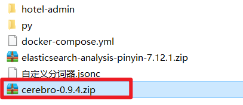

​	解压即可使用，解压好的目录如下：


​	进入对应的 bin 目录：

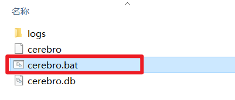


​	双击其中的 cerebro.bat 文件即可启动服务。


​	访问http://localhost:9000 即可进入管理界面：


​	

输入 elasticsearch 的任意节点的地址和端口，点击 connect 即可：

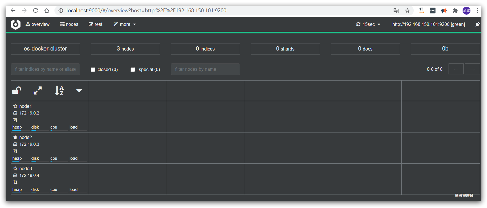

​	绿色的条，代表集群处于绿色（健康状态）。


##### 创建索引库

> 1）利用 kibana 的 DevTools 创建索引库

​	在 DevTools 中输入指令：

```json
PUT /itcast
{
  "settings": {
    "number_of_shards": 3, // 分片数量
    "number_of_replicas": 1 // 副本数量
  },
  "mappings": {
    "properties": {
      // mapping映射定义 ...
    }
  }
}
```


> 2）利用 cerebro 创建索引库


​	填写索引库信息：


​	点击右下角的 create 按钮：


> 查看分片效果

​	回到首页，即可查看索引库分片效果：


##### 集群脑裂问题

> 集群职责划分

​	elasticsearch 中集群节点有不同的职责划分：


​	默认情况下，集群中的任何一个节点都同时具备上述四种角色。


但是真实的集群一定要将集群职责分离：

- master 节点：对 CPU 要求高，但是内存要求第
- data 节点：对 CPU 和内存要求都高
- coordinating 节点：对网络带宽、CPU 要求高

职责分离可以让我们根据不同节点的需求分配不同的硬件去部署。而且避免业务之间的互相干扰。

一个典型的 es 集群职责划分如图：


> 脑裂问题

​	脑裂是因为集群中的节点失联导致的。

​	例如一个集群中，主节点与其它节点失联：


​	此时，node2 和 node3 认为 node1 宕机，就会重新选主：


​	当 node3 当选后，集群继续对外提供服务，node2 和 node3 自成集群，node1 自成集群，两个集群数据不同步，出现数据差异。

​	当网络恢复后，因为集群中有两个 master 节点，集群状态的不一致，出现脑裂的情况：


​	解决脑裂的方案是，要求选票超过 ( eligible 节点数量 + 1 ）/ 2 才能当选为主，因此 eligible 节点数量最好是奇数。对应配置项是 discovery.zen.minimum_master_nodes，在 es7.0 以后，已经成为默认配置，因此一般不会发生脑裂问题

​	例如：3 个节点形成的集群，选票必须超过 （3 + 1） / 2 ，也就是 2 票。node3 得到 node2 和 node3 的选票，当选为主。node1 只有自己 1 票，没有当选。集群中依然只有 1 个主节点，没有出现脑裂。


> 小结

master eligible 节点的作用是什么？

- 参与集群选主
- 主节点可以管理集群状态、管理分片信息、处理创建和删除索引库的请求

data 节点的作用是什么？

- 数据的 CRUD

coordinator 节点的作用是什么？

- 路由请求到其它节点

- 合并查询到的结果，返回给用户


##### 集群分布式存储

​	当新增文档时，应该保存到不同分片，保证数据均衡，那么 coordinating node 如何确定数据该存储到哪个分片呢？


> 分片存储测试

​	插入三条数据：


​	测试可以看到，三条数据分别在不同分片：


​	结果：


> 分片存储原理

​	elasticsearch 会通过 hash 算法来计算文档应该存储到哪个分片：


​	说明：

- _routing 默认是文档的 id
- 算法与分片数量有关，因此索引库一旦创建，分片数量不能修改！


​	新增文档的流程如下：

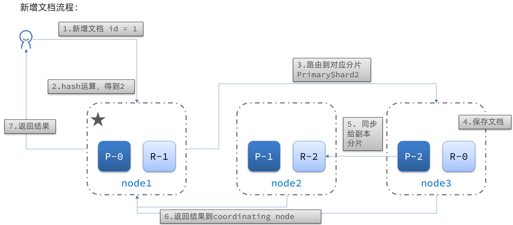


​	解读：

- 1）新增一个 id=1 的文档
- 2）对 id 做 hash 运算，假如得到的是 2，则应该存储到 shard-2
- 3）shard-2 的主分片在 node3 节点，将数据路由到 node3
- 4）保存文档
- 5）同步给 shard-2 的副本 replica-2，在 node2 节点
- 6）返回结果给 coordinating-node 节点


##### 集群分布式查询

​	elasticsearch 的查询分成两个阶段：

- scatter phase：分散阶段，coordinating node 会把请求分发到每一个分片

- gather phase：聚集阶段，coordinating node 汇总 data node 的搜索结果，并处理为最终结果集返回给用户


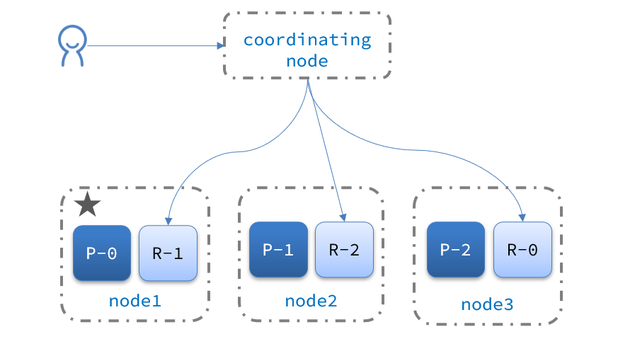


##### 集群故障转移

​	集群的 master 节点会监控集群中的节点状态，如果发现有节点宕机，会立即将宕机节点的分片数据迁移到其它节点，确保数据安全，这个叫做故障转移。


​	1）例如一个集群结构如图：


​	现在，node1 是主节点，其它两个节点是从节点。


​	2）突然，node1 发生了故障：


​	宕机后的第一件事，需要重新选主，例如选中了 node2：


​	node2 成为主节点后，会检测集群监控状态，发现：shard-1、shard-0 没有副本节点。因此需要将node1 上的数据迁移到 node2、node3：

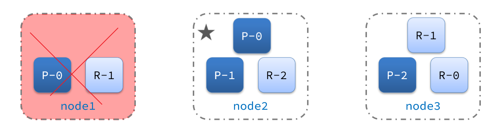


